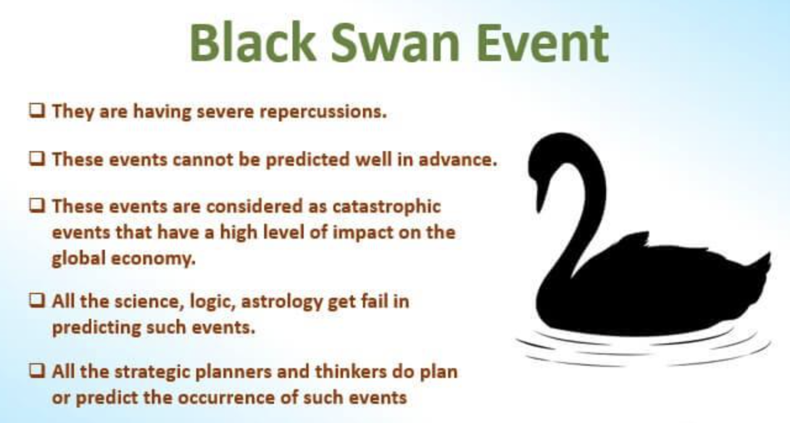

## Table of Contents

## What is a black swan event?

A black swan event is a rare and unexpected event that has a big impact on the world. These events are hard to predict because they are so unusual. For example, the global financial crisis in 2008 was a black swan event. Nobody saw it coming, but it changed the economy a lot.

Even though black swan events are rare, they can teach us a lot. After one happens, people often look back and try to understand what went wrong. This can help us prepare better for the future. But because these events are so unpredictable, it's still very hard to be ready for them.

## Can you provide examples of historical black swan events?

One famous black swan event was the terrorist attacks on September 11, 2001, in the United States. Nobody expected that planes would be used to crash into buildings. This event changed how people thought about security and led to big changes in laws and how countries work together to fight terrorism.

Another example is the Fukushima nuclear disaster in 2011. A huge earthquake and tsunami hit Japan, causing a nuclear power plant to fail. This was very unexpected and led to a lot of damage and fear about nuclear energy. It made countries rethink their plans for using nuclear power.

The global spread of the COVID-19 virus in 2020 is also a black swan event. Nobody predicted that a new virus would cause a worldwide health crisis. It changed how people live and work, and it affected the economy a lot. This event showed us how important it is to be ready for unexpected health problems.

## What are the key characteristics of a black swan event?

A black swan event is something that is very rare and unexpected. It's hard to predict because it's so unusual. When it happens, it surprises everyone and can change things a lot. For example, nobody thought a virus like COVID-19 would spread all over the world and change how we live.

These events also have a big impact. They can affect the economy, how people live, and even how countries work together. After a black swan event, people often look back and try to understand what happened. They want to learn from it so they can be better prepared next time. But because these events are so hard to predict, it's still tough to be ready for them.

## How do black swan events impact economies and societies?

Black swan events can shake up economies a lot. They can cause big drops in the stock market, like what happened during the 2008 financial crisis. Companies might go out of business, and people might lose their jobs. Governments have to spend a lot of money to help fix things, which can lead to more debt. For example, during the COVID-19 pandemic, many businesses had to close, and governments had to give people money to help them get by.

These events also change how societies work. After a black swan event, people might be scared and unsure about the future. They might change how they live their daily lives. For instance, after 9/11, people started to think more about security and safety. Governments might pass new laws to try to prevent similar events from happening again. These changes can affect how people feel about their freedom and privacy.

## What is the origin of the term 'black swan'?

The term 'black swan' comes from an old saying that people used to think all swans were white. They believed that because they had only seen white swans, there couldn't be any other color. But then, in the 17th century, explorers found black swans in Australia. This showed that something thought to be impossible could actually exist.

The idea of black swans became a way to talk about events that are very surprising and unexpected. Just like how nobody thought black swans could exist, some events seem impossible until they happen. The term was made popular by Nassim Nicholas Taleb in his book "The Black Swan," where he talks about how these rare events can change the world a lot.

## How can individuals and organizations prepare for black swan events?

Individuals and organizations can prepare for black swan events by building flexibility into their plans. This means having the ability to change quickly when something unexpected happens. For example, a business might have a backup plan for if their main product suddenly can't be sold anymore. People can also save some money for emergencies, so they're not in trouble if they lose their job or face a big unexpected cost. Being ready to adapt and having some extra resources can help a lot when a black swan event happens.

Another way to prepare is by learning from past black swan events. By studying what happened during events like the 2008 financial crisis or the COVID-19 pandemic, people and organizations can understand what went wrong and how they could do better next time. This doesn't mean they can predict the next black swan event, but it helps them be more ready for unexpected problems. It's also important to keep communication open and clear, so everyone knows what to do when something big and unexpected happens.

## What is the role of unpredictability in black swan events?

Unpredictability is a big part of black swan events. These events are very hard to predict because they are so unusual and rare. Nobody can see them coming, which makes them even more surprising when they happen. For example, nobody thought a virus like COVID-19 would spread all over the world and change everything.

Because black swan events are so unpredictable, it's tough to be ready for them. People and organizations can try to be flexible and have backup plans, but it's still hard to prepare for something you don't know is coming. Learning from past events can help a bit, but the next black swan event might be totally different. So, while we can try to be ready, the unpredictability of these events means we can never be fully prepared.

## How do black swan events challenge traditional risk management models?

Black swan events challenge traditional risk management models because these models are built to predict and manage risks that are known and can be measured. Traditional models use past data and [statistics](/wiki/bayesian-statistics) to guess what might happen in the future. But black swan events are so rare and unexpected that they don't fit into these models. They come out of nowhere and can't be predicted using normal methods. This means that even the best risk management plans can be thrown off by a black swan event.

Because of this, people and organizations have to think differently about risk. Instead of just focusing on what they can predict, they need to be ready for the unexpected. This means building flexibility into their plans and having backup options. It also means learning from past black swan events, even though the next one might be totally different. Traditional risk management models can still be useful, but they need to be used along with new ways of thinking that take into account the possibility of rare and unpredictable events.

## What are some criticisms of the black swan theory?

Some people think the black swan theory has problems. They say it makes it sound like we can't predict anything and that's not true. There are ways to guess what might happen, even if it's not perfect. Also, some critics think the theory focuses too much on rare events and ignores the smaller, everyday risks that can add up over time. They say it's important to pay attention to both big surprises and little problems.

Another criticism is that the black swan theory can make people feel too scared or unsure. If you think big, unexpected events are always around the corner, it can be hard to make plans or feel safe. Some say this focus on the unknown can stop people from taking action or making decisions. They believe it's better to balance the idea of black swan events with a more practical approach to managing risks.

## How has the concept of black swan events evolved since its introduction?

Since Nassim Nicholas Taleb introduced the concept of black swan events in his 2007 book "The Black Swan," the idea has grown and changed a lot. At first, it was mainly used to talk about big, unexpected events in finance and the economy. But over time, people started using it to explain all kinds of surprising events, like natural disasters, health crises, and even political changes. The idea became popular because it helped people understand that some events are so rare and unpredictable that they can shake up the world in big ways.

As the concept spread, it also faced more criticism and led to new ways of thinking about risk and uncertainty. Some people argued that focusing too much on black swan events could make us ignore smaller, everyday risks that can also cause problems. Others worried that the idea might make people too scared to make plans or take action. But the concept also pushed people to think about being more flexible and ready for the unexpected. Today, the idea of black swan events is used in many fields, from business to science, and it keeps evolving as we learn more about how to handle the surprises that life throws at us.

## What are the differences between black swan events and other types of unexpected events like gray swans?

Black swan events are very rare and unexpected things that nobody sees coming. They have a big impact on the world and can change how people live and work. For example, the 2008 financial crisis was a black swan event because it surprised everyone and caused a lot of problems. Black swan events are hard to predict because they are so unusual, and they make people rethink how they plan for the future.

Gray swan events are different because they are a bit more predictable than black swan events. People know they might happen, but they are still surprising and can have a big impact. For example, a big earthquake in a known earthquake zone could be a gray swan event. While people know earthquakes can happen there, they don't know exactly when or how bad it will be. Gray swan events are about things that are possible but not certain, and they help people think about risks that are not as rare as black swan events but still need to be prepared for.

## How can advanced data analytics and machine learning help in identifying potential black swan events?

Advanced data analytics and [machine learning](/wiki/machine-learning) can help spot potential black swan events by looking at huge amounts of data to find patterns and warnings that people might miss. These technologies can look at things like social media, news, and economic reports to see if something unusual is happening. For example, machine learning can find small changes in how people are talking about the economy or health issues, which might be early signs of a big problem coming. By putting together information from different places, these tools can help people see risks that are hard to see otherwise.

Even though these tools can't predict black swan events perfectly, they can make us more ready for them. They help by giving us better guesses about what might happen and by showing us where we need to be more careful. For instance, if machine learning finds a strange pattern in financial markets, it might tell us to be ready for a big change. While we can't stop black swan events from happening, using advanced data analytics and machine learning can help us be more ready and react faster when something unexpected does happen.

## References & Further Reading

[1]: Taleb, N. N. (2007). ["The Black Swan: The Impact of the Highly Improbable."](https://www.jstor.org/stable/23045073) Random House.

[2]: Johnson, K., & Zhao, H. (2012). ["Learning in Financial Markets: A Survey."](https://www.sciencedirect.com/science/article/pii/S092552732300049X) arXiv preprint arXiv:1210.0010.

[3]: "Why Stock Markets Crash: Critical Events in Complex Financial Systems" by Didier Sornette.

[4]: "The Misbehavior of Markets: A Fractal View of Financial Turbulence" by Benoit B. Mandelbrot and Richard L. Hudson.

[5]: Aldridge, I. (2013). ["High-Frequency Trading: A Practical Guide to Algorithmic Strategies and Trading Systems."](https://books.google.com/books/about/High_Frequency_Trading.html?id=8QpIsVUMhmEC) Wiley.

[6]: Bookstaber, R. (2007). ["A Demon of Our Own Design: Markets, Hedge Funds, and the Perils of Financial Innovation."](https://www.amazon.com/Demon-Our-Own-Design-Innovation/dp/0470393750) Wiley.

[7]: "Advances in Financial Machine Learning" by Marcos Lopez de Prado.

[8]: Glasserman, P. (2004). ["Monte Carlo Methods in Financial Engineering."](https://link.springer.com/book/10.1007/978-0-387-21617-1) Springer.

[9]: "Flash Boys: A Wall Street Revolt" by Michael Lewis.

[10]: Kirilenko, A. A., Kyle, A. S., Samadi, M., & Tuzun, T. (2017). ["The Flash Crash: High-Frequency Trading in an Electronic Market."](https://onlinelibrary.wiley.com/doi/abs/10.1111/jofi.12498) The Review of Financial Studies, 30(7), 2221-2256.