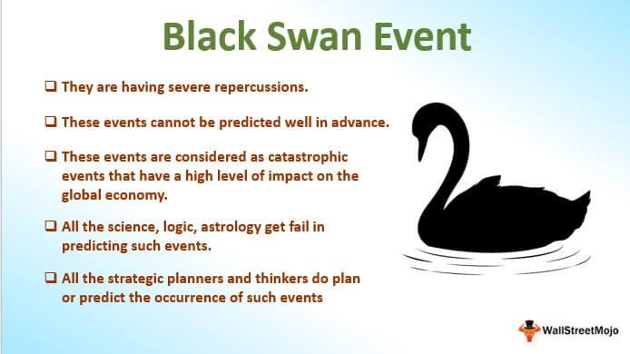

In the world of finance, Black Swan events represent unpredictable occurrences with severe consequences. These events are characterized by their rarity and their extreme impact on markets. Often defying standard predictions, they lead to significant disruptions across financial sectors. Algorithmic trading, heavily reliant on data and predictions, can be significantly affected by Black Swan events. The algorithms used in trading are designed based on historical data and statistical models which may fail under extraordinary circumstances.

This article explores the nature of Black Swan events, their history in algorithmic trading, and strategies to mitigate their impact. Since these events are rare yet impactful, understanding them becomes paramount for financial entities. Traders equipped with this knowledge can develop strategies to shield their investments from unforeseen market upheavals. Algorithmic traders especially must be prepared to adapt their models and strategies in response to market anomalies caused by these unexpected events. The text will further investigate historical instances and highlight contemporary strategies to manage the associated risks. Understanding these phenomena is crucial for traders looking to safeguard their investments against unforeseen market upheavals.

## Table of Contents

## Understanding Black Swan Events

The concept of 'Black Swan' events was popularized by Nassim Nicholas Taleb, a scholar and former options trader, to describe extremely rare and impactful occurrences that defy typical expectations within financial markets. These events are distinguished by their drastic departure from the norm, leading to significant upheavals across various sectors. Black Swan events stand apart from standard market volatility due to their sheer unpredictability and profound influence, often challenging the foundations of traditional financial models.

One key characteristic of Black Swan events is their rarity, which renders them exceedingly difficult to forecast utilizing conventional methods. While most financial models rely on historical data and statistical analysis to predict future trends, Black Swan events defy these patterns due to their unforeseen nature. For instance, the global financial crisis of 2008 and the COVID-19 pandemic were unprecedented in their scale and impact, disrupting markets worldwide and catching many by surprise. These events exemplify how Black Swans can lead to severe economic ramifications, as they introduce variables that are not accounted for in standard predictive models.

Algorithmic trading, which heavily depends on data analysis and predictive algorithms, must consider the potential occurrence of Black Swan events despite their inherent unpredictability. The automated nature of [algorithmic trading](/wiki/algorithmic-trading) systems can become a vulnerability during such events, as pre-programmed strategies may fail to accommodate unexpected market movements. Thus, it is imperative for algorithmic traders to maintain an awareness of these phenomena and adopt strategies that can withstand sudden market disruptions.

Incorporating risk management techniques and adaptive algorithms can aid in preparing for Black Swan events. While the predictability of these events remains elusive, algorithmic traders can benefit from acknowledging their potential and implementing robust strategies to mitigate the associated risks. By doing so, they enhance their capacity to safeguard investments against the sizable challenges posed by Black Swans, ultimately promoting resilience in the face of extreme market dynamics.

## Historical Black Swan Events in Algorithmic Trading

Algorithmic trading has encountered multiple Black Swan events that have tested the robustness of its models and strategies, each providing unique insights into the vulnerabilities and necessary adaptations of automated trading systems. One of the most notable instances is the 2010 Flash Crash, a rapid and deep drop in U.S. stock markets followed by a swift recovery within minutes on May 6, 2010. This event highlighted the potential for automated trading algorithms to exacerbate market movements during unexpected situations. A confluence of automated sell orders intensified the downward spiral, which was then followed by triggering algorithmic buy orders that helped to rapidly rectify the decline. 

The Flash Crash underscored the importance of understanding how algorithmic systems respond to abrupt market shifts. As algorithms are predominantly driven by pre-defined rules and strategies that analyze historical data and current market conditions, traditional models often fail in the face of unprecedented events. For instance, during the Flash Crash, certain algorithms indiscriminately executed trades based on [volume](/wiki/volume-trading-strategy), lacking mechanisms to discern the causes behind the surge in sell orders.

Analyzing past Black Swan events enables traders to identify patterns in how automated strategies behave under stress. For instance, correlations between asset classes can spike unexpectedly, leading to simultaneous declines or increases across multiple markets. Such revelations aid in refining trading strategies and improving risk management protocols to accommodate sudden market disruptions. Moreover, implementing strategies such as circuit breakers and improved real-time monitoring can be directly attributed to lessons learned from these events.

Strategies developed to address the implications of past Black Swan events can bolster future preparedness. By scrutinizing algorithm reactions and leveraging data from these events, traders can enhance algorithmic resilience. This includes adjustments in algorithmic parameters, development of comprehensive stress testing routines, and incorporation of dynamic hedging strategies that adapt to evolving market conditions. Thus, historical Black Swan events serve as crucial learning experiences, providing blueprints for better management of algorithmic trading risks in the face of unforeseen market upheavals.

## Impact of Black Swan Events on Market Dynamics

Black Swan events result in significant spikes in market [volatility](/wiki/volatility-trading-strategies) and [liquidity](/wiki/liquidity-risk-premium) challenges, often accompanied by rapid price declines and unexpected market trends. These events, due to their unforeseen and profound nature, can severely disrupt the normal functioning of financial markets. For algorithmic traders, the inability to adapt swiftly during these periods can culminate in substantial financial losses.

Market dynamics during Black Swan events are typically characterized by widespread panic and uncertainty. Investors may react to sudden news or market shifts by quickly buying or selling assets, amplifying volatility. This heightened volatility can lead to erratic price movements, creating an environment where traditional trading algorithms struggle to perform effectively. These conditions present formidable challenges to maintaining market liquidity, as the usual supply and demand balance is disrupted, making it challenging for traders to execute trades without a significant impact on prices.

For algorithmic traders, preparedness through adaptive algorithms is crucial to mitigating the adverse effects of Black Swan events. Adaptive algorithms are designed to respond and adjust to sudden changes in market conditions dynamically. These algorithms leverage advanced computational techniques and real-time data analysis to identify abnormal patterns and act on them promptly. By incorporating features such as automated stop-loss triggers and [machine learning](/wiki/machine-learning) models that predict market shifts, traders can better safeguard their investments during these volatile periods.

Ultimately, the chaotic nature of Black Swan events underscores the importance of resilience and adaptability in trading strategies. Developing and deploying robust algorithms that can withstand market upheavals is essential for minimizing losses and capitalizing on potential opportunities that arise in the aftermath of such events.

## Strategies to Mitigate Risks Associated with Black Swan Events

Risk management is crucial for algorithmic traders as they seek to mitigate the effects of Black Swan events. Diversification remains a key strategy in this context. By spreading investments across various asset classes, traders can reduce the impact that a singular event might have on their portfolios. This strategy ensures that the failure or extreme performance of one asset does not disproportionately affect the overall investment.

Advanced machine learning models offer significant potential to enhance predictions and improve the adaptability of trading strategies during unexpected market shifts. These models can analyze vast datasets, identifying patterns and correlations unseen by traditional methods. Machine learning algorithms like neural networks and decision trees can be employed to simulate various scenarios and adapt strategies in real-time to changing market conditions.

Stress testing algorithms against historical anomalies forms another layer of defense. By running algorithms through data from past Black Swan events, traders can identify weaknesses in their strategies and refine them to be more robust. This practice involves simulating stresses that mimic extreme market conditions, ensuring that the algorithms maintain stability and perform effectively, even during tumultuous events.

Setting trigger-based stop losses and dynamic hedging strategies can protect investments when markets become erratic. A stop-loss order automatically sells a security when it reaches a certain price, thus limiting potential losses. Dynamic hedging involves adjusting the hedging strategy continually as market conditions change, providing a buffer against unfavorable market movements. This approach minimizes the risk posed by sudden price declines or surges, reducing the potential financial fallout from Black Swan events.

Together, these strategies help algorithmic traders navigate the unpredictability inherent in financial markets and safeguard their investments from the severe impact of Black Swan events.

## Technological Innovations to Cope with Black Swan Events

The financial sector has increasingly turned to technological innovations to address the challenges posed by Black Swan events. Among these advancements, [artificial intelligence](/wiki/ai-artificial-intelligence) (AI) and big data analytics emerge as pivotal tools offering enhanced capabilities for predicting and responding to market anomalies that traditional models fail to anticipate. AI algorithms can analyze vast datasets to identify subtle patterns indicative of potential market disruptions long before they fully manifest. This capability allows traders to anticipate and prepare for sudden shifts, even when historical precedents are absent.

Real-time data processing is another crucial innovation facilitating agile responses to rapidly changing market conditions. This technological advancement ensures that trading algorithms can adjust their strategies instantaneously when indicators of a Black Swan event are detected. The increased speed in data handling and decision-making capacities reduces the latency between market change detection and strategic response, thereby minimizing potential losses.

Further improvements in algorithmic trading systems are achieved through learning from 'near-miss' events—situations where significant disruptions were narrowly avoided. By analyzing these incidents, algorithms can refine their parameters, enhancing resilience against actual Black Swan occurrences. This learning process involves iterative testing and adjustment of trading models to ensure they can withstand extreme market volatility.

Interactive simulations and scenario analysis play an essential role in preparing for various extreme financial occurrences. Simulation tools allow traders to model different scenarios, including rare and severe market conditions that resemble Black Swan events. By testing strategies in a controlled environment, traders can devise robust plans capable of withstanding unforeseen financial turbulence.

As technology evolves, it continuously offers novel approaches to mitigating the effects of Black Swans on trading operations. Machine learning frameworks, for instance, can handle non-linear relationships within financial data, which are often indicative of complex risk patterns associated with such events. The integration of these technologies is increasingly becoming a standard practice for firms aiming to shield their portfolios from unpredictable market upheavals.

## Conclusion

While Black Swan events are rare, their impact on markets and algorithmic trading is undeniable. These events, unforeseen and severe in their consequences, challenge the very foundations of financial models and trading algorithms. Preparing for such occurrences requires a strategic approach that combines traditional risk management with cutting-edge technological solutions. Diversification, robust stress testing, and adaptive algorithms are essential components of a risk management strategy.

Understanding and planning for Black Swan events can significantly mitigate risks and protect investments. Algorithmic traders must diligently balance the pursuit of profit with the pressing need for caution, especially in the face of unpredictable and volatile market conditions. By anticipating potential disruptions, traders can devise strategies that are more resilient to extraordinary market upheavals.

Looking forward, the future of algorithmic trading will increasingly focus on managing and adapting to the unpredictable nature of Black Swan events. Traders and financial institutions will leverage artificial intelligence and real-time data analytics to enhance predictive capabilities and response strategies. As the financial markets continue to evolve, so too will the methodologies designed to safeguard them against the unexpected, ensuring that algorithmic trading remains a viable and secure investment strategy amidst the uncertainties of the market landscape.

## Additional Resources

For further reading on risk management strategies, consider [this webinar](https://youtu.be/kt1jSw9BDt0). It discusses techniques that can protect investments during turbulent market conditions.

Explore extensive [quantitative trading](/wiki/quantitative-trading) strategy models on platforms like [Quantra](https://quantra.quantinsti.com/). Quantra provides educational resources and practical insights on developing robust algorithmic trading strategies that can withstand Black Swan events.

Engage with research papers and articles on the subject to deepen your understanding of Black Swan dynamics. Academic and industry publications often feature the latest findings on the unpredictable nature of these events and their impact on financial markets.

Readers are encouraged to stay informed about the latest technological advances in algorithmic trading. Innovations in artificial intelligence and big data are transforming how traders anticipate and react to market anomalies.

Utilize online courses and tutorials to expand knowledge about financial markets and risk assessment. Many educational platforms offer courses focused on modern trading techniques, risk management, and the incorporation of new technologies in finance. These resources provide a solid foundation for understanding and managing the challenges posed by Black Swan events.

## References & Further Reading

[1]: Taleb, N. N. (2007). ["The Black Swan: The Impact of the Highly Improbable."](https://www.jstor.org/stable/23045073) Random House.

[2]: Johnson, K., & Zhao, H. (2012). ["Learning in Financial Markets: A Survey."](https://www.sciencedirect.com/science/article/pii/S092552732300049X) arXiv preprint arXiv:1210.0010.

[3]: "Why Stock Markets Crash: Critical Events in Complex Financial Systems" by Didier Sornette.

[4]: "The Misbehavior of Markets: A Fractal View of Financial Turbulence" by Benoit B. Mandelbrot and Richard L. Hudson.

[5]: Aldridge, I. (2013). ["High-Frequency Trading: A Practical Guide to Algorithmic Strategies and Trading Systems."](https://books.google.com/books/about/High_Frequency_Trading.html?id=8QpIsVUMhmEC) Wiley.

[6]: Bookstaber, R. (2007). ["A Demon of Our Own Design: Markets, Hedge Funds, and the Perils of Financial Innovation."](https://www.amazon.com/Demon-Our-Own-Design-Innovation/dp/0470393750) Wiley.

[7]: "Advances in Financial Machine Learning" by Marcos Lopez de Prado.

[8]: Glasserman, P. (2004). ["Monte Carlo Methods in Financial Engineering."](https://link.springer.com/book/10.1007/978-0-387-21617-1) Springer.

[9]: "Flash Boys: A Wall Street Revolt" by Michael Lewis.

[10]: Kirilenko, A. A., Kyle, A. S., Samadi, M., & Tuzun, T. (2017). ["The Flash Crash: High-Frequency Trading in an Electronic Market."](https://onlinelibrary.wiley.com/doi/abs/10.1111/jofi.12498) The Review of Financial Studies, 30(7), 2221-2256.