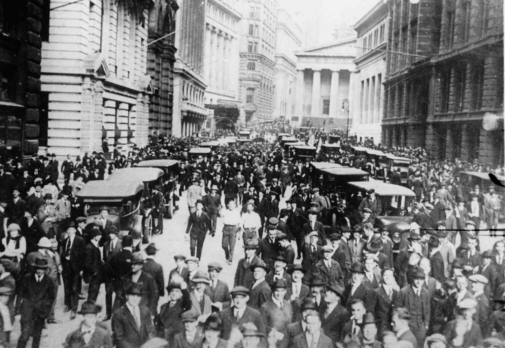

## Table of Contents

## What is Black Thursday?

Black Thursday is a name given to a very bad day in history when the stock market crashed. It happened on October 24, 1929. On this day, many people lost a lot of money because the prices of stocks went down a lot. This event is important because it started the Great Depression, a time when many people were poor and out of work.

The Great Depression lasted for many years and affected people all over the world. It was a very hard time for everyone. Black Thursday was just the beginning of this tough period. People remember it because it shows how quickly things can go wrong in the economy.

## When did Black Thursday occur?

Black Thursday happened on October 24, 1929. This was a day when the stock market in the United States crashed. A lot of people lost money because the prices of stocks dropped very fast.

This event is famous because it started the Great Depression. The Great Depression was a time when many people were poor and could not find jobs. It lasted for many years and made life hard for people all around the world.

## What were the immediate causes of Black Thursday?

The immediate causes of Black Thursday were mainly about how people were buying stocks. In the years before 1929, many people were buying stocks on margin. This means they were borrowing money to buy stocks, hoping to pay back the loans when the stock prices went up. But when the stock prices started to go down, people had to sell their stocks quickly to pay back their loans. This caused the prices to fall even more.

Another cause was that many people started to panic. When they saw the stock prices dropping, they got scared and sold their stocks too. This made the prices drop even faster. Also, some big investors and banks started selling their stocks, which made the situation worse. All these things happening at the same time led to the big crash on Black Thursday.

## How did Black Thursday impact the stock market?

Black Thursday had a big impact on the stock market. On that day, October 24, 1929, the stock market lost a lot of value very quickly. Many people who had bought stocks on margin, meaning they borrowed money to buy them, were forced to sell their stocks to pay back their loans. This selling caused the prices of stocks to fall even more. By the end of the day, the market had lost billions of dollars in value.

The impact didn't stop on Black Thursday. The crash continued and got worse on the following days, especially on what is known as Black Tuesday, October 29, 1929. The stock market kept losing value, and many people lost all their money. This led to a loss of confidence in the stock market and the economy. It was the start of the Great Depression, a time when many people were poor and out of work for years.

## What was the effect of Black Thursday on the average American?

Black Thursday had a big effect on the average American. When the stock market crashed, many people lost their money. Some people had borrowed money to buy stocks, and when the prices fell, they couldn't pay back their loans. This made them lose their savings and even their homes. People who didn't own stocks were affected too because the economy got worse. Businesses started to fail, and many people lost their jobs. It became hard to find work, and families struggled to buy food and other things they needed.

The effects of Black Thursday led to the Great Depression, which lasted for many years. During this time, life was very hard for most Americans. Many people had to stand in long lines for free food because they couldn't afford to buy it. Some families had to move from place to place looking for work. The government tried to help by creating jobs and giving people money, but it took a long time for things to get better. Black Thursday was the start of a very tough time for the average American.

## How did the government respond to Black Thursday?

After Black Thursday, the government tried to help fix the problems that the crash caused. President Herbert Hoover thought that the economy would get better on its own, but he did try to help. He worked with businesses to keep wages up and encouraged people to keep spending money. The government also started some projects to create jobs, like building roads and dams. But these efforts were not enough to stop the Great Depression from getting worse.

Later, when Franklin D. Roosevelt became president in 1933, he started the New Deal. This was a big plan to help the economy and people who were suffering. The New Deal created many new jobs through programs like the Civilian Conservation Corps and the Works Progress Administration. It also helped farmers and set up rules to make the banks and stock market safer. These actions helped a lot, but it took many years for the country to fully recover from the effects of Black Thursday.

## What were the long-term economic consequences of Black Thursday?

Black Thursday led to the Great Depression, which lasted for about ten years. During this time, many people lost their jobs and could not find new ones. Businesses closed down because people were not buying things. Banks failed because they could not give people their money back. This made the economy very weak. People had to live with less, and many families struggled to get enough food and a place to live. The government tried to help, but it took a long time for things to get better.

The effects of Black Thursday changed how the government worked with the economy. After the Great Depression, new rules were made to stop something like it from happening again. The government started to watch the stock market and banks more closely. They also created programs to help people who were out of work. These changes helped make the economy stronger over time. But it took many years for the country to fully recover from the damage caused by Black Thursday.

## How did Black Thursday contribute to the Great Depression?

Black Thursday was the start of the Great Depression. It happened on October 24, 1929, when the stock market crashed. Many people lost a lot of money because the prices of stocks went down very fast. People who had borrowed money to buy stocks had to sell them quickly to pay back their loans, but this made the prices drop even more. The crash scared a lot of people, and they started selling their stocks too, which made things worse. This panic and loss of money on Black Thursday was the beginning of the Great Depression.

After Black Thursday, the economy got much worse. Businesses started to fail because people were not buying things. Many people lost their jobs and could not find new ones. Banks failed because they could not give people their money back. All of this made life very hard for people. The Great Depression lasted for about ten years, and it took a long time for the country to get better. Black Thursday was the first big event that led to all these problems.

## What lessons have been learned from Black Thursday to prevent future crashes?

Black Thursday taught us a lot about how to keep the economy safe. One big lesson is that we need rules to stop people from borrowing too much money to buy stocks. This is called buying on margin. Now, there are laws that make it harder to do this, so it's less likely to cause a big crash. Another lesson is that the government needs to watch the stock market and the banks closely. They set up groups like the Securities and Exchange Commission (SEC) to make sure everyone is following the rules and to stop problems before they get too big.

Another important thing we learned is that the government needs to help people when the economy gets bad. After Black Thursday, the government started programs like the New Deal to create jobs and help people who were out of work. This showed that when things go wrong, the government can step in to make things better. These lessons have helped make the economy more stable over time, but we still have to be careful and keep learning to stop crashes from happening again.

## How have economic theories about Black Thursday evolved over time?

At first, people thought Black Thursday happened because too many people were buying stocks on margin and then panic selling when the prices started to fall. They believed that if people had not borrowed so much money to buy stocks, the crash might not have happened. Early theories also focused on the idea that the government should not get involved in the economy too much, thinking that the market would fix itself.

Over time, economists started to think more about other reasons for Black Thursday. They looked at how banks were lending too much money and how the economy was growing too fast before the crash. They also started to see that the government could help by making rules to protect the economy. New theories showed that things like unemployment and how much money people were spending could also affect the stock market. These ideas helped people understand that the economy is very complicated and many things can lead to a big crash like Black Thursday.

## What were the key differences between Black Thursday and other stock market crashes?

Black Thursday was different from other stock market crashes because it started the Great Depression, which lasted for many years and affected people all over the world. Many other crashes, like the one in 1987, did not lead to such a long and deep economic downturn. Black Thursday was also caused by a lot of people buying stocks on margin, which means they borrowed money to buy stocks. When the prices started to fall, they had to sell quickly to pay back their loans, making the crash worse. This was a big reason why the crash happened so suddenly and was so bad.

Another difference is that after Black Thursday, the government changed a lot of rules to try to stop something like it from happening again. They set up the Securities and Exchange Commission (SEC) to watch the stock market and make sure people follow the rules. Other crashes, like the one in 2008, led to different kinds of changes, like new rules for banks and how they lend money. Black Thursday also showed how panic and fear can make a crash worse, and this lesson has been used to help stop other crashes from getting out of control.

## How has the memory of Black Thursday influenced financial regulations and policies today?

The memory of Black Thursday has changed how we make rules for money and the stock market. After Black Thursday, people saw that borrowing a lot of money to buy stocks can be dangerous. So, they made rules to stop this from happening too much. They also created the Securities and Exchange Commission (SEC) to watch the stock market and make sure everyone follows the rules. This helps stop big crashes like Black Thursday from happening again.

Black Thursday also showed that the government can help when the economy is in trouble. After the crash, the government started programs like the New Deal to help people find jobs and get money. This idea has been used many times since then. When there are problems with the economy, like in 2008, the government steps in to help fix things. The memory of Black Thursday reminds us to be careful and to have rules in place to keep the economy safe.

## References & Further Reading

[1]: Galbraith, J. K. (1954). ["The Great Crash 1929."](https://en.wikipedia.org/wiki/The_Great_Crash,_1929) Boston: Houghton Mifflin Harcourt.

[2]: Harris, L. (2003). ["Trading and Exchanges: Market Microstructure for Practitioners."](https://academic.oup.com/book/52292) Oxford University Press.

[3]: Malkiel, B. G. (2007). ["A Random Walk Down Wall Street: The Time-Tested Strategy for Successful Investing."](https://www.amazon.com/Random-Walk-Down-Wall-Street/dp/0393358380) W.W. Norton & Company.

[4]: Grant, J. (1997). ["Money of the Mind: Borrowing and Lending in America from the Civil War to Michael Milken."](https://archive.org/details/moneyofmindborro0000gran) Farrar Straus & Giroux.

[5]: Shiller, R. J. (2015). ["Irrational Exuberance."](https://press.princeton.edu/books/paperback/9780691173122/irrational-exuberance) Princeton University Press.

[6]: Thomas, W. A. (2009). ["The Stock Exchanges of Ireland."](https://www.amazon.com/Exchanges-Ireland-Studies-Financial-Economic/dp/0905205340) Palgrave Macmillan. 

[7]: U.S. Securities and Exchange Commission. (n.d.). ["The Laws That Govern the Securities Industry."](https://www.sec.gov/rules-regulations/statutes-regulations)

