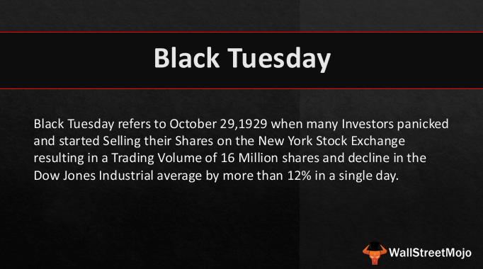

Black Tuesday, marked on October 29, 1929, stands as a pivotal moment in the history of financial markets, signifying a catastrophic stock market crash that heralded the onset of the Great Depression. This day was characterized by a frenzied sell-off of stocks on the New York Stock Exchange, resulting in monumental financial losses, a shattered sense of economic optimism, and the obliteration of personal fortunes. As stock prices plummeted, the Dow Jones Industrial Average fell nearly 12% in one day, cementing Black Tuesday’s legacy as a symbol of financial disaster.

The impact of Black Tuesday was profound and long-lasting. The stock market crash of 1929 is widely regarded as a significant factor contributing to the Great Depression, a period marked by unprecedented economic distress. The Great Depression saw soaring unemployment rates, with millions losing their jobs and homes, while countless banks failed, wiping out personal savings. The magnitude of this economic downturn prompted sweeping changes in public policy and financial market regulations to prevent similar collapses in the future.

In response to the debacle of 1929, financial systems embraced a range of reforms, intended to stabilize markets and restore investor confidence. These included the establishment of the Securities and Exchange Commission (SEC), the implementation of the Glass-Steagall Act that curtailed commercial banks' securities activities, and the introduction of measures like deposit insurance to safeguard individual bank deposits. Collectively, these changes laid the groundwork for more robust financial market oversight.

In contemporary times, the advent of algorithmic trading marks another transformative evolution in the financial sector. Utilizing complex algorithms and high-speed computing, algorithmic trading allows for rapid, data-driven decisions, optimizing trading efficiency and liquidity. This modern approach to trading, underpinned by vast advancements in technology and data analytics, holds the potential to mitigate risks that led to the collapse of 1929. Furthermore, algorithmic trading aggregates extensive market data to predict trends and automate asset trades, underscoring its significance in today's volatile financial markets.

Algorithmic trading exemplifies how lessons from historic financial catastrophes like Black Tuesday can inform present-day practices and technological innovations. This transition reflects an ongoing commitment to enhancing market stability and efficiency, emphasizing the need for continuous vigilance and adaptation in a bid to avert future financial calamities. As financial markets evolve, these innovations promise to redefine trading strategies while safeguarding against the systemic vulnerabilities that once precipitated drastic economic downturns.

## Table of Contents

## What Was Black Tuesday?

Black Tuesday refers to the catastrophic market collapse that occurred on October 29, 1929. This pivotal day marked the most severe stock market crash in the history of the United States, signaling the beginning of the Great Depression. The turmoil stemmed from a widespread sell-off, characterized by panic and chaos among investors. On Black Tuesday alone, approximately 16.4 million shares were traded, an unprecedented volume at the time, leading to a steep decline in stock prices across the board.

The panic-driven sell-off was fueled by investors trying to liquidate their holdings before experiencing even greater losses. This frenzy resulted in significant immediate financial losses. The Dow Jones Industrial Average, a key indicator of market health, plummeted by about 12% on Black Tuesday, wiping out billions of dollars in market value. This drastic drop followed a series of precipitous declines in the preceding days, with Black Thursday (October 24, 1929) and Black Monday (October 28, 1929) serving as precursors to the ultimate collapse on Black Tuesday.

The psychological impact of this day permeated the economic mindset of the era, as traditional investment safeguards had failed spectacularly. Investors who had borrowed heavily to buy stocks on margin were among the hardest hit, facing demands for repayment they could not meet. This created a vicious cycle of further selling and declining prices. The market [volatility](/wiki/volatility-trading-strategies) and financial turmoil of Black Tuesday eroded investor confidence and set in motion a chain reaction of bank failures and business collapses, ushering in a decade of economic hardship and reform.

## Causes of the 1929 Stock Market Crash

The stock market crash of 1929, known as Black Tuesday, was preceded by a period of economic prosperity known as the Roaring Twenties. This era was characterized by significant industrial growth, technological advancements, and widespread consumerism. However, this prosperity was built on precarious financial practices and economic conditions that set the stage for the eventual market collapse.

The economic exuberance of the 1920s was fueled by excessive speculation in the stock market. Investors, driven by optimism and the desire for quick profits, engaged in speculative buying, which led to an overvaluation of stocks. Many individuals invested in stocks without considering the intrinsic value of the companies, assuming that stock prices would continue to rise indefinitely.

A key [factor](/wiki/factor-investing) that exacerbated this speculative frenzy was the practice of margin buying. Margin buying enabled investors to purchase stocks by borrowing a significant portion of the purchase price, typically paying as little as 10% to 20% in cash while borrowing the remainder from brokers. This practice increased the purchasing power of investors but also significantly increased their financial risk. In mathematical terms, if an investor purchased $1,000 worth of stock with just $100 of their own money and borrowed the remaining $900, a mere 10% decline in stock value could wipe out their initial investment.

The rampant use of leverage through margin buying was compounded by other risky financial behaviors, such as investment trusts and holding companies, which created complex and opaque financial structures. These practices further strained the stability of the financial system.

Furthermore, the period leading up to the crash was marked by a lack of regulatory oversight. The stock market operated with minimal intervention from the government, and there was little regulation to protect investors or maintain market stability. This absence of regulatory safeguards allowed for unethical practices, such as insider trading and market manipulation, to go unchecked.

The confluence of these factors created a speculative bubble in the stock market. When confidence waned and the bubble burst, the cascading effect of margin calls and forced liquidations led to a rapid and severe market decline. This lack of regulatory framework not only failed to prevent the crash but also contributed to the panic and subsequent economic fallout.

In summary, the stock market crash of 1929 was precipitated by a combination of economic conditions such as speculative excess, risky financial behaviors like margin buying, and an absence of effective regulatory oversight. These elements collectively contributed to the unsustainable growth of the market in the 1920s and the subsequent crash that heralded the Great Depression.

## Impact of Black Tuesday and the Great Depression

The events of Black Tuesday on October 29, 1929, marked a significant turning point in the economic landscape of the United States and the world. The immediate aftermath saw the stock market's dramatic fall contribute heavily to the onset of the Great Depression, a period characterized by severe economic distress and adversity.

The panic triggered by the crash led to an abrupt contraction of wealth, profoundly affecting both individual and institutional investors. This contraction severely limited capital availability and resulted in a sharp decline in consumer spending and investment. As businesses faced reduced demand, they began to cut back on production, leading to widespread layoffs. The unemployment rate in the United States soared from approximately 3% in 1929 to nearly 25% by 1933 (Bernanke, 1983).

The crisis also instigated a wave of bank failures. Banks, having heavily invested in the booming stock market of the 1920s and extended substantial amounts of credit with little collateral, were left insolvent as asset values plummeted. By 1933, about 11,000 out of the nation’s 25,000 banks had failed (Federal Reserve). This collapse of the banking sector wiped out savings and disrupted the flow of credit, further stifling economic activity.

In response to these pressing economic challenges, significant changes in public policies and financial regulations were initiated. The U.S. government and policymakers recognized the urgent need for regulatory frameworks to stabilize the economy and prevent future crises. The Glass-Steagall Act of 1933 aimed to reform banking by establishing the Federal Deposit Insurance Corporation (FDIC), which insured bank deposits, restoring public confidence in the banking system. Additionally, it separated commercial and investment banking activities to reduce speculative excesses.

Further legislative measures included the Securities Act of 1933 and the Securities Exchange Act of 1934, which sought to regulate the securities industry, protect investors, and ensure transparency in financial statements to prevent market manipulations. These acts established the Securities and Exchange Commission (SEC), tasked with enforcing federal securities laws and regulating the securities industry.

In summary, the impact of Black Tuesday and the subsequent Great Depression catalyzed profound changes in both the economic landscape and regulatory environment. The economic hardships experienced during this period underscored the necessity of fiscal oversight and laid the groundwork for a more robust financial regulatory framework aimed at safeguarding against future economic catastrophes.

## Lessons Learned and Modern Parallels

The catastrophic events of Black Tuesday served as a wake-up call for financial markets worldwide, highlighting the urgent need for better risk management and regulatory oversight. One fundamental lesson learned was the perils of speculative bubbles, fueled by excessive borrowing and rampant margin trading. Prior to the crash, investors often purchased stocks on margin, meaning they could borrow up to 90% of the purchase price. This practice amplified potential gains but also increased vulnerability to price declines, as small drops in stock prices could trigger margin calls and force widespread selling, exacerbating the downturn.

In response to the excesses that led to the 1929 crash, significant changes were implemented to reform the financial system. One notable regulatory measure was the Glass-Steagall Act of 1933, which separated commercial banking from investment banking, aiming to reduce conflicts of interest and limit the risk exposures banks could undertake. Additionally, the establishment of the Securities and Exchange Commission (SEC) in 1934 marked a pivotal step in enforcing transparency and accountability in securities markets. The SEC's role includes monitoring securities transactions, preventing fraudulent practices, and ensuring that companies providing securities to the public comply with legal disclosure requirements.

A modern parallel to these lessons can be seen in the regulations implemented after the 2008 financial crisis. Here, the Dodd-Frank Wall Street Reform and Consumer Protection Act of 2010 played a similar role in tightening oversight and mitigating systemic risks in financial markets. It introduced measures to enhance consumer protection, regulate credit default swaps and other derivatives, and subjected large financial institutions to stress tests to assess their ability to withstand economic downturns.

Moreover, the lessons of Black Tuesday emphasize the importance of maintaining [liquidity](/wiki/liquidity-risk-premium) in financial markets. Modern financial regulations often require financial institutions to hold a minimum level of liquid assets to ensure they can meet short-term obligations, thus preventing a liquidity crisis akin to that of 1929. 

Finally, an emphasis on data analysis and risk assessment in contemporary financial practices can be traced back to these early lessons. Today, advanced modeling techniques and algorithms are employed to predict market trends and assess risk more accurately. The evolution of these tools underscores the ongoing commitment to learn from past mistakes and institute practices that safeguard economic stability.

In summary, Black Tuesday's lessons have profoundly shaped modern financial regulations, underscoring the critical need for vigilant oversight, robust risk management, and comprehensive transparency to prevent similar market failures in the future.

## Algorithmic Trading: A Modern Perspective

Algorithmic trading, often referred to as algo-trading or automated trading, is the use of computer programs and software to trade financial securities according to predetermined criteria. These algorithms operate at high speeds and volumes, typically involving complex mathematical models that allow traders to execute orders on an automated basis. This process contrasts significantly with traditional human-based trading and has become a cornerstone of modern financial markets due to its efficiency and accuracy.

The functionality of [algorithmic trading](/wiki/algorithmic-trading) in today’s markets revolves around its ability to process vast amounts of data quickly and execute trades at speeds far beyond human capability. Algorithms use variables such as price, timing, and [volume](/wiki/volume-trading-strategy) to set market conditions under which trades are executed. Common strategies include [arbitrage](/wiki/arbitrage), where the algorithm exploits price discrepancies of the same asset across different markets, and [trend following](/wiki/trend-following), which analyzes market data to determine and follow the current trend of asset prices.

In the context of a financial crisis like the crash of 1929, modern technology and data analysis may have offered substantial management tools. If algorithmic trading had been available, its capability to withstand panic-driven decisions through automated rules might have reduced the chaotic impact of massive sell-offs. By enforcing systematic trading practices and scouring real-time market data, algorithms could potentially mitigate the irrational behaviors that contribute to drastic market declines.

However, algorithmic trading also presents particular risks. High-Frequency Trading ([HFT](/wiki/high-frequency-trading-strategies)), a subset of algorithmic trading that executes a large number of orders at extremely high speeds, may exacerbate market volatility. The 'flash crash' of May 6, 2010, is a notable example where HFT was implicated in a rapid market decline. Moreover, reliance on algorithms can lead to systemic risks if multiple systems operate based on similar data inputs, potentially resulting in synchronized, adverse market actions. 

Despite these risks, the advantages of algorithmic trading are significant. It offers increased liquidity, reduced transaction costs due to limited human intervention, and improved market efficiency. The absence of emotional decision-making traditionally associated with human trading results in more consistent trade execution.

In conclusion, as financial markets continue to evolve, the role of algorithmic trading will likely expand, promising enhanced market opportunities while simultaneously posing new regulatory and ethical challenges. Effective risk management systems and thoughtful regulation will be essential to harness the benefits of algorithmic trading while mitigating its potential pitfalls.

## Conclusion

Black Tuesday, the cataclysmic event that marked October 29, 1929, left an indelible mark on financial markets and economic policies worldwide. The stock market crash it triggered not only ushered in the Great Depression but also laid bare the vulnerabilities of an inadequately regulated financial system. The financial turmoil that ensued highlighted the necessity for robust regulatory frameworks and systemic safeguards to preclude future economic catastrophes. This event became a catalyst for a series of reforms aimed at stabilizing financial markets and protecting investors. The Securities Act of 1933 and the Securities Exchange Act of 1934 were landmark legislations that initiated federal oversight of securities transactions and established the Securities and Exchange Commission (SEC) to enforce securities laws and protect investors from malpractice.

In contemporary times, the evolution of trading strategies, particularly the advent of algorithmic trading, symbolizes a significant advance in responding to historical financial disasters. Algorithmic trading uses mathematical models and automated processes, often employing sophisticated algorithms to execute trades at speeds and frequencies that are impossible for human traders. This technology-driven approach can potentially prevent market destabilizations similar to those in 1929 by offering enhanced liquidity, reducing transaction costs, and enabling more precise execution of trades. However, the rapid execution and high-frequency nature of algorithmic trading necessitate stringent monitoring to prevent systemic risks and ensure market integrity.

The evolution of algorithmic trading underscores the importance of continued vigilance and adaptation in financial markets. As financial landscapes evolve, so too must the mechanisms for monitoring and controlling these complex systems. It remains crucial for regulatory bodies to strike a balance between fostering innovation in trading technologies and safeguarding the markets against the aberrations that could lead to another systemic collapse.

While Black Tuesday serves as a stark reminder of the destructive potential of unregulated markets, it also emphasizes the necessity for ongoing advancements in trading technologies and regulatory practices. An effective regulatory environment, coupled with advanced trading strategies, can help mitigate risks and preserve market stability. As we continue to embrace technological innovations in financial markets, a commitment to vigilance and adaptation remains paramount to prevent the recurrence of such unparalleled market disruptions.

## References & Further Reading

[1]: Bernanke, B. S. (1983). ["Nonmonetary Effects of the Financial Crisis in the Propagation of the Great Depression."](https://www.jstor.org/stable/1808111) National Bureau of Economic Research.

[2]: Federal Reserve Historical Statistics. ["Bank Failures in the 1930s"](https://www.federalreservehistory.org/essays/banking-panics-1930-31).

[3]: ["The Great Crash, 1929"](https://en.wikipedia.org/wiki/Wall_Street_Crash_of_1929) by John Kenneth Galbraith.

[4]: Securities and Exchange Commission. ["The Investor's Advocate: How the SEC Protects Investors, Maintains Market Integrity, and Facilitates Capital Formation"](https://www.sec.gov/news/studies/2009/oig-509/exhibit-0356.pdf).

[5]: Friedman, M., & Schwartz, A. J. (1963). ["A Monetary History of the United States, 1867-1960"](https://www.jstor.org/stable/j.ctt7s1vp). Princeton University Press.

[6]: ["Too Big to Fail: The Inside Story of How Wall Street and Washington Fought to Save the Financial System—and Themselves"](https://www.amazon.com/Too-Big-Fail-Washington-System/dp/0143118242) by Andrew Ross Sorkin.

[7]: U.S. Securities and Exchange Commission. ["Laws That Govern the Securities Industry"](https://www.sec.gov/rules-regulations/statutes-regulations).