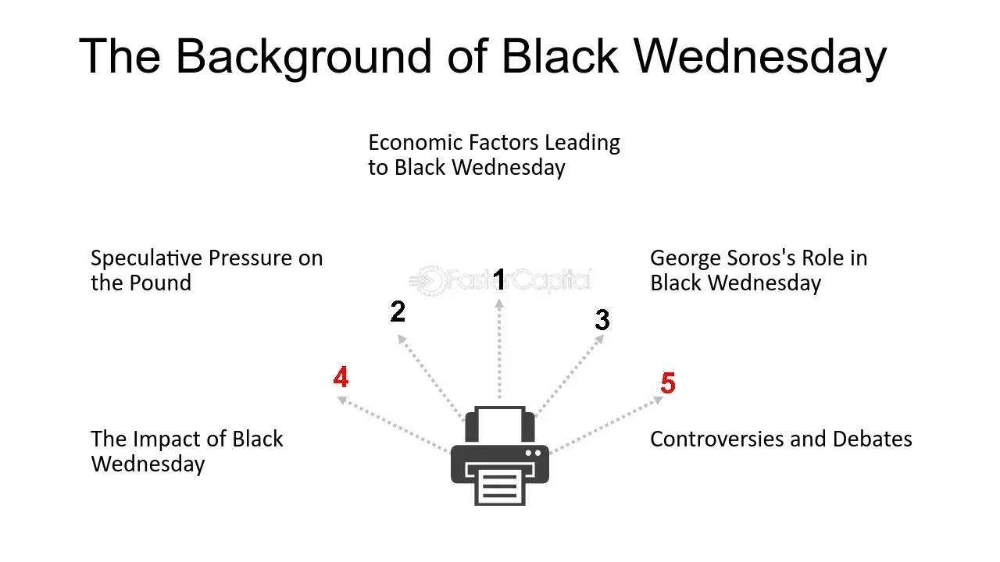

## Table of Contents

## What was Black Wednesday?

Black Wednesday happened on September 16, 1992. It was a big event in the world of money. On that day, the British government tried to keep the value of the pound steady with other countries' money. But they couldn't do it. The pound's value fell a lot, and it was very bad for the UK's economy.

The main reason this happened was because of a man named George Soros. He and other people who trade money thought the pound was too strong. They sold a lot of pounds, betting that its value would go down. They were right, and they made a lot of money. The British government lost billions trying to stop the pound from falling. After Black Wednesday, the UK had to leave the European Exchange Rate Mechanism, which was a group that tried to keep countries' money values close to each other.

## When did Black Wednesday occur?

Black Wednesday happened on September 16, 1992. It was a big day for the UK's money. The British government wanted to keep the pound's value the same as other countries' money. But they couldn't do it. The pound's value dropped a lot, and it was bad for the UK's economy.

The main person behind this was George Soros. He and other people who trade money thought the pound was too strong. They sold a lot of pounds, betting that its value would go down. They were right, and they made a lot of money. The British government lost billions trying to stop the pound from falling. After Black Wednesday, the UK had to leave the European Exchange Rate Mechanism. This was a group that tried to keep countries' money values close to each other.

## What were the immediate effects of Black Wednesday on the UK economy?

The immediate effects of Black Wednesday on the UK economy were quite bad. The value of the British pound fell a lot. This made things that the UK bought from other countries more expensive. It also made it harder for the UK to pay back money it owed to other countries. The government had spent a lot of money trying to keep the pound's value up, and now it had less money to spend on other things. This made the UK's economy weaker.

Another effect was that interest rates went up a lot. This happened because the government was trying to make people want to buy pounds again. But higher interest rates made it more expensive for people and businesses to borrow money. This slowed down the economy even more. People and businesses had less money to spend, and this made the economy struggle. Overall, Black Wednesday caused a lot of problems for the UK right away.

## What were the underlying causes of Black Wednesday?

The main reason for Black Wednesday was that the British pound was in the European Exchange Rate Mechanism (ERM). This meant that the pound's value had to stay close to the value of other countries' money. But the pound was too strong for this. The UK's economy was not doing well, and it needed a weaker pound to help it. But the government did not want to let the pound's value fall. This made people who trade money think the pound was too strong and would have to fall eventually.

George Soros and other money traders saw this. They thought the pound would have to leave the ERM. So, they sold a lot of pounds, betting that its value would go down. When the pound's value started to fall, the British government tried to stop it by buying pounds and raising interest rates. But they could not stop it. The government lost a lot of money trying to keep the pound's value up. In the end, the pound's value fell a lot, and the UK had to leave the ERM. This is what caused Black Wednesday.

## How did the UK government's economic policies contribute to Black Wednesday?

The UK government's economic policies played a big role in causing Black Wednesday. The government wanted to keep the pound's value high, even though the UK's economy was not doing well. They joined the European Exchange Rate Mechanism (ERM), which meant the pound had to stay close to the value of other countries' money. But the UK needed a weaker pound to help its economy. The government did not want to let the pound's value fall, so they kept trying to keep it high. This made people who trade money think the pound was too strong and would have to fall eventually.

Because of these policies, George Soros and other money traders saw a chance to make money. They sold a lot of pounds, betting that its value would go down. When the pound's value started to fall, the government tried to stop it by buying pounds and raising interest rates. But they could not stop it. The government lost a lot of money trying to keep the pound's value up. In the end, the pound's value fell a lot, and the UK had to leave the ERM. The government's policies of trying to keep the pound strong, even when it was not good for the economy, led to Black Wednesday.

## What role did the European Exchange Rate Mechanism (ERM) play in the events leading to Black Wednesday?

The European Exchange Rate Mechanism (ERM) was a big reason for Black Wednesday. The ERM was a group that tried to keep the value of different countries' money close to each other. The UK joined the ERM because they wanted the pound to stay strong. But the UK's economy was not doing well, and it needed a weaker pound to help it. The government did not want to let the pound's value fall, so they kept trying to keep it high. This made people who trade money think the pound was too strong and would have to fall eventually.

Because the pound was in the ERM, George Soros and other money traders saw a chance to make money. They sold a lot of pounds, betting that its value would go down. When the pound's value started to fall, the government tried to stop it by buying pounds and raising interest rates. But they could not stop it. The government lost a lot of money trying to keep the pound's value up. In the end, the pound's value fell a lot, and the UK had to leave the ERM. The ERM made it hard for the UK to change the pound's value when it needed to, and this led to Black Wednesday.

## Who is George Soros and what was his involvement in Black Wednesday?

George Soros is a famous businessman and investor. He is known for making a lot of money by trading money from different countries. He started a big company called the Quantum Fund. Soros became very rich and is known for his ideas about how the world's economy works.

On Black Wednesday, George Soros played a big role. He and his team at the Quantum Fund thought the British pound was too strong. They sold a lot of pounds, betting that its value would go down. They were right, and when the pound's value fell, Soros made a lot of money. This event is known as Black Wednesday because it was a very bad day for the UK's economy. Soros's actions helped show that the UK could not keep the pound's value high, and this led to the UK leaving the European Exchange Rate Mechanism.

## What specific financial strategies did George Soros use during Black Wednesday?

George Soros used a strategy called short selling during Black Wednesday. This means he sold pounds that he didn't own, betting that their value would go down. He borrowed pounds from banks and sold them right away. When the pound's value fell, Soros bought the pounds back at the lower price and gave them back to the banks. The difference between the price he sold the pounds at and the price he bought them back at was his profit. This strategy made him a lot of money because the pound's value dropped a lot.

Soros also used leverage to make his bets bigger. Leverage means borrowing money to invest more than you have. By using leverage, Soros could sell more pounds than he could have with just his own money. This made his potential profits bigger, but it also made the risk bigger. When the pound's value fell like Soros thought it would, his use of leverage helped him make a huge amount of money. His smart use of these financial strategies during Black Wednesday is a big reason why he is so famous in the world of money.

## How much money did George Soros make from his bets against the British pound?

George Soros made about $1 billion from his bets against the British pound on Black Wednesday. He used a strategy called short selling. This means he sold pounds he didn't own, betting that their value would go down. When the pound's value fell, Soros bought the pounds back at a lower price and gave them back to the banks he borrowed them from. The difference between the price he sold the pounds at and the price he bought them back at was his profit.

Soros also used something called leverage to make his bets bigger. Leverage means borrowing money to invest more than you have. By using leverage, Soros could sell more pounds than he could have with just his own money. This made his potential profits bigger, but it also made the risk bigger. When the pound's value fell like Soros thought it would, his use of leverage helped him make a huge amount of money.

## What were the long-term economic impacts of Black Wednesday on the UK?

Black Wednesday had big effects on the UK's economy over a long time. After the pound's value fell a lot, the UK had to leave the European Exchange Rate Mechanism. This let the UK control its money better. The pound's value kept falling for a while, which made things from other countries more expensive. But it also made things from the UK cheaper for other countries. This helped the UK sell more things to other countries, which was good for the economy. Over time, the UK's economy got stronger because of this.

Another long-term effect was that interest rates went down after Black Wednesday. This made it cheaper for people and businesses to borrow money. With lower interest rates, people could buy more things like houses and cars. Businesses could also borrow money to grow and hire more people. This helped the economy grow faster. Overall, even though Black Wednesday was bad at first, it led to some good changes for the UK's economy in the long run.

## How did Black Wednesday influence future economic policies in the UK and Europe?

Black Wednesday changed how the UK thought about its money. After the pound's value fell and the UK left the European Exchange Rate Mechanism, the UK started to be more careful about joining groups that control money values. They wanted to keep control over their own money. This made the UK think twice about joining the euro later on. The UK saw that having their own control over the pound was important for their economy. This event made the UK's leaders focus more on keeping the economy strong and stable, rather than trying to keep the pound's value the same as other countries' money.

In Europe, Black Wednesday also had big effects. It showed that trying to keep all countries' money values the same was hard. Some countries' economies were doing better than others, and this made it tough to keep their money values close. After Black Wednesday, Europe started to think more about how to make the European Exchange Rate Mechanism work better. This event helped lead to the creation of the euro. The euro was a new kind of money that many countries in Europe used. It was meant to make it easier for these countries to work together and keep their economies strong.

## What lessons can be learned from Black Wednesday regarding currency speculation and economic stability?

Black Wednesday showed that trying to keep a country's money value the same as other countries' money can be very hard. The UK tried to keep the pound strong, but it didn't work. The pound's value fell a lot, and this hurt the UK's economy. This event taught us that it's important for a country to have control over its own money. If a country's economy is not doing well, it might need to let its money's value fall to help it get better. Trying to keep the money's value the same when the economy is struggling can lead to big problems.

Another lesson from Black Wednesday is about how people who trade money can affect a country's economy. George Soros and other traders saw that the pound was too strong and bet against it. They made a lot of money when the pound's value fell. This showed that big traders can have a lot of power over a country's money. It's important for countries to be ready for this kind of speculation. They need to have good plans to keep their economy stable, even when big traders are betting against their money.

## Who is George Soros and how did he break the Bank of England?

George Soros, a renowned financier and the head of the Quantum Fund, played an instrumental role in the events of Black Wednesday. Known for his insight and speculative acumen, Soros wagered that the British government's attempts to sustain the pound within the confines of the European Exchange Rate Mechanism (ERM) would ultimately falter. At the core of his strategy was the belief that the pound was overvalued and that market forces would eventually compel a devaluation.

Soros's strategy involved short selling massive amounts of the British pound. Short selling is a technique in which an investor borrows a currency and sells it with the anticipation that its value will decline. The investor can then repurchase the currency at a lower price, return it to the lender, and pocket the difference as profit. Mathematically, this can be expressed as:

$$
\text{Profit} = (\text{Sell Price} - \text{Buy Price}) \times \text{Amount Sold}
$$

In the case of Black Wednesday, Soros and his fund short-sold billions of pounds. As the UK government's measures, including increasing interest rates and purchasing pounds with foreign currency reserves, proved insufficient to support the currency, the pound's value dropped according to Soros's prediction. Consequently, the UK government was compelled to withdraw from the ERM, leading to a devaluation of the pound.

The financial impact of Soros's actions was profound. He is reported to have reaped an estimated profit of $1 billion on Black Wednesday alone, leading to his nickname "the man who broke the Bank of England". This epithet underscores the significant pressure his trading placed on the pound and the pivotal role he played in the currency's collapse. His success in this endeavor is a testament to his analytical capabilities and highlights the influence an individual financier can exert on global financial markets.

Soros's actions during Black Wednesday have since become a case study in both the potential for profit through currency speculation and the risks faced by governments in maintaining artificial currency valuations. They also exemplify the sheer power of speculative activities in financial markets and the limitations of governmental efforts to control currency exchange rates in the face of unrelenting market forces.

## References & Further Reading

[1]: Eichengreen, B. (1992). ["The Breakdown of the Willy-Nilly Forward Eurobonds: Lessons from Black Wednesday."](https://ehs.org.uk/a-small-remark-with-big-consequences-what-sparked-black-wednesday/) *Economic Policy*, 14, 179-210.

[2]: Soros, G. (1995). *Soros on Soros: Staying Ahead of the Curve*. John Wiley & Sons. [Amazon Link](https://en.wikipedia.org/wiki/Soros_on_Soros:_Staying_Ahead_of_the_Curve)

[3]: Krugman, P. (1997). ["Currency Crises."](https://press.uchicago.edu/ucp/books/book/chicago/C/bo3632847.html) *National Bureau of Economic Research Working Paper No. 4640*.

[4]: Lo, A. W., & Hasanhodzic, J. (2010). *The Evolution of Technical Analysis: Financial Prediction from Babylonian Tablets to Bloomberg Terminals*. John Wiley & Sons. [Amazon Link](https://archive.org/details/evolutionoftechn0000loan)

[5]: Litterman, R., & Weiss, L. (2010). *Modern Investment Management: An Equilibrium Approach*. Wiley. [Amazon Link](https://www.wiley.com/en-us/Modern+Investment+Management%3A+An+Equilibrium+Approach-p-9780471480655)

[6]: Derman, E. (2004). *My Life as a Quant: Reflections on Physics and Finance*. John Wiley & Sons. [Amazon Link](https://emanuelderman.com/wp-content/uploads/2005/03/my-life.qf_.pdf)