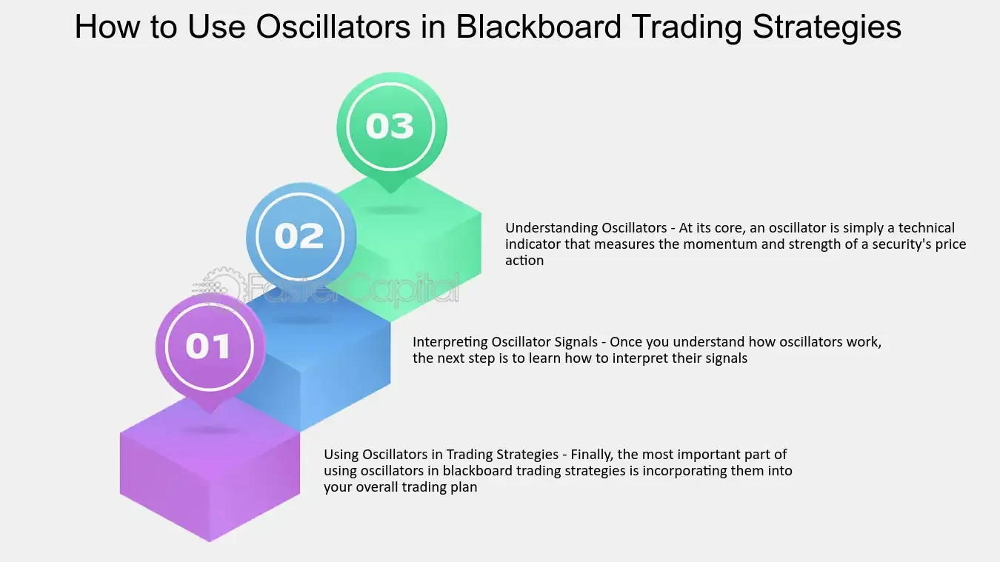

## Table of Contents

## What is a Blackboard Trading System?

A Blackboard Trading System is a type of software used by traders to help them make decisions about buying and selling stocks or other financial products. It works by collecting information from different sources, like market data and news, and then showing this information on a single screen, called a "blackboard." This helps traders see all the important information in one place, making it easier for them to decide what to do next.

The system is designed to be flexible, allowing traders to add or remove different pieces of information depending on what they need. For example, a trader might want to see real-time stock prices, news headlines, and economic indicators all at once. By having all this data on the blackboard, traders can quickly analyze the situation and make better trading decisions. This can be especially useful in fast-moving markets where quick decisions are important.

## How does a Blackboard Trading System work?

A Blackboard Trading System works by gathering lots of different pieces of information from various sources, like stock prices, news, and economic reports. It then puts all this information onto one big screen, called a blackboard. This helps traders see everything they need to know at a glance. Instead of having to look at many different places for information, traders can just look at the blackboard and see it all together. This makes it easier for them to understand what's happening in the market.

The system is also very flexible. Traders can choose what kind of information they want to see on the blackboard. For example, if a trader is interested in tech stocks, they might want to see news about tech companies, along with the latest stock prices for those companies. By customizing the blackboard, traders can focus on the information that matters most to them. This helps them make quicker and better decisions about when to buy or sell stocks.

## What are the key components of a Blackboard Trading System?

A Blackboard Trading System has several important parts that help traders make good decisions. The main part is the blackboard itself, which is a big screen that shows all the important information in one place. This screen can show things like stock prices, news, and economic reports. Traders can see all of this at the same time, which makes it easier for them to understand what's happening in the market.

Another key part is the system's ability to gather information from different sources. This means it can pull in data from places like stock exchanges, news websites, and economic databases. By bringing all this information together, the blackboard gives traders a complete picture of the market. The system is also flexible, so traders can choose what kind of information they want to see on the blackboard. This helps them focus on the things that matter most to them when making trading decisions.

## What are the benefits of using a Blackboard Trading System for trading?

Using a Blackboard Trading System can make trading easier and more effective. It gathers all the important information in one place, so traders don't have to look at many different screens or websites. This means they can see stock prices, news, and economic reports all at the same time. Having all this information together helps traders understand the market better and make decisions faster.

Another benefit is that the system is flexible. Traders can choose what kind of information they want to see on the blackboard. For example, if they are interested in tech stocks, they can set up the blackboard to show news and prices about those companies. This helps them focus on what matters most to them. By customizing the blackboard, traders can make better and quicker decisions about when to buy or sell stocks.

## Can you explain the role of knowledge sources in a Blackboard Trading System?

Knowledge sources in a Blackboard Trading System are very important because they provide the information that traders need to make good decisions. These sources can include things like stock prices from stock exchanges, news from news websites, and economic reports from databases. The system collects all this information and puts it on the blackboard. This helps traders see everything they need to know in one place, making it easier for them to understand what's happening in the market.

Having different knowledge sources is helpful because it gives traders a complete picture of the market. For example, if a trader is looking at a stock, they might want to see the current price, any recent news about the company, and how the economy is doing. By pulling in information from different places, the blackboard can show all of this at the same time. This way, traders can make better decisions because they have all the important information right in front of them.

## How does a Blackboard Trading System integrate different types of data?

A Blackboard Trading System works by bringing together different types of data from many places. It collects information like stock prices from stock exchanges, news from news websites, and economic reports from databases. All this data is then shown on one big screen called the blackboard. This way, traders can see everything they need to know in one place, instead of having to look at many different screens or websites.

The system is smart because it can handle different kinds of information at the same time. For example, if a trader is looking at a stock, they might want to see the current price, any recent news about the company, and how the economy is doing. The blackboard can show all of this together, helping traders understand the market better. By having all this information in one place, traders can make quicker and better decisions about when to buy or sell stocks.

## What are the common challenges faced when implementing a Blackboard Trading System?

One common challenge when implementing a Blackboard Trading System is making sure all the different pieces of information work well together. The system needs to pull in data from many places like stock exchanges, news websites, and economic databases. Sometimes, this data might not be in the same format or might update at different times. This can make it hard for the system to show everything correctly on the blackboard. Traders need the information to be accurate and up-to-date, so getting all the data to work together smoothly is important.

Another challenge is keeping the system flexible enough for different traders. Each trader might want to see different kinds of information on the blackboard. For example, one trader might be interested in tech stocks, while another might focus on energy companies. The system needs to let traders customize what they see, but this can be tricky to set up. If the system is too hard to use or change, traders might not use it as much as they could. Making the system easy to customize while still being reliable is a big challenge.

## How can a Blackboard Trading System be optimized for better performance?

To make a Blackboard Trading System work better, it's important to make sure all the data it uses is fast and accurate. This means the system should be able to get the latest stock prices, news, and economic reports quickly. If the data is slow or wrong, traders won't be able to make good decisions. One way to do this is by using strong computers and good internet connections. This helps the system get and show information faster. Also, the system should be checked often to make sure it's working right and all the data is up-to-date.

Another way to improve the system is by making it easy for traders to change what they see on the blackboard. Each trader might want to look at different things, like stock prices or news about certain companies. If the system is easy to use and customize, traders will be happier and use it more. This means the system should have simple controls that let traders add or remove information easily. By making the system flexible and user-friendly, traders can focus on the information that matters most to them and make better trading decisions.

## What are some real-world examples of Blackboard Trading Systems in use?

One real-world example of a Blackboard Trading System is used by a big investment bank. They have a special screen that shows all the important information traders need, like stock prices, news, and economic reports. This helps the traders see everything at once and make quick decisions. The system pulls in data from different places, like stock exchanges and news websites, and puts it all together on the blackboard. This makes it easier for the traders to understand what's happening in the market and decide when to buy or sell stocks.

Another example is a trading platform used by a group of day traders. They use a Blackboard Trading System to keep track of many stocks at the same time. The system lets them customize what they see on the screen, so they can focus on the stocks and news that matter most to them. This helps them react quickly to changes in the market. By having all the information in one place, these traders can make better decisions about their trades throughout the day.

## How does a Blackboard Trading System compare to other trading systems like expert systems or neural networks?

A Blackboard Trading System is different from expert systems and neural networks because it focuses on showing all the important information in one place. It gathers data from many sources like stock prices, news, and economic reports, and puts it all on a big screen called a blackboard. This helps traders see everything at the same time, making it easier for them to understand the market and make decisions quickly. The system is also flexible, letting traders choose what information they want to see. This means they can focus on what matters most to them, like certain stocks or news about specific companies.

Expert systems, on the other hand, use rules and knowledge to make decisions. They are like a smart computer that follows a set of rules to tell traders what to do. For example, an expert system might say to buy a stock if its price goes up by a certain amount. These systems are good at following rules but might not be as good at handling new or unexpected information. Neural networks are different because they learn from data. They can find patterns in stock prices or other information and use these patterns to make predictions. This can be helpful for finding trends, but neural networks can be hard to understand and might not explain why they make certain decisions.

In summary, a Blackboard Trading System is great for showing all the important information in one place and letting traders customize what they see. Expert systems are good at following rules to make decisions, while neural networks are good at finding patterns and making predictions. Each type of system has its own strengths, and traders might use them in different ways depending on what they need.

## What advanced techniques can be used to enhance the decision-making process in a Blackboard Trading System?

One advanced technique to make decision-making better in a Blackboard Trading System is using [machine learning](/wiki/machine-learning). This means the system can learn from past data to find patterns and make predictions. For example, it might look at how stock prices have changed in the past when certain news comes out. By understanding these patterns, the system can help traders guess what might happen next. This can make their decisions more accurate and help them make more money.

Another technique is using real-time analytics. This means the system can look at data as it comes in and give traders quick updates. For example, if a big news story comes out, the system can show how it might affect stock prices right away. This helps traders react faster to changes in the market. By combining real-time analytics with machine learning, the Blackboard Trading System can give traders a big advantage in making smart and quick decisions.

## What future developments are expected in the field of Blackboard Trading Systems?

In the future, Blackboard Trading Systems are expected to become even smarter and easier to use. One big change will be the use of more advanced [artificial intelligence](/wiki/ai-artificial-intelligence) (AI). AI can help the system understand the market better by learning from past data. This means the system can give traders better suggestions on when to buy or sell stocks. It can also make the blackboard easier to customize, so traders can quickly change what they see based on what's happening in the market. This will help traders make decisions faster and more accurately.

Another development will be the use of better real-time data. Right now, Blackboard Trading Systems can show information as it comes in, but in the future, this will get even faster. The system will be able to update the blackboard almost instantly when new data arrives. This will help traders react to changes in the market right away. By combining fast data updates with smart AI, Blackboard Trading Systems will become powerful tools that help traders make the best decisions possible.

## What are Algo Trading Strategies?

Algorithmic trading employs a variety of strategies, each designed to optimally execute trades based on specific market conditions and goals. Among the commonly used strategies are Volume Weighted Average Price (VWAP), Time Weighted Average Price (TWAP), [trend following](/wiki/trend-following), and mean reversion.

Volume Weighted Average Price (VWAP) is a trading benchmark used especially in large orders to ensure a trade is executed close to the market average. VWAP is calculated by taking the total dollar value of trading in a security and dividing it by the total [volume](/wiki/volume-trading-strategy) of trades. Traders utilizing the VWAP strategy aim to execute their trades in line with the average price over a specific period, ensuring minimal impact on the market price.

The formula for VWAP is: 

$$
\text{VWAP} = \frac{\sum (\text{Price}_i \times \text{Volume}_i)}{\sum \text{Volume}_i}
$$

Time Weighted Average Price (TWAP) is another execution strategy. It involves dividing a large order into smaller increments and executing them evenly over a specified time period. This reduces the market impact of a large order and is beneficial in assets with low [liquidity](/wiki/liquidity-risk-premium). By dividing their trades evenly, traders hope to achieve an execution price close to the average market price over that time.

Trend following strategies assume that prices are more likely to keep moving in the same direction than to change [course](/wiki/best-algorithmic-trading-courses). Thus, traders using these strategies buy an asset when its price trends upward and sell it when its price trends downward. This strategy is grounded in the notion that trends persist due to [momentum](/wiki/momentum), and traders use indicators like moving averages or the Relative Strength Index (RSI) to identify strong trends.

Mean reversion strategies, in contrast, are built on the premise that prices tend to revert to their historical averages over time. When the market price of an asset deviates significantly from its average value, traders employing a mean reversion strategy expect it to revert back to its mean. This strategy is implemented by identifying overbought or oversold conditions and executing trades accordingly, using indicators such as Bollinger Bands or moving average convergence divergence (MACD).

A simple Python example of a moving average crossover strategy, a subset of trend following, may illustrate these ideas:

```python
import numpy as np
import pandas as pd

# Sample data
data = pd.DataFrame({
    'Close': [100, 102, 104, 103, 105, 107, 110, 108, 107, 108]
})

short_window = 3
long_window = 5

# Calculate moving averages
data['short_mavg'] = data['Close'].rolling(window=short_window, min_periods=1).mean()
data['long_mavg'] = data['Close'].rolling(window=long_window, min_periods=1).mean()

# Generate signals
data['signal'] = np.where(data['short_mavg'] > data['long_mavg'], 1.0, 0.0)

# Generate trading orders
data['positions'] = data['signal'].diff()

print(data)
```

This code calculates short and long moving averages for closing prices and generates buy signals when the short moving average crosses above the long moving average, indicating a potential upward trend. Algorithmic trading strategies like these provide traders with structured approaches to navigate the complexities of financial markets efficiently.

## References & Further Reading

[1]: Bergstra, J., Bardenet, R., Bengio, Y., & Kégl, B. (2011). ["Algorithms for Hyper-Parameter Optimization."](https://dl.acm.org/doi/10.5555/2986459.2986743) Advances in Neural Information Processing Systems 24.

[2]: ["Advances in Financial Machine Learning"](https://www.amazon.com/Advances-Financial-Machine-Learning-Marcos/dp/1119482089) by Marcos Lopez de Prado

[3]: ["Evidence-Based Technical Analysis: Applying the Scientific Method and Statistical Inference to Trading Signals"](https://www.amazon.com/Evidence-Based-Technical-Analysis-Scientific-Statistical/dp/0470008741) by David Aronson

[4]: ["Machine Learning for Algorithmic Trading"](https://github.com/stefan-jansen/machine-learning-for-trading) by Stefan Jansen

[5]: ["Quantitative Trading: How to Build Your Own Algorithmic Trading Business"](https://www.amazon.com/Quantitative-Trading-Build-Algorithmic-Business/dp/1119800064) by Ernest P. Chan