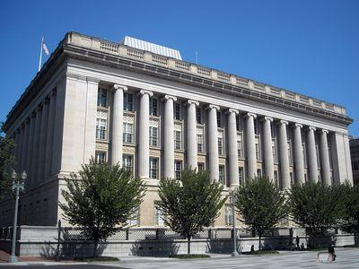

Blacklisting is a longstanding practice that plays a significant role in numerous sectors, serving as a mechanism to identify and isolate entities deemed undesirable or unethical. Its primary objective is to restrict the activities of these entities, thereby safeguarding the interests of compliant parties. The concept of blacklisting is deeply rooted in history, evolving from its early applications to combat movements perceived as subversive to its modern implementations by governments and organizations to enforce sanctions and protect digital ecosystems.

Blacklists are systematically compiled lists that contain individuals, groups, companies, or IP addresses that are marked due to associations with activities considered harmful or objectionable. These lists, by limiting the interactions and opportunities available to the blacklisted entities, act as a deterrent against non-compliance and unethical behavior. Traditional applications of blacklists focused on labor and political spheres, targeting union activists and alleged communist affiliates. Today, the practice has expanded, with blacklists being a critical tool in cybersecurity, finance, and international relations.



In the context of algorithmic trading, blacklists have become instrumental in risk management and regulatory compliance. They ensure that automated trading systems do not engage with securities or counterparts deemed to present a heightened risk of non-compliance or reputational damage. By incorporating blacklists into trading algorithms, firms can effectively filter out undesirable transactions, contributing to a more stable and transparent trading environment.

Understanding the historical evolution, typologies, and current applications of blacklists is essential for individuals and organizations navigating these complex systems. Whether managing national security threats, preserving the integrity of financial markets, or maintaining the safety of digital networks, blacklists provide a crucial layer of protection. Nevertheless, their implementation must be balanced with considerations of fairness and justice to prevent undue harm to reputations.

## Table of Contents

## History of Blacklists

The history of blacklists can be traced back to the early 1600s, with their origins rooted in practices that aimed to control and suppress certain groups or individuals. The term "blacklist" itself is believed to have originated during this period, though the concept likely existed in various forms prior to its widespread documentation.

Initially, blacklists were strategically used to target individuals suspected of union activities and those perceived as communist sympathizers. For instance, during the rise of labor movements, employers would create lists of workers who were involved in union organizing. These individuals were deemed undesirable, often making it difficult for them to gain employment, as sharing such lists among employers effectively barred them from the industry.

In the 20th century, a notable example of blacklisting occurred during the McCarthy era in the United States. The Hollywood blacklist, an infamous instance, targeted individuals in the entertainment industry alleged to have communist ties. These blacklists served as tools for political and social control, severely impacting the lives and careers of those affected.

In contemporary times, blacklists have evolved into mechanisms often compiled by governments, primarily to sanction entities deemed to be violating international norms or regulations. These governmental blacklists are used to impose economic restrictions and to enforce security protocols, often in the form of trade bans or denial of access to financial systems. Given the global nature of modern economies, such blacklists can have wide-reaching consequences, affecting not only the entities directly listed but also the countries and corporations engaged in trade with them.

Overall, the evolution of blacklists from informal, industry-focused lists to formalized government instruments illustrates their enduring role in regulating activities deemed undesirable by those in power.

## Types of Blacklists

Government blacklists have long been utilized as a mechanism to enforce economic sanctions against countries, organizations, and individuals violating international laws or ethical standards. These lists deter prohibited activities by restricting the blacklisted entities from engaging in trade and financial transactions. An example is the United States' Specially Designated Nationals (SDN) list, compiled by the Office of Foreign Assets Control (OFAC), which identifies individuals and companies owned or controlled by, or acting on behalf of, targeted countries. It also lists people, groups, and entities, such as terrorists and narcotics traffickers. Inclusion on such lists can severely impact an entity’s ability to conduct international business.

IP address blacklists serve as a critical tool for network security by identifying and blocking network access from problematic IP addresses. These lists are typically maintained by internet service providers, cybersecurity firms, and digital platforms to prevent access by known spammers, cybercriminals, or entities involved in malicious activities. The goal is to preemptively protect systems from potential threats by refusing connections from these flagged addresses. The effectiveness of IP address blacklists depends on the continual updating and monitoring of IPs involved in suspicious activities.

The distinction between blacklists and gray lists is significant. While blacklists categorically deny access or participation to the listed entities, gray lists mark entities as suspicious or of potential risk without total exclusion. The gray list approach allows for a more flexible response, enabling entities to engage with potential risks while maintaining higher alertness. For instance, email systems frequently use gray lists to temporarily defer mail from new or unknown sources, thus reducing spam while still allowing legitimate communications after an authentication process.

Understanding these different types of blacklists and their applications highlights their significance in safeguarding economic interests and ensuring network security. It also emphasizes the need for maintaining up-to-date and accurate lists to avoid unnecessary or unjust repercussions on legitimate entities.

## Blacklist Algo Trading

In [algorithmic trading](/wiki/algorithmic-trading), blacklists serve as critical tools for maintaining the integrity and efficiency of trading strategies. By excluding certain securities or entities from trading activities, these blacklists help manage risks and ensure compliance with relevant financial regulations.

Risk management is a fundamental aspect of algorithmic trading, where decisions are often made at speeds and volumes beyond human capacity. Blacklists simplify this process by identifying assets or entities that pose unacceptable risks. For instance, stocks with a history of high [volatility](/wiki/volatility-trading-strategies) or those involved in legal disputes can be put on a blacklist to prevent potential losses that could arise from unpredictable price movements.

Regulatory compliance is another critical consideration in algorithmic trading. Financial markets are subject to various local and international regulations, designed to ensure fair trading practices and market stability. By using blacklists, trading algorithms can automatically exclude entities subject to sanctions or regulatory constraints. This helps trading firms avoid penalties and reputational damage that could result from inadvertent violations of trading laws.

Automated trading systems leverage blacklists to filter out undesirable trades, ensuring that algorithms do not engage with securities that do not meet predefined criteria. The implementation of blacklists in these systems often involves matching trading data with entries on the blacklist, canceling any trading activity involving a blacklisted entity. This can be achieved through straightforward programming techniques, such as:

```python
class TradingAlgorithm:
    def __init__(self, blacklist):
        self.blacklist = blacklist

    def is_blacklisted(self, entity):
        return entity in self.blacklist

    def execute_trade(self, security):
        if self.is_blacklisted(security):
            print(f"Trade execution blocked for blacklisted security: {security}")
        else:
            print(f"Trade executed for security: {security}")

# Example usage
blacklist = {'ABC Corp', 'XYZ Inc'}
algorithm = TradingAlgorithm(blacklist)
algorithm.execute_trade('ABC Corp')  # Output: Trade execution blocked for blacklisted security: ABC Corp
```

This program demonstrates how blacklists are integrated into algorithmic systems to automate the exclusion of undesirable entities, safeguarding both the strategic interests and the compliance posture of trading operations.

## Impact of Blacklists

Blacklisting can have profound implications for the financial and reputational standing of an entity. Being placed on a blacklist effectively isolates an entity, making it exceedingly difficult to engage in any meaningful economic or business activities.

From a financial perspective, blacklists act as formidable barriers to securing funding or investment. Lenders and investors tend to avoid entities on blacklists due to the perceived higher risks associated with them. This aversion leads to a scarcity of available financial resources, impeding the entity's ability to operate effectively. In financial terms, this can be considered a negative shift in the risk profile, where the risk premium required by investors increases, making capital more expensive or inaccessible.

The damage to reputation caused by blacklisting can be significant and enduring. Once an entity is publicly identified as undesirable or unethical, trust is eroded, and rebuilding it is challenging, often extending beyond the period they are listed. This diminished reputation can discourage partnerships and lead to lost opportunities. For example, in competitive markets, having a strong reputation is often a prerequisite for securing contracts and maintaining customer relationships.

Blacklisting also introduces secondary effects that further exacerbate the difficulties faced by entities. Such entities often struggle to maintain or establish new credit lines, as their tarnished reputation makes credit institutions wary. The inability to access credit can restrict day-to-day operations and long-term strategic initiatives, hindering growth and recovery potential.

In conclusion, the impact of being blacklisted goes beyond immediate financial and operational obstacles. The ripple effects contribute to prolonged difficulties in re-establishing a creditworthy and reputable standing in the market. Responsible use of blacklists is therefore essential to prevent undue harm, ensuring that they target genuinely risky or unethical entities without unfairly burdening others.

## Examples of Blacklists

Union supporters have long faced the challenge of blacklists. Historically, employers used these lists to identify and discriminate against individuals who were involved in union organizing or activities. The intention was to suppress unionization efforts by isolating vocal union supporters, often barring them from employment opportunities within entire industries. Notable periods include the late 19th and early 20th centuries when industrialists wielded such blacklists to maintain control over labor practices. The practice was condemned for violating workers' rights and impeding social progress.

The Hollywood Blacklist represents another significant example. During the late 1940s and 1950s, this blacklist emerged amid the Red Scare and fears of communist infiltration in the United States. The entertainment industry, including writers, directors, and actors, were scrutinized for alleged communist sympathies. The House Un-American Activities Committee (HUAC) played a pivotal role, and individuals identified as communists or communist sympathizers faced career devastation. Careers were abruptly ended, and lives disrupted based on political beliefs, real or alleged. This blacklist left a profound impact on both the industry and American culture.

The Huawei Blacklist highlights geopolitical dynamics in the modern era. The United States government, citing national security concerns, placed the Chinese technology giant Huawei on a trade blacklist. This action restricted Huawei's ability to purchase hardware components and software from U.S. companies. The move, enacted under the premise of protecting sensitive information and infrastructure, illustrates how blacklists can influence international relationships and economic activities. Huawei's inclusion on the list reflects complexities in global trade and technology competition, affecting not just Huawei’s operations but also its partners and industries relying on its technology.

## Conclusion

Blacklists serve as influential mechanisms across various domains, offering numerous benefits while posing significant responsibilities. Their implementation is vital in sectors like trading, where they help maintain market compliance and manage risks by filtering out undesirable trades and entities. This ensures that trading activities adhere to legal and ethical standards, thereby safeguarding the integrity of financial markets.

However, the application of blacklists must be handled with precision and accountability, as their misuse can lead to unjust reputational damages. An entity placed on a blacklist might face severe financial setbacks, loss of business opportunities, and a tainted public image. These consequences underscore the importance of a conscientious approach, where the criteria and processes for blacklisting are transparent, fair, and regularly reviewed to prevent unwarranted harm.

For businesses and individuals, a comprehensive understanding of blacklists' diverse roles and impacts is essential. Awareness and insight into how blacklists function, their purposes, and the potential risks they pose can equip stakeholders with the knowledge to navigate their effects more effectively. Whether in economic sanctions, cybersecurity, or trading, recognizing the balance between security and fairness can help harness the positive aspects of blacklists while minimizing their adverse outcomes.

## References & Further Reading

[1]: Schweitzer, M. E. (1995). ["Red Scare on the Silver Screen: The Cold War in American Film, 1945–1960."](https://www.history.com/topics/cold-war/red-scare) Lawrence: University Press of Kansas.

[2]: Martin, B. (1988). ["The Bias of Communication on Blacklists: Politics, Civil Liberties, and the McCarthy Era."](https://www.semanticscholar.org/paper/The-Bias-of-Communication-Innis/e6865ee06f5a8ee49c5c6538edc1721f45825189) Journal of American History, 75(2), 426-454.

[3]: van Dijk, M., & Levy, H. (2005). ["Investment Alternatives and the White-List Methodology for Excluding Securities."](https://www.sciencedirect.com/science/article/pii/S0304422X06000167) Journal of Banking & Finance, 29(2), 315-336.

[4]: Kong, N. and Du, L. (2020). ["Understanding IP Blacklist Data for Network Defense."](https://mxtoolbox.com/blacklists.aspx) IEEE Transactions on Information Forensics and Security, 15, 567-580.

[5]: North, D. C., Wallis, J. J., & Weingast, B. R. (2009). ["Violence and Social Orders: A Conceptual Framework for Understanding Recorded Human History."](https://psycnet.apa.org/record/2009-02585-000) Cambridge University Press.

[6]: Office of Foreign Assets Control. ["Specially Designated Nationals List."](https://ofac.treasury.gov/sanctions-list-search-tool) U.S. Department of the Treasury.

[7]: Woods, R. H., & King, J. Z. (2010). ["The impact of blacklisting on multinational enterprises in global markets: The Huawei case."](https://onlinelibrary.wiley.com/doi/abs/10.1111/j.1468-2370.2009.00274.x) Journal of International Business Studies, 41(3), 345-353.