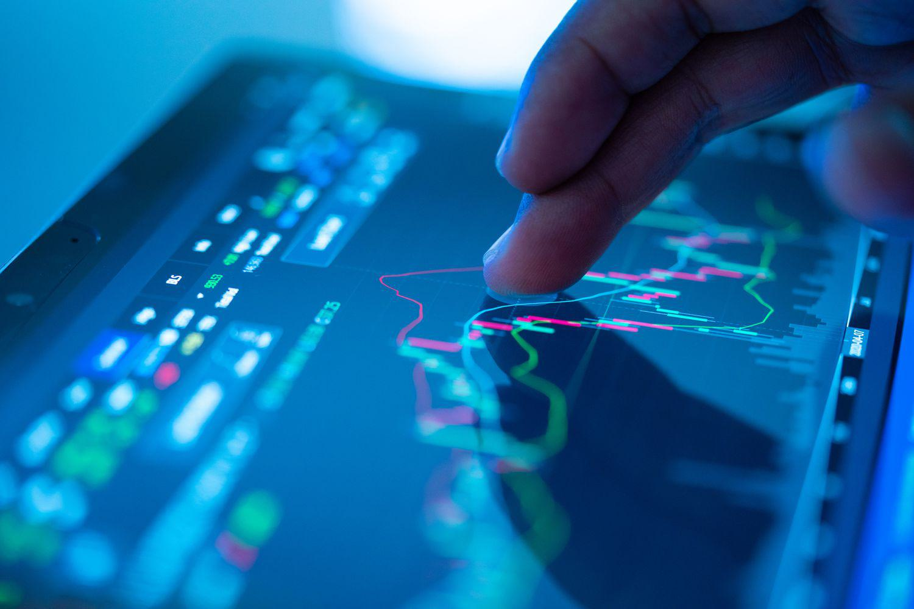

## Table of Contents

## What is a blackout period in finance?

A blackout period in finance is a time when certain people, usually company employees or insiders, are not allowed to buy or sell the company's stock. This rule is in place to prevent these people from using insider information to make unfair profits. For example, during a merger or when important financial reports are being prepared, a blackout period might be set to keep things fair.

These periods are important because they help maintain trust in the market. If people thought insiders could trade whenever they wanted, it might seem like the market isn't fair. By having blackout periods, companies show they care about following the rules and keeping the market honest. This helps everyone feel more confident about investing in the company.

## Why are blackout periods implemented?

Blackout periods are put in place to make sure that everyone plays by the same rules in the stock market. They stop company insiders, like employees or executives, from buying or selling the company's stock when they might know things that other people don't. This is important because if insiders could trade whenever they wanted, they could use secret information to make money unfairly. That wouldn't be fair to everyone else who doesn't have that information.

By having blackout periods, companies show that they care about being fair and honest. This helps keep trust in the market. When people trust that the market is fair, they feel more comfortable investing in companies. Blackout periods help make sure that no one can cheat the system, which keeps the market a level playing field for everyone.

## Who do blackout periods typically affect?

Blackout periods usually affect people who work for a company or have a special connection to it. This includes employees, executives, and sometimes even their family members. These people are called insiders because they might know things about the company that others don't.

During a blackout period, these insiders can't buy or sell the company's stock. This rule is there to make sure they don't use any secret information to make money unfairly. It helps keep things fair for everyone in the stock market.

## How long does a blackout period usually last?

A blackout period can last different amounts of time, but it usually goes on for a few weeks. It depends on what the company is doing. For example, if the company is getting ready to share its yearly financial report, the blackout period might start a few weeks before the report comes out and end a couple of days after.

Sometimes, a blackout period can be longer if the company is going through a big change, like a merger. In these cases, the period might last for a few months to make sure no one can use inside information to trade unfairly. The main thing is to keep the market fair for everyone.

## What are the rules governing blackout periods?

Blackout periods are times when people who work for a company or have special connections to it, called insiders, can't buy or sell the company's stock. These rules are set by the company and must follow laws made by the government, like the U.S. Securities and Exchange Commission (SEC). The main goal is to stop insiders from using secret information to make money unfairly. This helps keep the stock market fair for everyone.

The length of a blackout period can change depending on what the company is doing. For example, it might last a few weeks when the company is getting ready to share its yearly financial report. It starts a little before the report comes out and ends a couple of days after. If the company is going through a big change, like a merger, the blackout period might be longer, maybe even a few months. The idea is to make sure no one can use inside information to trade unfairly during important times.

Companies have to tell their employees about these blackout periods and make sure everyone knows the rules. Breaking these rules can lead to big problems, like fines or even going to jail. So, it's important for everyone to follow the rules to keep the market fair and honest.

## Can you provide examples of blackout periods in different financial contexts?

Blackout periods happen in different financial situations. For example, when a company is about to share its yearly financial report, it might start a blackout period. This period usually begins a few weeks before the report comes out and ends a couple of days after. The company does this to make sure that people who work there don't use the information in the report to buy or sell stock before everyone else knows about it. This keeps things fair for everyone in the stock market.

Another example is when a company is going through a big change, like merging with another company. During this time, the company might set a longer blackout period, maybe even a few months. This is because a lot of secret information is being shared inside the company, and they want to make sure no one uses it to trade unfairly. By having a blackout period, the company shows it cares about being fair and honest, which helps keep trust in the market.

In some cases, blackout periods can also apply to employee stock purchase plans (ESPPs). When a company is setting up or changing these plans, it might have a blackout period to make sure that employees don't use any special information about the plan to buy or sell stock. This helps keep the plan fair for all employees and maintains trust in the company's stock market practices.

## What are the penalties for violating blackout period rules?

If someone breaks the rules about blackout periods, they can get into big trouble. This might mean they have to pay a lot of money as a fine. The fine can be big enough to hurt their wallet a lot. The government, like the U.S. Securities and Exchange Commission (SEC), can make them pay these fines. The SEC wants to make sure everyone plays fair in the stock market.

Sometimes, breaking blackout period rules can even lead to jail time. If someone uses secret information to make money unfairly, they could go to prison. This is a serious punishment that shows how important it is to follow the rules. The goal is to stop people from cheating and to keep the market honest for everyone.

## How do blackout periods impact stock trading and employee stock options?

Blackout periods stop people who work at a company from buying or selling its stock for a while. This can make the stock market less active during those times because fewer people are trading. If a lot of employees usually trade the company's stock, the market might see less buying and selling when there's a blackout period. This can make the stock price stay the same or move less than usual because there's less trading happening.

For employees with stock options, blackout periods can be tricky. Stock options let employees buy the company's stock at a special price. But during a blackout period, they can't use their options to buy or sell the stock. This means they have to wait until the blackout period is over before they can do anything with their options. It can be frustrating for employees if they think the stock price is going to go up or down, but they have to wait and can't act on their options right away.

## What strategies can companies use to manage blackout periods effectively?

Companies can manage blackout periods effectively by making sure everyone knows about them well in advance. They can send out clear messages to all employees, telling them when the blackout period starts and ends. This way, no one is surprised, and everyone can plan ahead. Companies can also use their internal communication tools like emails or company-wide meetings to remind employees about the rules and the reasons for the blackout period. This helps keep everyone on the same page and makes sure the company follows the law.

Another good strategy is to set up a special team to handle blackout periods. This team can keep track of when blackout periods are happening and make sure all the rules are being followed. They can also answer any questions employees might have and help them understand what they can and can't do during these times. By having a team in charge, the company can make sure everything runs smoothly and that no one accidentally breaks the rules. This helps keep the company's reputation strong and builds trust with everyone in the market.

## How do blackout periods affect insider trading regulations?

Blackout periods are times when people who work at a company can't buy or sell its stock. This helps stop insider trading, which is when someone uses secret information to make money unfairly. By having blackout periods, companies make sure that their employees can't trade during important times, like when they're about to share financial reports or during a big change like a merger. This keeps the market fair because everyone has the same information when they're trading.

These periods also make it easier for the government to watch for insider trading. If someone trades during a blackout period, it's a clear sign that they might be breaking the rules. This helps the government, like the U.S. Securities and Exchange Commission (SEC), catch people who are trying to cheat. By having these rules, companies show they care about being honest and fair, which helps everyone trust the stock market more.

## What are the differences in blackout period regulations between countries?

Blackout period rules can be different in different countries. In the United States, the rules are set by the Securities and Exchange Commission (SEC). Companies have to follow these rules to make sure their employees don't use secret information to trade unfairly. The SEC says that blackout periods should happen during important times, like when a company is about to share its financial reports or during a merger. This helps keep the stock market fair for everyone.

In other countries, the rules might be different. For example, in the United Kingdom, the Financial Conduct Authority (FCA) sets the rules for blackout periods. They also want to stop insider trading, but their rules might not be exactly the same as the SEC's rules. In Canada, the rules are made by the Canadian Securities Administrators (CSA). Each country has its own way of making sure that blackout periods work to keep the market fair and honest.

## How have blackout period policies evolved over time, and what might future changes look like?

Blackout period policies have changed a lot over time. In the past, rules about when people who work at a company can't buy or sell its stock were not as strict. But after some big problems with insider trading, governments started to make the rules tighter. For example, in the United States, the SEC made rules that said companies have to have blackout periods during important times, like when they're about to share financial reports. This was to stop people from using secret information to make money unfairly. Over the years, these rules have gotten even stricter, with more rules about how companies have to tell their employees about blackout periods and what happens if someone breaks the rules.

In the future, blackout period policies might keep changing to make the stock market even fairer. One thing that could happen is using new technology to watch for insider trading better. This could mean using computers to look at trading patterns and catch people who are trying to cheat. Another change might be making the rules even clearer and easier for everyone to understand. This way, employees know exactly what they can and can't do during blackout periods. As the world changes, blackout period policies will probably keep evolving to make sure the market stays honest and fair for everyone.

## References & Further Reading

[1]: SEC Website. [U.S. Securities and Exchange Commission (SEC)](https://www.sec.gov/). 

[2]: Investopedia. [Blackout Period](https://www.investopedia.com/terms/b/blackoutperiod.asp).

[3]: FINRA Website. [Financial Industry Regulatory Authority (FINRA)](https://www.finra.org/).

[4]: Bacidore, J. ["Algorithmic Trading"](https://www.amazon.com/Algorithmic-Trading-Practitioners-Jeffrey-Bacidore/dp/0578715236). Springer, 2022.

[5]: Armour, J., Awrey, D., et al. ["Principles of Financial Regulation"](https://academic.oup.com/book/35860). Oxford University Press, 2016.

[6]: NIRI Website. [The National Investor Relations Institute (NIRI)](https://www.niri.org/).

[7]: ESMA Website. [European Securities and Markets Authority (ESMA)](https://www.esma.europa.eu/).

[8]: Aldridge, I. ["High-Frequency Trading: A Practical Guide to Algorithmic Strategies and Trading Systems"](https://www.ahmetbeyefendi.com/wp-content/uploads/2020/07/High-Frequency-Trading-Irene-Aldridge.pdf). Wiley, 2013.

[9]: van N Trades, D., et al. ["The Regulation of Financial Markets"](https://academic.oup.com/book/35860/chapter/308565103). Routledge, 2017.