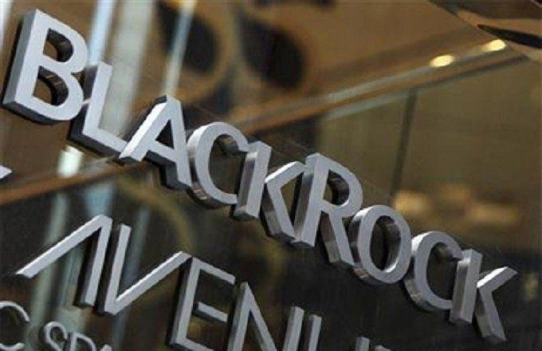

BlackRock Inc. is recognized as the world's largest asset management firm, commanding significant influence and resources within global financial markets. Established in 1988, BlackRock has evolved into a pivotal institution within the investment management sector. As of 2023, the firm manages assets worth over $10 trillion, making it a central figure in both institutional and retail investing landscapes. BlackRock offers a diverse range of investment solutions, including mutual funds, ETFs, and tailored investment strategies for institutions and individuals alike.

The firm is heavily involved in asset management through active and passive investment strategies, facilitating access to a myriad of financial instruments across diverse markets. In addition to traditional investment vehicles, BlackRock is a leader in algorithmic trading, which leverages complex computational models to execute trades with speed and precision, utilizing vast amounts of market data to inform decision-making processes.



A cornerstone of BlackRock's operational framework is its proprietary technology platform, Aladdin. This platform is integral to BlackRock's approach to investment management, offering robust capabilities for risk management and trade processing. Aladdin effectively consolidates data from a multitude of sources to provide comprehensive risk analyses and support informed investment decisions. Its advanced analytics enable users to process vast datasets swiftly, ensuring risk management practices are both proactive and responsive. Through Aladdin, BlackRock standardizes its investment processes, offering a common data language that enhances the coherence and alignment of strategies across its vast network of institutional clients.

## Table of Contents

## BlackRock's History and Expansion

BlackRock Inc., established in 1988, began as a risk management and fixed income institutional asset manager focused on providing clients with tailored investment solutions. Founded by Larry Fink and a group of partners, the company quickly capitalized on emerging computing technologies to develop risk management and asset analysis systems. These initial efforts laid the groundwork for what would become BlackRock's proprietary platform, Aladdin.

A pivotal moment in BlackRock's growth was the acquisition of Barclays Global Investors (BGI) in 2009. This strategic acquisition solidified BlackRock's position as the world's largest asset manager by significantly expanding its portfolio, particularly through BGI’s iShares business, which introduced a prominent suite of exchange-traded funds (ETFs). This acquisition not only diversified BlackRock's offerings across asset classes but also expanded its global footprint.

Aladdin, first developed in the early 1990s, has been another cornerstone of BlackRock's expansion. Originally intended for internal use, this comprehensive asset management and risk analysis platform was eventually offered to external clients, enhancing operational efficiencies and setting industry benchmarks. Aladdin's capabilities in data integration, risk assessment, and trade processing have been vital in managing growing volumes of assets.

During the 2007–2008 financial crisis, BlackRock played a crucial role by assisting the U.S. government in managing toxic assets. Tasked with handling distressed securities, BlackRock's impartiality and sophisticated analytics allowed it to navigate complex financial landscapes effectively. This involvement not only underscored BlackRock's operational capacity but also cemented its reputation as a trusted partner in crisis management.

Through strategic acquisitions and technological innovation, BlackRock has continually evolved, broadening its influence across global financial markets and redefining asset management dynamics.

## Aladdin: Revolutionizing Asset Management

Aladdin, BlackRock's proprietary technology platform, is a comprehensive tool that has fundamentally transformed asset management. With its advanced capabilities, Aladdin manages an astounding $21.6 trillion in assets, making it an integral component of BlackRock's success and an industry benchmark for investment management solutions.

At its core, Aladdin combines sophisticated risk analytics with portfolio management tools, enabling users to perform real-time analysis and execute trades effectively. The platform's design integrates a vast array of data sources, equipping asset managers with the ability to conduct comprehensive risk assessments and make informed decisions. This integration allows for the seamless combining of internal and external data sources, ensuring that every [factor](/wiki/factor-investing) that could impact a portfolio's performance is taken into account.

Aladdin's strength lies in its capacity to offer a unified data language, a critical feature that simplifies the complex web of investment processes across different institutions. It functions as a central node where all data-driven insights converge, providing users with a consistent and reliable basis for decision-making. By standardizing data inputs and outputs, Aladdin ensures that stakeholders, whether within a single organization or across institutional boundaries, can communicate and operate with a common understanding.

Furthermore, the platform supports a variety of functions necessary for modern asset management. These include pre-trade compliance checks, scenario analysis, performance measurement, and reporting. Its capabilities redefine how financial entities approach risk, allowing them to anticipate market changes and adjust portfolios accordingly.

In a continually evolving financial landscape, Aladdin stands out not only for its technical prowess but also for its role in fostering collaborative investment strategies. It streamlines processes, enhances data accuracy, and reduces operational risks, allowing BlackRock and other institutional clients to maintain a competitive edge in global markets. Through Aladdin, BlackRock exemplifies how technology can transform asset management, driving efficiency and innovation while managing vast quantities of capital.

## Innovation in Algorithmic Trading

BlackRock has embraced technology to enhance its [algorithmic trading](/wiki/algorithmic-trading) capabilities, refining how it manages and executes trades across multiple asset classes. Central to this technological advancement is BlackRock's proprietary platform, Aladdin, which plays an integral role in the firm's trading operations.

Aladdin provides real-time data and analytics, crucial for making informed trading decisions. The platform aggregates vast amounts of market data, which allows BlackRock's traders and analysts to monitor market trends and signals instantaneously. This capability enables rapid response to market movements, improving [liquidity](/wiki/liquidity-risk-premium) management and price execution.

Moreover, the integration of [artificial intelligence](/wiki/ai-artificial-intelligence) and [machine learning](/wiki/machine-learning) within Aladdin has significantly augmented BlackRock's trading strategies. Machine learning algorithms analyze historical data to identify patterns and predict future price movements, enhancing the firm's ability to optimize its trading strategies. These algorithms can process large datasets to uncover insights that human analysts might miss, offering a competitive edge in executing trades and managing portfolios effectively.

AI-driven techniques have also facilitated the development of sophisticated risk management models, supporting portfolio optimization. For instance, factor analysis models help in assessing the exposure of portfolios to different risk factors, enabling dynamic adjustment to align with market conditions. This kind of algorithmic insight is pivotal in minimizing risk while maximizing return, particularly in volatile markets.

Python, a preferred programming language for developing trading algorithms, can be used to implement simple models based on Aladdin's data outputs. For instance:

```python
import numpy as np
from sklearn.linear_model import LinearRegression

# Hypothetical historical data
features = np.array([[1, 12], [2, 15], [3, 20], [4, 25]])  # Example market indicators
prices = np.array([10, 15, 20, 25])  # Corresponding asset prices

# Linear regression model
model = LinearRegression()
model.fit(features, prices)

# Predicting future prices based on market indicators
predicted_price = model.predict(np.array([[5, 30]]))
print(predicted_price)
```

In this example, machine learning models can forecast future asset prices based on market indicators, assisting in making data-driven trading decisions.

Overall, BlackRock's innovation in algorithmic trading, underpinned by Aladdin's advanced analytics and AI capabilities, has enabled the firm to remain at the forefront of the asset management industry. The use of technology not only enhances efficiency but also provides strategic insights crucial for navigating complex financial markets.

## BlackRock's Role in Sustainable Investing

BlackRock Inc., as a global leader in asset management, has demonstrated a strong commitment to integrating sustainability principles and [ESG](/wiki/esg-investing) (Environmental, Social, and Governance) criteria into its investment strategies. Recognizing the growing importance of sustainable investing for its clients and the broader market, BlackRock has actively sought to incorporate ESG factors into its portfolio management processes to align financial performance with positive environmental and social outcomes.

At the core of BlackRock's ESG integration strategy is Aladdin, its advanced technology platform. Aladdin facilitates the incorporation of ESG data into investment analyses and decision-making processes. By leveraging vast streams of ESG data, Aladdin provides investors with insights into the sustainability risks and opportunities associated with their portfolios. The platform’s capability to integrate ESG metrics helps in conducting comprehensive risk assessments, thereby guiding investors in making informed decisions that align with their sustainability goals.

BlackRock's efforts in sustainable investing are further exemplified by its launch of Exchange-Traded Funds (ETFs) focused on climate change and ESG criteria. These funds are designed to provide investors exposure to companies and sectors that are proactively addressing environmental challenges and exhibiting robust governance and social practices. For instance, BlackRock offers a suite of ETFs that prioritize companies with low carbon footprints, thereby enabling investors to partake in the transition to a low-carbon economy while seeking long-term value.

Such initiatives reflect BlackRock's broader strategy to drive sustainable investing by not only providing investment vehicles that prioritize ESG factors but also advocating for systemic change across financial markets. The firm's strategic moves underscore its belief that ESG considerations can contribute to better risk-adjusted returns and enhance long-term value creation for investors.

Through strategic alignments with sustainability objectives, BlackRock is positioned as a significant player in shaping the future of the investment landscape, where ESG integration is increasingly becoming a standard rather than an option.

## Global Impact and Influence

BlackRock Inc.'s global impact and influence in the financial markets are profound, largely due to its comprehensive approach to asset management and investment strategies. As of 2021, BlackRock managed approximately $9 trillion in assets, positioning itself as a leading force in the financial industry [1].

The firm's strategies and technologies set benchmarks in asset management worldwide through their robust risk management practices and innovative use of technology. BlackRock's proprietary platform, Aladdin, plays a crucial role in this domain by providing a sophisticated risk analysis and portfolio management system used by numerous asset managers globally. This platform enables institutions to minimize risks and optimize returns, aligning with BlackRock's strategy of incorporating advanced data analytics to forecast market trends.

BlackRock's collaboration with governments and institutions worldwide is another testament to its extensive influence. The firm has played a pivotal role in financial advisory and mutual fund operations across various regions. Notably, BlackRock has engaged in public-private partnerships, assisting governments in restructuring and advising on economic policies, enhancing its reputation as a critical stakeholder in global finance.

Furthermore, through the launch of environmentally and socially responsible investment products, BlackRock has influenced sustainable investing practices. By integrating ESG criteria into its investment processes, BlackRock significantly impacts the global conversation on responsible investment.

In summary, BlackRock's influence on global financial markets is characterized by its strategic innovations, technological advancements, and collaborative efforts with government bodies and institutions, helping shape contemporary asset management practices.

---

[1] BlackRock Investor Relations, Annual Report 2021.

## Challenges and Controversies

BlackRock Inc., as the world's largest asset management firm, faces numerous challenges and controversies that impact its operations and reputation. One significant challenge is market competition, as the financial sector is highly competitive and dynamic. BlackRock competes with other large asset managers, such as Vanguard and State Street, as well as numerous smaller firms that offer niche products and services. To maintain its market position, BlackRock continuously invests in technology and innovation, like its Aladdin platform, to enhance its investment management services and operational efficiency.

Regulatory hurdles also pose substantial challenges for BlackRock. The company operates under the scrutiny of regulatory bodies in various jurisdictions around the world, including the U.S. Securities and Exchange Commission (SEC), the Financial Conduct Authority (FCA) in the UK, and the European Securities and Markets Authority (ESMA). These regulators impose strict compliance requirements that BlackRock must adhere to, and any failure to comply could result in penalties or other adverse consequences. Navigating these complex regulatory landscapes requires significant resources and strategic planning.

BlackRock has faced controversies over potential conflicts of interest and accusations of market dominance. Critics argue that BlackRock's sheer size and influence can lead to conflicts, particularly when it holds significant stakes in competing companies. These positions can raise questions about whose interests BlackRock prioritizes—those of the firms it invests in or its clients. Additionally, BlackRock's dominance in the [ETF](/wiki/etf-trading-strategies) market and its substantial share of assets under management have prompted concerns about its influence on global financial markets and the systemic risks that might entail.

In response to these controversies, BlackRock has attempted to enhance its transparency and governance practices. The company has publicly committed to various initiatives to improve disclosure and accountability, such as increasing transparency regarding its investment stewardship practices and engaging more actively with the companies in which it invests. BlackRock's efforts to address market dominance critiques include advocating for legislative and regulatory reforms to ensure a level playing field in the asset management industry.

Overall, while BlackRock continues to lead the industry in asset management innovation, it must navigate these significant challenges and controversies to sustain its position and reputation in the global financial markets. Addressing these concerns through transparent practices and improved governance remains crucial for maintaining stakeholder trust and ensuring long-term success.

## Conclusion

BlackRock Inc. has indisputably played a pivotal role in transforming the asset management industry through its innovative approach and comprehensive technology solutions. As the world's largest asset manager, BlackRock has set new standards in how financial assets are managed, driving efficiency and enhancing decision-making processes within the investment community. At the heart of this transformation is BlackRock’s Aladdin platform, a pioneering technology that integrates data seamlessly for risk management and trade processing, enabling asset managers to optimize portfolios based on real-time insights and comprehensive risk metrics.

Looking forward, BlackRock's future appears promising as it continues to innovate and expand its influence within the financial sector. The company is well-positioned to leverage emerging technologies such as artificial intelligence, machine learning, and big data analytics to further refine its investment strategies and enhance portfolio performance. BlackRock's commitment to sustainable investing is also expected to drive future growth, as integrating Environmental, Social, and Governance (ESG) criteria becomes increasingly essential in investment decision-making. This foresight not only aligns investment opportunities with global sustainability goals but also addresses a growing demand from investors for responsible and ethical investment options.

Finally, technology remains a cornerstone for shaping the investment landscape, and BlackRock’s leadership in this area emphasizes the critical importance of deploying sophisticated tools and systems to manage complex financial markets. As asset managers worldwide strive to handle increasing volumes of data and evolving market dynamics, BlackRock's technological solutions set an important benchmark for the entire industry. The firm’s continuous dedication to innovation and excellence in execution reaffirms its role as a transformative force, steering the future of financial investments towards greater transparency, efficiency, and sustainability.

## References & Further Reading

[1]: Baer, J., & Britt, P. (2018). ["BlackRock's Big Push into Tech."](https://en.wikipedia.org/wiki/List_of_Stanford_Law_School_alumni) The Washington Post.

[2]: ["Aladdin: The Secret Weapon at the Heart of BlackRock"](https://en.wikipedia.org/wiki/Aladdin_(BlackRock)) Financial Times.

[3]: Popper, N. (2013). ["BlackRock Builds Its Future on a Foundation of Technology."](https://d3.harvard.edu/platform-rctom/submission/between-a-rock-and-a-hard-place-how-blackrock-is-winning-the-war-on-technology/) The New York Times.

[4]: Ricketts, C. (2021). ["Inside Aladdin: How BlackRock's man in charge of 'the matrix' of finance wields his power to help save the world."](https://en.wikipedia.org/wiki/Pete_Ricketts) Insider.

[5]: ["Advancing Financial Machine Learning"](https://github.com/doda/fincl) by Marcos Lopez de Prado.