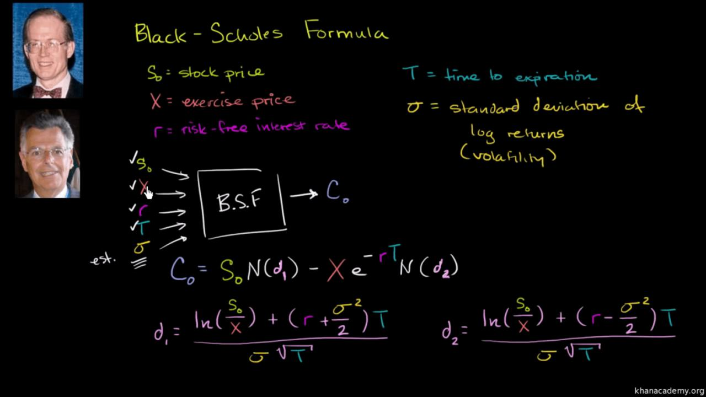

Financial derivatives are pivotal in the landscape of modern finance, offering essential tools for hedging, speculation, and risk management. As dynamic instruments, they allow market participants to mitigate risk and leverage market movements. Among the spectrum of derivatives-related models aimed at equitable pricing, Black’s Model emerges prominently due to its aptness in valuing options on futures contracts. 

Black’s Model, alternatively known as Black 76, is an extension of the renowned Black-Scholes model. While the Black-Scholes model was initially designed for options on stocks, Black's adaptation reorients the framework for pricing options on futures, thus broadening its applicability across varying financial instruments. By focusing on futures contracts, Black's Model circumvents some of the limitations inherent in the original model, such as those related to dividend yields.



This article explores the core aspects of Black’s Model, including its foundational assumptions and the role it plays in the sphere of algorithmic trading. As algorithmic trading continues to gain momentum, models like Black’s play a crucial role in facilitating high-frequency trading strategies, powering the technology-driven evolution of financial markets.

## Table of Contents

## Understanding Black's Model

Black's Model, also known as Black 76, is a financial model specifically designed to price options on futures contracts. It provides an adaptation of the renowned Black-Scholes model, which was originally developed for pricing options on stocks. The primary distinction between these two models lies in the type of instrument each addresses; while Black-Scholes deals with stock options, Black's Model caters to the unique nature of futures contracts. 

Futures contracts are agreements to buy or sell an asset at a predetermined future date and price. This inherent characteristic of futures necessitates a different approach to option pricing than the one used for stocks. Black's Model excels in this respect, specifically modifying the inputs and assumptions of the Black-Scholes framework to suit the pricing of futures options. 

A critical aspect of Black's Model is its dependence on the forward price of the underlying asset. Instead of utilizing spot prices, like in the Black-Scholes model, Black's Model incorporates the known price of the futures contract at expiration. This adjustment aligns with the futures market's structure, where the cost to [carry](/wiki/carry-trading) and expectations about future spot prices are inherently embedded in the futures price. 

An important component of Black's Model is the formula's structure, which is similar in form to Black-Scholes but adjusted for the futures context. The model's equation for the price $C$ of a call option is expressed as:

$$
C = e^{-rT} \left[ FN(d_1) - KN(d_2) \right]
$$

Where:
- $F$ is the current futures price,
- $K$ is the strike price,
- $r$ is the risk-free interest rate,
- $T$ is the time to expiration,
- $N(\cdot)$ is the cumulative distribution function of the standard normal distribution,
- $d_1 = \frac{\ln\left(\frac{F}{K}\right) + \left(\frac{\sigma^2}{2}\right)T}{\sigma \sqrt{T}}$,
- $d_2 = d_1 - \sigma \sqrt{T}$,
- $\sigma$ is the volatility of the futures price.

This formula provides a realistic valuation tool in markets where futures contracts are prevalent, enabling more accurate pricing than models based purely on spot prices. The adaptation ensures that Black's Model accounts for the characteristics of futures markets, making it a critical instrument in the financial toolkit for valuing options on these contracts.

## Key Assumptions and Components

Black's Model, known for its efficacy in pricing options on futures, is built upon several foundational assumptions that distinguish it from other models, such as the Black-Scholes Model. One fundamental assumption of Black's Model is that the prices of futures contracts are log-normally distributed. This assumption aligns with the idea that prices cannot be negative and that they exhibit proportional rather than absolute changes, making a log-normal distribution a reasonable choice for modeling futures prices.

The key distinction of Black's Model lies in its use of forward prices instead of spot prices. This is particularly relevant for futures contracts, which are agreements to buy or sell an asset at a predetermined future date and price. By incorporating forward prices, Black's Model effectively synchronizes option pricing with the state of the futures market. This alignment is beneficial for traders and financial analysts who focus on futures contracts rather than directly traded stocks.

To understand the application of Black's Model, it is helpful to examine its mathematical formulation. The model calculates the price of a European call option on a futures contract as follows:

$$
C = e^{-rT} \times (FN(d_1) - KN(d_2))
$$

Here, $C$ represents the call option price, $e$ is the base of the natural logarithm, $r$ denotes the risk-free [interest rate](/wiki/interest-rate-trading-strategies), and $T$ is the time to maturity. $F$ is the forward price of the futures contract, $K$ is the strike price of the option, and $N(\cdot)$ is the cumulative distribution function of the standard normal distribution. The terms $d_1$ and $d_2$ are computed as:

$$
d_1 = \frac{\ln\left(\frac{F}{K}\right) + \frac{\sigma^2 T}{2}}{\sigma \sqrt{T}}
$$

$$
d_2 = d_1 - \sigma \sqrt{T}
$$

where $\sigma$ is the volatility of the futures price.

Grasping these components is essential for traders and analysts who aim to apply Black's Model effectively in their trading strategies. The assumptions underpinning the model provide a framework that, while powerful, requires careful consideration of market conditions. Deviations from these assumptions, such as non-log-normality of returns or fluctuating [volatility](/wiki/volatility-trading-strategies), may necessitate adjustments or complementary models to achieve more accurate valuations and effective risk management.

## Algorithmic Trading and Black's Model

Algorithmic trading is an integral aspect of modern financial markets, where mathematical models are utilized for executing high-frequency trades. Black's Model, an extension of the Black-Scholes model, is often employed in these systems for the pricing of options on futures contracts. The model offers a robust framework for predicting prices and optimizing trading strategies. 

In [algorithmic trading](/wiki/algorithmic-trading), the precision of model-based prediction and execution can lead to improved trade outcomes. Black's Model leverages the concept of forward prices, aligning with the futures market dynamics to enhance the accuracy of financial predictions. This alignment ensures that the model provides a more realistic valuation of options compared to using spot prices, which are not always available or representative of future conditions.

Python, among other programming languages, plays a significant role in implementing Black's Model in algorithmic trading. Its extensive libraries, such as NumPy and SciPy, facilitate complex computations and allow traders to simulate Black's Model under different scenarios. For example, Python can be employed to calculate the price of a call option on a futures contract using Black's Model:

```python
import numpy as np
from scipy.stats import norm

def black_model_call_price(F, K, T, r, sigma):
    d1 = (np.log(F / K) + (0.5 * sigma ** 2) * T) / (sigma * np.sqrt(T))
    d2 = d1 - sigma * np.sqrt(T)
    call_price = np.exp(-r * T) * (F * norm.cdf(d1) - K * norm.cdf(d2))
    return call_price

# Example parameters
F = 100  # Forward price of the underlying asset
K = 95   # Strike price
T = 1    # Time to maturity (in years)
r = 0.05 # Risk-free interest rate
sigma = 0.2 # Volatility

call_option_price = black_model_call_price(F, K, T, r, sigma)
print(f"Call option price: {call_option_price}")
```

The integration of Black's Model in algorithmic systems enables more sophisticated trading strategies. By using real-time data, these systems can adapt to market conditions, execute trades at optimal prices, and manage risk more effectively. Additionally, the adaptability of programming languages like Python supports the continuous evolution and refinement of trading algorithms, accommodating the differences in market conditions and enhancing overall trading performance.

## Real-World Applications

Black's Model, often referred to as Black 76, has found extensive real-world applications across various financial institutions due to its efficacy in pricing futures options, particularly for interest rate derivatives. This adaptability is notable in areas involving interest rate caps, floors, and various interest rate derivatives. These instruments are crucial in managing interest rate risks and structuring strategic financial products.

### Pricing of Interest Rate Derivatives

Financial institutions employ Black's Model to price interest rate derivatives, which are contracts based on interest rates and include various instruments like interest rate swaps. By using Black’s Model, businesses gain a reliable framework for predicting and analyzing the costs and benefits related to future interest rate movements. This pricing model is rooted in the concept of forward rates rather than spot rates, aligning it closely with futures markets where these derivatives often trade.

### Application in Capped Variable Rate Loans

Capped variable rate loans are loans with an interest rate that varies with a benchmark rate but is capped at a certain level. Black's Model is extensively used to evaluate the potential future value of such loans by accurately pricing the embedded caps. The model helps lenders and borrowers by providing clear insights into the maximum costs associated with fluctuating interest rates, ensuring that both parties understand the financial limits and potential outcomes.

### Utilization by Hedge Funds and Mutual Funds

Hedge funds and mutual funds also leverage Black’s Model to manage interest rate risks effectively. These entities include derivatives as part of their portfolio to hedge against adverse interest rate movements or to speculate for potential gains. Black's Model serves as an essential tool for valuing these derivatives, leading to optimized financial investment strategies. With the capability to adjust the strategies based on predicted futures prices, fund managers can make more informed decisions, leading to improved risk-adjusted returns.

By integrating such models, investment funds enhance their ability to navigate the complexities of modern financial markets. This includes the anticipation of market shifts and the strategic rebalancing of their investment portfolios to maintain or increase their desired exposure to interest rate changes.

Overall, the application of Black's Model in these areas underscores its significance in effectively managing financial products and strategies centered on interest rate movements, fostering a more predictable financial environment amidst uncertain market conditions.

## Challenges and Limitations

Black's Model, like any other financial model, operates under specific assumptions that, while simplifying the complex nature of financial markets, can also introduce a set of limitations. One primary assumption is the existence of zero trading costs. In reality, transaction costs such as brokerage fees and bid-ask spreads are inherent in trading and can significantly impact the profitability of transactions, especially in high-frequency trading scenarios.

Another critical assumption is the constancy of volatility over time. Black's Model assumes that the volatility of the underlying futures contract remains constant, which simplifies the computation of option prices but often diverges from real-world conditions. Market volatility tends to fluctuate due to various factors such as economic news, geopolitical events, and shifts in market sentiment. This variability can lead to discrepancies in pricing accuracy, particularly in turbulent or highly volatile markets.

In volatile conditions, the assumption of constant volatility might lead Black’s Model to misestimate the value of options on futures. For example, if market volatility increases unexpectedly, the model may undervalue the option, exposing traders to significant risk. Conversely, if volatility decreases but is overestimated by the model, it may lead to overpriced options, potentially resulting in missed trading opportunities.

To mitigate these limitations, traders and analysts are encouraged to integrate Black's Model with other analytical tools and approaches for a more robust trading strategy. One such method is the use of stochastic volatility models, which can account for volatility's dynamic nature by allowing it to follow a stochastic process. Additionally, empirical adjustments can be made to incorporate transaction costs and non-constant volatility into option pricing models.

Python's versatility and extensive libraries make it a suitable choice for implementing such enhancements. For instance, the following Python snippet demonstrates a basic setup for simulating a stochastic volatility model, which can be used in conjunction with Black's Model to address weaknesses in its volatility assumptions:

```python
import numpy as np

def simulate_stochastic_volatility(S0, T, r, sigma_v, mu_v, steps=1000):
    dt = T / steps
    prices = np.zeros(steps)
    volatilities = np.zeros(steps)
    prices[0] = S0
    volatilities[0] = sigma_v

    for t in range(1, steps):
        dz = np.random.normal(0, np.sqrt(dt))
        dv = np.random.normal(0, np.sqrt(dt))
        volatilities[t] = volatilities[t-1] + mu_v * (sigma_v - volatilities[t-1]) * dt + dv
        prices[t] = prices[t-1] * np.exp((r - 0.5 * volatilities[t-1]**2) * dt + volatilities[t-1] * dz)

    return prices, volatilities

# Example usage
simulate_stochastic_volatility(S0=100, T=1, r=0.05, sigma_v=0.2, mu_v=0.1)
```

By understanding these limitations and incorporating additional insights, traders can harness Black's Model more effectively, making well-informed decisions in complex and dynamic market environments.

## Conclusion

Black's Model is a fundamental aspect of the financial derivatives domain, providing essential methodologies for pricing futures options. Its notable contribution lies in its ability to account for the peculiarities of futures contracts, extending the traditional Black-Scholes framework to better serve participants in markets where futures are predominant. The model's elegance and robustness have made it an indispensable tool for traders and financial institutions globally.

In the evolving field of algorithmic trading, Black's Model's application is increasingly vital. The model is frequently integrated into sophisticated trading systems, utilizing advanced computational capabilities and data analytics to optimize trading strategies. With the rise of high-frequency trading and [machine learning](/wiki/machine-learning) algorithms, Black's Model aids in refining price predictions and executing trades with precision at unprecedented speeds.

The ability to discern both the strengths and constraints of Black's Model empowers market participants to make informed decisions. Although the model operates under certain assumptions that may not always align with real-world conditions—such as constant volatility and zero transaction costs—its strategic application, often in concert with alternative models and analytical tools, enhances its efficacy. By mitigating risks and optimizing investment outcomes, Black's Model continues to be a cornerstone in modern finance, offering traders a structured approach to navigating the complexities of derivative markets.

## References & Further Reading

[1]: Black, F. (1976). ["The Pricing of Commodity Contracts"](https://www.sciencedirect.com/science/article/pii/0304405X76900246). Journal of Financial Economics, 3(1-2), 167-179.

[2]: Hull, J. C. (2018). ["Options, Futures, and Other Derivatives"](https://www.semanticscholar.org/paper/Options%2C-Futures%2C-and-Other-Derivatives-Hull/89bdee500c8623864fc9eb7a471546aa713acc44) (10th edition). Pearson.

[3]: Wilmott, P. (2006). ["Paul Wilmott Introduces Quantitative Finance"](https://www.amazon.com/Paul-Wilmott-Quantitative-Finance-Set/dp/0470018704) (2nd edition). Wiley.

[4]: Gatheral, J. (2006). ["The Volatility Surface: A Practitioner's Guide"](https://onlinelibrary.wiley.com/doi/book/10.1002/9781119202073). Wiley.

[5]: Choudhry, M. (2010). ["An Introduction to Bond Markets"](https://onlinelibrary.wiley.com/doi/book/10.1002/9781118371961) (4th edition). Wiley.