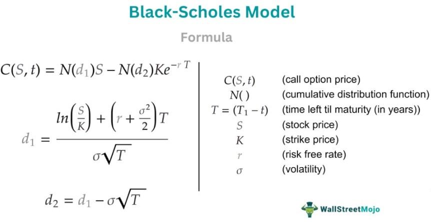

## Table of Contents

## What is Black's Model and who developed it?

Black's Model is a way to figure out the price of options on futures. It helps people understand what an option might be worth in the future. An option is like a bet on whether the price of something, like oil or wheat, will go up or down. The model uses math to guess this price by looking at things like how much time is left until the option expires and how much the price of the future might change.

Fischer Black, an economist, came up with this model. He worked with Myron Scholes to create another famous model called the Black-Scholes Model, which is used for pricing options on stocks. Black's Model is simpler and specifically made for futures options. Fischer Black was very smart and his work has helped many people in finance understand and use options better.

## What are the key assumptions of Black's Model?

Black's Model makes some guesses about how the world works to help figure out the price of options on futures. One big guess is that the price of the future moves in a normal way, kind of like a bell curve. This means the model thinks the price can go up or down, but it's most likely to stay close to where it is now. Another guess is that you can buy and sell the future without any problems, like there's always someone willing to trade with you.

Another important assumption is that there are no extra costs, like fees or taxes, when you trade. The model also assumes that you can borrow and lend money at the same interest rate, which might not be true in real life. Lastly, Black's Model thinks that the future's price changes don't depend on what happened before; each change is a fresh start. These guesses help make the math easier, but they might not match the real world perfectly.

## How does Black's Model differ from the Black-Scholes Model?

Black's Model and the Black-Scholes Model are both used to figure out the price of options, but they focus on different things. Black's Model is used for options on futures, which are bets on the future price of things like oil or wheat. It's simpler because it doesn't need to think about things like dividends that stocks might pay. On the other hand, the Black-Scholes Model is used for options on stocks. It takes into account the possibility of dividends and other details that come with owning stocks.

The key difference in how they work is that Black's Model assumes the future's price changes follow a normal pattern, making the math a bit easier. The Black-Scholes Model, however, uses a more complex way to predict how stock prices might change, which can be trickier to calculate. Both models help people guess what an option might be worth, but they use different starting points and math to get there, depending on whether you're dealing with futures or stocks.

## What types of financial instruments can Black's Model be applied to?

Black's Model is mainly used for figuring out the price of options on futures. Futures are agreements to buy or sell something like oil, wheat, or even stock indexes at a set price in the future. Options on these futures give people the right, but not the obligation, to buy or sell the future at that set price. So, if you want to know how much an option on a corn futures contract might be worth, Black's Model can help you with that.

Besides futures, Black's Model can also be used for other financial instruments that work in a similar way. For example, it can be used for options on bonds, where the bond's future price is what matters. It's also useful for options on currencies, where you're betting on how the exchange rate might change. The key thing is that Black's Model works well when you're dealing with things that have a future price you can bet on, and it helps you guess what that bet might be worth.

## Can you explain the basic formula used in Black's Model?

The basic formula in Black's Model helps you figure out the price of an option on a future. It uses a few important pieces of information: the current price of the future, the price at which you can buy or sell the future (called the strike price), how long until the option expires, the interest rate, and how much the future's price might change (called volatility). The formula combines these pieces to give you a number that tells you what the option might be worth.

The formula looks like this: Option Price = (F * N(d1) - X * N(d2)) * e^(-rT), where F is the current price of the future, X is the strike price, r is the interest rate, T is the time until the option expires, and N(d1) and N(d2) are parts of the formula that come from a normal distribution curve. The e^(-rT) part adjusts the price based on the interest rate and time. This formula might seem complicated, but it's all about putting together the pieces to guess the option's value.

## What are the inputs required to use Black's Model?

To use Black's Model, you need to know a few things. First, you need the current price of the future, which is what people are paying for it right now. You also need the strike price, which is the price at which you can buy or sell the future if you use the option. Another important piece is how long you have until the option expires, because the more time left, the more the price might change. You also need to know the interest rate, which is what you could earn if you put your money in a safe place instead of buying the option.

The last thing you need is the volatility, which is a guess about how much the future's price might go up or down. This is tricky because it's hard to predict, but it's really important for the model. Once you have all these pieces of information, you can put them into the Black's Model formula to figure out what the option might be worth. It's like putting together a puzzle to see the big picture of the option's value.

## How is Black's Model used to price options?

Black's Model helps people figure out how much an option on a future might be worth. It uses a special formula that takes into account the current price of the future, the price at which you can buy or sell the future (called the strike price), how long until the option expires, the interest rate, and how much the future's price might change (called volatility). By putting all these pieces together, the model can give you a number that tells you what the option might be worth. This is helpful because it lets people make better guesses about whether buying or selling an option is a good idea.

The model works by imagining that the future's price moves in a normal way, kind of like a bell curve. It also assumes that you can buy and sell the future easily, without any extra costs like fees or taxes. These guesses help make the math easier, but they might not match the real world perfectly. Still, Black's Model is a useful tool because it gives people a way to think about the value of options on futures, which can be tricky to understand without a model to guide them.

## What are the limitations of Black's Model?

Black's Model helps people guess the price of options on futures, but it has some problems. One big issue is that it assumes the future's price moves in a normal way, like a bell curve. In real life, prices can jump around a lot more than the model expects. This means the model might not be very accurate if the price of the future changes a lot suddenly. Also, the model thinks you can buy and sell the future easily without any extra costs, but in the real world, there are often fees and taxes that can change how much an option is worth.

Another limitation is that Black's Model doesn't think about what happened to the future's price in the past. It treats each price change as a fresh start, which might not be true because past changes can affect what people expect to happen next. The model also assumes you can borrow and lend money at the same interest rate, which isn't always the case. These guesses help make the math easier, but they can make the model less useful in real situations where these things matter.

## How can Black's Model be adjusted for dividends?

Black's Model is usually used for options on futures, which don't pay dividends. But if you want to use it for options on things that do pay dividends, like stocks, you need to make some changes. Dividends are payments that companies give to people who own their stocks. When a stock pays a dividend, it can change how much the stock is worth, and this can affect the price of options on that stock. To adjust Black's Model for dividends, you need to take the expected dividends into account when figuring out the future price of the stock.

One way to do this is by reducing the current price of the stock by the present value of the expected dividends during the life of the option. The present value is what the dividends would be worth if you got them today instead of in the future. By doing this, you're making the model think about how the stock's price might change because of the dividends. This adjustment helps make Black's Model more accurate for options on dividend-paying stocks, even though it was originally made for futures.

## What are some practical examples of Black's Model in use?

Imagine you work at a big farm and you grow corn. You want to make sure you can sell your corn at a good price, even if the price of corn goes down in the future. So, you decide to buy an option on a corn futures contract. This option gives you the right to sell your corn at a set price later on. To figure out how much this option might cost, you use Black's Model. You put in the current price of corn, the price you want to sell it at, how long until the option expires, the interest rate, and how much you think the price of corn might change. The model helps you see if buying the option is a good deal for protecting your corn's price.

Another example is if you're a trader who deals with oil. You think the price of oil might go up in the future, so you want to buy an option on an oil futures contract. This option lets you buy oil at a set price later on, which could be a good deal if the price goes up. To decide if this option is worth buying, you use Black's Model. You enter the current price of oil, the price you want to buy it at, how long until the option expires, the interest rate, and how much you think the price of oil might change. The model gives you a number that tells you what the option might be worth, helping you make a smart choice about whether to buy it.

## How does Black's Model handle interest rate options?

Black's Model can be used to figure out the price of options on interest rates, like options on bonds or interest rate futures. These options let people bet on whether interest rates will go up or down in the future. To use Black's Model for these options, you need to know the current interest rate, the rate at which you can buy or sell the option (called the strike rate), how long until the option expires, and how much you think the interest rate might change (called volatility). The model puts all these pieces together to give you a number that tells you what the option might be worth.

Using Black's Model for interest rate options is a bit different from using it for other kinds of futures. With interest rates, the model needs to think about how the value of money changes over time because of the interest rate. This is important because the price of an interest rate option depends on what people think interest rates will do in the future. Even though the model makes some guesses that might not match the real world perfectly, it's still a helpful tool for people who want to make smart choices about buying or selling options on interest rates.

## What advanced techniques can be used to improve the accuracy of Black's Model?

To make Black's Model more accurate, people can use something called "volatility smile" adjustments. This means they look at how the price of options changes in real life and see that it doesn't always follow the normal pattern the model expects. They can then change the model to fit this real-life pattern better. Another way to improve the model is by using "stochastic volatility" models. These models think about how the amount of change in the price of the future can change over time, which can make the guesses more accurate.

Another technique is to use "Monte Carlo simulations." This is a way of running lots of different guesses about what might happen to the future's price and then seeing what the option might be worth in all those different situations. This can give a better picture of the option's value because it looks at many possibilities. Also, people can use "local volatility models," which think about how the future's price might change differently at different times and prices. These advanced techniques can help make Black's Model more useful and closer to what really happens in the world of trading.

## What is Black's Model and how can it be understood?

Black's Model, also known as Black 76, is a financial model specifically designed to price options on futures contracts. It provides an adaptation of the renowned Black-Scholes model, which was originally developed for pricing options on stocks. The primary distinction between these two models lies in the type of instrument each addresses; while Black-Scholes deals with stock options, Black's Model caters to the unique nature of futures contracts. 

Futures contracts are agreements to buy or sell an asset at a predetermined future date and price. This inherent characteristic of futures necessitates a different approach to option pricing than the one used for stocks. Black's Model excels in this respect, specifically modifying the inputs and assumptions of the Black-Scholes framework to suit the pricing of futures options. 

A critical aspect of Black's Model is its dependence on the forward price of the underlying asset. Instead of utilizing spot prices, like in the Black-Scholes model, Black's Model incorporates the known price of the futures contract at expiration. This adjustment aligns with the futures market's structure, where the cost to [carry](/wiki/carry-trading) and expectations about future spot prices are inherently embedded in the futures price. 

An important component of Black's Model is the formula's structure, which is similar in form to Black-Scholes but adjusted for the futures context. The model's equation for the price $C$ of a call option is expressed as:

$$
C = e^{-rT} \left[ FN(d_1) - KN(d_2) \right]
$$

Where:
- $F$ is the current futures price,
- $K$ is the strike price,
- $r$ is the risk-free interest rate,
- $T$ is the time to expiration,
- $N(\cdot)$ is the cumulative distribution function of the standard normal distribution,
- $d_1 = \frac{\ln\left(\frac{F}{K}\right) + \left(\frac{\sigma^2}{2}\right)T}{\sigma \sqrt{T}}$,
- $d_2 = d_1 - \sigma \sqrt{T}$,
- $\sigma$ is the volatility of the futures price.

This formula provides a realistic valuation tool in markets where futures contracts are prevalent, enabling more accurate pricing than models based purely on spot prices. The adaptation ensures that Black's Model accounts for the characteristics of futures markets, making it a critical instrument in the financial toolkit for valuing options on these contracts.

## What are the key assumptions and components?

Black's Model, known for its efficacy in pricing options on futures, is built upon several foundational assumptions that distinguish it from other models, such as the Black-Scholes Model. One fundamental assumption of Black's Model is that the prices of futures contracts are log-normally distributed. This assumption aligns with the idea that prices cannot be negative and that they exhibit proportional rather than absolute changes, making a log-normal distribution a reasonable choice for modeling futures prices.

The key distinction of Black's Model lies in its use of forward prices instead of spot prices. This is particularly relevant for futures contracts, which are agreements to buy or sell an asset at a predetermined future date and price. By incorporating forward prices, Black's Model effectively synchronizes option pricing with the state of the futures market. This alignment is beneficial for traders and financial analysts who focus on futures contracts rather than directly traded stocks.

To understand the application of Black's Model, it is helpful to examine its mathematical formulation. The model calculates the price of a European call option on a futures contract as follows:

$$
C = e^{-rT} \times (FN(d_1) - KN(d_2))
$$

Here, $C$ represents the call option price, $e$ is the base of the natural logarithm, $r$ denotes the risk-free [interest rate](/wiki/interest-rate-trading-strategies), and $T$ is the time to maturity. $F$ is the forward price of the futures contract, $K$ is the strike price of the option, and $N(\cdot)$ is the cumulative distribution function of the standard normal distribution. The terms $d_1$ and $d_2$ are computed as:

$$
d_1 = \frac{\ln\left(\frac{F}{K}\right) + \frac{\sigma^2 T}{2}}{\sigma \sqrt{T}}
$$

$$
d_2 = d_1 - \sigma \sqrt{T}
$$

where $\sigma$ is the volatility of the futures price.

Grasping these components is essential for traders and analysts who aim to apply Black's Model effectively in their trading strategies. The assumptions underpinning the model provide a framework that, while powerful, requires careful consideration of market conditions. Deviations from these assumptions, such as non-log-normality of returns or fluctuating [volatility](/wiki/volatility-trading-strategies), may necessitate adjustments or complementary models to achieve more accurate valuations and effective risk management.

## References & Further Reading

[1]: Black, F. (1976). ["The Pricing of Commodity Contracts"](https://www.sciencedirect.com/science/article/pii/0304405X76900246). Journal of Financial Economics, 3(1-2), 167-179.

[2]: Hull, J. C. (2018). ["Options, Futures, and Other Derivatives"](https://www.semanticscholar.org/paper/Options%2C-Futures%2C-and-Other-Derivatives-Hull/89bdee500c8623864fc9eb7a471546aa713acc44) (10th edition). Pearson.

[3]: Wilmott, P. (2006). ["Paul Wilmott Introduces Quantitative Finance"](https://www.amazon.com/Paul-Wilmott-Quantitative-Finance-Set/dp/0470018704) (2nd edition). Wiley.

[4]: Gatheral, J. (2006). ["The Volatility Surface: A Practitioner's Guide"](https://onlinelibrary.wiley.com/doi/book/10.1002/9781119202073). Wiley.

[5]: Choudhry, M. (2010). ["An Introduction to Bond Markets"](https://onlinelibrary.wiley.com/doi/book/10.1002/9781118371961) (4th edition). Wiley.