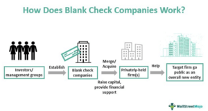

Special Purpose Acquisition Companies (SPACs) have emerged prominently as an alternative investment vehicle, particularly in recent years. Commonly referred to as blank check companies, SPACs provide a novel method for private firms to enter public markets more rapidly than traditional initial public offerings (IPOs). This accelerated pathway to raising capital and gaining market visibility has captivated investors, especially those enticed by the prospect of substantial returns.

However, the world of SPACs is not without its complexities and uncertainties. While they present unique benefits, these companies also pose significant challenges and risks that warrant careful consideration by investors. The process involves trusting the SPAC sponsors' capability to identify and merge with a lucrative target company, which inherently carries speculative risk as investors are essentially committing to an unknown future business endeavor.

This article will illuminate the structure and function of SPACs, evaluate the inherent investment risks, and consider the significant impact of algorithmic trading on SPAC market dynamics. Algorithmic trading, with its ability to execute large volumes of trades based on real-time data, can add another layer of complexity, influencing SPAC price volatility and market behavior. For investors using such strategies, understanding these dynamics becomes crucial to managing risks effectively.

By examining the interplay between SPACs and algorithmic trading, our discussion aims to equip investors with essential insights into the potential pitfalls and opportunities within this investment avenue. As the financial market continues to evolve, it is critical for investors to grasp the nuances of SPACs to make well-informed decisions amidst today’s volatile market conditions.

## Table of Contents

## Understanding SPACs: An Overview

A Special Purpose Acquisition Company (SPAC) functions as a publicly-traded entity established with the primary aim of merging with or acquiring an existing private company. Unlike traditional Initial Public Offerings (IPOs), SPACs possess neither ongoing business operations nor predetermined acquisition targets upon their inception and trading commencement. This characteristic grants SPACs their alternative name, "blank check companies."

Investors partake in a SPAC's IPO with the anticipation that the management team will effectively identify and consummate a merger with a promising private enterprise. The typical timeframe allocated for these transactions is around 24 months. During this period, the SPAC sponsors must diligently seek and negotiate a viable business combination. Should the management team fail to secure a suitable acquisition within this timeframe, the SPAC is usually liquidated, and the IPO proceeds are returned to the investors, a safeguard ensuring investment protection.

The funds amassed from the SPAC IPO are entrusted to a dedicated escrow account or trust. This mechanism ensures that the capital remains protected and is only accessible for the intended merger activities. If a merger or acquisition does not materialize during the stipulated period, the funds are returned to the shareholders, although some deductions may occur, such as those pertaining to operational costs or shareholder-approved expenses.

The allure of SPACs largely stems from their structure, which facilitates a potentially faster route for private companies to transition into public entities. Additionally, the SPAC model presents an opportunity for seasoned sponsors to capitalize on their industry expertise and management skills, promising investors potential value creation through strategic acquisitions. Despite the speculative nature inherent in not knowing the eventual target company at the IPO stage, SPACs have gained traction for these and several other advantages they offer to private firms and investors alike.

## Analyzing the Risks of Investing in SPACs

Special Purpose Acquisition Companies (SPACs) have gained recognition as vehicles that allow private firms to access public markets more swiftly. However, this alternative comes with inherent speculative risks. One of the fundamental risks is that investors do not know the target company at the time of the SPAC's Initial Public Offering (IPO). This means they are essentially issuing a 'blank check' to the sponsors, relying heavily on their ability to identify a profitable acquisition target.

Another significant risk lies in the potential for deal failure or the impact of adverse market conditions on the SPAC’s target company. If the identified target underperforms or if negotiations fall through, investors may face significant financial setbacks. The funds raised in a SPAC IPO are held in escrow and are typically returned to investors, often with minimal interest, if a suitable transaction is not completed within the specified timeframe, usually 24 months. This can lead to opportunity costs as funds are tied up with minimal returns.

Economic factors such as [interest rate](/wiki/interest-rate-trading-strategies) hikes and increased regulatory scrutiny can further complicate the SPAC landscape. Higher interest rates may reduce the attractiveness of SPACs as borrowing costs rise, while stringent regulatory requirements can impose additional compliance costs and time delays, impacting the agility and success of the mergers.

The fluctuating popularity of SPACs also adds another layer of risk. They may experience cycles of high investor interest followed by periods of cooling off. Such shifts can be driven by broader economic trends or high-profile failures that dampen market enthusiasm. Consequently, investors can face significant [volatility](/wiki/volatility-trading-strategies) and unpredictability in returns. Understanding these dynamics and thorough due diligence are crucial for managing the potential downside in SPAC investments.

## SPACs and Algorithmic Trading: A Complex Interaction

Algorithmic trading has become a pivotal component in the landscape of Special Purpose Acquisition Companies (SPACs), significantly impacting their market behavior. This trading method leverages technological advancements and complex mathematical models to make strategic trading decisions at speeds and frequencies that are beyond human capability. In the context of SPACs, [algorithmic trading](/wiki/algorithmic-trading) can substantially influence market conditions due to several factors.

Algorithms, equipped to process vast amounts of market data in real-time, can instantly respond to SPAC-related announcements and events. For instance, news concerning a SPAC's merger target or changes in regulatory policies can trigger immediate buying or selling actions by algorithms, causing rapid fluctuations in SPAC prices. Such swift reactions contribute to increased market volatility, as algorithmic trading can induce price movements that amplify the impact of the initial news trigger. 

While this approach provides the opportunity for quick profits through strategic exploitation of market movements, it also introduces heightened risks. The accelerated pace of trading can lead to exaggerated swings in stock prices, sometimes detaching them from the underlying fundamentals of the SPAC's potential or actual acquisition target. This volatility is further compounded by the existence of high-frequency trading ([HFT](/wiki/high-frequency-trading-strategies)) algorithms that seek to profit from minute price discrepancies in SPAC stocks. HFTs can intensify the unpredictability of the market, as they compete to execute trades within fractions of a second.

Moreover, algorithmic trading does not uniformly provide an advantage. The competitive edge provided by algorithms depends on their design and the capability of their underlying models. Poorly designed algorithms may fail to adapt to sudden market changes or respond inappropriately to misinterpreted market signals, potentially leading to financial losses. As such, investors utilizing algorithmic trading in the SPAC space must carefully consider these dynamics.

To mitigate the risks associated with algorithmic trading in SPACs, developers and traders need to employ robust risk management strategies. These strategies might include setting thresholds to halt trading during extreme volatility and continuously refining algorithms to better interpret market data and anticipate potential trends. Consequently, while algorithmic trading can enhance the efficiency of SPAC markets and offer opportunities for profit, it requires meticulous attention to both technological detail and market strategy to be successfully integrated into an investor's portfolio.

## Case Studies: High-Profile SPACs and Their Outcomes

The emergence of Special Purpose Acquisition Companies (SPACs) has been marked by significant and often unpredictable events, with some deals becoming focal points of interest and speculation. One such example is the involvement of Digital World Acquisition Corp (DWAC) with Trump Media & Technology Group.

The association of DWAC with former President Donald Trump’s media venture attracted considerable public and market scrutiny. The deal highlighted both the potential and the risks associated with SPAC transactions. Initially, the announcement fueled substantial market excitement and led to a sharp increase in DWAC's stock price. However, this surge was met with intense volatility, reflecting investor sentiment and regulatory concerns. Such high-profile SPAC deals underscore how media and political attention can dramatically impact investor perception and, consequently, market performance.

Beyond these headline-grabbing stories, many SPACs have encountered challenges translating initial market enthusiasm into long-term business success. For instance, some SPAC mergers have resulted in notable financial downturns post-merger due to unrealistic valuations, inadequate due diligence, or operational hurdles. Such cases often see the stock price plummet after the initial euphoria dissipates. Investors in these SPACs may face significant losses, particularly when the merged entity fails to deliver anticipated financial results or strategic growth.

Examining past SPAC outcomes provides valuable lessons for investors. Successful SPACs often share certain characteristics: a clear path to profitability, experienced management teams, and realistic valuations. Conversely, those that falter frequently suffer from speculative overvaluation and lack strategic vision.

For investors, these experiences emphasize the importance of conducting thorough research and maintaining a critical perspective when evaluating SPAC opportunities. The historical performance of high-profile SPACs offers a cautionary tale, underscoring the need for careful analysis and informed decision-making in the fast-paced world of SPAC investments.

## Conclusion: Making Informed SPAC Investment Decisions

Despite the appeal of Special Purpose Acquisition Companies (SPACs) as an expedient route for private firms to access public markets, investors should remain vigilant to the myriad risks these vehicles present. Thorough due diligence becomes not merely advisable but imperative. An investor's understanding of the SPAC management team’s track record can significantly influence the decision-making process, as the team's expertise and history are pivotal in identifying and negotiating successful mergers. Investors must evaluate the management's prior achievements and failures to ascertain the likelihood of future success.

Conducting a cautious market analysis is equally essential. Investors should consider broader economic indicators that may impact SPAC performance, such as interest rate fluctuations and regulatory developments. These factors have historically swayed investor sentiment and market stability, thereby influencing SPAC valuations and outcomes.

Leveraging algorithmic trading in SPAC investments presents further complexity. While algorithms can optimize trade execution by processing market data and executing orders swiftly, they also introduce volatility due to rapid reactions to market news or fluctuations. This double-edged sword effect necessitates a robust risk management strategy. Investors should employ advanced models to simulate market conditions, ensuring preparedness for potential scenarios of heightened volatility. 

Algorithmic strategies should be built upon a foundation of sound risk assessments and portfolio diversification. For instance, utilizing [machine learning](/wiki/machine-learning) algorithms to predict SPAC performance based on historical data can enhance decision-making, but models must be rigorously tested for accuracy and resilience against market unpredictability.

In summary, SPACs serve as a potent option within investment portfolios, offering the promise of high returns. However, realizing these benefits demands meticulous preparation and strategic foresight. Aided by comprehensive due diligence, market analyses, and prudent algorithmic trading strategies, investors can navigate the SPAC landscape effectively. Balancing opportunity with risk awareness, they can position themselves to capitalize on the unique advantages offered by these financial instruments.

## References & Further Reading

[1]: Klausner, M., & Ohlrogge, M. (2020). ["A Sober Look at SPACs."](https://papers.ssrn.com/sol3/papers.cfm?abstract_id=3720919) Stanford Law Review, 73(1), 55-98.

[2]: Axelson, U., & Makarov, I. (2017). ["Private Equity Performance and Capital Flows."](https://www.sciencedirect.com/science/article/pii/S156601411730403X) Journal of Financial Economics, 124(3), 543-567.

[3]: Baker, G. P., & Gompers, P. A. (2003). ["The Determinants of Board Structure at the Initial Public Offering."](https://www.jstor.org/stable/10.1086/380409) Journal of Financial Economics, 69(3), 413-437.

[4]: Hull, J. (2017). ["Options, Futures, and Other Derivatives."](https://books.google.com/books/about/Options_Futures_and_Other_Derivatives.html?id=yfr0DQAAQBAJ) 10th Edition. Pearson.

[5]: Daniel, K., & Moskowitz, T. (2016). ["Momentum Crashes."](https://www.sciencedirect.com/science/article/pii/S0304405X16301490) Journal of Financial Economics, 122(2), 221-247.

[6]: Brown, S. J., & Warner, J. B. (1980). ["Measuring Security Price Performance."](https://www.sciencedirect.com/science/article/pii/0304405X80900021) Journal of Financial Economics, 8(3), 205-258.