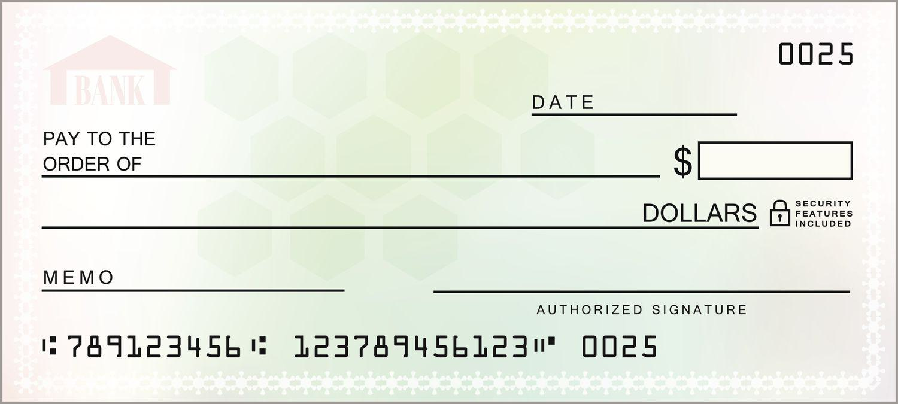

## Table of Contents

## What is Blank Check Preferred Stock?

Blank Check Preferred Stock is a type of stock that companies can issue without immediately setting all the details. When a company decides to use this stock, they can later decide on things like how much each share is worth, what kind of dividends it will pay, and any special rights the stock might have. This flexibility can be useful for companies that want to raise money quickly or make deals with investors without figuring out all the details right away.

Because the details of Blank Check Preferred Stock can be filled in later, it can be a bit risky for investors. They might not know exactly what they are buying until the company sets the terms. However, it can also be attractive to investors who trust the company and are okay with waiting to see what the final terms will be. Companies often use this kind of stock for things like mergers, acquisitions, or other big financial moves where they need to act fast.

## How does Blank Check Preferred Stock differ from common stock?

Blank Check Preferred Stock and common stock are different in a few big ways. Blank Check Preferred Stock gives the company the power to decide on important details like the price of the stock, how much it pays in dividends, and any special rights it might have, after it's already been issued. This means the company can change these details later, which can be helpful for them but also a bit risky for investors who don't know all the details upfront. On the other hand, common stock has fixed details from the start. When you buy common stock, you know the price, and you usually get voting rights in the company, but you are last in line to get paid if the company goes bankrupt.

Another key difference is how they pay dividends. Blank Check Preferred Stock often pays a fixed dividend, which can be higher than what common stock pays. This can make it more attractive to investors who want a steady income. Common stock dividends can change and are usually lower, but they can also grow if the company does well. Also, if the company goes bankrupt, holders of Blank Check Preferred Stock get paid before common stockholders, which makes it a bit safer in that way.

## What are the typical features of Blank Check Preferred Stock?

Blank Check Preferred Stock has several features that make it different from other types of stock. One key feature is that the company can set the details of the stock after it's been issued. This means they can decide on things like the price of the stock, how much it pays in dividends, and any special rights it might have later on. This flexibility can be really useful for the company, especially when they need to raise money quickly or make deals with investors without having all the details figured out right away.

Another important feature is that Blank Check Preferred Stock often comes with a fixed dividend. This means that if you own this stock, you can expect to get a certain amount of money regularly, which can be more than what common stock pays. This can make it attractive to investors who are looking for a steady income. Also, if the company ever goes bankrupt, people who own Blank Check Preferred Stock get paid before those who own common stock, which makes it a bit safer in that situation.

## Why would a company issue Blank Check Preferred Stock?

A company might issue Blank Check Preferred Stock when it needs to raise money quickly or make a deal without figuring out all the details right away. This type of stock gives the company the flexibility to set important details like the price, dividends, and special rights after the stock has been issued. This can be really helpful for the company, especially if they're in the middle of a big financial move like a merger or acquisition where they need to act fast.

Another reason a company might choose Blank Check Preferred Stock is to attract investors who are looking for a steady income. This stock often comes with a fixed dividend, which means investors can expect to get a certain amount of money regularly. This can be more attractive than common stock, which usually pays lower and less predictable dividends. Plus, if the company ever goes bankrupt, holders of Blank Check Preferred Stock get paid before common stockholders, making it a bit safer for investors.

## What are the risks associated with investing in Blank Check Preferred Stock?

Investing in Blank Check Preferred Stock can be risky because the details of the stock, like its price, dividends, and special rights, can be set by the company after you buy it. This means you might not know exactly what you're getting until later. If the company decides to set terms that are not as good as you expected, you could end up with a stock that's worth less or pays less in dividends than you thought.

Another risk is that the value of Blank Check Preferred Stock can change a lot. Because the company can change the terms, the stock's value can go up or down based on what the company decides. This can be hard to predict and can make the stock more risky than other types of stock where the terms are set from the start. Also, while you might get paid before common stockholders if the company goes bankrupt, there's still a chance you could lose money if the company's financial situation gets really bad.

## How is Blank Check Preferred Stock typically used in corporate finance?

In corporate finance, companies often use Blank Check Preferred Stock when they need to raise money quickly or make a deal without figuring out all the details right away. This type of stock lets the company decide on important things like the price, how much it pays in dividends, and any special rights it might have after it's been issued. This flexibility can be really helpful for the company, especially if they're in the middle of a big move like a merger or acquisition where they need to act fast.

Another way Blank Check Preferred Stock is used is to attract investors who want a steady income. This stock usually comes with a fixed dividend, which means investors can expect to get a certain amount of money regularly. This can be more attractive than common stock, which often pays lower and less predictable dividends. Plus, if the company ever goes bankrupt, people who own Blank Check Preferred Stock get paid before those who own common stock, making it a bit safer for investors.

## What are the regulatory considerations for issuing Blank Check Preferred Stock?

When a company wants to issue Blank Check Preferred Stock, it has to follow rules set by government agencies like the Securities and Exchange Commission (SEC) in the United States. These rules are there to make sure that investors get enough information to make smart choices. The company has to tell investors about the risks of buying this kind of stock, like how the details can change after it's issued. They also have to be clear about how they plan to use the money they raise and any special rights the stock might have.

Another important thing to consider is that the rules can be different in different countries. So, if a company wants to sell Blank Check Preferred Stock in another country, they have to follow that country's rules too. This can make things more complicated, but it's important for making sure investors everywhere are treated fairly and have the information they need.

## Can you explain the process of issuing Blank Check Preferred Stock?

When a company wants to issue Blank Check Preferred Stock, it starts by deciding to raise money this way. They tell the government, like the Securities and Exchange Commission (SEC) in the U.S., about their plan. The company has to write a document called a prospectus that explains everything about the stock, including the risks. This is important because the details of the stock, like its price and dividends, can be set later. The company makes sure to be clear about how they might use the money and any special rights the stock might have. They have to follow rules to make sure investors know what they're buying.

Once the government approves the plan, the company can start selling the Blank Check Preferred Stock. They might work with banks or other financial companies to help sell the stock. Investors buy the stock knowing that the company can change the details later. After the stock is issued, the company can then set the final terms, like how much each share is worth and what dividends it will pay. This flexibility helps the company, but it can also be a bit risky for investors because they don't know all the details until later.

## How do shareholders benefit from Blank Check Preferred Stock?

Shareholders can benefit from Blank Check Preferred Stock because it often pays a fixed dividend. This means they get a regular amount of money, which can be more than what they'd get from common stock. This steady income can be really helpful for investors who want to know how much money they'll get each time. Plus, if the company ever goes bankrupt, people who own Blank Check Preferred Stock get paid before those who own common stock. This makes it a bit safer for them because they have a better chance of getting some of their money back.

Another way shareholders can benefit is that Blank Check Preferred Stock can be a good way to invest in a company that's making big moves, like a merger or acquisition. The company can use this stock to raise money quickly and make deals without figuring out all the details right away. This flexibility can help the company grow and do well, which can be good for shareholders. But, it's important to know that because the details can change later, there's also some risk involved. Investors need to trust the company to set fair terms after the stock is issued.

## What are some real-world examples of companies using Blank Check Preferred Stock?

One example of a company using Blank Check Preferred Stock is when a tech startup wants to raise money quickly for a new project. They might issue this type of stock to investors, telling them they'll set the details like the price and dividends later. This can help the startup get the money they need without spending a lot of time figuring everything out first. Investors might be okay with this because they believe in the startup and are willing to wait to see what the final terms will be.

Another example is when a big company is in the middle of buying another company. They might use Blank Check Preferred Stock to raise money for the deal. This lets them move fast without having to set all the details right away. Investors who buy this stock know they'll get paid before common stockholders if something goes wrong, which makes it a bit safer for them. But they also have to trust the company to set fair terms after the stock is issued.

## How does Blank Check Preferred Stock impact a company's capital structure?

Blank Check Preferred Stock can change a company's capital structure by giving them a new way to raise money. When a company issues this type of stock, they can get cash quickly without setting all the details right away. This can be really helpful if they need money for big projects or to buy another company. The money from the stock adds to the company's total capital, which can help them grow and do more things.

But, Blank Check Preferred Stock also makes the company's capital structure more complicated. The company has to pay dividends to the people who own this stock, which can use up some of their money. Also, because the details of the stock can be changed later, it can be harder for investors to understand the company's financial situation. This means the company needs to be careful about how they use this kind of stock and make sure they keep investors happy.

## What are the strategic advantages and disadvantages of using Blank Check Preferred Stock in mergers and acquisitions?

Using Blank Check Preferred Stock in mergers and acquisitions can give a company some big advantages. It lets them raise money quickly without figuring out all the details right away. This can be really helpful when a company needs to move fast to buy another company or make a big deal. It also makes the stock more attractive to some investors because it usually pays a fixed dividend, which means they get a regular amount of money. Plus, if the company ever goes bankrupt, people who own this stock get paid before those who own common stock, which makes it a bit safer for them.

But, there are also some downsides to using Blank Check Preferred Stock. Because the company can change the details of the stock later, it can be risky for investors. They might not know exactly what they're buying until the company sets the final terms, which can make them nervous. This can also make the company's financial situation more complicated, which might scare away some investors. The company has to be careful about how they use this kind of stock and make sure they keep investors happy, or it could hurt their chances of making a good deal.

## References & Further Reading

[1]: ["Blank Check Companies and Corporate Governance"](https://www.investopedia.com/terms/b/blankcheckcompany.asp) by William F. Johnston, Harvard Law School Forum on Corporate Governance

[2]: ["Preferred Stock: New Insights Into Capital Structure"](https://www.sciencedirect.com/science/article/pii/S0929119913000060) by Christine Cuny and Stefan J. Reichelstein, Stanford University

[3]: ["Advances in Financial Machine Learning"](https://www.amazon.com/Advances-Financial-Machine-Learning-Marcos/dp/1119482089) by Marcos Lopez de Prado

[4]: ["The Impact of Algorithmic Trading on Market Dynamics"](https://wjaets.com/sites/default/files/WJAETS-2024-0054.pdf) by Albert S. Kyle and Anna A. Obizhaeva, Review of Financial Studies

[5]: ["Quantitative Trading: How to Build Your Own Algorithmic Trading Business"](https://www.amazon.com/Quantitative-Trading-Build-Algorithmic-Business/dp/1119800064) by Ernest P. Chan

[6]: ["The Use and Abuse of Preferred Stock"](https://vittana.org/17-advantages-and-disadvantages-of-preferred-stock) by Lawrence A. Cunningham and Richard A. Booth, Boston College Law School Faculty Papers

[7]: ["Machine Learning for Algorithmic Trading"](https://github.com/stefan-jansen/machine-learning-for-trading) by Stefan Jansen