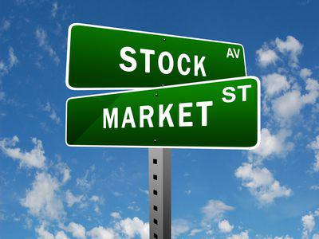

## Table of Contents

## What is a Blend Fund?

A Blend Fund is a type of mutual fund that invests in a mix of different types of stocks. It combines growth stocks, which are expected to grow quickly, and value stocks, which are thought to be underpriced. By blending these two types of stocks, the fund aims to balance the potential for high returns with the stability of more established companies.

Blend Funds are often used by investors who want a diversified portfolio without having to pick individual stocks themselves. They offer a middle ground between the aggressive growth potential of growth funds and the more conservative approach of value funds. This makes them a popular choice for people looking for a balanced investment strategy.

## How does a Blend Fund differ from other types of funds?

A Blend Fund is different from other types of funds because it mixes growth and value stocks. Growth funds focus on companies that are expected to grow fast. These companies might not pay dividends but their stock prices can go up a lot. Value funds, on the other hand, look for companies that seem to be priced too low. These companies might be more stable and could pay dividends. A Blend Fund takes a bit of both, trying to get the best of both worlds.

Compared to sector funds, which invest in specific industries like technology or healthcare, Blend Funds spread their investments across many different sectors. This diversification can help reduce risk. Also, Blend Funds are different from index funds, which try to match the performance of a market index like the S&P 500. Blend Funds have more flexibility in choosing their investments, which can lead to higher returns but also more risk.

In summary, Blend Funds offer a balanced approach that differs from the more focused strategies of growth, value, sector, and index funds. They aim to provide both growth and stability, making them a versatile choice for investors looking for a diversified portfolio without the need to manage individual stocks.

## What are the main objectives of investing in a Blend Fund?

The main goal of investing in a Blend Fund is to get a good mix of growth and stability in your investments. By including both growth stocks, which can grow quickly, and value stocks, which are more stable, the fund tries to balance the risk and reward. This means you might not see the super high returns that you could get from a growth fund, but you also won't face as much risk as you might with those funds. It's like having a bit of both worlds, making it easier to handle ups and downs in the market.

Another big reason people choose Blend Funds is for their diversification. Instead of putting all your money into one type of stock or industry, a Blend Fund spreads it out across many different kinds of companies and sectors. This can help protect your money if one part of the market does badly. It's a way to keep your investments safe while still having the chance to make money. For people who want a simpler way to invest without picking individual stocks, Blend Funds offer a convenient and balanced option.

## Who should consider investing in a Blend Fund?

People who want a mix of growth and stability in their investments should think about a Blend Fund. These funds are good for someone who doesn't want to take big risks but still wants to see their money grow. If you like the idea of having some fast-growing stocks and some more reliable ones, a Blend Fund could be right for you. It's like having a safety net while still reaching for some big wins.

Blend Funds are also great for people who want to keep things simple. Instead of choosing lots of different stocks or worrying about which sectors to invest in, you can put your money into a Blend Fund and let the experts handle it. This is perfect for someone who doesn't have the time or knowledge to manage their investments closely but still wants a diversified portfolio. If you're looking for a balanced and easy way to invest, a Blend Fund might be what you need.

## What are the typical asset allocations in a Blend Fund?

A Blend Fund usually mixes growth and value stocks to create a balanced portfolio. Growth stocks are companies that are expected to grow quickly, so the fund might put around 40% to 60% of its money into these stocks. These companies often don't pay dividends but can see their stock prices go up a lot. On the other hand, value stocks are companies that seem to be priced too low, and the fund might invest about 40% to 60% in these. Value stocks are usually more stable and might pay dividends, which can provide some income.

The rest of the fund's money, which could be anywhere from 0% to 20%, might be put into other types of assets like bonds or cash. This helps to spread out the risk even more and can make the fund a bit safer. The exact mix can change depending on what the fund manager thinks is best at the time, but the goal is always to balance growth and stability.

## How do Blend Funds perform compared to Growth and Value Funds?

Blend Funds usually try to find a middle ground between Growth Funds and Value Funds. Because they mix growth stocks and value stocks, their performance can be somewhere in the middle too. If the market is doing well for growth stocks, a Blend Fund might not do as well as a Growth Fund because it's not fully focused on growth. But, if value stocks are doing better, the Blend Fund might not keep up with a Value Fund either. It's like having a bit of both, so you might not see the highest highs or the lowest lows.

Over time, Blend Funds can be more stable than Growth or Value Funds because they're not betting everything on one type of stock. They spread the risk, which can help protect your money if one part of the market isn't doing well. But, this also means you might miss out on big wins if one type of stock takes off. So, if you're okay with a steady, balanced approach and don't want to take big risks, a Blend Fund might be a good choice. If you're looking for the chance to make more money quickly, you might want to look at Growth or Value Funds instead.

## Can you provide examples of successful Blend Funds?

One example of a successful Blend Fund is the Vanguard Dividend Growth Fund (VDIGX). This fund mixes growth and value stocks and focuses on companies that not only grow but also pay dividends. Over the years, it has given investors a good mix of growth and income, making it a popular choice for those who want a balanced approach. The fund has done well because it picks solid companies that keep growing and also give back money to shareholders through dividends.

Another good example is the T. Rowe Price Equity Income Fund (PRFDX). This fund also blends growth and value stocks but leans more towards value. It has a strong track record of steady performance and often does better than other funds when the market is tough. By choosing companies that are undervalued but still have room to grow, the fund has managed to give investors both growth and safety. People like this fund because it helps them sleep better at night, knowing their money is in a mix of solid and growing companies.

## What are the fees and expenses associated with Blend Funds?

Blend Funds, like other mutual funds, come with fees and expenses that investors need to know about. One big fee is the expense ratio, which is a yearly fee that covers the costs of running the fund. This fee is a percentage of your investment, usually between 0.5% to 1.5% for Blend Funds. So, if you invest $10,000 in a fund with a 1% expense ratio, you'll pay $100 a year just to keep your money in the fund. Some funds might also charge a load fee, which is a one-time fee you pay when you buy or sell shares of the fund. These load fees can be as high as 5% of your investment, but not all Blend Funds have them.

Besides the expense ratio and load fees, there might be other smaller fees too. For example, some funds charge for things like account maintenance or buying and selling shares. These fees can add up, so it's good to read the fund's prospectus, which is like a detailed guide that tells you everything about the fund, including all the fees. Knowing about these fees helps you pick a Blend Fund that fits your budget and investment goals.

## How do you evaluate the performance of a Blend Fund?

To evaluate the performance of a Blend Fund, you need to look at a few key things. One of the most important is how the fund has done over time. You can check its returns over different periods, like one year, three years, or five years. Comparing these returns to a benchmark, like the S&P 500, can help you see if the fund is doing better or worse than the overall market. Another thing to look at is how much risk the fund takes. A good way to measure this is by looking at the fund's volatility, which shows how much its value goes up and down. A Blend Fund that grows steadily without big swings might be a good sign.

It's also smart to see how the fund does compared to other Blend Funds. If it's doing better than most of its peers, that could mean it's a strong choice. Don't forget to consider the fees and expenses too. High fees can eat into your returns, so a fund that performs well but charges a lot might not be as good as it seems. Lastly, look at the fund manager's track record. If the person running the fund has a history of making good choices, that's a positive sign. By putting all these pieces together, you can get a clear picture of how well a Blend Fund is doing.

## What are the risks involved in investing in Blend Funds?

Investing in Blend Funds comes with some risks, just like any other investment. One big risk is that the market can go up and down, and this can affect the value of your investment. Even though Blend Funds try to balance growth and value stocks, if the whole market goes down, your Blend Fund will probably go down too. Another risk is that the fund might not pick the right mix of stocks. If the fund manager makes bad choices, the fund might not do as well as you hope. This can mean you lose money or don't make as much as you could with a different investment.

Another thing to think about is the fees you have to pay. Blend Funds charge fees for managing your money, and these fees can eat into your returns. If the fund doesn't perform well enough to cover these fees, you might end up with less money than you started with. Also, Blend Funds can be affected by changes in interest rates, inflation, and other economic factors. These things can make the stocks in the fund go up or down in ways that are hard to predict. So, even though Blend Funds try to be a balanced choice, they still come with risks that you need to be aware of.

## How does the management style affect the performance of a Blend Fund?

The way a Blend Fund is managed can really change how well it does. Some Blend Funds are run by people who pick each stock by hand. They look at lots of details about different companies and try to choose the best ones to mix growth and value stocks. If the manager is good at picking stocks, the fund might do really well. But if they make bad choices, the fund could lose money. So, the skill and experience of the fund manager can make a big difference in how the fund performs.

Other Blend Funds might use a more automatic way to pick stocks, following certain rules or formulas. This can help keep things steady and avoid big mistakes, but it might also mean the fund misses out on some big wins that a smart manager could find. The style of management can also affect how much the fund changes over time. A hands-on manager might change the mix of stocks more often, trying to do better than the market. A more automatic approach might keep the same mix for longer, aiming for steady growth. Either way, the management style plays a big part in how the Blend Fund does over time.

## What advanced strategies can be used to optimize returns from Blend Funds?

To get the most out of your Blend Fund, one strategy is to keep an eye on the fund's performance and compare it to other funds and market benchmarks. If you see that your fund is not doing as well as others, you might want to switch to a better-performing Blend Fund. Also, think about the fees you're paying. Sometimes, funds with lower fees can give you better returns over time because you're not losing as much money to costs. Another thing to do is to look at the fund's asset allocation. If the fund has too much in one type of stock and not enough in the other, you might want to balance it out by investing in other funds that focus more on growth or value, depending on what's missing.

Another advanced strategy is to use dollar-cost averaging. This means you put money into your Blend Fund at regular times, no matter what the market is doing. This can help you buy more shares when prices are low and fewer when prices are high, which can lead to better overall returns. Also, consider rebalancing your portfolio. Over time, the mix of growth and value stocks in your Blend Fund might change. By selling some of the stocks that have grown a lot and buying more of the ones that haven't, you can keep your investments balanced and possibly improve your returns. These strategies can help you make the most of your Blend Fund and reach your investment goals.

## References & Further Reading

[1]: Bergstra, J., Bardenet, R., Bengio, Y., & Kégl, B. (2011). ["Algorithms for Hyper-Parameter Optimization."](https://dl.acm.org/doi/10.5555/2986459.2986743) Advances in Neural Information Processing Systems 24.

[2]: ["Advances in Financial Machine Learning"](https://www.amazon.com/Advances-Financial-Machine-Learning-Marcos/dp/1119482089) by Marcos Lopez de Prado

[3]: ["Evidence-Based Technical Analysis: Applying the Scientific Method and Statistical Inference to Trading Signals"](https://www.amazon.com/Evidence-Based-Technical-Analysis-Scientific-Statistical/dp/0470008741) by David Aronson

[4]: ["Machine Learning for Algorithmic Trading"](https://github.com/stefan-jansen/machine-learning-for-trading) by Stefan Jansen

[5]: ["Quantitative Trading: How to Build Your Own Algorithmic Trading Business"](https://github.com/LucindaYa/quant-resources/blob/master/Quantitative%20Trading%20How%20to%20Build%20Your%20Own%20Algorithmic%20Trading%20Business.pdf) by Ernest P. Chan