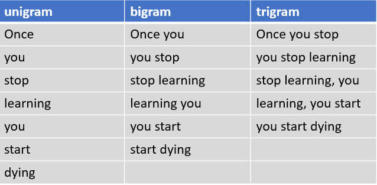

## Table of Contents

## What is BLEU and what is its primary purpose in machine learning?

BLEU, which stands for Bilingual Evaluation Understudy, is a metric used to evaluate the quality of machine-generated translations. It compares a machine's output to one or more human reference translations and calculates a score based on how similar they are. The score ranges from 0 to 1, where a higher score indicates a better translation. BLEU is widely used because it's quick and easy to use, and it gives a good idea of how well a machine translation system is performing.

The primary purpose of BLEU in machine learning is to provide a way to automatically assess the quality of translations without needing human evaluators, which can be time-consuming and expensive. By using BLEU, researchers and developers can quickly test and compare different translation models. This helps them improve their systems by focusing on models that score higher. While BLEU isn't perfect and doesn't capture all aspects of translation quality, it's a useful tool for getting a general sense of how well a system is doing.

## How does BLEU measure the quality of machine translation?

BLEU measures the quality of machine translation by comparing the machine's output to one or more human reference translations. It does this by looking at how many words and phrases in the machine's translation match those in the human translations. BLEU uses something called n-grams, which are groups of words. For example, if the machine translation is "the cat is on the mat" and the human reference is "the cat sat on the mat," BLEU would count matches for "the," "cat," "on," and "the mat." The more matches there are, the higher the BLEU score.

The BLEU score is calculated using a formula that takes into account both the precision of the n-gram matches and a brevity penalty to prevent very short translations from getting high scores. The formula is $$ \text{BLEU} = \text{BP} \cdot \exp \left( \sum_{n=1}^{N} w_n \log p_n \right) $$ where BP is the brevity penalty, $w_n$ are weights for the n-grams, and $p_n$ is the precision for n-grams. The brevity penalty ensures that if a translation is much shorter than the reference, it doesn't get an unfairly high score. This way, BLEU provides a single number that gives a quick idea of how good a machine translation is compared to human translations.

## What are the key components of the BLEU score calculation?

The BLEU score is calculated using two main parts: n-gram precision and a brevity penalty. N-gram precision looks at how many groups of words in the machine's translation match the groups of words in the human reference translations. For example, if the machine says "the cat is on the mat" and the human says "the cat sat on the mat," BLEU checks for matches like "the," "cat," "on," and "the mat." The more matches, the higher the precision, and the better the score. BLEU usually looks at different sizes of n-grams, from single words up to longer phrases, to get a good overall picture of the translation quality.

The other important part of the BLEU score is the brevity penalty. This part makes sure that if a machine translation is much shorter than the human reference, it doesn't get a high score just because it used fewer words. The brevity penalty is calculated by comparing the length of the machine translation to the length of the reference translation. If the machine translation is too short, the brevity penalty will lower the overall BLEU score. The final BLEU score combines these two parts using a formula: $$ \text{BLEU} = \text{BP} \cdot \exp \left( \sum_{n=1}^{N} w_n \log p_n \right) $$ where BP is the brevity penalty, $w_n$ are weights for the n-grams, and $p_n$ is the precision for n-grams. This formula gives a single number that shows how good the machine translation is compared to human translations.

## Can you explain the concept of n-grams in the context of BLEU?

In the context of BLEU, n-grams are groups of words that are used to compare machine translations with human reference translations. For example, if you have the sentence "the cat is on the mat," the 1-grams are single words like "the," "cat," "is," "on," and "mat." The 2-grams are pairs of words like "the cat," "cat is," "is on," "on the," and "the mat." Higher n-grams would be longer phrases, like "the cat is" for 3-grams. BLEU uses these n-grams to see how many of the machine's word groups match the human's word groups. The more matches there are, the higher the BLEU score, showing that the machine translation is more similar to the human translation.

BLEU calculates the precision of these n-gram matches. Precision is like a score that shows how many of the machine's n-grams are found in the human reference. For example, if the machine translation has 10 2-grams and 8 of them match the human reference, the precision for 2-grams would be 0.8. BLEU combines the precision scores for different n-grams (usually from 1-grams up to 4-grams) into one final score. The formula for this is $$ \text{BLEU} = \text{BP} \cdot \exp \left( \sum_{n=1}^{N} w_n \log p_n \right) $$ where BP is the brevity penalty, $w_n$ are weights for the n-grams, and $p_n$ is the precision for n-grams. This helps give a good overall picture of how well the machine translation matches the human translation.

## How does BLEU handle different sentence lengths and why is this important?

BLEU handles different sentence lengths by using a part called the brevity penalty. If a machine translation is much shorter than the human reference, the brevity penalty makes sure it doesn't get a high score just because it used fewer words. The penalty is calculated by comparing the length of the machine translation to the length of the reference translation. If the machine translation is too short, the brevity penalty will lower the overall BLEU score. This is important because it stops short translations from being seen as better just because they are shorter.

The formula for the BLEU score includes the brevity penalty and looks like this: $$ \text{BLEU} = \text{BP} \cdot \exp \left( \sum_{n=1}^{N} w_n \log p_n \right) $$. In this formula, BP is the brevity penalty, $w_n$ are weights for the n-grams, and $p_n$ is the precision for n-grams. By including the brevity penalty, BLEU makes sure that the score reflects both how well the words match and how well the length matches the human reference. This helps give a more accurate picture of how good the machine translation is compared to what a human would do.

## What are the limitations of using BLEU as a metric for translation quality?

BLEU has some problems when used to measure how good a machine translation is. One big issue is that it looks at how many words and phrases match between the machine's translation and a human's translation, but it doesn't care about the order of those words or if the translation makes sense. So, a machine translation could have the right words but in the wrong order, and BLEU might still give it a high score. Also, BLEU can't tell if a translation sounds natural or fits well in the language it's translated into. It's more about checking if the words match, not if the whole sentence feels right.

Another limitation is that BLEU needs a lot of human reference translations to work well, and sometimes these aren't available. If there's only one reference translation, BLEU might not be as accurate because it can't see different ways to say the same thing. Also, BLEU uses a formula to calculate its score, which is $$ \text{BLEU} = \text{BP} \cdot \exp \left( \sum_{n=1}^{N} w_n \log p_n \right) $$. This formula tries to balance the precision of word matches with a penalty for short translations, but it's not perfect. Sometimes, a translation might be good but short, and BLEU might unfairly lower its score because of the brevity penalty.

## How can BLEU be used in conjunction with other evaluation metrics?

BLEU is often used with other ways to check how good a machine translation is because it has some limits. For example, BLEU looks at how many words and phrases match between the machine's translation and a human's translation, but it doesn't care about the order of those words or if the translation makes sense. So, people might use another metric like METEOR, which does pay attention to word order and synonyms. METEOR can help catch things that BLEU might miss, like if the translation is good but the words are in a different order. By using both BLEU and METEOR, researchers can get a better idea of how well the machine is translating.

Another way to use BLEU with other metrics is to include human judgments. Humans can look at translations and rate them on how well they sound, how accurate they are, and how much they keep the meaning of the original text. A common way to do this is to use a metric called Human Evaluation, where people score translations on a scale. By combining BLEU scores with these human scores, researchers can see if the machine's translations are not just matching words but also making sense and sounding natural. The formula for BLEU is $$ \text{BLEU} = \text{BP} \cdot \exp \left( \sum_{n=1}^{N} w_n \log p_n \right) $$, but human evaluations can add another layer of understanding to how good the translations really are.

## What are some common criticisms of BLEU and how have they been addressed?

One common criticism of BLEU is that it focuses too much on matching words and phrases, but doesn't care about the order of those words or if the translation makes sense. This means a machine translation could have the right words but in the wrong order, and BLEU might still give it a high score. Another problem is that BLEU can't tell if a translation sounds natural or fits well in the language it's translated into. It's more about checking if the words match, not if the whole sentence feels right. To address these issues, other metrics like METEOR have been developed. METEOR pays attention to word order and synonyms, which can help catch things that BLEU might miss. By using both BLEU and METEOR, researchers can get a better idea of how well the machine is translating.

Another criticism is that BLEU needs a lot of human reference translations to work well, and sometimes these aren't available. If there's only one reference translation, BLEU might not be as accurate because it can't see different ways to say the same thing. Also, the formula BLEU uses, $$ \text{BLEU} = \text{BP} \cdot \exp \left( \sum_{n=1}^{N} w_n \log p_n \right) $$, tries to balance the precision of word matches with a penalty for short translations, but it's not perfect. Sometimes, a translation might be good but short, and BLEU might unfairly lower its score because of the brevity penalty. To address these issues, researchers often combine BLEU with human evaluations. Humans can look at translations and rate them on how well they sound, how accurate they are, and how much they keep the meaning of the original text. By combining BLEU scores with these human scores, researchers can see if the machine's translations are not just matching words but also making sense and sounding natural.

## How does BLEU compare to other machine translation evaluation metrics like METEOR or TER?

BLEU, METEOR, and TER are all used to check how good machine translations are, but they do it in different ways. BLEU looks at how many words and phrases in the machine's translation match the human reference translations. It uses something called n-grams, which are groups of words. For example, if the machine translation says "the cat is on the mat" and the human reference says "the cat sat on the mat," BLEU counts matches for "the," "cat," "on," and "the mat." The more matches there are, the higher the BLEU score. BLEU also uses a formula to calculate its score, which is $$ \text{BLEU} = \text{BP} \cdot \exp \left( \sum_{n=1}^{N} w_n \log p_n \right) $$. This formula includes a brevity penalty (BP) to make sure short translations don't get high scores just because they're short.

METEOR, on the other hand, looks at more than just word matches. It also cares about the order of words and if the machine translation uses synonyms that are in the human reference. This makes METEOR better at catching translations that might be good but different from the reference. TER, or Translation Edit Rate, measures how many changes, like adding, deleting, or moving words, are needed to make the machine translation match the human reference. A lower TER score means fewer changes are needed, which means the translation is better. Each of these metrics has its own strengths and weaknesses, so using them together can give a fuller picture of how good a machine translation is.

## Can you describe any modifications or variants of the BLEU score that have been proposed?

Some researchers have come up with different versions of the BLEU score to make it better. One change is called smoothed BLEU, which helps when the machine translation has no matches at all with the human reference. In regular BLEU, if there are no matches, the score can become zero, which isn't very helpful. Smoothed BLEU adds a small number to the count of matches to avoid this problem. Another change is called sentence-level BLEU, which looks at how good each sentence is instead of the whole document. This can help find out which parts of the translation need to be better. There's also a version called multi-reference BLEU, which uses more than one human reference translation to check the machine's work. This can be better because it looks at different ways to say the same thing.

Another modification is called BLEU+1, which adds a measure of how well the translation keeps the meaning of the original text. This is important because just matching words isn't enough if the meaning changes. BLEU+1 tries to fix this by also checking if the main ideas are the same. Some researchers also use a version called BLEURT, which combines BLEU with other ways to check translations, like looking at how well the sentences fit together. BLEURT uses a [machine learning](/wiki/machine-learning) model to give a score that's meant to be more like what a human would think. The formula for the original BLEU score is $$ \text{BLEU} = \text{BP} \cdot \exp \left( \sum_{n=1}^{N} w_n \log p_n \right) $$, but these new versions try to make it more useful by fixing some of its problems.

## How is BLEU implemented in practice, including any specific tools or libraries?

In practice, BLEU is often used with tools and libraries that help researchers and developers check how good machine translations are. One popular tool is the Moses SMT (Statistical Machine Translation) toolkit, which includes a script for calculating BLEU scores. This script takes the machine translations and human reference translations as input and gives a BLEU score as output. Another common library is sacreBLEU, which is designed to make it easier to use BLEU by handling things like different languages and multiple reference translations. SacreBLEU can be used from the command line or as part of a Python program, making it very flexible for different needs.

To use BLEU in a Python program, you can use libraries like NLTK (Natural Language Toolkit) or sacreBLEU. For example, with NLTK, you can calculate the BLEU score like this:

```python
from nltk.translate.bleu_score import sentence_bleu

reference = [['the', 'cat', 'is', 'on', 'the', 'mat']]
candidate = ['the', 'cat', 'is', 'on', 'the', 'mat']

score = sentence_bleu(reference, candidate)
print(score)
```

This code calculates the BLEU score for a single sentence. The formula for BLEU is $$ \text{BLEU} = \text{BP} \cdot \exp \left( \sum_{n=1}^{N} w_n \log p_n \right) $$, where BP is the brevity penalty, $w_n$ are weights for the n-grams, and $p_n$ is the precision for n-grams. By using these tools and libraries, people can quickly and easily check the quality of machine translations and improve their systems.

## What future developments or research directions are being explored to improve BLEU or replace it?

Researchers are working on new ways to make BLEU better or find other ways to check how good machine translations are. One idea is to use machine learning models that can understand the meaning of sentences better than just looking at word matches. These models can look at how well the translation keeps the main ideas and if it sounds natural in the language it's translated into. Another direction is to use more human judgments in the evaluation process. By combining automatic scores like BLEU with human ratings, researchers can get a fuller picture of translation quality. They're also trying to make BLEU work better with different languages and shorter texts by changing how it calculates scores.

Some new metrics are being developed to replace or work with BLEU. One example is BLEURT, which uses a machine learning model to give a score that's meant to be more like what a human would think. BLEURT looks at how well the sentences fit together and if the translation keeps the meaning of the original text. Another metric is COMET, which also uses machine learning to check translations. COMET can be trained to focus on different things, like how natural the translation sounds or how well it keeps the meaning. These new metrics try to fix some of BLEU's problems by looking at more than just word matches. The formula for BLEU is $$ \text{BLEU} = \text{BP} \cdot \exp \left( \sum_{n=1}^{N} w_n \log p_n \right) $$, but these new methods aim to go beyond this simple calculation to better understand translation quality.