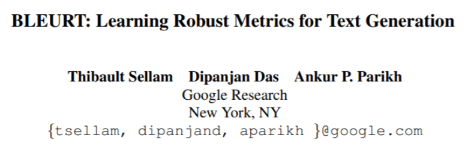

## Table of Contents

## What is Bleurt and what does it stand for?

BLEURT is a metric used to evaluate the quality of text generated by machines, like in machine translation or text summarization. It stands for "BERT-based Language Evaluation Under Review and Testing." BLEURT uses a pre-trained language model called BERT, which helps it understand and compare texts better than older methods.

BLEURT works by taking two pieces of text, like a reference text and a machine-generated text, and then it calculates a score to show how similar they are. This score helps researchers and developers know if their machine's text is good or needs improvement. BLEURT is special because it can capture subtle differences in meaning and style, making it a powerful tool in natural language processing.

## How does Bleurt differ from traditional machine translation evaluation metrics?

BLEURT is different from older ways of checking how good machine translations are because it uses a smart computer model called BERT. Traditional metrics like BLEU or ROUGE look at how many words match between the machine's text and a human's text. They count words and phrases that are the same, but they don't really understand if the sentences mean the same thing. BLEURT, on the other hand, can see if two sentences have the same meaning, even if the words are different. This makes BLEURT better at telling if a translation is good or not, because it can catch small differences in meaning that other metrics might miss.

Another way BLEURT is different is that it learns from lots of examples. Traditional metrics use simple math formulas to score translations. For example, BLEU might use a formula like $$BLEU = BP \cdot \exp \left( \sum_{n=1}^{N} w_n \log p_n \right)$$, where BP is a brevity penalty and $$p_n$$ are the n-gram precisions. But BLEURT doesn't just use a formula; it's trained on a huge amount of data to understand what makes a good translation. This training helps BLEURT give a more accurate score because it knows what humans think is a good translation, not just what matches word-for-word.

## What are the key components of the Bleurt model?

The BLEURT model is made up of a few important parts that help it work well. The main part is the BERT model, which is a type of computer program that understands language really well. BERT helps BLEURT read and understand both the machine's text and the human's text. Another part is the training data, which is a big collection of examples that BLEURT uses to learn what makes a good translation. This training data includes lots of pairs of texts, where one text is a good translation and the other is not so good. By looking at these examples, BLEURT learns to tell the difference between good and bad translations.

Another key component of BLEURT is the scoring system. After reading the texts, BLEURT gives them a score to show how similar they are. This score is not just based on matching words, like older methods. Instead, BLEURT looks at the meaning and style of the texts. It uses a special formula to calculate this score, but it's not a simple math formula like $$BLEU = BP \cdot \exp \left( \sum_{n=1}^{N} w_n \log p_n \right)$$. Instead, it's a complex process that takes into account many different things about the texts. This makes BLEURT's scores more accurate and helpful for people who want to improve their machine translation systems.

## How is Bleurt trained and what data is used for its training?

BLEURT is trained using a lot of examples of text pairs. These pairs include one text that is a good translation and another text that is not so good. By looking at these examples, BLEURT learns what makes a translation good or bad. The training data comes from many places, like human evaluations of machine translations, and it covers many different languages and styles of writing. This helps BLEURT understand a wide range of texts and give accurate scores.

The training process involves feeding these text pairs into the BERT model, which is the main part of BLEURT. BERT reads the texts and tries to understand their meanings. Then, BLEURT uses this understanding to calculate a score that shows how similar the texts are. This score is not just based on matching words, but on the overall meaning and style of the texts. The training continues until BLEURT can give scores that match what humans think about the quality of the translations.

## Can you explain the role of Transformers in Bleurt?

Transformers play a big role in BLEURT because they help the model understand language better. In BLEURT, the main Transformer model used is BERT, which stands for Bidirectional Encoder Representations from Transformers. BERT looks at the whole sentence at once, not just one word at a time. This helps BLEURT see the full meaning of the texts it's comparing. When BLEURT reads two texts, it uses BERT to understand what each text means and then it can tell how similar they are, even if the words are different.

The Transformer architecture in BERT makes BLEURT better at understanding subtle differences in meaning and style. Transformers use something called "attention" to focus on different parts of the text. This attention mechanism helps BERT know which words are important and how they relate to each other. By using Transformers, BLEURT can give a more accurate score because it captures the overall meaning of the texts, not just how many words match. This makes BLEURT a powerful tool for evaluating machine translations and other generated texts.

## What are the advantages of using Bleurt over other metrics like BLEU or METEOR?

BLEURT has some big advantages over other metrics like BLEU or METEOR because it understands the meaning of texts better. BLEU and METEOR look at how many words match between the machine's text and a human's text. They use formulas like $$BLEU = BP \cdot \exp \left( \sum_{n=1}^{N} w_n \log p_n \right)$$ to calculate a score. But these formulas don't really understand if the sentences mean the same thing. BLEURT, on the other hand, uses a smart computer model called BERT to see if two sentences have the same meaning, even if the words are different. This makes BLEURT better at telling if a translation is good or not, because it can catch small differences in meaning that other metrics might miss.

Another advantage of BLEURT is that it learns from lots of examples. Traditional metrics like BLEU and METEOR use simple math formulas to score translations. But BLEURT is trained on a huge amount of data to understand what makes a good translation. This training helps BLEURT give a more accurate score because it knows what humans think is a good translation, not just what matches word-for-word. By using a complex process to calculate scores, BLEURT can take into account many different things about the texts, making its evaluations more helpful for improving machine translation systems.

## How does Bleurt handle different languages and bilingual contexts?

BLEURT is good at handling different languages and bilingual contexts because it is trained on a lot of examples from many languages. When BLEURT reads texts in different languages, it uses its understanding of language to see if the translations are good. This means BLEURT can work well with texts in English, Spanish, French, and many other languages. It doesn't just look at the words; it looks at the meaning of the whole sentence. This helps BLEURT give accurate scores even when the texts are in different languages.

In bilingual contexts, BLEURT can compare texts where one is in one language and the other is in another language. For example, if you have a text in English and its translation in Spanish, BLEURT can tell how good the Spanish translation is. It does this by understanding the meaning of both texts and seeing how well they match. This makes BLEURT a useful tool for people who work with translations between different languages, because it can give a good idea of how well a machine is translating from one language to another.

## What are some common applications of Bleurt in machine learning and NLP?

BLEURT is often used in [machine learning](/wiki/machine-learning) and natural language processing to check how good machine translations are. When people make computer programs that translate text from one language to another, they need a way to know if the translations are good. BLEURT helps by reading both the original text and the translated text, and then it gives a score to show how similar they are. This score helps people see if the machine's translation is good or if it needs to be better. BLEURT is better than older methods like BLEU, which use formulas like $$BLEU = BP \cdot \exp \left( \sum_{n=1}^{N} w_n \log p_n \right)$$, because BLEURT looks at the meaning of the texts, not just the words.

Another way BLEURT is used is in text generation, like when a computer writes stories or summaries. People want to know if the computer's writing makes sense and is good. BLEURT can read the computer's text and compare it to a good example written by a human. It then gives a score to show how close the computer's text is to the human's text. This helps people improve their text generation programs. Because BLEURT understands the meaning of texts, it can give more accurate scores than older methods, making it a helpful tool in natural language processing.

## How can Bleurt be integrated into existing NLP pipelines?

To integrate BLEURT into existing NLP pipelines, you first need to download and set up the BLEURT model. You can do this by getting the BLEURT model from a place like GitHub or a similar site. Once you have the model, you can add it to your pipeline where you want to check how good your machine translations or generated texts are. When your pipeline makes a translation or a piece of text, you can use BLEURT to read it and compare it to a good example. BLEURT will then give a score that shows how similar the texts are. This score can help you see if your machine's text needs to be better.

BLEURT is different from older ways of checking translations, like BLEU, which use formulas like $$BLEU = BP \cdot \exp \left( \sum_{n=1}^{N} w_n \log p_n \right)$$ to score texts. BLEURT looks at the meaning of the texts, not just the words, so it can give a more accurate score. To use BLEURT in your pipeline, you might need to change your code to include the BLEURT model. You can do this by adding a step in your code where BLEURT reads the texts and gives a score. This score can then be used to decide if your machine's text is good enough or if it needs more work.

## What are the limitations or challenges faced when using Bleurt?

One challenge with using BLEURT is that it needs a lot of computer power. BLEURT uses a big and smart model called BERT to understand texts. This means it can take a long time to score a lot of translations, especially if you're working with a big project. Also, BLEURT might not work as well with languages that it hasn't seen a lot of during its training. If BLEURT was mostly trained on English texts, it might not be as good at scoring translations in other languages like Swahili or Finnish.

Another limitation is that BLEURT can sometimes be hard to understand. When BLEURT gives a score, it's not always clear why it gave that score. Older methods like BLEU use simple formulas like $$BLEU = BP \cdot \exp \left( \sum_{n=1}^{N} w_n \log p_n \right)$$ to score texts, so it's easier to see why a text got a certain score. But BLEURT looks at the meaning of the texts, which makes it harder to explain why it thinks a translation is good or bad. This can make it tricky for people who want to use BLEURT to improve their machine translation systems.

## How does Bleurt's performance compare to other state-of-the-art evaluation metrics in recent benchmarks?

In recent benchmarks, BLEURT has shown to be better than many other evaluation metrics like BLEU and METEOR. BLEURT uses a smart model called BERT to understand the meaning of texts, which helps it give more accurate scores. For example, in the WMT (Workshop on Machine Translation) benchmarks, BLEURT often gets scores that are closer to what humans think about the quality of translations. This is because BLEURT can see if two sentences mean the same thing, even if the words are different. Older metrics like BLEU use formulas like $$BLEU = BP \cdot \exp \left( \sum_{n=1}^{N} w_n \log p_n \right)$$ to score translations, but they don't understand the meaning as well as BLEURT does.

However, BLEURT still has some challenges. It needs a lot of computer power to work, which can be a problem for big projects. Also, BLEURT might not work as well with languages it hasn't seen much during its training. In some benchmarks, other metrics like COMET, which also uses machine learning but in a different way, have shown to be good too. COMET can sometimes give scores that are even closer to human judgments than BLEURT, especially for certain languages or types of texts. So, while BLEURT is a strong tool, it's important to think about these challenges and maybe use it together with other metrics to get the best results.

## What future developments or research directions are anticipated for Bleurt?

In the future, people might work on making BLEURT use less computer power. Right now, BLEURT needs a lot of computer power because it uses a big model called BERT to understand texts. If researchers can make BLEURT work faster, it could be easier to use for big projects. They might also try to train BLEURT on more languages so it can work better with languages it hasn't seen much before. This could help BLEURT give more accurate scores for translations in many different languages.

Another thing researchers might look at is making BLEURT's scores easier to understand. Right now, it's hard to know why BLEURT gives a certain score because it looks at the meaning of texts, not just the words. If researchers can find a way to explain BLEURT's scores better, it would be easier for people to use BLEURT to improve their machine translation systems. They might also compare BLEURT with other new metrics like COMET to see which one works best for different types of texts and languages.

## References & Further Reading

[1]: Sellam, T., & Beam, S. (2020). ["BLEURT: Learning Robust Metrics for Text Generation."](https://aclanthology.org/2020.acl-main.704/) Proceedings of the 58th Annual Meeting of the Association for Computational Linguistics.

[2]: Devlin, J., Chang, M. W., Lee, K., & Toutanova, K. (2019). ["BERT: Pre-training of Deep Bidirectional Transformers for Language Understanding."](https://arxiv.org/abs/1810.04805) Proceedings of the 2019 Conference of the North American Chapter of the Association for Computational Linguistics: Human Language Technologies.

[3]: Bojar, O., Chatterjee, R., Federmann, C., Graham, Y., Haddow, B., Huck, M., ... & Zampieri, M. (2018). ["Findings of the 2018 Conference on Machine Translation (WMT18)."](https://aclanthology.org/W18-6401/) Proceedings of the Third Conference on Machine Translation.

[4]: Zhang, T., Kishore, V., Wu, F., Weinberger, K. Q., & Artzi, Y. (2020). ["BERTScore: Evaluating Text Generation with BERT."](https://arxiv.org/abs/1904.09675) In Proceedings of the 8th International Conference on Learning Representations (ICLR).

[5]: Popović, M. (2015). ["chrF: character n-gram F-score for automatic MT evaluation."](https://aclanthology.org/W15-3049/) Proceedings of the Tenth Workshop on Statistical Machine Translation.