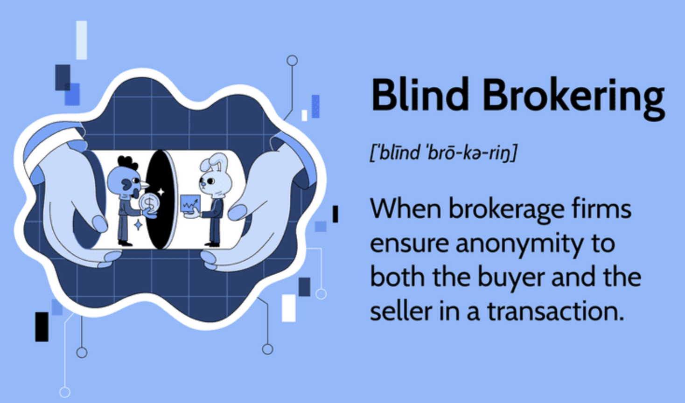

In the rapidly evolving landscape of financial markets, brokerage services have undergone significant transformation. As technology continues to advance, the methods and strategies used to conduct financial transactions have become more sophisticated and efficient. One of the most influential technological innovations in this domain is algorithmic trading. By leveraging automated systems and complex algorithms, algorithmic trading has fundamentally reshaped the execution of transactions, offering increased speed, accuracy, and the ability to handle large volumes of data.

Parallel to this technological evolution, blind brokering remains a critical component of modern brokerage services. Blind brokering ensures the anonymity of market participants during transactions, an essential feature for preserving privacy and maintaining fairness in trading activities. By withholding the identities of buyers and sellers, blind brokering minimizes the potential for market bias, allowing trades to occur based solely on price and timing considerations.



This article provides a comprehensive overview of modern brokerage services, emphasizing the roles of algorithmic trading and blind brokering. We will explore how these key elements—automation and anonymity—integrate to optimize financial transactions, ultimately enhancing the efficiency and fairness with which markets operate.

## Table of Contents

## Understanding Blind Brokering

Blind brokering is a crucial mechanism in financial markets, designed to maintain anonymity during transactions. This practice involves the use of intermediaries to execute trades, ensuring that the identities of the trading parties remain undisclosed. By preserving anonymity, blind brokering safeguards market integrity, minimizes potential biases, and contributes to fair pricing in trades.

This method is especially significant in contexts where transaction sizes or strategic intentions might influence market conditions if disclosed. Blind markets prioritize price and timing over the identities of the traders, which can lead to more impartial trading environments. The anonymization provided by blind brokering reduces the risk of manipulation and maintains competitive balance, as all traders are judged on the same criteria of price and timing rather than on their market status or size.

Blind brokering is prevalent in securities trading, where preserving the neutrality of trades is essential. It is particularly beneficial for large institutional investors who may otherwise affect market prices if their trading intentions were known. Despite its common application, there are exceptions in scenarios involving broker-dealers. When broker-dealers engage in trading using their inventories, the blind brokering principle might be bypassed. This occurs because broker-dealers, who facilitate trades by acting as both brokers and dealers, might disclose some elements of the trade as part of their dual roles.

In summary, blind brokering enhances trading fairness and market integrity by ensuring that all trades are conducted solely based on objective financial parameters, preventing unfair advantages linked to the exposure of trader identities.

## The Role of Brokerage Services in Financial Transactions

Brokerage services play a fundamental role in financial markets by serving as intermediaries that connect buyers and sellers, thus facilitating the seamless execution of trades. These services are essential in ensuring that financial transactions are conducted efficiently and effectively. As the financial landscape continues to evolve with technological advancements, brokerage services must continuously adapt to remain relevant and maintain their competitive edge.

One of the primary functions of brokerage services is to provide market [liquidity](/wiki/liquidity-risk-premium), a crucial element for the proper functioning of financial markets. Liquidity refers to the ease with which assets can be traded in the market without significantly affecting the asset's price. Broker-dealers contribute to liquidity by acting as market makers, standing ready to buy or sell securities at quoted prices. This function enables them to bridge the gap between buyers and sellers, ensuring that trades can be executed promptly and at fair prices.

To fulfill their role effectively, brokerage services employ a range of trading technologies and platforms. The rapid advancement of technology has led to the development of sophisticated trading algorithms and automated systems that brokers use to process large volumes of transactions with speed and precision. These technological tools enable brokers to enhance the efficiency of trade execution, minimize transaction costs, and offer competitive services to their clients.

Additionally, broker-dealers provide critical services such as trade settlement, custody of assets, and research and advisory services. The settlement involves ensuring that the transfer of securities and funds between buyers and sellers occurs smoothly, while custody services involve the safekeeping of clients' securities. Moreover, brokers offer research and analysis services that provide valuable insights into market trends, helping investors make informed decisions.

Adapting to technological changes also entails embracing innovative solutions like blockchain and [artificial intelligence](/wiki/ai-artificial-intelligence), which are poised to transform how brokerage services operate. Blockchain technology, for example, has the potential to enhance transparency and security in transactions, while artificial intelligence can be leveraged to analyze vast amounts of data for better trading strategies and risk management.

In conclusion, brokerage services are pivotal in fostering market liquidity and efficient trade execution. By continuously integrating technological advancements and adapting to market shifts, these services ensure the smooth operation of financial markets and meet the dynamic needs of their clients.

## Algorithmic Trading in Financial Markets

Algorithmic trading employs automated systems to execute trades based on pre-established criteria and real-time market data. This technology-driven approach allows for rapid decision-making and execution, significantly surpassing human capabilities in terms of speed and precision.

One of the core advantages of [algorithmic trading](/wiki/algorithmic-trading) is its ability to enhance the speed of transactions. Algorithms can analyze vast volumes of data within milliseconds, identifying optimal trading opportunities and executing trades almost instantaneously. This ability to act faster than the human eye can perceive provides significant competitive advantages in financial markets, where the timing of a trade can be critical to its success.

Accuracy is another critical benefit of algorithmic trading. By reducing human intervention, the likelihood of errors diminishes. Automated systems adhere strictly to predefined trading parameters and risk management protocols, ensuring consistency and discipline in trade execution. This precision contributes to the robustness of trading strategies, fostering more predictable outcomes.

The capacity to process and analyze large data volumes is particularly noteworthy. Algorithms can incorporate multifaceted datasets comprising historical prices, real-time market feeds, economic indicators, and even social media sentiment. By applying advanced statistical models and [machine learning](/wiki/machine-learning) techniques, these systems can discern patterns and forecast market trends with a higher degree of accuracy than traditional methods.

Brokers who leverage algorithmic trading can substantially improve execution outcomes for their clients. By automating transaction processes, brokers can reduce operational costs, passing these savings directly to clients. Lower costs enhance the attractiveness of brokerage services, particularly for high-frequency traders and institutional clients who rely on efficient and cost-effective trade executions.

In conclusion, algorithmic trading represents a paradigm shift in financial markets, offering enhanced speed, accuracy, and data processing capabilities. By leveraging these advantages, brokers can deliver superior outcomes to their clients and maintain competitiveness in a landscape that increasingly values technology-driven solutions.

## Integrating Algo Trading with Blind Brokering

Algorithmic trading and blind brokering together offer a robust framework for modern financial transactions, maximizing both efficiency and confidentiality. The combination of these two elements allows financial markets to function with heightened privacy, while leveraging technology to improve transaction outcomes.

Algorithmic trading involves using computer algorithms to automate the processing and execution of trading decisions. These systems can analyze large datasets, identify patterns, and execute trades within microseconds, far beyond human capability. When integrated with blind brokering, where a broker facilitates trades without revealing the identity of the counterparties, this technology ensures that trades are conducted without bias or manipulation, emphasizing fair market value based solely on supply and demand.

The synergy between algorithmic trading and blind brokering is evident in the strategic goals of modern brokerages, which seek to preserve privacy and maintain market integrity. Algorithms can be designed to optimize trading strategies while adhering to anonymity requirements. This integration supports client interests by reducing information leakage and minimizing the risk of front running, where others exploit knowledge of pending trades to their advantage.

Consider a Python example that illustrates a basic mechanism for privacy-preserving trade execution:

```python
import numpy as np

# Simulate pricing data
prices = np.random.normal(loc=50, scale=5, size=1000)

# Define a simple trading strategy
def trading_strategy(prices, threshold):
    # Blinded execution: only consider a threshold without revealing underlying data
    orders = []
    for price in prices:
        if price < threshold:
            orders.append('buy')
        elif price > threshold:
            orders.append('sell')
        else:
            orders.append('hold')
    return orders

# Execute the strategy with a threshold price
threshold_price = 50
trade_orders = trading_strategy(prices, threshold_price)

print(f"Trade orders: {trade_orders[:10]}")  # Display first 10 trade orders
```

By employing such strategies, brokers can offer comprehensive services tailored to client needs, ensuring both competitive pricing and discretion. The integration of algorithmic trading with blind brokering not only enhances efficiency but also builds client trust by prioritizing anonymity. As financial markets continue to evolve, the demand for sophisticated, privacy-preserving trading solutions is expected to grow, further solidifying the importance of combining these two methodologies.

## Challenges and Risks of Algo Trading

Algorithmic trading, while offering significant advantages, also poses certain challenges and risks that market participants must carefully navigate. One of the primary risks is the potential for system failures. As trading algorithms rely heavily on complex software and hardware infrastructures, any malfunction, bug, or downtime can lead to substantial financial losses. These failures can also lead to market disruptions, particularly if large volumes of trades execute erroneously in a short period.

Market [volatility](/wiki/volatility-trading-strategies) exacerbation is another significant risk associated with algorithmic trading. During periods of high volatility, algorithms that base decisions on historical data may not adequately respond to rapid market changes. This can lead to increased volatility as automated systems execute trades based on outdated or misinterpreted information. This feedback loop can intensify market movements, contributing to broader systemic risks. According to a study by Golub et al. (2012), the flash crash of May 6, 2010, highlighted how automated trade executions could destabilize market stability.

To mitigate these risks, brokers are required to employ robust risk management systems. This involves constant monitoring and real-time analysis of trading algorithms to identify and correct anomalies before they affect broader market operations. It is also critical to integrate stringent compliance protocols to ensure adherence to evolving regulatory frameworks. For instance, the European Union's Markets in Financial Instruments Directive II (MiFID II) imposes comprehensive regulations on high-frequency trading activities to ensure market integrity and transparency.

Cybersecurity is another crucial aspect of sustainable algorithmic trading operations. Sophisticated cyber-attacks pose a substantial threat to the integrity of trading systems, potentially leading to unauthorized transactions or breaches of sensitive financial data. To combat these threats, brokers must implement advanced cybersecurity measures, including encryption, multi-[factor](/wiki/factor-investing) authentication, and regular security audits. Python, with libraries like PyCrypto and Paramiko, can be an effective tool for developing secure trading applications.

Furthermore, adopting fail-safes is essential for minimizing the impacts of unforeseen disruptions. These can include automatic shutdown mechanisms or circuit breakers, which pause trading activities under certain conditions to prevent cascading failures. Circuit breaker mechanisms are similar to conditional prompts in a Python script:

```python
def check_market_conditions():
    # Hypothetical function to monitor market conditions
    if market_volatility > volatility_threshold:
        halt_trading()

def halt_trading():
    # Function to halt trading activities
    print("Trading halted due to high volatility.")

check_market_conditions()
```

By implementing such measures, brokers can actively manage the inherent risks of algorithmic trading and ensure its continued evolution and integration into the broader financial markets.

## The Future of Brokerage Services and Financial Transactions

The future of brokerage services and financial transactions is poised for significant transformation, largely driven by advances in artificial intelligence (AI) and machine learning. These technologies promise to deliver more adaptive and personalized trading experiences for investors. AI and machine learning algorithms can analyze vast amounts of financial data with unparalleled speed and accuracy, identifying patterns and trends that human traders might overlook. This capacity enables broker-dealers to offer increasingly customized trading strategies tailored to individual client profiles, risk preferences, and market conditions.

Broker-dealers must embrace these technologies to maintain a competitive edge and explore new market opportunities. The integration of AI and machine learning into brokerage services is expected to facilitate entry into emerging markets and the development of innovative financial products. By adopting sophisticated algorithms, broker-dealers can enhance their analytical capabilities, optimize trading strategies, and improve decision-making processes.

Sustainability and ethical trading practices are becoming increasingly important considerations in algorithm development, reflecting a growing awareness of environmental, social, and governance ([ESG](/wiki/esg-investing)) concerns. Future trading algorithms are likely to account for these factors, ensuring that trading activities align with broader societal values. This trend toward sustainability and ethical considerations is expected to influence both the strategies employed by broker-dealers and the expectations of clients, who are increasingly prioritizing responsible investment practices.

In conclusion, the ongoing integration of AI and machine learning into brokerage services will likely revolutionize the financial industry. By staying ahead of technological advancements and prioritizing sustainability and ethics, broker-dealers can ensure they remain competitive and responsive to the evolving needs of their clients.

## Conclusion

The integration of blind brokering and algorithmic trading represents a transformative shift in financial services, setting the stage for more sophisticated and secure trading environments. This fusion caters to the needs for privacy and efficiency in an era where information is power and speed is crucial. By maintaining anonymity while leveraging the power of technology, brokers can execute transactions that not only protect client identities but also optimize trade effectiveness and execution time.

Despite the challenges associated with algorithmic trading, such as system reliability and market stability issues, its advantages in improving market efficiency and service delivery are unmistakable. Algorithmic trading, when aligned with blind brokering, creates a unique value proposition by enhancing transaction confidentiality and elevating the standard of service offered to clients. Brokers are thus empowered to navigate the complex financial landscape, balancing technological advancements with traditional market practices.

The future of this integration hinges on relentless innovation and the enforcement of regulatory frameworks. Technological developments—particularly in AI and machine learning—promise to further refine and personalize trading processes. Simultaneously, robust regulatory measures ensure that these innovations foster a healthy and fair market environment. With continuous oversight and adaptation, the fusion of blind brokering and algorithmic trading is poised to make significant contributions to the evolution and stability of financial markets.

## References & Further Reading

[1]: Golub, A., Keane, J., & Poon, S.-H. (2012). ["High Frequency Trading and Mini Flash Crashes."](https://arxiv.org/abs/1211.6667) 

[2]: Van Kervel, V. (2015). ["Competition for Order Flow with Fast and Slow Traders."](https://www.jstor.org/stable/24466902) Review of Financial Studies, 28(7), 2094-2127.

[3]: Lopez de Prado, M. (2018). ["Advances in Financial Machine Learning."](https://www.amazon.com/Advances-Financial-Machine-Learning-Marcos/dp/1119482089) Wiley.

[4]: Gomber, P., Arndt, B., Lutat, M., & Uhle, T. (2011). ["High-Frequency Trading."](https://papers.ssrn.com/sol3/papers.cfm?abstract_id=1858626) Business & Information Systems Engineering, 3(2), 63-69.

[5]: Chan, E. P. (2009). ["Quantitative Trading: How to Build Your Own Algorithmic Trading Business."](https://github.com/ftvision/quant_trading_echan_book) Wiley.

[6]: Jansen, S. (2020). ["Machine Learning for Algorithmic Trading: Predictive Models to Extract Signals from Market and Alternative Data for Systematic Trading Strategies with Python."](https://www.amazon.com/Machine-Learning-Algorithmic-Trading-alternative/dp/1839217715) Packt Publishing.

[7]: Aronson, D. R. (2007). ["Evidence-Based Technical Analysis: Applying the Scientific Method and Statistical Inference to Trading Signals."](https://onlinelibrary.wiley.com/doi/book/10.1002/9781118268315) Wiley.

[8]: Mifid II. (2014). ["Markets in Financial Instruments Directive II (MiFID II)."](https://eur-lex.europa.eu/legal-content/EN/TXT/?uri=celex%3A32014L0065) European Union.