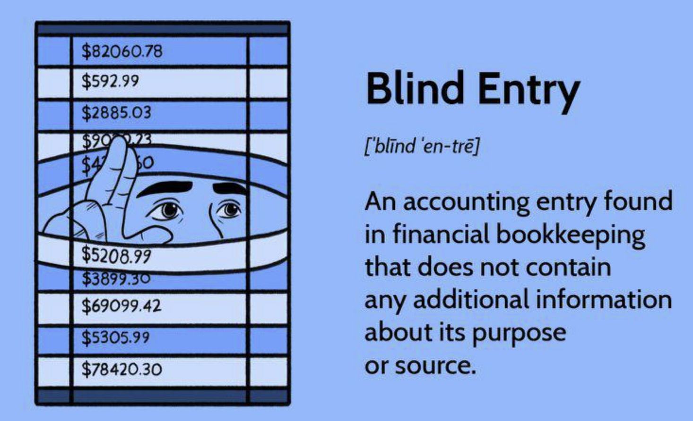

## Table of Contents

## What is a blind entry in finance?

A blind entry in finance is when someone makes an investment or a trade without fully understanding the details or risks involved. It's like taking a guess or following a tip without doing your own research. This can happen when people trust advice from others without checking the facts themselves, or when they invest in something complex that they don't fully understand.

Blind entries can be risky because they might lead to unexpected losses. If you don't know what you're getting into, you might end up investing in something that doesn't perform well or is too risky for your comfort level. It's always better to do your homework and understand what you're investing in before you make a decision. This way, you can make more informed choices and manage your money more wisely.

## How does a blind entry differ from other types of entries in trading?

A blind entry is different from other types of entries in trading because it involves making a trade without fully understanding the investment. With a blind entry, someone might follow a tip or advice without doing their own research. They might not know the details, risks, or potential rewards of the trade. This is risky because they could lose money if the investment doesn't go well.

Other types of entries, like informed entries, involve more research and understanding. With an informed entry, a trader studies the market, looks at data, and makes a decision based on what they learn. They know the risks and rewards and feel confident in their choice. This approach is generally safer because the trader has more control over their decisions and can better manage their investments.

## What are the potential risks associated with making a blind entry?

Making a blind entry in trading can be very risky. When you don't know much about what you're investing in, you might lose a lot of money. It's like going into a dark room without knowing what's inside. You could trip over something or bump into a wall. In trading, this means you might buy something that goes down in value, or you might not know about important news that could affect your investment.

Another risk is that you might get tricked by someone else. If you follow a tip without checking it, you could be following bad advice. People might tell you to invest in something that's not good, just because they want to make money themselves. This can lead to big losses for you. It's important to do your own research so you don't fall into these traps.

## Can you provide a basic example of a blind entry in a financial market?

Imagine you're at a party, and a friend tells you about a stock that's going to "go to the moon." They say everyone is buying it, and you should too. Without knowing anything about the company, its financials, or the market conditions, you decide to buy the stock just because your friend said so. This is a blind entry because you're making a decision without any real understanding or research.

In this case, you might end up losing money if the stock doesn't perform well. Maybe the company has a lot of debt or is facing legal issues that you didn't know about. If you had taken the time to look into the company, you might have decided not to invest. Blind entries like this are risky because they're based on guesses or tips rather than solid information.

## What are the key factors to consider before making a blind entry?

Before making a blind entry, it's important to think about why you're considering it. Are you just following a friend's advice or a hot tip without knowing the details? It's really helpful to take a step back and ask yourself if you understand what you're getting into. Blind entries can lead to big losses if you don't know the risks involved. So, it's a good idea to find out more about the investment, like the company's financial health or any news that might affect its value.

Another thing to consider is your own comfort level with risk. If you're not sure about something, it's better to wait and learn more before you invest. Blind entries can be exciting, but they can also be very stressful if things don't go well. It's always better to make a decision based on information rather than a guess. This way, you can feel more confident about your investment and be ready for any surprises that might come up.

## How can a trader mitigate the risks of a blind entry?

To reduce the risks of a blind entry, a trader should always do their homework before making a trade. This means looking up information about the company, checking its financial health, and understanding any news that could affect its value. By doing this, you can make a more informed decision and avoid surprises that could lead to losses. It's also a good idea to use tools like stock charts and financial reports to get a better picture of what you're investing in.

Another way to mitigate the risks is to set clear limits on how much you're willing to lose. This can be done by setting stop-loss orders, which automatically sell your investment if it drops to a certain price. This helps you control your losses and prevents a bad trade from getting worse. Additionally, it's helpful to start with small amounts of money when you're not sure about an investment. This way, if things don't go well, you won't lose too much. By taking these steps, you can make smarter choices and protect your money.

## What psychological factors influence a trader's decision to make a blind entry?

One big psychological [factor](/wiki/factor-investing) that can lead to a blind entry is the fear of missing out, or FOMO. When traders see others making money or hear about a hot tip, they might feel like they need to jump in quickly to not miss out on the gains. This fear can push them to make quick decisions without thinking things through or doing any research. They might follow the crowd without understanding what they're getting into, hoping to make easy money.

Another psychological factor is overconfidence. Some traders might think they know more than they actually do, or they might trust advice from friends or online sources too much. This overconfidence can make them believe that they can make a good trade even without all the information. They might ignore the risks and go ahead with a blind entry, thinking that they're smart enough to make it work out. This can lead to big losses if the trade doesn't go as planned.

## In what scenarios might a blind entry be considered a viable strategy?

A blind entry might be considered a viable strategy in certain situations, like when you're investing a very small amount of money that you can afford to lose. If you're just starting out and want to try trading without risking too much, a small blind entry could be a way to learn the ropes. It's like dipping your toe in the water to see how it feels. As long as you're not putting in money you need for bills or other important things, a small blind entry can be a way to test the market and gain experience.

Another scenario where a blind entry might be considered is when you're following a trusted advisor or a well-known expert. If you have a lot of trust in someone who has a good track record, you might decide to follow their advice without doing your own research. This can work out if the advisor really knows what they're doing. But even then, it's important to start with a small amount of money and keep an eye on how the investment is doing. This way, you can pull out if things start to go wrong.

## How do experienced traders typically evaluate the success of a blind entry?

Experienced traders often look at how much money they made or lost when they evaluate a blind entry. They check if the trade was successful by seeing if they ended up with more money than they started with. They also think about how the trade fits into their overall trading plan. If the blind entry was just a small part of their strategy and they didn't lose too much, they might see it as a learning experience rather than a big failure.

Another way experienced traders evaluate a blind entry is by looking at what they learned from it. Even if the trade didn't make them money, they might have learned something new about the market or about their own trading style. They think about whether the blind entry helped them understand more about the risks they're willing to take. By reflecting on these lessons, they can make better decisions in the future and avoid making the same mistakes again.

## What are some advanced techniques for optimizing blind entry strategies?

One advanced technique for optimizing blind entry strategies is to use a diversified portfolio. This means spreading your money across different investments instead of putting it all into one blind entry. By doing this, you can reduce the risk of losing everything if the blind entry doesn't work out. If one investment goes down, others might go up and balance out your losses. This way, you can still try a blind entry but with less risk because you're not putting all your eggs in one basket.

Another technique is to use stop-loss orders to manage your risk. A stop-loss order automatically sells your investment if it drops to a certain price, helping you limit your losses. This can be really helpful with blind entries because you might not know how the investment will do. By setting a stop-loss, you can protect yourself from big losses and keep more control over your money. It's like having a safety net that catches you if things start to go wrong.

## Can you discuss any historical cases where blind entries led to significant financial outcomes?

One famous example of a blind entry leading to a big financial outcome happened during the dot-com bubble in the late 1990s and early 2000s. Many people heard about new internet companies and decided to invest without really understanding them. They thought these companies would make them rich quickly. But when the bubble burst, a lot of these companies went bankrupt, and people lost a lot of money. It was a lesson in how dangerous it can be to follow the crowd without doing your own research.

Another example is the GameStop stock frenzy in early 2021. A lot of people on social media started talking about buying GameStop stock, saying it was going to go up a lot. Many people jumped in without understanding the stock or the risks involved. For a while, the stock did go up a lot, and some people made money. But then it crashed, and a lot of people who bought in late lost money. This showed how a blind entry based on social media hype can lead to big wins or big losses, depending on when you get in and out.

## How does regulatory oversight impact the use of blind entries in professional trading?

Regulatory oversight can make it harder for professional traders to use blind entries. Rules from places like the Securities and Exchange Commission (SEC) or other financial regulators are there to protect investors. These rules say that traders need to know a lot about what they're investing in and that they can't just follow tips without doing their homework. If traders make blind entries, they might break these rules and get into trouble. So, it's important for professional traders to follow the rules and do their research to avoid problems with regulators.

Even though it's risky, some professional traders might still try to use blind entries, but they have to be very careful. They need to make sure they're not breaking any laws and that they're not putting their clients' money at risk. Regulators keep a close eye on the market to make sure everyone is playing fair. If a trader gets caught making blind entries that hurt their clients or the market, they could face big fines or even lose their license to trade. So, while blind entries might seem like a quick way to make money, the risks and the chance of getting in trouble with regulators make it a dangerous strategy for professional traders.

## References & Further Reading

[1]: Bergstra, J., Bardenet, R., Bengio, Y., & Kégl, B. (2011). ["Algorithms for Hyper-Parameter Optimization."](https://dl.acm.org/doi/10.5555/2986459.2986743) Advances in Neural Information Processing Systems 24.

[2]: ["Advances in Financial Machine Learning"](https://www.amazon.com/Advances-Financial-Machine-Learning-Marcos/dp/1119482089) by Marcos Lopez de Prado

[3]: ["Evidence-Based Technical Analysis: Applying the Scientific Method and Statistical Inference to Trading Signals"](https://www.amazon.com/Evidence-Based-Technical-Analysis-Scientific-Statistical/dp/0470008741) by David Aronson

[4]: ["Machine Learning for Algorithmic Trading"](https://github.com/stefan-jansen/machine-learning-for-trading) by Stefan Jansen

[5]: ["Quantitative Trading: How to Build Your Own Algorithmic Trading Business"](https://github.com/LucindaYa/quant-resources/blob/master/Quantitative%20Trading%20How%20to%20Build%20Your%20Own%20Algorithmic%20Trading%20Business.pdf) by Ernest P. Chan