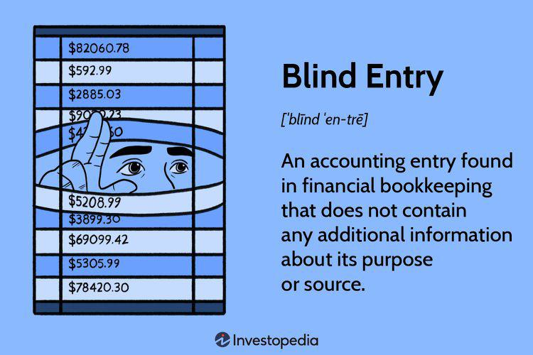

In the rapidly evolving world of finance, trading strategies have significantly progressed, primarily driven by technological advancements. The nexus of algorithmic trading and finance has birthed innovative strategies like the blind entry finance trading strategy. This strategy exemplifies the role of algorithm-driven methods in revolutionizing trading practices.

Algorithmic trading, often referred to as algo trading, employs algorithms—complex mathematical models executed by sophisticated software—to make critical trading decisions. These algorithms analyze vast datasets to predict market trends and execute trades rapidly and efficiently. Among the diverse strategies within algorithmic trading, blind entry stands out by minimizing the human element in decision-making and relying heavily on predefined algorithmic parameters. This minimizes the risk of emotional bias and errors typically associated with human traders.



Blind entry strategies are increasingly shaping the future of finance by simplifying decision-making processes. These strategies aim to capitalize on market opportunities by executing trades based on pre-formulated rules and conditions, effectively reducing the reliance on extensive fundamental analysis or human intuition.

The integration of technology in these strategies enhances their capability to assess market conditions and automatically execute trades. The continuous advancement of technology, including machine learning and artificial intelligence, holds the promise to make blind entry strategies even more proficient and adaptable to market dynamics.

As trading practices transform through the adoption of algorithms and automation, the financial sector is on the cusp of an unprecedented change. The effectiveness of blind entry strategies in financial markets points to a future where human oversight and automated systems synergize to push the limits of traditional trading methodologies.

This article explores the fundamentals of algorithmic trading and evaluates how blind entry strategies are shaping the future of the financial landscape. Through a comprehensive examination of these strategies and the role of technology, we uncover the transformative potential of trading practices that leverage algorithms and automation.

## Table of Contents

## Understanding Blind Entry in Finance

Blind entry in finance involves making trading decisions primarily through predefined algorithmic parameters rather than through extensive human analysis at each step. By employing these algorithms, traders aim to swiftly navigate markets, capitalizing on opportunities that arise, without being hindered by the biases and slower response times inherent in human judgment. This approach hinges on a substantial understanding of market dynamics, embedded within algorithms designed to automatically execute trades under specific conditions.

### Algorithmic Design and Execution

Blind entry strategies simplify the decision-making process by automating trade executions through complex coding structures. These strategies are typically programmed in languages such as Python, C++, or Java due to their robust libraries and computational efficiency. The algorithms process a myriad of data points, including price movements, trading volumes, and historical trends, to make informed trading decisions.

A simple algorithm might employ a moving average crossover strategy, which generates buy and sell signals based on the intersection of short-term and long-term moving averages. For example, consider a Python implementation of a basic moving average crossover:

```python
def moving_average(data, window):
    return data.rolling(window=window).mean()

data['Short_MA'] = moving_average(data['Close'], short_window)
data['Long_MA'] = moving_average(data['Close'], long_window)
data['Signal'] = np.where(data['Short_MA'] > data['Long_MA'], 1, 0)
data['Position'] = data['Signal'].diff()
```

Such strategies rely on streaming data to trigger trades when specified conditions are met, thereby reducing the potential for human error or emotional decision-making.

### Intended Outcomes and Data Utilization

The goal of blind entry trading is to achieve consistent profitability by exploiting market inefficiencies with speed and precision. Algorithms can quickly identify and respond to shifts, thus enabling traders to capture profits on minor price discrepancies or short-lived trends. The effectiveness of these strategies depends heavily on accurate data inputs and the precision of algorithmic logic.

### Risks and Challenges

Despite their potential benefits, blind entry strategies come with distinct risks. The primary concern is the potential overreliance on automated systems. Algorithms are only as effective as the data and assumptions they are based on; thus, they may falter in unpredictable or rapidly changing market conditions. Furthermore, excessive dependency on technology can result in vulnerabilities to technical failures or cyber-attacks, which may lead to significant financial losses.

Moreover, blind entry strategies do not incorporate qualitative elements of trading, such as geopolitical events or sudden market sentiment shifts. These factors can lead to algorithmic errors if not adequately accounted for in the model. Hence, while these strategies can enhance trading efficiency, they necessitate vigilant monitoring and periodic updates to remain effective and secure in an ever-evolving market landscape.

## The Role of Algorithms in Trading

Algorithms play a crucial role in shaping the trading landscape, serving as the foundation for a variety of modern trading strategies. By leveraging sophisticated mathematical models, these algorithms can rapidly analyze market trends and execute trades within milliseconds, a capability that significantly enhances trading efficiency and performance.

One of the most prominent applications of algorithms in trading is high-frequency trading ([HFT](/wiki/high-frequency-trading-strategies)). HFT systems use complex algorithms to analyze multiple markets and execute a large number of orders at very high speeds. The primary goal of HFT is to capitalize on small price discrepancies that are often imperceptible to human traders. Another advanced form of trading is [arbitrage](/wiki/arbitrage), where algorithms identify and exploit price differences of the same asset across different markets or exchanges, essentially buying low in one market and selling high in another. Trend-following strategies, another popular algorithm-driven approach, rely on the analysis of historical price data to identify potential buy or sell signals based on established market trends.

The implementation of these algorithms typically involves coding languages that are known for their speed and efficiency in handling complex computations. Python, with its extensive libraries like NumPy and Pandas, is widely used for developing trading algorithms due to its simplicity and robust capabilities in data analysis. C++ is also favored for its speed, offering the ability to execute high-frequency trades with minimal latency. Here is an example of a simple moving average crossover strategy implemented in Python:

```python
import pandas as pd
import numpy as np

# Sample data: historical prices of an asset
data = {'Price': [100, 102, 101, 103, 105, 107, 106, 108, 110]}
df = pd.DataFrame(data)

# Calculate moving averages
df['SMA_5'] = df['Price'].rolling(window=5).mean()
df['SMA_8'] = df['Price'].rolling(window=8).mean()

# Generate trading signals
df['Signal'] = np.where(df['SMA_5'] > df['SMA_8'], 1, 0)

print(df)
```

Risk management is another critical aspect of [algorithmic trading](/wiki/algorithmic-trading). Algorithms can incorporate various risk management techniques like diversification, which involves spreading investments across different assets to reduce risk. Additionally, stop-loss orders are frequently coded into trading algorithms to automatically sell a security once it reaches a certain price, thus limiting potential losses. Implementing such risk management tactics helps in controlling the inherent risks associated with algorithmic trading.

Overall, algorithms facilitate a disciplined approach to trading by executing predefined strategies without emotional interference, paving the way for more systematic and potentially profitable trading activities.

## Pros and Cons of Blind Entry Finance Trading Strategy

Blind entry finance trading strategies present distinct advantages and disadvantages, impacting their practicality and effectiveness in financial markets. A key benefit of these strategies is their ability to mitigate emotional biases. By adhering strictly to algorithmic rules, traders can maintain consistency and discipline, often difficult to achieve in manual trading where emotional decisions can influence outcomes. This automated discipline ensures that trades are executed based on predefined criteria, reducing the risk of impulsive or irrational decision-making.

Moreover, the speed and efficiency offered by blind entry strategies can capture opportunities that may be missed in manual trading. Algorithms can analyze and act upon market conditions with remarkable speed, executing trades in milliseconds. This rapid execution allows traders to exploit fleeting market opportunities, potentially increasing profitability. By processing large volumes of data and identifying patterns more quickly than a human trader, these algorithms can operate on multiple markets concurrently, maximizing trading potential.

Nevertheless, the reliance on automated systems comes with significant drawbacks. One major concern is the potential for system failures. Trading platforms or networks can experience glitches, resulting in unintended trades or the halting of execution, often incurring financial losses. Algorithmic errors are another risk, where flaws in the algorithm’s design or logic lead to unfavorable trades. Such errors necessitate rigorous testing and validation of algorithms to minimize unintended consequences.

Additionally, blind entry strategies can suffer from a lack of human judgment. While algorithms excel at following logic and rules, they may not adapt well to rapidly changing market scenarios or unexpected events. Human intuition and experience can still play a crucial role in assessing nuanced market signals that algorithms may overlook or misinterpret. This shortfall highlights the importance of periodic human oversight and intervention to recalibrate strategies in line with evolving market dynamics.

Real-world applications illustrate these pros and cons. Consider the 2010 "Flash Crash," where algorithmic trading systems contributed to a dramatic, albeit brief, drop in U.S. equity markets. On the one hand, algorithms were able to execute numerous trades swiftly; on the other, the lack of human oversight exacerbated market [volatility](/wiki/volatility-trading-strategies). Conversely, some hedge funds successfully leverage blind entry strategies, reporting consistent gains through rigorous algorithm management and adaptation to market trends.

In conclusion, while blind entry strategies offer efficiency and discipline by eliminating emotional biases, they demand careful monitoring and the integration of human judgment to adapt to market changes and mitigate risks. Successful implementation of these strategies requires a balanced approach where technological efficiency is complemented by human expertise to navigate the complex financial landscape.

## Future Trends in Algorithmic Trading

The future of algorithmic trading is anticipated to be significantly shaped by advancements in [artificial intelligence](/wiki/ai-artificial-intelligence) (AI) and [machine learning](/wiki/machine-learning) (ML). These technological innovations are progressively transforming trading methodologies, enabling more sophisticated and adaptable strategies. AI's capacity to process vast amounts of data with high-speed precision allows for the enhancement of blind entry strategies, making them more nuanced and capable of adapting to dynamic market conditions.

Blind entry strategies, which rely on pre-set algorithmic parameters, can substantially benefit from AI's adaptive learning capabilities. As AI systems become more adept at recognizing patterns and predicting market movements, these strategies are expected to gain an enhanced ability to mitigate risks and capitalize on opportunities. For instance, [reinforcement learning](/wiki/reinforcement-learning), a subset of ML, can be employed to adapt trading parameters based on historical data performance, optimizing outcomes over time. Below is a simple Python example demonstrating how reinforcement learning might be implemented for basic strategy adjustments:

```python
import numpy as np

# Example reward and action policy
rewards = np.random.randn(100)  # Simulated financial returns
sma_short = 14
sma_long = 50

actions = {'hold': 0, 'buy': 1, 'sell': -1}

def evaluate_strategy(actions, rewards):
    return np.cumsum(rewards[actions == 1]) - np.cumsum(rewards[actions == -1])

# Simple reinforcement learning loop
for episode in range(10):  # number of iterations
    # Simulate strategy using short-term vs long-term moving average
    action_taken = [actions['buy'] if sma_short > sma_long else actions['sell'] for _ in range(rewards.size)]
    total_return = evaluate_strategy(np.array(action_taken), rewards)
    print(f'Episode {episode+1}: Total Return: {total_return[-1]}')
```

With the emergence of decentralized finance (DeFi) platforms, algorithmic trading is venturing into new terrains. DeFi platforms offer a decentralized infrastructure for financial transactions, providing opportunities for deploying algorithms in peer-to-peer environments. This decentralization can lead to increased transparency and reduced transaction costs, while also posing challenges related to security and market regulation.

Regulatory changes and ethical considerations are critical factors guiding the development of algorithmic strategies. Emerging legislation is focusing on ensuring transparency, fairness, and accountability in trading systems. These regulatory frameworks aim to curb the risks associated with high-frequency and algorithmic trading, such as market manipulation and systemic instability. Ethical algorithms, which incorporate fairness and transparency by design, are likely to become central to future trading systems.

In this evolving landscape, the coexistence of human oversight and automation is essential. While algorithms can process complex data sets and execute trades at unprecedented speeds, human intuition and experience remain crucial in interpreting broader market contexts and managing unforeseen events. Thus, the synergy between human and machine is expected to redefine the boundaries of algorithmic trading, striking a balance between efficiency and prudent risk management.

## Conclusion

Blind entry finance trading strategies represent a significant shift in the financial markets, driven fundamentally by the integration of algorithmic systems. These strategies capitalize on the power of automation and computational precision, offering major advantages in terms of speed and efficiency. Automated systems execute trades quickly, capturing market opportunities that may be missed by manual trading processes. However, while the benefits are clear, it is crucial to address the risks and ethical considerations that accompany these strategies. 

The reliance on algorithmic trading introduces the potential for systemic risks if not carefully monitored. Algorithmic errors, system failures, and the lack of human oversight can lead to unintended consequences. Additionally, ethical implications such as transparency, fairness, and the potential for market manipulation must be thoroughly examined and regulated. 

The unrelenting progress of technology indicates that trading strategies will continue to become more complex. Advances in artificial intelligence and machine learning provide the tools for developing more adaptive and nuanced blind entry mechanisms. However, the increased sophistication of these systems requires that traders and investors remain informed and proactive. Continuous education and adaptation are essential to effectively utilizing these strategies while managing the inherent risks.

Ultimately, the convergence of finance and technology creates a landscape of both opportunity and challenge. Blind entry strategies are at the forefront of this evolution, signifying a need for vigilant adaptation and oversight to fully harness their potential while safeguarding the integrity of financial markets.

## References & Further Reading

[1]: Bergstra, J., Bardenet, R., Bengio, Y., & Kégl, B. (2011). ["Algorithms for Hyper-Parameter Optimization."](https://dl.acm.org/doi/10.5555/2986459.2986743) Advances in Neural Information Processing Systems 24.

[2]: ["Advances in Financial Machine Learning"](https://www.amazon.com/Advances-Financial-Machine-Learning-Marcos/dp/1119482089) by Marcos Lopez de Prado

[3]: ["Evidence-Based Technical Analysis: Applying the Scientific Method and Statistical Inference to Trading Signals"](https://www.amazon.com/Evidence-Based-Technical-Analysis-Scientific-Statistical/dp/0470008741) by David Aronson

[4]: ["Machine Learning for Algorithmic Trading"](https://github.com/stefan-jansen/machine-learning-for-trading) by Stefan Jansen

[5]: ["Quantitative Trading: How to Build Your Own Algorithmic Trading Business"](https://github.com/LucindaYa/quant-resources/blob/master/Quantitative%20Trading%20How%20to%20Build%20Your%20Own%20Algorithmic%20Trading%20Business.pdf) by Ernest P. Chan