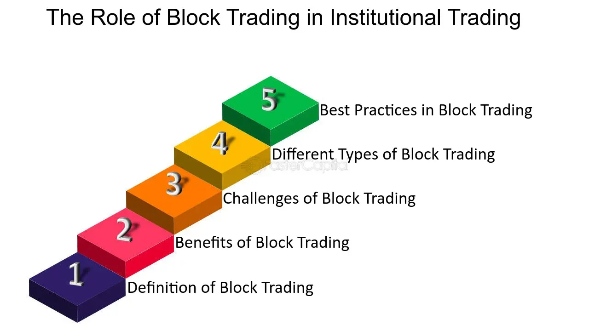

## Table of Contents

## What is a block in the context of blockchain technology?

In blockchain technology, a block is like a page in a notebook where you write down information. Each block contains a list of transactions or other data that people want to record. Once a block is full, it gets added to the chain of blocks, which is why it's called a blockchain. Each block has a special code called a hash, which is like a unique fingerprint for that block. This hash helps keep the blockchain secure and makes sure no one can change the information in the blocks.

When a new block is added to the blockchain, it connects to the previous block using its hash. This creates a chain of blocks where each block depends on the one before it. If someone tries to change the information in a block, the hash would change, and it would no longer match the next block in the chain. This makes it very hard for anyone to cheat or change the records without everyone noticing. So, blocks are important because they help keep the blockchain safe and trustworthy.

## How are blocks created in a blockchain?

Blocks in a blockchain are created by special computers called miners or validators, depending on the type of blockchain. When people want to add new information, like transactions, to the blockchain, they send it to these miners or validators. The miners or validators gather these pieces of information into a block. They then have to solve a tricky puzzle or follow certain rules to prove that the block is valid. This process is called mining or validation.

Once a miner or validator successfully solves the puzzle or follows the rules, they can add the new block to the blockchain. The block gets a special code called a hash, which is like a unique fingerprint for that block. This hash links the new block to the previous block, creating a chain. After the block is added, the information in it becomes part of the permanent record of the blockchain. This process keeps repeating as new information comes in, and new blocks are created and added to the chain.

## What information is typically included in a block?

A block in a blockchain usually has three main parts: the block header, the list of transactions, and the block size. The block header is like the cover of a book. It has important information like the block's version, a special code called a hash, and the hash of the block that came before it. It also has a timestamp, which tells when the block was made, and a target value that helps with mining.

The list of transactions is the main part of the block. It's like the pages inside the book, where all the important records are kept. Each transaction has details like who sent money, who received it, and how much was sent. These transactions are what people want to add to the blockchain, like buying something or sending money to a friend.

The block size tells how big the block is, which helps keep the blockchain organized. Sometimes, a block might also have extra information, like a special note called a nonce that miners use to solve puzzles. All these parts work together to make sure the block is valid and can be added to the blockchain safely.

## What are the benefits of using blocks in blockchain technology?

Using blocks in blockchain technology helps keep information safe and organized. Each block is like a special container that holds a group of transactions or other data. When a block is full, it gets added to the chain of blocks, making sure that the information stays in the right order. This makes it easy for everyone to see and check the records, like looking at pages in a book. By using blocks, the blockchain stays neat and tidy, which helps people trust the information they see.

Another big benefit of using blocks is that they help keep the blockchain secure. Each block has a special code called a hash, which is like a unique fingerprint. This hash connects each block to the one before it, creating a chain that is hard to break. If someone tries to change the information in a block, the hash would change, and it would not match the next block anymore. This makes it very difficult for anyone to cheat or change the records without everyone noticing. So, blocks help make the blockchain a safe and reliable way to keep important information.

## How does the concept of blocks contribute to the security of a blockchain?

Blocks help make a blockchain secure by using something called a hash. A hash is like a special code or fingerprint for each block. When a new block is added to the blockchain, it gets its own hash and also includes the hash of the block that came before it. This creates a chain where each block is linked to the one before it. If someone tries to change the information in a block, the hash of that block would change. Because the next block in the chain includes the old hash, it would no longer match, and everyone would know something was changed. This makes it very hard for anyone to cheat or change the records without being caught.

Another way blocks help with security is by making it difficult to change the blockchain's history. Since each block depends on the one before it, you would have to change all the blocks that come after it to hide any changes. This is a lot of work and requires a lot of computer power. In most blockchains, many computers around the world are working together to check and add new blocks. If someone tried to change a block, they would need to control most of these computers, which is very hard to do. So, by using blocks, the blockchain stays safe and trustworthy, making it a good way to keep important information secure.

## What is the role of miners in creating and validating blocks?

Miners are special computers that help create and add new blocks to a blockchain. When people want to add new information, like transactions, to the blockchain, they send it to the miners. The miners collect these pieces of information and put them into a block. To add the block to the blockchain, miners have to solve a tricky puzzle. This puzzle is hard to solve but easy to check, which helps keep the blockchain safe. Once a miner solves the puzzle, they can add the new block to the blockchain and get a reward, usually in the form of the blockchain's [cryptocurrency](/wiki/cryptocurrency).

Miners also help make sure that the blocks are valid and that no one is cheating. After a miner adds a new block, other miners check the block to see if it follows all the rules. If it does, they agree to add it to the blockchain. If it doesn't, they won't accept it. This checking process helps keep the blockchain secure and trustworthy. By working together, miners make sure that the information in the blockchain is correct and that no one can change it without everyone knowing.

## How do blocks affect the scalability of blockchain networks?

Blocks play a big role in how well a blockchain can handle lots of information and transactions. Each block can only hold a certain amount of data, and it takes time to add a new block to the blockchain. If too many people want to add information at the same time, it can slow down the whole system. This is because miners need to solve puzzles to add new blocks, and if the blocks are full, new transactions have to wait for the next block. This can make the blockchain less scalable, meaning it can't handle as many transactions quickly as it grows.

To make blockchains more scalable, some people try to make the blocks bigger or have them added more often. Bigger blocks can hold more transactions, but they also take longer to check and add to the chain. Adding blocks more often can help process transactions faster, but it can also make the blockchain harder to keep secure. So, finding the right balance is important. Different blockchains try different ways to improve scalability, like using special techniques or adding more layers to handle transactions off the main chain. This helps make the blockchain more able to grow and handle more users and transactions without slowing down too much.

## What are block rewards and how do they incentivize block creation?

Block rewards are special prizes that miners get when they add a new block to the blockchain. These rewards are usually given in the form of the blockchain's own cryptocurrency, like Bitcoin. When a miner solves the tricky puzzle needed to add a new block, they get to keep the block reward. This reward is a way to say thank you for the hard work the miner did to help keep the blockchain running smoothly.

The block reward is important because it gives miners a reason to keep working on the blockchain. Without the reward, miners might not want to spend their time and computer power solving puzzles. By getting a reward for each block they add, miners are encouraged to keep the blockchain growing and secure. This helps make sure that new blocks are always being added, and the blockchain keeps working well for everyone who uses it.

## How can the size of a block impact the performance of a blockchain?

The size of a block can really affect how fast and well a blockchain works. If blocks are bigger, they can hold more transactions, which means the blockchain can handle more information at once. This can be good because it makes the system more efficient and able to process more transactions quickly. But, bigger blocks also take longer for miners to check and add to the chain. This can slow down the whole system because everyone has to wait longer for new blocks to be added.

On the other hand, if blocks are smaller, they can be added to the blockchain faster because they're easier for miners to check. Smaller blocks mean that new information can be added more often, which can make the blockchain feel faster and more responsive. But, smaller blocks can also mean that the blockchain can't handle as many transactions at once, which might make it less useful for busy networks. So, finding the right size for blocks is important to keep the blockchain working well for everyone.

## What are some common trading signals related to block data in cryptocurrency markets?

In cryptocurrency markets, people often look at block data to find trading signals. One common signal is the number of transactions in a block. If there are a lot of transactions, it might mean that more people are using the cryptocurrency, which could be a good sign for its value. Another signal is the block size. If blocks are getting bigger, it might show that the network is busy and that more people want to use it. This could also be seen as a positive sign for the cryptocurrency's future.

Another important signal is the block time, which is how long it takes to add a new block to the blockchain. If the block time is getting shorter, it might mean that the network is working faster and can handle more transactions. This can be a good sign for traders. On the other hand, if the block time is getting longer, it might show that the network is slowing down, which could be a warning sign. By watching these signals, traders can get a better idea of what might happen next with the cryptocurrency's price.

## How can advanced analytics on block data provide insights into market trends?

Advanced analytics on block data can help people see what's happening in the cryptocurrency market. By looking at things like how many transactions are in each block, how big the blocks are, and how long it takes to add new blocks, analysts can spot patterns and trends. For example, if the number of transactions is going up, it might mean more people are using the cryptocurrency, which could push the price up. On the other hand, if the block size is getting smaller, it might show that fewer people are using the network, which could be a sign that the price might go down.

These insights can help traders make better decisions. If analysts see that the block time is getting shorter, it might mean the network is working faster and can handle more transactions. This could be a good sign for the cryptocurrency's future, and traders might want to buy more. But if the block time is getting longer, it could mean the network is slowing down, which might make traders think about selling. By using advanced analytics on block data, people can get a clearer picture of what's happening in the market and make smarter choices about when to buy or sell.

## What are the future developments or proposed changes to block structures in blockchain technology?

In the future, people who work on blockchain technology are thinking about ways to make blocks better. One idea is to change the size of blocks. Some want to make blocks bigger so they can hold more transactions. This could help the blockchain handle more information and work faster. But, bigger blocks might take longer to check and add to the chain, so it's a tricky balance. Another idea is to use something called "sharding," where the blockchain is split into smaller pieces. Each piece, or shard, can work on its own and handle its own blocks. This could make the whole system faster and able to handle more users.

Another proposed change is to use different ways to add blocks to the blockchain. Right now, many blockchains use a method called "proof of work," where miners solve hard puzzles to add new blocks. But this can use a lot of energy. So, some people are looking at other methods like "proof of stake," where people who own more of the cryptocurrency get to add new blocks. This could be more energy-efficient and help the blockchain grow faster. These changes could make blockchains more useful and easier for more people to use, but they need to be tested carefully to make sure they keep the blockchain safe and trustworthy.

## What are trading signals and what is their significance?

Trading signals are pivotal components in modern trading strategies, serving as indicators derived from technical analysis, fundamental data, or sentiment analysis to suggest buying or selling financial assets. These signals play a crucial role in decision-making, helping traders to navigate complex and volatile markets effectively.

Technical indicators are a primary source of trading signals, providing insights into market trends and potential price movements. Among the most commonly used technical indicators are Moving Averages and the Relative Strength Index (RSI). Moving Averages smooth out price data by creating a constantly updated average price, which can help identify the direction of the trend. For example, a simple moving average (SMA) is calculated as follows:

$$
\text{SMA} = \frac{P_1 + P_2 + \ldots + P_n}{n}
$$

where $P_1, P_2, \ldots, P_n$ are the closing prices of the asset over a specified number of periods $n$.

The RSI, on the other hand, is a [momentum](/wiki/momentum) indicator that measures the speed and change of price movements. It is typically used to identify overbought or oversold conditions in the market. The RSI is calculated using the formula:

$$
\text{RSI} = 100 - \left(\frac{100}{1 + \frac{\text{Average Gain}}{\text{Average Loss}}}\right)
$$

Fundamental analysis contributes to trading signals by evaluating broader economic indicators, corporate earnings reports, and relevant news events that might impact the price of assets. For instance, changes in interest rates, inflation reports, and shifts in trade policies can provide signals for potential market movement.

Trading signals are integral to [algorithmic trading](/wiki/algorithmic-trading) strategies as they offer precise execution points, helping to automate trading decisions. By incorporating these signals into algorithms, traders can enhance the accuracy of their strategies and optimize trade execution. This becomes particularly advantageous in volatile markets, where quick decision-making is essential to capitalize on short-lived trading opportunities.

The effective use of trading signals, therefore, involves a combination of technical analysis, fundamental insights, and sentiment awareness. This holistic approach ensures a more comprehensive understanding of the market, thereby improving predictive accuracy and enabling more informed trading decisions. As financial markets continue to evolve, the role of trading signals is expected to grow, further enhancing the capabilities of algorithmic trading systems.

## References & Further Reading

[1]: Narayanan, A., Bonneau, J., Felten, E., Miller, A., & Goldfeder, S. (2016). ["Bitcoin and Cryptocurrency Technologies: A Comprehensive Introduction."](https://press.princeton.edu/books/hardcover/9780691171692/bitcoin-and-cryptocurrency-technologies) Princeton University Press.

[2]: Cai, Y. (2018). ["The State of Blockchain Adoption in the Financial Services Sector."](https://www.sciencedirect.com/science/article/pii/S0268401219310928) IEEE 20th International Conference on High Performance Computing and Communications.

[3]: Lopez de Prado, M. (2018). ["Advances in Financial Machine Learning."](https://www.amazon.com/Advances-Financial-Machine-Learning-Marcos/dp/1119482089) Wiley.

[4]: Gomber, P., Koch, J.-A., & Siering, M. (2017). ["Digital Finance and FinTech: Current Research and Future Research Directions."](https://link.springer.com/content/pdf/10.1007/s11573-017-0852-x.pdf) Journal of Information Systems.

[5]: Treleaven, P., Galas, M., & Lalchand, V. (2013). ["Algorithmic Trading Review."](https://dl.acm.org/doi/10.1145/2500117) Communications of the ACM.

[6]: Nakamoto, S. (2008). ["Bitcoin: A Peer-to-Peer Electronic Cash System."](https://nakamotoinstitute.org/library/bitcoin/) Bitcoin.org Whitepaper.

[7]: Yermack, D. (2017). ["Corporate Governance and Blockchains."](https://econpapers.repec.org/RePEc:oup:revfin:v:21:y:2017:i:1:p:7-31.) Review of Finance.

[8]: Clark, D., & Lombardi, S. (2019). ["Algorithmic Trading and the Demand for Speed."](https://www.semanticscholar.org/paper/Algorithmic-Pricing-and-Competition%3A-Empirical-from-Assad-Clark/6112327ed660dffb7145d5c3960aa41ca9e43183) Applied Economics Letters.

[9]: Jansen, S. (2020). ["Machine Learning for Algorithmic Trading."](https://github.com/stefan-jansen/machine-learning-for-trading) Packt Publishing.