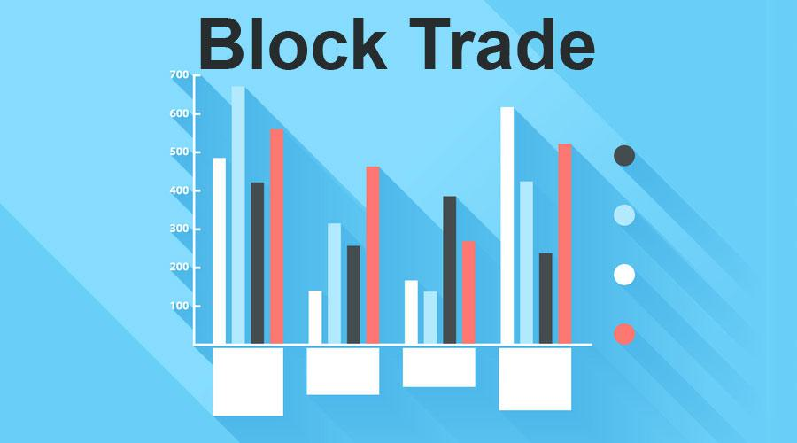

Blockchain and algorithmic trading represent significant advancements in financial technology, each revolutionizing the dynamics of market interactions. Blockchain, as a groundbreaking development, manages large transactions through its block structure, introducing a new level of transparency and security. This decentralized ledger technology records transactions in immutable blocks, each connected to the previous one, ensuring that data integrity and transaction history remain intact. This structural transparency is particularly beneficial in financial systems where security and trust are paramount.

Algorithmic trading, often called algo trading, employs sophisticated algorithms to automate trading decisions, significantly reducing human intervention and potential error. These algorithms process vast datasets at high speeds, executing trades based on pre-defined criteria such as price, timing, and market conditions. The result is a more precise and efficient execution of trades, which is essential for capitalizing on market opportunities and for mitigating risks associated with rapid market fluctuations.



This article examines the synergy between blockchain technology and algorithmic trading, focusing on the benefits blockchain blocks bring to trading operations, the role of trading signals, and how algorithmic strategies capitalize on these technological advancements. The discussion emphasizes the integration of blockchain, which can fundamentally alter the infrastructure of financial transactions, enhancing both the speed and security of trade execution.

Through this exploration, readers are provided with insights into the mechanics, benefits, and future prospects of incorporating blockchain with algorithmic trading. As these technologies continue to evolve, their combined power is poised to shape the financial landscape, heralding a new era of trading characterized by increased efficiency, security, and accuracy.

## Table of Contents

## Understanding Blockchain Blocks

Blockchain technology functions by organizing transaction data into a series of blocks, each linked to its predecessor, thus creating a robust and secure chain. Each block encapsulates several critical elements that ensure its integrity and usefulness in diverse applications, particularly in financial trading. A core component of every blockchain block is the cryptographic hash, a unique identifier generated from the block's contents, which ensures data consistency and prevents tampering. If even a tiny piece of the data in the block is altered, the hash changes, providing a reliable mechanism for data verification. This cryptographic feature is fundamental in preserving the transparency and trustworthiness of the blockchain.

In addition to the cryptographic hash, each block contains a timestamp, indicating the exact time at which the block was created. This serves an essential role in maintaining the chronological order of transactions, thereby enabling efficient tracking and auditing of all recorded activities. The transaction data itself reflects all the specific exchanges and interactions validated by the network, establishing a permanent and immutable record of events.

The utility of blockchain blocks is particularly evident in trading environments, where high-[volume](/wiki/volume-trading-strategy) transactions demand quick verification and execution. The structured linkage of blocks facilitates the simultaneous processing of multiple transactions, significantly enhancing speed and efficiency. This is vital for maintaining the fluidity and responsiveness of trading systems, where delays can lead to substantial financial consequences.

The decentralized nature of blockchain technology is another critical advantage, offering increased security against fraud and unauthorized manipulation. Unlike traditional centralized systems, a blockchain doesn't rely on a single point of control or failure. Instead, it distributes data across a network of nodes, each maintaining a complete copy of the blockchain. This architectural feature minimizes the risk of data breaches, making it particularly advantageous for executing large-scale trades where security is paramount.

As blockchain technology continues to advance, its integration into trading systems is expected to increase. The perpetual evolution of blockchain is anticipated to bolster both the security and speed of transaction processing. This growth will likely spur further innovation, opening up new possibilities for optimized and reliable trading frameworks that leverage the inherent strengths of blockchain blocks.

## Advantages of Blockchain in Trading

The integration of blockchain technology into trading systems brings significant advantages that transform market operations. One of the primary benefits is the heightened transparency it provides. Blockchain records all transactions on a public or permissioned ledger, allowing for a clear, accessible trail of trading activities. This transparency is essential for fostering trust among market participants and ensuring accountability.

The decentralized nature of blockchain technology significantly reduces the reliance on intermediaries traditionally involved in trade execution and settlement processes. By cutting out these middle [agents](/wiki/agents), blockchain minimizes costs and reduces the time required for transaction processing. This efficiency gains are particularly crucial in high-frequency trading environments where speed is a critical [factor](/wiki/factor-investing).

Blockchain technology also enhances the integrity of financial records by maintaining an immutable ledger. Once information is recorded within a block, it cannot be altered without consensus from the network, providing a robust mechanism for compliance and audit processes. This immutability is invaluable for regulatory reporting and in resolving discrepancies in trading transactions.

Furthermore, blockchain facilitates rapid verification and settlement of trades. By streamlining these processes, blockchain technology reduces the risk of counterparty defaults, as settlement times are significantly shortened. This security enhancement is particularly beneficial in mitigating risks associated with large and complex transactions.

Overall, these advantages contribute to increased market efficiency, making blockchain an appealing solution for institutional-level block trades. Institutions can leverage blockchain to achieve faster, cheaper, and more secure trading operations, ultimately enhancing their competitiveness in the financial markets.

## Algorithmic Trading: Components and Strategies

Algorithmic trading employs predefined sets of instructions, known as algorithms, which dictate when and how trades should be executed based on various market factors such as time, price, volume, and other intricate conditions. This approach minimizes human intervention, thereby reducing the likelihood of errors associated with manual trading. Three major components often used in these strategies are market orders, limit orders, and stop-loss orders. 

A market order is executed immediately at the current market price, ensuring the trade is completed but without price certainty. This is advantageous for traders looking to enter or [exit](/wiki/exit-strategy) positions quickly. Conversely, a limit order sets a specific price threshold; the trade is only executed if the market reaches this price, giving traders control over execution price but not timing. Stop-loss orders are designed to limit an investor's loss on a security position. By specifying a price point at which the order becomes a market order, stop-loss mechanisms help in managing risk effectively.

Common [algorithmic trading](/wiki/algorithmic-trading) strategies include:

1. **Trend-following**: This strategy exploits market trends using technical indicators to discern the direction and momentum of asset prices. A simple implementation might involve moving averages, where a buy signal is generated when a short-term moving average crosses above a long-term moving average.

    ```python
    short_window = 40
    long_window = 100

    signals = pd.DataFrame(index=stock_data.index)
    signals['short_mavg'] = stock_data['Close'].rolling(window=short_window, min_periods=1, center=False).mean()
    signals['long_mavg'] = stock_data['Close'].rolling(window=long_window, min_periods=1, center=False).mean()

    # Generates buy or sell signals
    signals['signal'] = 0.0  
    signals['signal'][short_window:] = np.where(signals['short_mavg'][short_window:] > signals['long_mavg'][short_window:], 1.0, 0.0)
    signals['positions'] = signals['signal'].diff()
    ```

2. **Arbitrage**: This strategy seeks to exploit price differences between different markets or forms of an asset. For instance, a trader might buy an asset in one market where it's undervalued and sell it in another where it's overvalued to profit from the temporary price incongruence.

3. **Statistical analysis**: Algorithms analyze massive datasets to identify patterns and relationships that offer predictive insights. Statistical arbitrage, for instance, involves creating models based on historical price data to predict future trades.

Through algorithms, traders can process extensive datasets rapidly, allowing them to identify market patterns and predict movements with high precision. The advantage of this method lies in its ability to execute complex trading strategies at a scale and speed that human traders cannot match, thereby maximizing profitability and operational efficiency. This automation not only enhances the capacity to manage and execute multiple trades simultaneously but also optimizes trading opportunities to capitalize on short-lived market conditions.

## Trading Signals and Their Significance

Trading signals are pivotal components in modern trading strategies, serving as indicators derived from technical analysis, fundamental data, or sentiment analysis to suggest buying or selling financial assets. These signals play a crucial role in decision-making, helping traders to navigate complex and volatile markets effectively.

Technical indicators are a primary source of trading signals, providing insights into market trends and potential price movements. Among the most commonly used technical indicators are Moving Averages and the Relative Strength Index (RSI). Moving Averages smooth out price data by creating a constantly updated average price, which can help identify the direction of the trend. For example, a simple moving average (SMA) is calculated as follows:

$$
\text{SMA} = \frac{P_1 + P_2 + \ldots + P_n}{n}
$$

where $P_1, P_2, \ldots, P_n$ are the closing prices of the asset over a specified number of periods $n$.

The RSI, on the other hand, is a [momentum](/wiki/momentum) indicator that measures the speed and change of price movements. It is typically used to identify overbought or oversold conditions in the market. The RSI is calculated using the formula:

$$
\text{RSI} = 100 - \left(\frac{100}{1 + \frac{\text{Average Gain}}{\text{Average Loss}}}\right)
$$

Fundamental analysis contributes to trading signals by evaluating broader economic indicators, corporate earnings reports, and relevant news events that might impact the price of assets. For instance, changes in interest rates, inflation reports, and shifts in trade policies can provide signals for potential market movement.

Trading signals are integral to algorithmic trading strategies as they offer precise execution points, helping to automate trading decisions. By incorporating these signals into algorithms, traders can enhance the accuracy of their strategies and optimize trade execution. This becomes particularly advantageous in volatile markets, where quick decision-making is essential to capitalize on short-lived trading opportunities.

The effective use of trading signals, therefore, involves a combination of technical analysis, fundamental insights, and sentiment awareness. This holistic approach ensures a more comprehensive understanding of the market, thereby improving predictive accuracy and enabling more informed trading decisions. As financial markets continue to evolve, the role of trading signals is expected to grow, further enhancing the capabilities of algorithmic trading systems.

## Integration of Blockchain with Algo Trading

Blockchain technology, when integrated with algorithmic trading, offers a reliable and robust infrastructure for executing and settling transactions. This integration leverages the inherent strengths of blockchain, such as enhanced security and transparency, to address several challenges faced by traditional algo trading systems.

The secure network provided by blockchain ensures that algorithms execute trades with high data integrity. By utilizing a decentralized ledger, blockchain minimizes the risk of data tampering, allowing algorithms to operate in an environment where information is trustworthy and immutable. This secure foundation is crucial for executing trades accurately and consistently.

Transparency is another significant advantage of blockchain that benefits algorithmic trading. Every transaction recorded on the blockchain is accessible for verification, allowing every market participant to have access to the same data. This visibility not only enhances trust in algorithm-generated trades but also boosts overall market confidence. Traders and stakeholders can rely on the blockchain's public ledger to validate the authenticity of trades, which helps in building a stronger trading community.

Furthermore, blockchain enables the use of smart contracts—self-executing contracts with the terms of the agreement directly written into code. These contracts can be programmed to automate trading strategies, ensuring that trades are executed exactly when the predefined conditions are met. Smart contracts align perfectly with the logic of algorithmic trading, which is based on executing predefined instructions under specific market conditions. This automation reduces the need for manual intervention, speeds up transactions, and minimizes human error, thus increasing efficiency.

The synergy between blockchain and algo trading is poised to transform traditional trading practices, creating more efficient and secure systems. By integrating blockchain, algo trading can achieve higher accuracy and reliability, which is crucial in today’s fast-paced trading environments. As blockchain technology continues to evolve, we can expect further enhancements in the speed, security, and precision of algorithmic trading, fostering more robust and efficient financial markets.

## Challenges and Considerations

The integration of blockchain technology with algorithmic trading presents notable challenges despite its potential benefits. One of the primary challenges lies in the technological complexity and scalability of these systems. Blockchain technology, while secure and transparent, demands significant computational resources, especially when handling a high volume of transactions in a trading environment. The need for scalability becomes apparent as trading systems require the capacity to process large datasets and execute trades in real time, without succumbing to latency issues.

Regulatory compliance poses another critical obstacle. As blockchain operates on a decentralized network, aligning its function with traditional financial regulations can be arduous. Various jurisdictions impose different regulatory standards, complicating the integration process. Compliance with these regulations is crucial not only to avoid legal penalties but also to foster trust among stakeholders in both blockchain and algorithmic trading sectors. Therefore, continuous updates to stay abreast of evolving regulations are imperative.

Market impact and [liquidity](/wiki/liquidity-risk-premium) are pressing concerns, especially when dealing with large block trades. The introduction of high-frequency trading through algorithms can exacerbate liquidity issues, leading to price [volatility](/wiki/volatility-trading-strategies). This requires careful management to prevent significant market disruptions. Traders need to devise strategies that minimize adverse market impacts while ensuring sufficient liquidity.

Developing algorithms that are both high-speed and accurate necessitates substantial investment and expertise. High-frequency trading algorithms must analyze market data and execute trades with minimal delay. The complexity involved in refining these algorithms to maintain competitive advantages is significant. Furthermore, the constant advancements in algorithmic strategies demand continuous research and development, which can be financially and technically intensive.

Balancing innovation with regulatory frameworks and ethical standards will be crucial for sustainable growth in this sector. As technology advances, it is essential to align these innovations with ethical considerations, ensuring fairness and transparency in trading practices. Innovations such as smart contracts and decentralized finance (DeFi) platforms continue to challenge existing frameworks, necessitating an ongoing dialogue between technologists, regulators, and financial professionals.

Overall, while the integration of blockchain and algorithmic trading heralds a new era in financial technology, overcoming these challenges will require concerted efforts across technological, regulatory, and ethical dimensions.

## Conclusion

The fusion of blockchain and algorithmic trading represents a significant transformation in financial markets, offering unprecedented levels of security, efficiency, and accuracy. Blockchain's inherent ability to define ownership and transfer of digital assets with complete transparency and security aligns perfectly with the objectives of algorithmic trading, which seeks to enhance execution efficiency and profitability through automation. As technologies continue to advance, the prospect for further innovation and integration within trading systems is considerable.

To fully capitalize on this potential, financial professionals must remain vigilant and adaptable, staying abreast of the rapid technological changes to effectively harness the capabilities of blockchain and algorithmic trading. Future developments in [machine learning](/wiki/machine-learning) and [artificial intelligence](/wiki/ai-artificial-intelligence) (AI) are anticipated to further enhance these systems, increasing their predictive accuracy and resilience in ever-changing market conditions. Emerging machine learning algorithms have the potential to adapt and learn from vast amounts of trading data, enabling more strategic decision-making processes and providing traders with unprecedented insights.

A strategic approach that embraces these technological advancements will facilitate the creation of more sophisticated and robust trading environments. Such environments will optimize trading operations by maximizing returns and minimizing risks, ultimately fostering a more resilient financial landscape. The continuous evolution of blockchain and algorithmic trading is poised to not only revolutionize traditional trading mechanisms but also shape the future of financial markets, providing stakeholders with the tools necessary to navigate an increasingly complex financial ecosystem.

## References & Further Reading

[1]: Narayanan, A., Bonneau, J., Felten, E., Miller, A., & Goldfeder, S. (2016). ["Bitcoin and Cryptocurrency Technologies: A Comprehensive Introduction."](https://press.princeton.edu/books/hardcover/9780691171692/bitcoin-and-cryptocurrency-technologies) Princeton University Press.

[2]: Cai, Y. (2018). ["The State of Blockchain Adoption in the Financial Services Sector."](https://www.sciencedirect.com/science/article/pii/S0268401219310928) IEEE 20th International Conference on High Performance Computing and Communications.

[3]: Lopez de Prado, M. (2018). ["Advances in Financial Machine Learning."](https://www.amazon.com/Advances-Financial-Machine-Learning-Marcos/dp/1119482089) Wiley.

[4]: Gomber, P., Koch, J.-A., & Siering, M. (2017). ["Digital Finance and FinTech: Current Research and Future Research Directions."](https://link.springer.com/content/pdf/10.1007/s11573-017-0852-x.pdf) Journal of Information Systems.

[5]: Treleaven, P., Galas, M., & Lalchand, V. (2013). ["Algorithmic Trading Review."](https://dl.acm.org/doi/10.1145/2500117) Communications of the ACM.

[6]: Nakamoto, S. (2008). ["Bitcoin: A Peer-to-Peer Electronic Cash System."](https://nakamotoinstitute.org/library/bitcoin/) Bitcoin.org Whitepaper.

[7]: Yermack, D. (2017). ["Corporate Governance and Blockchains."](https://econpapers.repec.org/RePEc:oup:revfin:v:21:y:2017:i:1:p:7-31.) Review of Finance.

[8]: Clark, D., & Lombardi, S. (2019). ["Algorithmic Trading and the Demand for Speed."](https://www.semanticscholar.org/paper/Algorithmic-Pricing-and-Competition%3A-Empirical-from-Assad-Clark/6112327ed660dffb7145d5c3960aa41ca9e43183) Applied Economics Letters.

[9]: Jansen, S. (2020). ["Machine Learning for Algorithmic Trading."](https://github.com/stefan-jansen/machine-learning-for-trading) Packt Publishing.