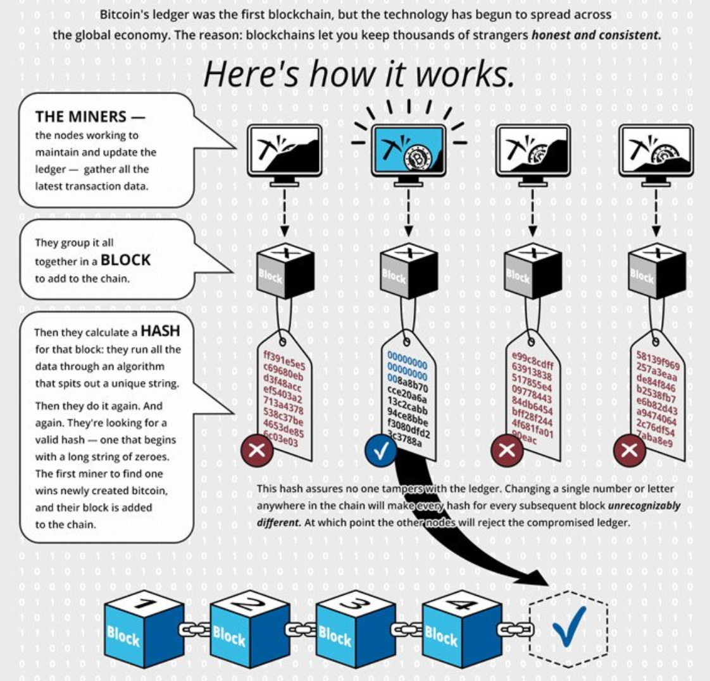

## Table of Contents

## What is a block in a blockchain?

A block in a blockchain is like a page in a notebook. It contains information about transactions, like who sent money to whom and how much. Each block has a unique code called a hash, which helps keep the information safe and unchangeable. When a new block is added, it gets connected to the block before it, making a chain of blocks.

This chain of blocks is what makes up a blockchain. Every new block added makes the chain longer and more secure. If someone tries to change information in an old block, it would change the hash, and everyone would know something was wrong. This way, the blockchain keeps the information honest and safe for everyone to see and trust.

## How are blocks structured in a blockchain?

A block in a blockchain is made up of a few important parts. The first part is the header, which is like the cover of a book. It has a special code called a hash that makes the block unique. The header also has the hash of the block before it, which links the blocks together like a chain. There's also a timestamp that shows when the block was made, and a number called the nonce that helps in creating the block's hash.

The second part of a block is the body, which is like the pages inside the book. The body contains the list of transactions, which are the main reason for the block's existence. Each transaction tells a story about who sent what to whom, and how much. All these transactions together make up the data that the block is storing. When a new block is added to the blockchain, it adds more stories to the chain, making it longer and more secure.

## What is the role of a block in securing a blockchain?

A block helps keep a blockchain safe by using something called a hash. A hash is like a special code that makes each block unique. When a new block is added to the blockchain, it includes the hash of the block that came before it. This makes a chain where each block is connected to the one before it. If someone tries to change information in an old block, it would change that block's hash. But because each block's hash depends on the block before it, changing one block would mean changing all the blocks that come after it too. This makes it really hard for someone to mess with the information without everyone noticing.

Another way blocks help secure the blockchain is by making it harder to change things as more blocks are added. Each new block added to the chain makes the blockchain longer and more secure. Imagine trying to change a word in the first chapter of a book, but you have to rewrite every chapter that comes after it to make the story make sense again. It would take a lot of work and time. In the same way, the more blocks there are in a blockchain, the more work it would take to change something in an old block, making the blockchain safer for everyone.

## How does a block get added to a blockchain?

When someone wants to add a new block to a blockchain, they first gather a bunch of transactions that need to be recorded. These transactions are like little stories about who sent what to whom. A special computer, often called a miner, takes these transactions and puts them into a new block. The miner then tries to solve a tricky puzzle to make the block's hash, which is like a special code that makes the block unique. Once the puzzle is solved, the new block is ready to be added to the blockchain.

To add the new block, the miner shares it with everyone else on the network. If everyone agrees that the new block is correct and follows the rules, it gets added to the end of the blockchain. This new block includes the hash of the last block, which links it to the chain. Once the block is added, it becomes a permanent part of the blockchain, making the chain longer and more secure. This process keeps repeating, with new blocks being added all the time, keeping the blockchain up to date and safe for everyone to use.

## What is block time and why is it important?

Block time is how long it takes for a new block to be added to a blockchain. It's like waiting for a new page to be added to a notebook. Different blockchains have different block times. For example, Bitcoin's block time is about 10 minutes, while Ethereum's is around 15 seconds. 

Block time is important because it affects how fast the blockchain can process transactions. If the block time is short, transactions can be confirmed quickly, which is good for things like buying things online. But if the block time is too short, it might lead to more mistakes and disagreements on the network. If the block time is long, it might be safer and more stable, but people might have to wait longer for their transactions to be confirmed. So, finding the right block time is a balance between speed and safety.

## What is a block reward and how does it incentivize miners?

A block reward is like a prize that miners get for adding a new block to the blockchain. When a miner solves the puzzle to create a new block, they get to keep some of the cryptocurrency from that block as a reward. This reward is a big reason why miners work hard to add new blocks. It's like getting paid for doing a job, but instead of money, they get cryptocurrency.

The block reward is important because it encourages miners to keep the blockchain running smoothly. If there were no rewards, miners might not want to spend their time and energy solving puzzles. But with the block reward, they have a reason to keep working, which helps keep the blockchain safe and growing. As more blocks are added, the blockchain becomes stronger and more secure, all thanks to the miners being motivated by their rewards.

## How does block size affect the performance of a blockchain?

Block size is like the size of a page in a notebook. If the page is small, you can only write a little bit on it. In a blockchain, a small block size means fewer transactions can fit in one block. This can make the blockchain slower because it takes more blocks to record all the transactions. But smaller blocks are easier for computers to handle, which can make the blockchain more stable and reliable.

On the other hand, if the block size is big, like a large page, you can write a lot more on it. This means more transactions can fit into one block, which can make the blockchain faster. People don't have to wait as long for their transactions to be recorded. But bigger blocks can be harder for some computers to handle, which might cause problems and slow things down if not everyone can keep up. So, finding the right block size is important for making the blockchain work well for everyone.

## What are the differences between blockchains in terms of block functionality?

Different blockchains have different ways of using blocks, which can change how they work. For example, Bitcoin uses blocks to record transactions and keep the network secure. Each Bitcoin block has a size limit, and it takes about 10 minutes to add a new block. This makes Bitcoin's blockchain slower but very secure. On the other hand, Ethereum uses blocks not just for transactions but also for running smart contracts, which are like little computer programs that can do things automatically. Ethereum's blocks are added faster, about every 15 seconds, which makes it quicker but can sometimes lead to more disagreements on the network.

Another difference is how blockchains handle block size and rewards. Bitcoin started with a block reward of 50 bitcoins, which gets cut in half every four years. This makes mining Bitcoin less profitable over time but keeps the total number of bitcoins limited. Ethereum, on the other hand, is moving from a system where miners get rewards to one where validators earn rewards for keeping the network running. Ethereum also has a different approach to block size, using something called gas to limit how much can be done in each block. This helps manage the load on the network and keeps things running smoothly.

These differences in block functionality show how blockchains can be designed for different purposes. Bitcoin focuses on being a secure store of value, while Ethereum aims to be a platform for more complex applications. Understanding these differences helps people choose the right blockchain for their needs, whether it's for simple transactions or running smart contracts.

## What are orphan blocks and how do they occur?

Orphan blocks are blocks in a blockchain that get created but don't end up being part of the main chain. They're like extra pages that were written but didn't make it into the final book. This can happen when two miners find a solution to the puzzle at almost the same time. Both miners create a block and share it with the network. The network has to choose which block to add to the chain, and the one that gets added first becomes part of the main chain. The other block, even though it's valid, becomes an orphan because it doesn't connect to the main chain.

Orphan blocks are more common in blockchains with shorter block times, like Ethereum, because there's less time between blocks, making it more likely for two miners to solve the puzzle at the same time. When this happens, the network usually goes with the longest chain, which is the one with the most work put into it. The orphan block and any blocks that come after it might still be valid, but they're not part of the main chain anymore. This doesn't harm the blockchain's security, but it can cause a small delay in transaction confirmations as the network sorts out which chain to follow.

## How can block validation be optimized in blockchain technology?

Block validation in blockchain technology can be made faster and better by using special computer programs called consensus algorithms. These algorithms help everyone on the network agree on which blocks are correct and should be added to the chain. One way to optimize this is by using a method called proof of stake, where instead of solving hard puzzles like in proof of work, people can become validators by locking up some of their cryptocurrency. This uses less energy and can be quicker because it doesn't need as much computing power. Another way is by using sharding, which splits the blockchain into smaller parts so that different groups of validators can work on different parts at the same time, making the whole process faster.

Another approach to optimize block validation is by improving the network's communication. By using better ways to send and receive data, like using more efficient protocols or even special hardware, the time it takes for validators to share and check new blocks can be reduced. This helps make the blockchain more responsive and able to handle more transactions. By combining these methods, blockchains can become more efficient, allowing for faster and more secure validation of blocks, which is important for keeping the whole system running smoothly.

## What are the advanced security measures implemented at the block level?

At the block level, one important security measure is the use of cryptographic hashes. Each block has a unique hash, which is like a special code that makes the block unique. This hash is created using the block's data and the hash of the previous block. If someone tries to change anything in a block, it would change the hash, and everyone would know something was wrong. This makes it very hard for someone to mess with the blockchain without being caught. Another way to keep blocks secure is by using digital signatures. Each transaction in a block has a digital signature that proves who sent it. This helps make sure that only the person who owns the cryptocurrency can send it, making it harder for someone to fake transactions.

Another advanced security measure is the use of Merkle trees. A Merkle tree is like a family tree for transactions in a block. It groups transactions together and creates a hash for each group. These hashes are then combined and hashed again, all the way up to a single hash called the Merkle root, which is stored in the block header. If someone tries to change a transaction, it would change the hashes all the way up the tree, making it easy to spot the change. This helps keep the transactions in a block safe and secure. By using these methods, blockchains can protect the information in each block and keep the whole system trustworthy.

## How do layer-2 solutions impact block functionality in blockchain networks?

Layer-2 solutions are like helpers that work on top of the main blockchain, called layer-1. They help make the blockchain faster and cheaper by handling some of the work that would normally be done on the main chain. For example, instead of putting every single transaction into a block on the main chain, layer-2 solutions can group many transactions together and only send the final result to the main chain. This means fewer transactions need to be added to each block, which can make the blockchain run more smoothly and quickly.

One popular layer-2 solution is called the Lightning Network, which is used with Bitcoin. It lets people do many small transactions off the main blockchain and then settle them all at once. This helps keep the blocks on the main chain smaller and more manageable, so they can be added faster. Another example is Ethereum's layer-2 solutions like Optimistic Rollups and zk-Rollups, which also bundle transactions together to reduce the load on the main chain. By using these layer-2 solutions, the main blockchain can focus on being secure and stable, while the layer-2 helpers take care of making things faster and cheaper for everyone.

## References & Further Reading

[1]: Nakamoto, S. (2008). ["Bitcoin: A Peer-to-Peer Electronic Cash System."](https://nakamotoinstitute.org/library/bitcoin/)

[2]: Mougayar, W. (2016). ["The Business Blockchain: Promise, Practice, and Application of the Next Internet Technology"](https://books.google.com/books/about/The_Business_Blockchain.html?id=CEsPDAAAQBAJ)

[3]: Tapscott, D., & Tapscott, A. (2016). ["Blockchain Revolution: How the Technology Behind Bitcoin is Changing Money, Business, and the World"](https://dl.acm.org/doi/10.5555/3051781)

[4]: Narayanan, A., Bonneau, J., Felten, E., Miller, A., & Goldfeder, S. (2016). ["Bitcoin and Cryptocurrency Technologies: A Comprehensive Introduction"](https://press.princeton.edu/books/hardcover/9780691171692/bitcoin-and-cryptocurrency-technologies)

[5]: DeFilippi, P., & Wright, A. (2018). ["Blockchain and the Law: The Rule of Code"](https://www.jstor.org/stable/j.ctv2867sp)

[6]: Lopez de Prado, M. (2018). ["Advances in Financial Machine Learning"](https://www.amazon.com/Advances-Financial-Machine-Learning-Marcos/dp/1119482089)

[7]: Antonopoulos, A. M. (2017). ["Mastering Bitcoin: Unlocking Digital Cryptocurrencies"](https://books.google.com/books/about/Mastering_Bitcoin.html?id=IXmrBQAAQBAJ)

[8]: Peters, G. W., & Panayi, E. (2016). Understanding Modern Banking Ledgers through Blockchain Technologies: Future of Transaction Processing and Smart Contracts on the Internet of Money. In "Banking Beyond Banks and Money" (pp. 239-278). Springer, Cham.