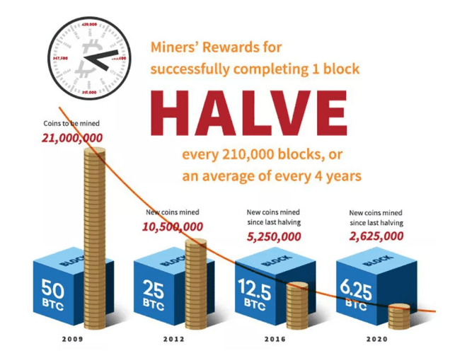

Blockchain technology is revolutionizing how data is stored, verified, and transmitted across various sectors in modern technology. At its core, a blockchain is a decentralized and distributed digital ledger that records transactions across multiple devices, ensuring security, transparency, and immutability. This technology underlies numerous applications, especially in the field of finance and digital assets, forming the foundation upon which cryptocurrencies like Bitcoin and Ethereum operate. A crucial element within each blockchain is the concept of block height, a term that denotes the number of blocks in a chain, counting from the genesis block. Essentially, the block height provides an indication of the progress and size of a blockchain network, serving as a reference point for transactions and enabling a chronological order of events within the blockchain.

Cryptocurrencies are digital or virtual currencies that use cryptography for security, and they rely heavily on blockchain technology to function. The decentralized nature of blockchains in cryptocurrencies offers resilience against fraud and hacking, ensuring that transaction records remain unaltered and secure. Cryptocurrencies have significantly influenced financial markets, introducing novel ways for trading and investing.



An emerging trend in this digital financial landscape is algorithmic trading, or algo trading, which refers to the use of computer programs to execute trades based on pre-defined criteria and strategies. In the context of cryptocurrency, algorithmic trading is gaining prominence due to its ability to process large volumes of data quickly, identify patterns, and execute trades at speeds beyond human capabilities. This technological advancement enables traders to capitalize on market movements efficiently and can include indicators such as block height data in their strategies.

This article is structured to provide a comprehensive understanding of blockchain and its fundamental components, such as block height, while exploring their relevance in cryptocurrency networks. It will also discuss the integration and potential benefits of algorithmic trading within the cryptocurrency markets, highlighting the interplay between block height data and trading strategies. Lastly, it will address the challenges and considerations that arise from using blockchain data in algorithmic trading, while looking into the future possibilities and innovations in blockchain technology and cryptocurrency trading.

## Table of Contents

## Understanding Blockchain

A blockchain is a form of distributed ledger technology that records transactions across a network of computers in a manner that ensures security, transparency, and immutability. Unlike traditional ledgers maintained by a centralized authority, blockchains operate in a decentralized fashion, where each participant, known as a node, maintains a copy of the entire ledger. This decentralization is crucial for ensuring trust in systems where participants may not necessarily trust each other.

At its core, a blockchain comprises a series of blocks that are linked together in chronological order, forming a chain. Each block contains a collection of transactions, a timestamp, and a cryptographic hash of the previous block, which ensures the integrity and immutability of the ledger. The structure of a block typically includes the following components:

1. **Header**: The block header contains metadata such as the version number, the current timestamp, the hash of the previous block, the Merkle root (a hash of all the transactions in the block), and other relevant data necessary for maintaining the blockchain.

2. **Transaction List**: This section of the block includes all the transactions that have been verified and added to the block. Each transaction typically records details such as the sender, receiver, amount, and any other data relevant to the transaction.

3. **Nonce**: A number used once, or nonce, is a value that miners change in order to find a valid hash for the block during the mining process. This value is critical in the execution of the consensus mechanism known as proof of work.

### Genesis Block

The genesis block is the very first block of a blockchain and serves as the foundation upon which all subsequent blocks are built. It holds unique significance because it does not reference a previous block, unlike all other blocks in the blockchain. The creation of the genesis block marks the start of the blockchain network and its parameters, such as the initial distribution of [cryptocurrency](/wiki/cryptocurrency) or the rules governing the blockchain. For example, in the Bitcoin blockchain, the genesis block contains the famous text from The Times newspaper headline of January 3, 2009, which reads, "Chancellor on brink of second bailout for banks." This inclusion served as both a timestamp and a commentary on the financial system, symbolizing the decentralization ethos underlying blockchain technology.

The role of the genesis block extends beyond just being the first block. It serves as the origin point for the chain's entire structure, and any changes to it would effectively alter the history of the blockchain. This permanence is a testament to the blockchain's immutability, as any tampering with a historical block would require altering every subsequent block, which is computationally infeasible in a well-secured network.

## Explaining Block Height

Block height is a fundamental concept in blockchain technology, referring to the total number of blocks that precede a specific block within a blockchain. It is essentially a measure of the blockchain's length, offering insight into the sequence and progression of block confirmations over time.

To better comprehend block height, it is important to understand the structure of a blockchain. A blockchain consists of a series of blocks, each containing a list of transactions. Each block, except the first one known as the genesis block, contains a reference to the previous block, creating a continuous chain. The genesis block is unique as it is the only block that does not have a predecessor, and thus has a block height of zero.

The block height increases incrementally as new blocks are added to the chain, making it an accurate reflection of the total number of completed blocks in the blockchain. For example, if a particular block has a block height of 507, this indicates that there are 507 blocks preceding it back to the genesis block. It's important to note that block height is not synonymous with the number of transactions; it purely reflects the number of blocks, not the [volume](/wiki/volume-trading-strategy) of the data within those blocks.

Block height serves several crucial roles in the blockchain ecosystem:

1. **Progress Tracking**: It is an essential metric for determining how far a blockchain has advanced since its inception. By knowing the current block height, users can estimate the network's maturity and how much computational work has been invested into the chain.

2. **Chain Verification**: It aids in the verification process by ensuring that the sequence of blocks is intact and unaltered. Since each block contains a reference to the previous block, any tampering would disrupt the continuity, making discrepancies in block height visible.

3. **Fork Resolution**: In cases where there are multiple competing versions of the blockchain (forks), block height can be useful for determining the most "trustworthy" chain. Generally, the chain with the greater block height is deemed more secure, as it implies more computational work has been dedicated to extending that chain.

Block height is a vital element for assessing the blockchain's reliability and performance. Using block height, software applications, nodes, and miners can gauge the blockchain's growth and confirm the network's steadfastness. It plays a pivotal role in the broader context of blockchain’s function and security, underscoring its significance in the technological landscape.

## Block Height in Cryptocurrency

Block height is a fundamental concept in cryptocurrency networks, serving as a crucial metric for both transaction verification and maintaining network security. In the structure of a blockchain, each block is sequentially ordered with an associated number known as the block height. The block height represents the distance from the genesis block, which is the very first block in the blockchain. For instance, a block with a height of 500,000 is the 500,000th block in the chain since the inception of the genesis block.

In cryptocurrency networks like Bitcoin, block height plays a critical role in ensuring the integrity and security of the blockchain. The blockchain functions as a distributed ledger, where transaction data is stored in blocks. Each block contains a list of transactions, a reference to the previous block, a timestamp, and a cryptographic hash. The process of referencing the previous block ensures that once a block is added to the chain, it becomes immutable. Altering any information in a block would require the modification of every subsequent block, which is computationally expensive and practically infeasible due to the network's consensus mechanism.

Transaction verification is inherently linked to block height. In a blockchain network, confirmations denote the number of blocks that have been added to the blockchain after a particular transaction's block. For Bitcoin, it is generally accepted that a transaction is secure after six confirmations. Each confirmation corresponds to a block added to the chain after the block containing the transaction. The block height facilitates this process by providing a clear sequence of blocks, thereby enabling users to determine how many confirmations a transaction has received, which directly impacts its perceived reliability.

Moreover, block height is directly related to network security. The security of a blockchain is a function of its length and the computational power that supports it. A longer blockchain, characterized by a higher block height, typically signifies a more extensive history of verified transactions, making it more secure against potential attacks. In Bitcoin, the longest chain rule is pivotal—a node will always adopt the longest available chain as the correct version of the blockchain history. This rule is integral to avoiding malicious forks attempted by attackers who may try to rewrite transaction histories.

An illustrative example is the Bitcoin network itself, where the block height signifies important milestones. For instance, every 210,000 blocks, a halving event occurs wherein the reward for mining new blocks is reduced by half. The block height thus helps predict such events, which have significant implications for miners and the overall supply of Bitcoin.

In conclusion, block height is not only a measure of the blockchain's length but a fundamental component that ensures transaction verification and network security. Its role in processes like confirmation tracking and event predictions underscores its importance in the cryptocurrency ecosystem.

## Algorithmic Trading in Cryptocurrency

Algorithmic trading refers to the use of computer algorithms to automate trading strategies in financial markets. This method has gained significant traction due to its ability to process vast amounts of data at high speeds and execute trades based on predetermined criteria without human intervention. Its application extends to various asset classes, including equities, commodities, and, increasingly, cryptocurrencies.

In cryptocurrencies, [algorithmic trading](/wiki/algorithmic-trading) capitalizes on the high [volatility](/wiki/volatility-trading-strategies) and 24/7 trading availability of digital assets. The decentralized and unregulated nature of the cryptocurrency markets presents unique opportunities for traders to exploit price inefficiencies. Algorithms can be programmed to execute trades when certain conditions are met, such as price thresholds, volume changes, or market indicators.

Advantages of algorithmic trading in cryptocurrency markets include increased speed and accuracy in trade execution, which helps in capturing fleeting trading opportunities. Algorithms can operate continuously, analyzing data points and market signals even when human traders are offline. Additionally, algo trading can reduce the emotional bias that often affects human decision-making, as algorithms strictly follow coded instructions. 

Moreover, algorithmic trading allows for complex strategies that consider multiple variables and datasets. For instance, a mean reversion strategy could be applied, where the algorithm analyzes historical price data to forecast and capitalize on potential price corrections. By leveraging [machine learning](/wiki/machine-learning) techniques, algorithms can also learn from historical data to predict future trends or adapt to changing market conditions.

Overall, algorithmic trading enhances the efficiency and effectiveness of trading strategies in cryptocurrency markets, offering traders the ability to remain competitive in a rapidly evolving landscape.

## Interplay Between Block Height and Algorithmic Trading

The integration of block height data into algorithmic trading strategies presents a unique opportunity for traders to enhance their decision-making processes in cryptocurrency markets. Block height, a fundamental metric in blockchain technology, provides information on the total number of confirmed blocks preceding the current one. This data is crucial in assessing transaction confirmations, network activity, and overall blockchain progress.

Algorithmic trading, by its nature, relies on automated and rapid decision-making processes to execute trades that capitalize on market inefficiencies. Incorporating real-time blockchain data, such as block height, is critical for optimizing these strategies. When traders have access to up-to-date blockchain metrics, they are better equipped to evaluate market conditions, gauge transaction congestion, and predict potential network delays that might influence trading outcomes.

A practical application of block height data in algorithmic trading involves using it as an indicator of network congestion. For instance, during periods of increased transaction activity, a slower block height increment might signal that the network is processing a backlog of transactions, potentially leading to transaction delays and increased fees. Armed with this information, an algorithm might temporarily pause trading or adjust transaction fees to optimize trade execution.

Another example is the utilization of block height to assess the security of a transaction. In the context of Bitcoin, for instance, a transaction that is six blocks deep is commonly considered secure from double-spending attacks. Algorithmic trading systems can leverage this understanding to manage risk more effectively by automatically validating the security status of transactions based on their depth in the blockchain.

Python, with libraries like `web3.py`, can be used to access and handle blockchain data efficiently:

```python
from web3 import Web3

# Connect to a blockchain node
w3 = Web3(Web3.HTTPProvider('https://mainnet.infura.io/v3/YOUR_INFURA_PROJECT_ID'))

# Get the latest block height
latest_block = w3.eth.block_number
print(f"The current block height is: {latest_block}")

# Example strategy: Monitor for block confirmations
def is_transaction_confirmed(tx_hash, confirmations=6):
    tx_receipt = w3.eth.getTransactionReceipt(tx_hash)
    if not tx_receipt:
        return False
    latest_block = w3.eth.block_number
    tx_block = tx_receipt.blockNumber
    return (latest_block - tx_block) >= confirmations

# Example usage
tx_hash = '0x...'
confirmed = is_transaction_confirmed(tx_hash)
print(f"Transaction is {'confirmed' if confirmed else 'not confirmed'}")
```

This script shows how real-time block height data can be integrated into trading algorithms, providing the foundation to build more complex strategies that incorporate blockchain metrics. By continuously adapting to blockchain conditions through techniques like these, algorithmic traders can gain a competitive edge in the often volatile cryptocurrency markets.

## Challenges and Considerations

Using blockchain data, such as block height, in trading algorithms brings various challenges that need careful consideration. One significant challenge is ensuring the data's accuracy and integrity. Blockchain data, while theoretically immutable, can be affected by forks, network latencies, or errors during data extraction. These discrepancies can lead to erroneous trading signals, causing financial losses or missed opportunities.

Security issues also arise when utilizing blockchain data. Unauthorized access and data spoofing can compromise trading algorithms. Malicious actors could manipulate data sources or create false blocks, leading to inaccurate block height readings. Safeguarding against these risks requires implementing robust authentication and encryption protocols to validate data sources and ensure the authenticity of blockchain information.

Mining difficulty presents another variable that can impact block height accuracy and subsequently affect trading decisions. As mining difficulty adjusts approximately every two weeks in the Bitcoin network, variations can result in longer block creation times, impacting real-time data acquisition for trading strategies. An understanding of mining difficulty adjustments is essential to correctly interpret block height data, as these reflect the network's current state and transaction throughput.

Network congestion also significantly influences the reliability of blockchain data in trading algorithms. High transaction volumes can create bottlenecks, delaying the confirmation of blocks and affecting the speed at which block height updates are reflected in trading systems. This can lead to outdated or incomplete views of the blockchain's state, potentially skewing algorithm-driven trading actions. 

In summary, leveraging block height in trading algorithms necessitates addressing challenges related to data accuracy, security, mining difficulty, and network congestion. Comprehensively tackling these issues is critical for effective algorithmic decision-making in cryptocurrency markets.

## Future Prospects

The future of blockchain technology and block height in the cryptocurrency landscape is poised for transformative growth and innovation. Blockchain, as a decentralized ledger system, continues to garner attention due to its transparency, security, and efficiency in processing transactions. As the technology matures, its applications could extend far beyond financial transactions, potentially revolutionizing industries such as supply chain management, healthcare, and voting systems.

Block height, a critical metric in blockchain technology that indicates the number of blocks connected consecutively in a blockchain, is expected to gain more utility as the blockchain landscape evolves. As more applications are built on blockchain technology, monitoring block height can provide insights into the operational efficiency, size, and security of a blockchain network. This could become particularly relevant in ensuring network integrity and gauging transaction throughput as networks expand and new consensus mechanisms are introduced.

Algorithmic trading (algo trading) stands to benefit significantly from advancements in blockchain data, including block height. Algo trading, which involves using automated and preprogrammed trading instructions to execute transactions at high speed and volume, could leverage real-time blockchain data to enhance trading strategies. The transparency and immutability of blockchain data can aid in the development of more robust trading algorithms, capitalizing on patterns and trends that may not be as apparent in traditional financial markets.

Moreover, innovations such as decentralized finance (DeFi) could further drive the integration of blockchain data into trading strategies. DeFi platforms could utilize block height data to automate financial services and create highly programmable, distributed applications that offer unprecedented transparency and security. Tools analyzing blockchain data could potentially forecast transaction fees, assess network congestion, and optimize order execution timing, thereby refining trading strategies.

Looking ahead, the interplay between blockchain technology and cryptocurrency trading could spawn new opportunities. Innovations like smart contracts—self-executing contracts with the terms of the agreement directly written into code—could automate complex trading strategies directly on blockchain platforms. Additionally, advancements in blockchain scalability, such as sharding and layer-2 solutions, might enhance transaction processing rates, enabling more seamless integration of blockchain data into real-time trading systems.

The ongoing evolution of blockchain standards and protocols is likely to create a fertile ground for novel data-driven trading strategies. As blockchain technology becomes more intertwined with machine learning and [artificial intelligence](/wiki/ai-artificial-intelligence), we can anticipate sophisticated algorithms capable of processing and acting on complex datasets, including but not limited to block height information, in a more autonomous and effective manner.

In summary, the future prospects for blockchain technology and block height in cryptocurrency are promising, with significant implications for algorithmic trading. As technologies advance and new innovations emerge, the potential to leverage blockchain data to optimize trading decisions and develop cutting-edge financial products will continue to grow, ushering in a new era of financial technology and investment strategies.

## Conclusion

Understanding block height is crucial for grasping the broader functionality and stability of blockchain ecosystems, particularly within the context of cryptocurrencies. Block height serves as an essential metric that reflects the number of blocks on a blockchain, providing insights into network age, transaction verification, and security mechanisms. Its significance extends to various blockchain applications, revealing the intricacies of this distributed ledger technology.

Algorithmic trading holds significant promise in utilizing blockchain data, notably block height, to execute informed trading decisions. By leveraging real-time data and identifying market trends and inefficiencies, traders can develop automated strategies that enhance decision-making processes. This approach to trading not only optimizes performance but also embraces the dynamic nature of cryptocurrency markets.

As blockchain technology continues its rapid evolution, further exploration and research are encouraged to unlock additional opportunities within blockchain, algorithmic trading, and their symbiotic relationship. Innovations in blockchain might introduce new methods of data utilization, while advancements in trading algorithms could significantly impact the efficiency and profitability of cryptocurrency markets. Understanding and harnessing these developments can pave the way for new trading strategies, investment insights, and technological breakthroughs.

## References & Further Reading

[1]: Nakamoto, S. (2008). ["Bitcoin: A Peer-to-Peer Electronic Cash System."](https://nakamotoinstitute.org/library/bitcoin/)

[2]: Antonopoulos, A. M. (2017). ["Mastering Bitcoin: Unlocking Digital Cryptocurrencies."](https://books.google.com/books/about/Mastering_Bitcoin.html?id=IXmrBQAAQBAJ) O'Reilly Media.

[3]: Narayanan, A., Bonneau, J., Felten, E., Miller, A., & Goldfeder, S. (2016). ["Bitcoin and Cryptocurrency Technologies."](https://press.princeton.edu/books/hardcover/9780691171692/bitcoin-and-cryptocurrency-technologies) Princeton University Press.

[4]: Popper, N. (2015). ["Digital Gold: Bitcoin and the Inside Story of the Misfits and Millionaires Trying to Reinvent Money."](https://www.amazon.com/Digital-Gold-Bitcoin-Millionaires-Reinvent/dp/006236250X) Harper.

[5]: Tapp, E. (2020). ["Algorithmic Trading with Python: Quantitative Methods and Strategy Development."](https://www.amazon.com/Algorithmic-Trading-Python-Quantitative-Development/dp/B086Y6H6YG) Packt Publishing.