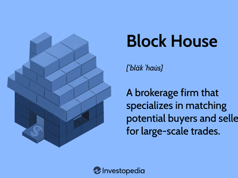

In the evolving landscape of both architecture and finance, the juxtaposition of terms like 'architecture building design block house algo trading' may initially appear unrelated. However, each plays a crucial role in its respective domain, and their intersections are increasingly dictated by technological advancements. Architectural building design focuses on creating functional and aesthetically pleasing structures, while financial innovations, such as block houses in trading and algorithmic trading, transform the execution and stability of financial markets.

This article seeks to explore the complex dynamics between these fields: the artistry and science of designing buildings, the strategic operations of block houses in executing substantial trades, and the precision of algorithmic trading in financial markets. By examining these components, we intend to demonstrate how they collectively influence the shaping of modern infrastructure and the evolution of financial markets. This exploration provides insight into how innovative design and strategic financial solutions can collaborate to foster efficiency and modernization.

## Table of Contents

## Understanding Architectural Building Design

Architectural building design is an intricate discipline that blends artistic creativity with scientific rigor. It focuses on constructing environments that not only serve their intended functions efficiently but also resonate with aesthetic appeal. Modern architecture seeks to harmonize these elements by integrating cutting-edge technologies to address pressing concerns like sustainability and efficiency.

A significant trend in contemporary architectural design is the emphasis on sustainability. Architects now prioritize environmentally friendly materials and energy-efficient practices. For instance, the incorporation of solar panels and green roofs reduces energy consumption and enhances environmental conservation. Moreover, advances in technology allow architects to simulate environmental impacts during the design phase, leading to more informed decision-making.

Architects play a pivotal role in balancing design elements. They must consider various factors, including economic constraints and social implications, to create spaces that meet diverse needs. This requires a comprehensive understanding of materials, construction techniques, and design principles. The architect's vision must align with the client's goals while also adhering to regulatory standards and community expectations.

A noteworthy advancement in architectural design is the integration of smart building systems. These systems use technology to optimize building operations, improving comfort and resource management. For example, intelligent HVAC systems adjust based on occupancy and weather conditions, enhancing energy efficiency. Similarly, automated lighting systems respond to natural light levels, minimizing energy usage while maximizing user comfort.

Current architectural design trends emphasize flexibility and adaptability. Open-plan spaces, modular construction, and multi-functional areas are increasingly popular. These designs accommodate evolving user needs and technological advancements over time. Additionally, biophilic design, which incorporates natural elements into the built environment, is gaining traction for its positive impacts on occupant well-being.

Understanding these principles and trends provides insight into the future of architectural building design. It highlights the importance of integrating function and aesthetics while embracing technology to create innovative and sustainable spaces. As architects continue to respond to societal and environmental challenges, their designs will shape the futures of our urban and rural landscapes.

## The Concept of a Block House in Trading

In the trading world, a block house serves as a brokerage firm specializing in executing large-scale transactions, known as block trades, which are typically carried out off-exchange. These transactions commonly involve significant volumes of securities traded primarily between institutional investors, such as mutual funds, pension funds, or insurance companies. The primary aim of conducting these trades off-exchange is to reduce their potential impact on the market price of the traded securities.

Block trades, by their nature, possess the potential to alter market dynamics considerably. If conducted on regular trading platforms, large orders could lead to price fluctuations, impacting both current market [liquidity](/wiki/liquidity-risk-premium) and price stability. The involvement of a block house helps in circumventing these issues by ensuring that large trades are executed discreetly, thereby maintaining an equilibrium in the market.

The operation of block houses involves maintaining a crucial balance between the demands of the sellers and buyers while ensuring that the confidentiality of each transaction is preserved. The strategic placement of such trades involves various tactics to match institutional buyers and sellers, often using a network of trading partners or other large brokers.

In terms of market stability, block houses are indispensable. By providing a platform for executing large trades with minimized market disruption, they help in stabilizing prices and ensuring that large-[volume](/wiki/volume-trading-strategy) trading activities do not lead to extensive price swings. This role is especially vital during periods of high market [volatility](/wiki/volatility-trading-strategies), where large trades could exacerbate market fluctuations.

The significance of block houses extends to their ability to provide liquidity in the market. By facilitating these large transactions, they help in aligning the supply and demand dynamics for sizable quantities of securities, thereby enhancing overall market liquidity. This provision of liquidity tap not only stabilizes the financial ecosystem but also aids in efficient capital allocation across different sectors.

In conclusion, block houses play a pivotal role in institutional trading, safeguarding the interests of large investors while maintaining market integrity. Their function in managing large block trades off-exchange has implications for preserving stability within the broader financial market.

## Algorithmic Trading: Revolutionizing Financial Markets

Algorithmic trading, a prominent innovation in financial markets, employs computer algorithms to automate and execute trading decisions with extraordinary speed and precision. This sophisticated approach to trading significantly reduces human errors and facilitates the deployment of complex, multi-faceted market strategies that are difficult to implement manually.

### Automation and Efficiency
At its core, [algorithmic trading](/wiki/algorithmic-trading) relies on a set of pre-defined rules and algorithms to make trading decisions. These algorithms can process vast amounts of market data in real-time to identify trading opportunities based on trends, patterns, or statistical analysis. The automation of trading decisions allows for the rapid execution of orders, often within milliseconds, which is crucial in volatile markets where prices can change instantly.

### AI and Machine Learning Enhancements
The integration of [artificial intelligence](/wiki/ai-artificial-intelligence) (AI) and [machine learning](/wiki/machine-learning) (ML) techniques has significantly enhanced algorithmic trading systems. AI and ML enable the creation of models that can learn from historical data to predict future market movements. These predictive models are continually refined using [backtesting](/wiki/backtesting)—where strategies are tested against historical data—to improve accuracy and efficiency. For example, a machine learning model might be trained to recognize patterns indicating a forthcoming price increase and initiate a buy order.

### Architecture of Algorithmic Trading Systems
The architecture of algorithmic trading systems comprises several key components:

1. **Data Acquisition Layer:** Collects and preprocesses real-time data feeds from exchanges, including stock prices, volume, and news sentiment.

2. **Strategy Engine:** Utilizes algorithms that analyze data to make trading decisions. The engine applies rules and models to determine optimal buy/sell points.

3. **Execution System:** Responsible for order management and execution. This system interfaces with exchanges to place trades and manages order books to ensure transactions occur at the best possible prices.

4. **Risk Management Module:** Monitors trades to mitigate risk, ensuring that the portfolio remains within predefined risk limits. It may involve setting stop-loss orders or adjusting positions during market fluctuations.

5. **Performance Analysis Tool:** Evaluates the effectiveness of trading strategies using metrics such as Sharpe ratio and drawdown analysis to refine and optimize strategies for future use.

### Benefits and Challenges
Algorithmic trading offers several benefits. It enhances market liquidity by enabling high-frequency trading, reduces transaction costs due to efficient execution, and minimizes emotions in trading decisions. However, it also presents challenges. Technical glitches or errors in algorithms can lead to significant financial losses, as exemplified by the "flash crash" of 2010. Moreover, the reliance on high-speed internet and computational power raises the barrier to entry for smaller traders.

While algorithmic trading is transformative, it necessitates robust infrastructure and continuous monitoring to ensure reliability and performance. As technology advances, further integration of AI, ML, and big data analytics is expected to push algorithmic trading capabilities even further, shaping the future dynamics of financial markets.

## Intersections of Architectural and Financial Systems

Both architecture and financial systems share a fundamental reliance on design principles, which guide their functionality, efficiency, and sustainability. Architectural design relies on principles such as symmetry, balance, and harmony to create spaces that are both aesthetically pleasing and practical. Similarly, financial systems, particularly algorithmic trading, utilize structured frameworks and algorithms designed to optimize performance and reliability.

In smart buildings, blockchain technology is increasingly utilized to optimize energy and resource management. Blockchain provides a decentralized and secure method for recording transactions, which can be applied to track energy usage within smart buildings. By employing smart contracts, these buildings can automatically manage resources, such as adjusting energy consumption based on predefined criteria or market conditions. This results in greater efficiency and cost-effectiveness.

In parallel, the financial industry mirrors these structural designs within algorithmic frameworks. Algorithms are crafted to manage resources—information, capital, and time—effectively. These frameworks are built to respond to market signals with precision, akin to how smart building systems adjust to environmental changes. High-frequency trading algorithms, for example, are designed with a robust architecture that allows them to execute trades within microseconds, maintaining stability and liquidity in financial markets.

A noteworthy case study illustrating the intersection of architectural concepts and financial systems is the integration of decentralized finance (DeFi) technologies in the construction of smart, energy-efficient buildings. DeFi, which relies extensively on blockchain technology, allows for transparent and automated financial transactions, eliminating the need for intermediaries. This parallels the use of blockchain in managing a building’s energy distribution network, ensuring transparency and reducing energy waste through real-time data and automated adjustments.

Furthermore, architectural principles have inspired the development of risk assessment models in finance. Design concepts like modularity and redundancy, which ensure resilience in architectural structures, are employed to create financial models that anticipate and manage risk effectively. Just as a building’s design mitigates the risk of structural failure, these financial models aim to minimize economic losses.

In summary, the intersection of architectural and financial systems is evident in their shared reliance on design principles to enhance efficiency and performance. The use of blockchain in smart buildings and the adoption of algorithmic frameworks in finance demonstrate how these principles are applied across domains. Case studies reveal that architectural concepts not only inspire but also directly contribute to innovative solutions in financial systems.

## The Future of Integrated Systems: Trading Platforms and Smart Buildings

The future of integrated systems is marked by the convergence of architectural innovations and trading technologies, paving the way for smart cities equipped with advanced financial platforms. These urban centers are designed to facilitate rapid data access and support seamless transactions, employing a range of technologies such as the Internet of Things (IoT) and Artificial Intelligence (AI) to bridge the gap between physical and digital infrastructures.

Smart cities leverage IoT to monitor and manage urban elements like traffic flow, energy consumption, and utilities in real-time. This integration allows for the creation of a dynamically responsive environment, optimizing resource use and enhancing the quality of life for residents. For instance, IoT sensors can provide real-time data on building energy usage, enabling adjustments to reduce waste and costs. Such technological enhancements promote sustainability and operational efficiency in urban settlements.

In parallel, AI technologies enhance algorithmic trading by delivering sophisticated data analysis and predictive modeling capabilities. AI-driven algorithms can process large datasets to identify market trends and anomalies, allowing traders to make informed decisions. The fusion of AI and IoT in smart cities presents new possibilities for creating trading environments that are more efficient and less prone to human error.

Envisioning a future where these technologies operate in unison underscores the potential for significant contributions to economic development and sustainability. For example, blockchain technology, a subset of AI systems, can support secure and transparent financial transactions within smart cities. The decentralized nature of blockchain ensures reliability and security, fostering trust in digital trading platforms.

Moreover, implementing integrated systems in smart urban frameworks can yield substantial benefits. Economic activities in these environments are likely to accelerate due to streamlined financial and trading processes, bolstered by real-time analytics and automated systems. The concurrent emphasis on sustainability ensures that as these cities grow economically, they also contribute positively to environmental goals.

Ultimately, the intersection of architectural innovations and trading technologies defines the future of integrated systems in smart cities. These unified systems are set to transform economic landscapes by providing platforms that not only enhance financial transactions but also promote sustainability and efficiency. The continued advancement and adoption of IoT and AI will be crucial as we forge ahead in creating cities that are intelligent, connected, and resilient.

## Conclusion

Architecture and finance, two seemingly distinct fields, are increasingly converging in the technological era. This convergence is driven by the integration of innovative technologies such as artificial intelligence, machine learning, and blockchain, which provide new opportunities and solutions across both domains. By understanding the architecture of building designs, block houses in trading, and algorithmic systems, we can identify shared challenges—like the need for optimizing energy consumption and reducing market inefficiency—and cooperative strategies to address them.

The cross-application of principles and technologies can lead to more efficient, innovative, and sustainable solutions for the future. For instance, the use of artificial intelligence to automate complex processes can be seen in both smart building systems and algorithmic trading platforms. Similarly, blockchain technology, originally developed for financial systems, is increasingly being used to enhance transparency and efficiency in resource management within architectural design.

Learning from one domain to benefit the other allows for a holistic approach to enhancing our built environment and financial systems. As both fields leverage data-driven insights to build more autonomous and resilient systems, they can accelerate improvements in user experience, economic performance, and sustainability.

Moving forward, the embrace of these technologies in architecture and finance will be crucial for growth and advancement. By fostering a synergistic relationship between building designs, trading infrastructures, and cutting-edge technologies, we can anticipate a future that integrates the best of both worlds, contributing significantly to economic development and sustainability.

## References & Further Reading

[1]: Lanzone, L., & Puri, R. (2019). ["Algorithmic Trading and Artificial Intelligence in Financial Markets."](https://journals.physiology.org/doi/10.1152/physiol.00048.2018) Journal of Asset Management.

[2]: Bertino, E., & Islam, N. (2017). ["Blockchain: A Data Management Perspective."](https://ieeexplore.ieee.org/document/7842850) IEEE International Conference on Software Quality, Reliability and Security Companion.

[3]: Benner, P., & Schaefer, M. (2012). ["Smart Building Systems for Flexible and Efficient Use of Space."](http://currentnursing.com/nursing_theory/Patricia_Benner_From_Novice_to_Expert.html) IEEE Transactions on Automation Science and Engineering.

[4]: MacKenzie, D. (2018). ["Material Signals: A Historical Sociology of Algorithmic Trading in Financial Markets."](https://www.semanticscholar.org/paper/Material-Signals%3A-A-Historical-Sociology-of-MacKenzie/a3347764ea03c35bddbc703940a907c6e52f6f6b) Theory, Culture & Society.

[5]: McLellan, S. (2014). ["Biophilic Design: The Architecture of Life."](https://www.dreff.org/2012/pe_biophilic_en.asp) Architectural Review.