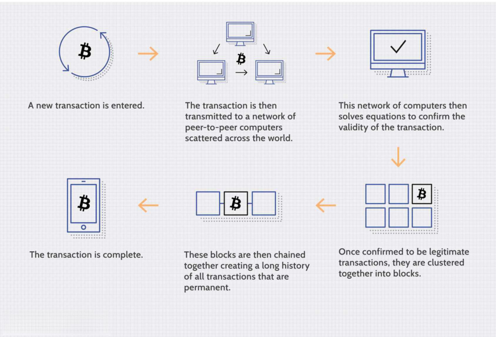

## Table of Contents

## What is block time in the context of blockchain technology?

Block time in blockchain technology refers to the average time it takes for a new block of transactions to be added to the blockchain. Think of it like a timer that starts when one block is added and stops when the next one is added. This time can vary depending on the specific blockchain, but it's an important measure because it affects how quickly transactions are processed and confirmed.

For example, in Bitcoin, the block time is designed to be about 10 minutes. This means that, on average, a new block of transactions is added to the Bitcoin blockchain every 10 minutes. If the block time were shorter, transactions would be confirmed faster, but it could also lead to more errors and less security. If it were longer, the blockchain would be more secure, but transactions would take longer to process. So, finding the right block time is a balance between speed and security.

## How is block time measured in different blockchain networks?

Different blockchain networks measure block time in their own way, but the basic idea is the same. They look at how long it takes, on average, to add a new block of transactions to the chain. For Bitcoin, the target is about 10 minutes. They use a special math problem that miners solve, and the difficulty of this problem adjusts to keep the block time close to 10 minutes. If blocks are coming too fast, the problem gets harder, and if they're too slow, it gets easier.

Ethereum, on the other hand, aims for a block time of around 12 to 15 seconds. They use a different method called "proof of stake," where validators are chosen to add new blocks based on how many coins they hold and are willing to "stake" as a sort of deposit. This system is designed to be faster than Bitcoin's, but it still needs to balance speed with security. Both Bitcoin and Ethereum, and other blockchains, constantly monitor and adjust their systems to keep their block times as stable as possible.

## What factors influence the block time in a blockchain?

Several things can affect how long it takes to add a new block to a blockchain. One big [factor](/wiki/factor-investing) is the type of consensus mechanism the blockchain uses. For example, Bitcoin uses "proof of work," where miners solve hard math problems to add blocks. The difficulty of these problems changes to keep the block time around 10 minutes. If the problems are too easy, blocks get added too fast, and if they're too hard, it takes too long. Ethereum uses "proof of stake," where validators are picked based on how many coins they have. This method can be faster, but it still needs to balance speed with keeping the network secure.

Another factor is how busy the network is. If lots of people are using the blockchain at the same time, it can take longer to process all the transactions and add them to a block. Also, the size of the blocks matters. If blocks can hold more transactions, they might take longer to fill up and be added to the chain. The technology and software running the blockchain can also play a role. If the software is updated or changed, it might affect how quickly new blocks are created. All these things together help decide how long it takes to add a new block to the blockchain.

## Why is block time important for the security and efficiency of a blockchain?

Block time is super important for keeping a blockchain both safe and fast. If the block time is too short, it means new blocks are added really quickly. This can be good because it makes transactions happen faster, which is great for people using the blockchain. But, if blocks are added too fast, there's more chance for bad stuff to happen, like people trying to cheat the system by making changes to the blockchain. So, a short block time can make the blockchain less safe.

On the other hand, if the block time is too long, it makes the blockchain more secure. It's harder for someone to mess with the blockchain if it takes longer to add new blocks. But, this also means that transactions take longer to go through, which can be annoying for users who want to move their money quickly. So, finding the right block time is all about balancing how fast and safe the blockchain needs to be. Different blockchains choose different times based on what they think is most important for their users.

## How does the consensus mechanism affect block time?

The consensus mechanism is like the rulebook that decides how a blockchain agrees on adding new blocks. Different blockchains use different rules, and these rules can make the block time shorter or longer. For example, Bitcoin uses a system called "proof of work." In this system, miners solve hard math problems to add new blocks. The time it takes to solve these problems decides how long it takes to add a new block. If the problems are too easy, blocks get added too fast, and if they're too hard, it takes too long. Bitcoin aims for a block time of about 10 minutes by changing how hard the problems are.

Another popular system is "proof of stake," which Ethereum uses. In this system, validators are picked to add new blocks based on how many coins they have and are willing to "stake" as a sort of deposit. This method can be faster than proof of work because it doesn't need to solve math problems. Ethereum aims for a block time of around 12 to 15 seconds. The choice of consensus mechanism affects how quickly or slowly new blocks are added, which is important for keeping the blockchain both fast and secure.

## What are the typical block times for popular blockchains like Bitcoin and Ethereum?

Bitcoin has a typical block time of about 10 minutes. This means that, on average, a new block of transactions is added to the Bitcoin blockchain every 10 minutes. Bitcoin uses a system called "proof of work," where miners solve hard math problems to add new blocks. The difficulty of these problems changes to keep the block time close to 10 minutes. If blocks are coming too fast, the problems get harder, and if they're too slow, they get easier. This helps balance speed and security.

Ethereum has a typical block time of around 12 to 15 seconds. This is much faster than Bitcoin because Ethereum uses a different system called "proof of stake." In this system, validators are chosen to add new blocks based on how many coins they hold and are willing to "stake" as a sort of deposit. This method doesn't need to solve math problems, so it can add blocks more quickly. Ethereum's faster block time makes transactions happen faster, but it still needs to balance speed with keeping the network secure.

## How can block time be verified by users or nodes in a blockchain network?

Users and nodes in a blockchain network can check the block time by looking at the timestamps on the blocks. Each block has a timestamp that shows when it was added to the blockchain. By comparing the timestamps of different blocks, users can see how much time passed between them. For example, if a user looks at the timestamp on block number 100 and then at the timestamp on block number 101, they can figure out how long it took to add that new block.

This process is important because it helps everyone on the network agree on how fast new blocks are being added. Nodes, which are like the computers that keep the blockchain running, constantly check these timestamps to make sure the block time stays close to what the blockchain is aiming for. If the block time starts to get too fast or too slow, the nodes can help adjust the system to bring it back in line. This way, everyone can trust that the blockchain is working the way it should.

## What are the consequences of having too short or too long block times?

Having too short block times can make a blockchain faster, which is good for people who want their transactions to go through quickly. But, it can also make the blockchain less safe. When blocks are added really fast, there's more chance for someone to try and cheat the system by changing the blockchain. This is because there's less time for everyone to check and agree on the new blocks. So, while short block times can make things faster, they can also make it easier for bad stuff to happen.

On the other hand, having too long block times can make a blockchain more secure. It's harder for someone to mess with the blockchain if it takes longer to add new blocks. Everyone has more time to check and agree on the new blocks, which makes the system safer. But, long block times also mean that transactions take longer to go through. This can be frustrating for users who want to move their money quickly. So, finding the right block time is all about balancing how fast and safe the blockchain needs to be.

## How do developers adjust block time in a blockchain protocol?

Developers can adjust block time in a blockchain by changing the rules that decide how quickly new blocks are added. For example, in a blockchain that uses "proof of work" like Bitcoin, developers can change how hard the math problems are that miners need to solve. If they want the block time to be shorter, they can make the problems easier, so miners can solve them faster and add new blocks more quickly. If they want the block time to be longer, they can make the problems harder, so it takes longer for miners to solve them and add new blocks.

In a blockchain that uses "proof of stake" like Ethereum, developers can adjust the block time by changing how validators are chosen to add new blocks. They might change the rules about how many coins someone needs to "stake" to be picked as a validator, or how often new validators are chosen. By tweaking these rules, developers can make the block time shorter or longer. It's all about finding the right balance between making transactions fast and keeping the blockchain secure.

## What advanced techniques are used to optimize block time in blockchain systems?

To make block time better in blockchain systems, developers use a few smart tricks. One way is to use something called "sharding." This breaks the blockchain into smaller parts, or "shards," so that different parts of the network can work on adding new blocks at the same time. This can make the whole system faster because more work can be done at once. Another trick is to use "layer 2 solutions" like the Lightning Network for Bitcoin. These solutions let transactions happen off the main blockchain, which can make things quicker without messing with the main chain's security.

Another technique is to adjust the "difficulty adjustment algorithm" more often. In blockchains like Bitcoin, this algorithm changes how hard the math problems are that miners need to solve. By making these changes more often, the block time can stay closer to what's wanted, even if the number of miners or the network's busyness changes a lot. Also, some blockchains use "adaptive block size limits." This means the size of the blocks can change based on how busy the network is, which can help keep the block time steady. All these methods help keep the blockchain fast and safe at the same time.

## How does block time impact transaction confirmation times and network scalability?

Block time has a big effect on how long it takes for transactions to be confirmed on a blockchain. If the block time is short, new blocks are added quickly, which means transactions get confirmed faster. This is good for people who want to use the blockchain for things like buying things online, where they need their money to move fast. But, if the block time is too short, it can make the blockchain less safe because there's less time for everyone to check and agree on the new blocks. So, a shorter block time can speed up transactions but might also make the system easier to cheat.

Block time also affects how well a blockchain can handle a lot of transactions, which is called scalability. If the block time is long, the blockchain can be more secure, but it can't handle as many transactions at once because it takes longer to add new blocks. This can slow things down and make the network less useful for busy times. On the other hand, a shorter block time can help the blockchain handle more transactions at once, making it more scalable. But, this needs to be done carefully to keep the network safe. So, finding the right block time is key to making sure the blockchain can grow and handle more users without losing its security.

## What are the future trends and research directions in block time management for blockchain technology?

In the future, people who work on blockchains are looking at ways to make block time even better. One big idea is using something called "adaptive block time algorithms." These are smart ways to change the block time based on how busy the network is. If the blockchain is getting lots of transactions, the block time could get shorter to handle them faster. But if it's not so busy, the block time could get a bit longer to keep things safe. Another idea is to use "[machine learning](/wiki/machine-learning)" to predict how the network will act and adjust the block time before problems happen. This could make the blockchain run smoother and be more reliable.

Another trend is looking at how to make blockchains work together better, which is called "interoperability." If different blockchains can share information and work together, they might be able to use each other's strengths to manage block time better. For example, a fast blockchain could help a slower one with quick transactions, while the slower one could help keep things secure. Researchers are also thinking about new ways to use "layer 2 solutions" to make transactions faster without changing the main blockchain's block time. These ideas could make blockchains more useful for more people and keep them safe at the same time.

## References & Further Reading

[1]: Nakamoto, S. (2008). ["Bitcoin: A Peer-to-Peer Electronic Cash System."](https://nakamotoinstitute.org/library/bitcoin/) 

[2]: Bonneau, J., Miller, A., Clark, J., Narayanan, A., Kroll, J. A., & Felten, E. W. (2015). ["SoK: Research Perspectives and Challenges for Bitcoin and Cryptocurrencies."](https://ieeexplore.ieee.org/document/7163021) IEEE Symposium on Security and Privacy.

[3]: Wood, G. (2014). ["Ethereum: A Secure Decentralised Generalised Transaction Ledger."](https://ethereum.github.io/yellowpaper/paper.pdf) Ethereum Project Yellow Paper.

[4]: Buterin, V. (2014). ["A Next-Generation Smart Contract and Decentralized Application Platform."](https://ethereum.org/content/whitepaper/whitepaper-pdf/Ethereum_Whitepaper_-_Buterin_2014.pdf) Ethereum Whitepaper.

[5]: Bonneau, J., Miller, A., Clark, J., Narayanan, A., Kroll, J. A., & Felten, E. W. (2015). ["Sok: Research Perspectives and Challenges for Bitcoin and Cryptocurrencies."](https://ieeexplore.ieee.org/document/7163021) 2015 IEEE Symposium.

[6]: Antonopoulos, A. M. (2014). ["Mastering Bitcoin: Unlocking Digital Cryptocurrencies."](https://books.google.com/books/about/Mastering_Bitcoin.html?id=IXmrBQAAQBAJ) O'Reilly Media.

[7]: Bonneau, J., Narayanan, A., Felten, E. W., Miller, A., & Goldfeder, S. (2016). ["Bitcoin and Cryptocurrency Technologies."](https://press.princeton.edu/books/hardcover/9780691171692/bitcoin-and-cryptocurrency-technologies) Princeton University Press.