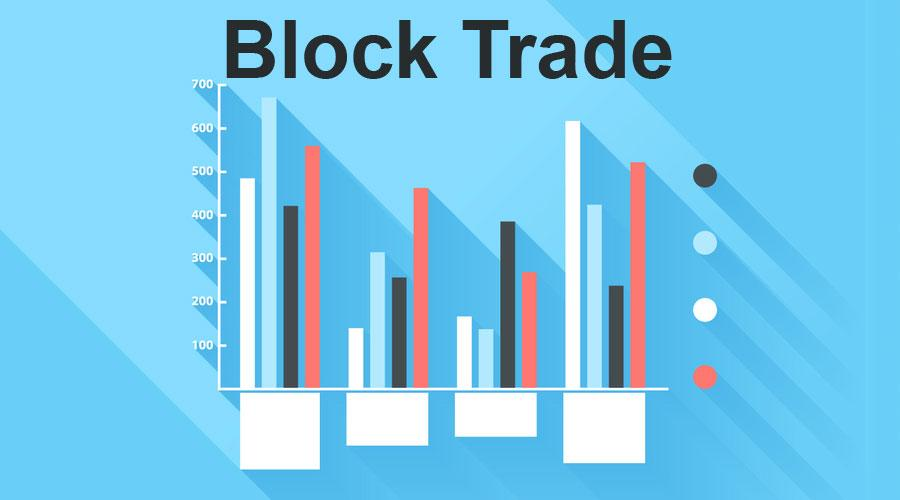

The financial markets are complex ecosystems where various financial instruments, such as stocks, bonds, currencies, and derivatives, are traded. These markets enable the mobilization of capital, risk management, and the establishment of prices, contributing significantly to global economic stability and growth. The dynamics of financial markets are influenced by numerous factors, including economic indicators, political events, and technological advancements, which collectively affect pricing and trading activities.

Block trades are significant transactions in the financial markets, typically involving large volumes of securities traded privately between parties, often bypassing public exchanges to minimize market impact. These trades are predominantly executed by institutional investors, such as mutual funds, pension funds, and hedge funds. The significance of block trades lies in their ability to facilitate the swift transfer of considerable share volumes without causing immediate disruptions in market prices, providing a mechanism for liquidity and stability in the financial system.



The rise of algorithmic trading has revolutionized financial markets by automating the trading process, using advanced mathematical models and computational algorithms. This technological advancement allows for the rapid execution of trades, data analysis, and strategic decision-making. Algorithmic trading enhances the efficiency of executing block trades by optimizing trade execution to mitigate the adverse effects on market prices, thereby preserving the trader's confidentiality and intent.

The objective of this article is to explore the intricacies of block trades, their market impact, and the transformative role of algorithmic trading. This exploration will provide insights into the mechanisms underlying these trading methods and the benefits and challenges they present. Furthermore, the article aims to address the ethical and regulatory aspects of block and algorithmic trading, while speculating on their future developments and innovations. Through this analysis, a comprehensive understanding of the integration of block trades with algorithmic strategies will be developed, encouraging further research and technological adaptation in financial trading practices.

## Table of Contents

## Understanding Block Trades

Block trades are an integral part of financial markets, defined as large transactions that involve the buying or selling of securities. Typically, these trades exceed a certain threshold, which varies by market, but are generally larger than standard, retail-focused transactions. In the United States, for example, a block trade usually involves a minimum of 10,000 shares or a monetary value exceeding $200,000. The primary characteristic distinguishing block trades from standard market trades is their size, which can significantly impact market dynamics. 

A critical aspect of block trades is their execution outside the open market to minimize potential market impact and price fluctuations. Standard market trades, involving smaller quantities, are typically executed directly on exchanges where prices are subject to real-time supply and demand. In contrast, block trades are frequently arranged privately and may occur in off-exchange trading venues known as "dark pools". These private negotiations allow the involved parties to agree on a price without revealing their large orders to the broader market.

The role of institutional investors is pronounced in block trading. Institutional investors, such as mutual funds, pension funds, hedge funds, and insurance companies, usually handle large volumes of assets. This makes block trades an efficient mechanism for them to adjust significant positions without causing large-scale disruptions in the asset's price. Institutional participation is driven by the need for cost-effective execution of extensive portfolios, often necessitating the discreet handling of transactions that block trading facilitates.

By engaging in block trades, institutional investors can manage their portfolios more effectively and access opportunities for strategic investments that require discretion and significant transaction sizes, which standard market trades typically cannot accommodate at such a scale without influencing market conditions significantly.

## Market Impact of Block Trades

Block trades, typically large transactions executed privately and outside of public exchanges, have the potential to significantly influence market prices. These trades are substantial in size and often involve a considerable number of securities, thus posing a risk of triggering sharp price movements if not managed carefully.

### Potential Effects of Block Trades on Market Prices

When a block trade is initiated, the sheer size of the order can lead to imbalances in supply and demand. For instance, a large buy order may push stock prices upward, while a similar sell order could pressure them downward. These market movements are primarily due to [liquidity](/wiki/liquidity-risk-premium) constraints, as not all market participants may be ready to absorb such large transactions without affecting prices.

The impact on prices can be analyzed through the concept of market impact cost, which measures the change in price due to executing a large order. The market impact cost is influenced by several factors, including the trade size relative to average daily [volume](/wiki/volume-trading-strategy), liquidity of the asset, and current market [volatility](/wiki/volatility-trading-strategies).

$$
\text{Market Impact Cost} = f(\text{Trade Size}, \text{Liquidity}, \text{Volatility})
$$

### Strategies to Minimize Market Disruption

To execute block trades while minimizing market disruption, various strategies can be employed:

1. **Dark Pools**: These private exchanges allow block trades to be executed without publicly displaying the order size and price, thus reducing market impact.

2. **Algorithmic Trading**: Algorithms can be programmed to break down large block trades into smaller, less conspicuous trades distributed over time, thereby reducing market impact.

3. **VWAP and TWAP**: Techniques like Volume Weighted Average Price (VWAP) and Time Weighted Average Price (TWAP) can be used to execute orders based on average prices over a given period or volume, minimizing the disruptive effect on the market.

4. **Negotiated Trades**: Direct negotiations between institutional buyers and sellers can facilitate block trades without disrupting market prices, often through the use of intermediaries.

### Case Study: Impactful Block Trade Example

A notable example of a recent impactful block trade is the transaction involving Archegos Capital Management in March 2021. Archegos triggered significant market volatility by liquidating several large positions rapidly, leading to multi-billion dollar losses for several banks involved as intermediaries, including Credit Suisse and Nomura.

The large-scale unwinding of positions in stocks such as ViacomCBS and Discovery Inc. not only led to substantial declines in these stocks' prices but also raised concerns about the transparency and risk management practices of involved parties. This event underscored the vital importance of strategic planning and effective execution when managing block trades to mitigate systemic risk and potential market disruption. 

This example highlights the necessity for better risk management frameworks and the importance of employing sophisticated trading strategies and technologies to handle block trades smoothly and efficiently.

## Algorithmic Trading: Revolutionizing Financial Markets

Algorithmic trading refers to the use of computer algorithms to automate trading strategies, allowing for the rapid and efficient execution of trades. It emerged as a transformative force in financial markets by utilizing mathematical models and complex formulas to maximize trading profits. Algorithms are designed to follow specific rules for placing trades, including factors like timing, price, and volume.

Executing large block trades often involves significant market impact, potentially causing adverse price movements. Algorithms can mitigate such risks by breaking a large order into smaller pieces, executing them at opportune moments to minimize market impact and reduce costs. These algorithms, known as execution algorithms, are employed to seamlessly integrate block trades into the market, optimizing execution prices while maintaining anonymity. A commonly used strategy is the Volume-Weighted Average Price (VWAP), which targets an average price of a security over a specific period, aligning trade execution with market volume patterns.

For large block trades, algorithms like TWAP (Time Weighted Average Price) and IS (Implementation Shortfall) are also frequently applied. TWAP distributes the order quantity evenly over a given time period, while IS seeks to minimize the difference between the decision price and the final execution price, typically adjusting for real-time market conditions.

Market-making algorithms, another aspect of [algorithmic trading](/wiki/algorithmic-trading), provide liquidity by continuously quoting buy and sell prices. These strategies facilitate more efficient execution of block trades as they maintain market stability and reduce spreads. Statistical [arbitrage](/wiki/arbitrage) algorithms exploit pricing inefficiencies between correlated financial instruments, creating opportunities for executing profitable trades that can incorporate block trades if aligned with larger market movements.

Incorporating [machine learning](/wiki/machine-learning) techniques, algorithmic trading can adapt to evolving market conditions. Algorithms leverage historical data to train models capable of predicting short-term price movements or changes in market conditions, supporting dynamic decision-making for block trades. Python's extensive libraries, such as Pandas for data manipulation and TensorFlow for machine learning, serve as valuable tools for developing sophisticated trading algorithms. For instance, a simple moving average crossover strategy can be implemented as follows:

```python
import pandas as pd

# Assuming 'data' is a DataFrame with 'Close' prices
data['SMA50'] = data['Close'].rolling(window=50).mean()
data['SMA200'] = data['Close'].rolling(window=200).mean()

# Generate signal
data['Signal'] = 0
data['Signal'][50:] = np.where(data['SMA50'][50:] > data['SMA200'][50:], 1, -1)
```

By executing strategies through well-designed algorithms, traders can efficiently manage large block trades, reduce transaction costs, and capitalize on market opportunities with precision and speed.

## Developing a Block Trade Algorithmic Trading Strategy

Creating an algorithmic trading strategy for block trades involves several key steps that are critical to its success. These steps include defining the trading objectives, developing the algorithm, rigorous data analysis, [backtesting](/wiki/backtesting), and implementing robust risk management protocols.

Initially, defining clear trading objectives is essential. This involves determining the specific goals of the trading strategy, such as the target asset classes, desired time horizons, and acceptable levels of risk. Once these objectives are established, the development of the algorithm can begin. This involves selecting appropriate algorithmic models, such as [statistical arbitrage](/wiki/statistical-arbitrage) or market-making algorithms, that are aligned with the trading objectives.

Data analysis is a cornerstone in the development of a successful algorithmic trading strategy. High-frequency trading data, historical market prices, and volume data provide insights into market trends and patterns. Techniques such as feature engineering and dimensionality reduction can be employed to enhance data quality. For example, Principal Component Analysis (PCA) can be applied to identify key factors that influence asset prices.

```python
from sklearn.decomposition import PCA
import numpy as np

# Example of PCA implementation
data = np.array([[2.5, 2.4], [0.5, 0.7], [2.2, 2.9], [1.9, 2.2], [3.1, 3.0], [2.3, 2.7], [2, 1.6], [1, 1.1], [1.5, 1.6], [1.1, 0.9]])
pca = PCA(n_components=2)
pca_fit = pca.fit_transform(data)
```

Backtesting is a critical process that validates the strategy by simulating its performance on historical data. This process helps identify potential issues and refine the algorithm before live deployment. A robust backtesting framework should account for transaction costs, slippage, and market impact. Python libraries such as `Backtrader` or `Zipline` are popular tools for backtesting.

```python
# Pseudocode for a basic backtesting loop
for date in historical_data:
    signal = strategy.generate_signal(date)
    if signal:
        execute_trade(signal, date)
    portfolio.update(date)
```

Risk management is another crucial aspect of developing a block trade algorithmic strategy. This involves setting position limits, diversifying across assets, and employing stop-loss orders to protect against adverse market movements. Portfolio optimization techniques, such as the Markowitz Efficient Frontier, can help in allocating assets to maximize returns for a given risk level.

In summary, developing a block trade algorithmic trading strategy requires a structured approach that incorporates clear objectives, data analysis, backtesting, and comprehensive risk management. By rigorously following these steps, traders can enhance the efficiency and effectiveness of their block trade executions.

## Advantages and Challenges of Algo Trading in Block Trades

Algorithmic trading has significantly influenced the execution of block trades in financial markets, offering both advantages and challenges. By employing advanced computational and mathematical models, traders can optimize their strategies for large transactions, while also confronting certain obstacles.

**Benefits of Using Algorithms for Block Trades**

1. **Efficiency and Speed**: Algorithms enable traders to execute block trades swiftly, often with minimal lag. This rapid processing reduces the time large orders affect the market, potentially decreasing the likelihood of price slippage. Swift trade execution helps align the trade price closer to the intended value.

2. **Cost Reduction**: Automated trading minimizes the manual intervention required in executing block trades, thus lowering the transaction costs. Algorithms can dynamically adjust strategies to reduce the market impact, minimizing costs associated with unfavorable market moves.

3. **Enhanced Precision and Accuracy**: Algorithms can process vast datasets to identify optimal trading opportunities with high precision. This capability allows traders to structure block trades that can offer better pricing and timing, maximizing the trade's effectiveness.

4. **Complex Strategy Implementation**: With algorithms, traders can implement sophisticated strategies, such as slicing large orders into smaller ones to be executed over time. Techniques like VWAP (Volume Weighted Average Price) and TWAP (Time Weighted Average Price) utilize advanced algorithms to optimize execution without significantly altering market dynamics.

5. **Risk Management**: Algorithms can incorporate risk management parameters—such as stop-loss orders and volatility thresholds—into the execution process, potentially safeguarding against adverse market movements during the block trade process.

**Challenges Faced by Traders**

1. **Market Risk**: Even with sophisticated algorithms, block trades can still pose a significant impact on market prices, especially in less liquid markets. Adjusting algorithms dynamically to mitigate this impact requires ongoing monitoring and fine-tuning.

2. **Algorithm Complexity and Maintenance**: Building and maintaining complex algorithms require significant expertise and resources. Regular updates are necessary to adapt to changing market conditions, which can result in substantial costs and operational effort.

3. **Data Dependency**: High-quality and timely market data is crucial for algorithm performance. Any inaccuracy or delay in data can lead to suboptimal trades or errors in execution, which might magnify losses in block trades.

4. **Technological and Infrastructural Challenges**: Deploying high-frequency trading strategies involves maintaining cutting-edge technology and robust infrastructure. Any failure in these systems can disrupt trading activities and lead to potential financial setbacks.

5. **Regulatory Compliance**: Ensuring that algorithmic trading practices comply with regulatory standards poses an ongoing challenge. Implementing audits and controls within trading systems adds complexity and requires regular updates to adhere to evolving regulations.

**Addressing Common Misconceptions**

1. **Algorithmic Trading Equals High Risk**: While some perceive algorithmic trading as inherently risky, it actually allows for precise control over trades, offering tools for robust risk management. The key lies in structuring and monitoring the algorithms effectively.

2. **Algorithms Guarantee Profitability**: There is a misconception that algorithmic trading ensures profits. In reality, market conditions, model assumptions, and data quality considerably influence outcomes. Successful algo trading depends on accurately modeling and adapting to market dynamics.

3. **Exclusive to High-Speed Environments**: While often associated with high-frequency trading, algorithms are also designed for longer-term strategies, suitable for executing substantial block trades over longer durations to minimize market impact.

In conclusion, while algorithmic trading presents a myriad of advantages such as efficiency and complex strategy execution for block trades, it also poses challenges like market risk and significant dependency on technology and data. Careful consideration and strategic planning are vital in harnessing the full potential of algorithmic trading in block trading environments.

## Ethics and Regulations in Block and Algo Trading

The regulation of block and algorithmic trading is essential to ensure fair and transparent financial markets. Block trades, due to their size and potential impact on market prices, often attract regulatory scrutiny. They are typically governed by rules set by regulatory bodies such as the Securities and Exchange Commission (SEC) in the United States, the European Securities and Markets Authority (ESMA) in Europe, and other similar organizations globally. These regulations aim to prevent market manipulation, insider trading, and ensure market integrity.

Algorithmic trading, including high-frequency trading ([HFT](/wiki/high-frequency-trading-strategies)), is subject to additional regulatory oversight due to its rapid execution speed and potential to cause extreme volatility. Regulatory frameworks often require algorithmic traders to adhere to best execution policies, which mandate that they execute trades under the most favorable terms for their clients, considering price, costs, speed, and likelihood of execution.

One of the key ethical considerations in algorithmic trading strategies is the avoidance of manipulative tactics, such as spoofing or layering. Spoofing involves placing orders with the intention of canceling them before execution, aiming to mislead other traders regarding supply and demand levels. Such practices can be detrimental to market health and are illegal under many jurisdictions.

Regulatory actions have significantly impacted trading practices. For instance, the SEC's Regulation National Market System (Reg NMS) was implemented to enhance competition and ensure that investors receive best prices by promoting price transparency and efficiency. Similarly, the European Union's Markets in Financial Instruments Directive II (MiFID II) requires rigorous reporting and transparency standards, influencing how algorithmic trading firms operate.

Ethically, algorithmic trading requires robust risk controls to prevent unintended consequences such as flash crashes, which have occurred due to algorithm malfunctions or unexpected market conditions. Firms must also consider the implications of their algorithms on market stability and fairness, avoiding strategies that could unduly disrupt the market.

In conclusion, adherence to regulatory frameworks and ethical considerations is crucial for the sustainability of both block and algorithmic trading. As these trading methods continue to evolve, ongoing refinement of regulations and ethical standards will be necessary to address new challenges and technological advancements.

## Future of Block Trade and Algorithmic Trading

Block trading and algorithmic trading are at a pivotal juncture, poised to undergo significant transformation as technological advancements continue to reshape financial markets. This transition is largely driven by innovations in machine learning (ML) and [artificial intelligence](/wiki/ai-artificial-intelligence) (AI), which are setting new benchmarks for efficiency, accuracy, and strategic complexity in trading practices.

### Technological Evolution in Block Trading

The evolution of block trading with advanced technologies anticipates a landscape where trade execution is more seamless and less impactful on market prices. One foreseeable trend is the enhanced execution of block trades through more sophisticated algorithms that can predict market movements with greater precision and execute trades with minimal market disturbance. As processing power increases and data analytics become more nuanced, block trades can potentially be executed in ways that are less traceable by traditional market participants, thereby preserving the strategic intent behind these trades.

Furthermore, integrations of blockchain technology could further augment the block trading paradigm by providing greater transparency and reducing counterparty risk. Blockchain's decentralized ledger can ensure the security and authenticity of each transaction, facilitating a more trustworthy environment for executing large-scale trades.

### The Role of Machine Learning and AI

Machine learning and AI are anticipated to play central roles in the future of algorithmic trading strategies. These technologies can analyze vast datasets at unprecedented speeds, uncovering patterns and insights that would be impervious to traditional statistical methods. For instance, ML algorithms can adapt to new market conditions in real-time, learning from previous trades to optimize decision-making processes continuously.

AI-driven models can also simulate a multitude of trading scenarios, learning from historical data to predict future price movements. This adaptive learning capability is a game changer for block trades, where predicting market impact and timing are crucial for successful execution. Moreover, [reinforcement learning](/wiki/reinforcement-learning), a subset of machine learning, enables trading algorithms to interact with the market environment dynamically, learning optimal strategies through trial and error.

### Potential for Growth and Innovation

The potential for growth in algorithmic trading is immense, with innovation set to proliferate across various facets of the trading process. One specific area ripe for development is the improvement of natural language processing (NLP) techniques, enabling algorithms to incorporate textual data from news and social media into trading strategies. This can provide a more holistic approach to market analysis, incorporating sentiment and market psychology.

Moreover, the democratization of machine learning tools and platforms is likely to increase the participation of smaller institutional players and even individual traders in sophisticated trading strategies. Open-source libraries and cloud-based services are lowering the barriers to entry, allowing more entities to develop and deploy their own trading algorithms.

### Conclusion

The future of block and algorithmic trading is characterized by increased integration of machine learning and AI, offering promising avenues for sophisticated and adaptive trading strategies. Blockchain technology may further enhance transparency and reduce risks. As these technologies advance, they are likely to drive significant growth and innovation, reshaping the landscape of financial markets. This progression encourages further research and adaptation of these cutting-edge technologies to maintain a competitive edge in trading practices.

## Conclusion

In conclusion, block trades and algorithmic trading have fundamentally transformed the landscape of financial markets. Block trades, which are characterized by large quantities of securities being bought or sold without significantly impacting the market price, have been pivotal in facilitating the needs of institutional investors. These trades require meticulous planning and execution due to their magnitude and potential market impact. Algorithmic trading has emerged as a vital tool in executing block trades efficiently, leveraging sophisticated algorithms to minimize market disruption and ensure optimal execution prices.

The integration of block trades with algorithmic strategies offers substantial benefits, including enhanced execution efficiency, reduced transaction costs, and greater market liquidity. Algorithms are programmed to analyze vast datasets in real-time, allowing traders to execute large orders in a manner that is both time-sensitive and cost-effective. However, designing an efficient algorithmic trading strategy requires rigorous backtesting, data analysis, and risk management to ensure robustness and adaptability to market conditions.

As technology continues to advance, there is significant potential for innovation in how block and algorithmic trading are implemented. Future developments in machine learning and artificial intelligence are poised to further refine trading strategies, potentially enhancing predictive capabilities and execution precision.

Given the dynamic nature of financial markets, continuous research and adaptation to new technologies are crucial. As the industry evolves, embracing innovation will be essential for traders and institutions to maintain competitiveness and capitalize on emerging opportunities. Further exploration of how cutting-edge technologies can be harnessed to optimize trading strategies promises not only to advance market efficiency but also to unlock new avenues for growth and success in financial trading.

## References & Further Reading

[1]: Bergstra, J., Bardenet, R., Bengio, Y., & Kégl, B. (2011). ["Algorithms for Hyper-Parameter Optimization"](https://papers.nips.cc/paper/4443-algorithms-for-hyper-parameter-optimization). Advances in Neural Information Processing Systems 24.

[2]: ["Advances in Financial Machine Learning"](https://www.amazon.com/Advances-Financial-Machine-Learning-Marcos/dp/1119482089) by Marcos Lopez de Prado

[3]: ["Evidence-Based Technical Analysis: Applying the Scientific Method and Statistical Inference to Trading Signals"](https://www.amazon.com/Evidence-Based-Technical-Analysis-Scientific-Statistical/dp/0470008741) by David Aronson

[4]: ["Machine Learning for Algorithmic Trading"](https://github.com/PacktPublishing/Machine-Learning-for-Algorithmic-Trading-Second-Edition) by Stefan Jansen

[5]: ["Quantitative Trading: How to Build Your Own Algorithmic Trading Business"](https://books.google.com/books/about/Quantitative_Trading.html?id=j70yEAAAQBAJ) by Ernest P. Chan