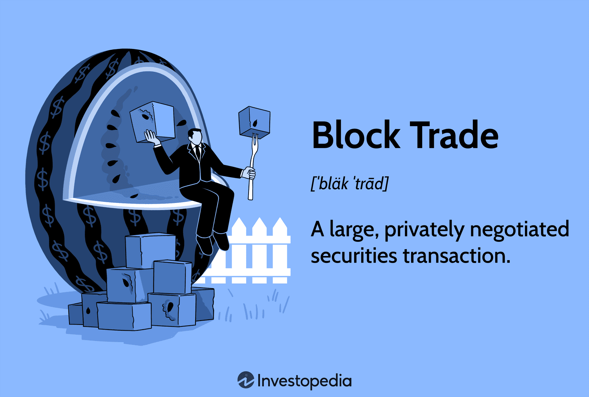

## Table of Contents

## What is a block trade?

A block trade is a large purchase or sale of securities, usually stocks, that happens outside of the public market. It's like when someone wants to buy or sell a lot of something at once, so they do it privately instead of going to a busy store where everyone can see. This is often done by big investors, like banks or investment firms, who need to move a lot of shares without affecting the price too much.

When a block trade happens, it's usually because the buyer and seller have agreed on a price privately. This helps keep the market stable because if a big sale happened in the open market, it might scare other people and make the stock price drop quickly. By doing it privately, they can keep things calm and move their big amount of shares without causing a big fuss.

## Why do investors use block trades?

Investors use block trades because they need to buy or sell a lot of shares at once. Imagine you have a big collection of toys and you want to sell them all quickly. If you go to a small toy store, it might not be able to buy all your toys, and if you sell them one by one, it could take a long time. So, you find someone who can buy your whole collection at once. That's what a block trade is like for investors with lots of shares.

Another reason investors use block trades is to keep the market calm. If a big investor suddenly sells a lot of shares in the open market, it might make other people worried and cause the stock price to drop. By using a block trade, the investor can sell their shares quietly without scaring everyone else. This helps keep the stock price stable and protects the investor's interests.

## How does a block trade differ from a regular trade?

A block trade is different from a regular trade because it involves a lot more shares. When you do a regular trade, you might buy or sell just a few shares of a company. But with a block trade, you're talking about thousands or even millions of shares at once. It's like the difference between buying a single candy bar at the store versus buying a whole truckload of candy bars.

Another big difference is that block trades happen privately, away from the public market. Regular trades happen on the stock exchange where everyone can see them. But with a block trade, the buyer and seller agree on a price behind the scenes. This helps keep the stock price from moving too much because if everyone saw a big sale happening, it might make them worried and cause the price to drop. So, block trades are a way to move big amounts of shares quietly.

## What are the typical sizes of block trades?

Block trades are usually very big. They can be for thousands or even millions of shares. For example, if a company has 100 million shares out there, a block trade might be for 10,000 shares or more. The exact number can change depending on the company and how many shares it has.

The size of a block trade can also depend on what the stock exchange says. Some places have rules about what counts as a block trade. For example, the New York Stock Exchange says a block trade is at least 10,000 shares or a trade worth $200,000 or more. So, block trades are always big, but the exact size can be different based on where you are and what the rules are.

## Who are the main participants in block trades?

The main people who do block trades are big investors, like banks, investment firms, and hedge funds. These groups have a lot of money and often need to buy or sell a lot of shares at once. They use block trades to move these big amounts without causing a fuss in the market.

Sometimes, big companies also use block trades. If a company wants to sell a lot of its own shares or buy back a lot of shares, they might do it through a block trade. This way, they can do it quietly and keep the stock price from moving too much.

## What are the advantages of executing a block trade?

One big advantage of a block trade is that it lets big investors buy or sell a lot of shares without making the stock price move too much. Imagine you want to sell a lot of toys at once. If you do it in a small store, everyone might see and get worried, making the price of toys drop. But if you sell your toys quietly to one buyer, you can keep things calm. That's what a block trade does for stocks. It helps keep the market stable because it's done privately.

Another advantage is that block trades can be faster and easier for big investors. When you have a lot of shares to move, doing it one by one on the public market can take a long time. A block trade lets you do it all at once. It's like selling your whole toy collection to one person instead of trying to find many buyers. This saves time and effort for the investor.

## What are the potential risks associated with block trades?

One risk of block trades is that the price might not be as good as it could be on the public market. When you do a block trade, you agree on a price privately. Sometimes, that price might be lower than what you could get if you sold the shares one by one on the open market. So, you might not get the best deal.

Another risk is that even though block trades are done privately, people might still find out about them. If word gets out that a big investor is selling a lot of shares, it could still make other people worried and cause the stock price to drop. This is called market impact, and it's something investors try to avoid but can't always control.

## How is a block trade executed?

A block trade happens when a big investor wants to buy or sell a lot of shares at once. They usually work with a special kind of broker called a block trader or a dealer. The investor tells the block trader how many shares they want to move and at what price. The block trader then looks for another big investor who wants to buy or sell that many shares at that price. They talk in private, away from the busy public market, to make sure they can agree on a price without causing a big fuss.

Once the block trader finds someone willing to take the other side of the trade, they agree on the price and the number of shares. This is all done quietly so that the big trade doesn't scare other people in the market. After everything is agreed upon, the block trade is done, and the shares move from one investor to another. This way, the big investor can move a lot of shares without making the stock price jump around too much.

## What role do dark pools play in block trading?

Dark pools are private places where big investors can trade a lot of shares without everyone seeing what they're doing. They're like secret clubs where members can buy and sell big amounts of stocks quietly. This helps keep the stock price from moving too much because if everyone saw a big trade happening, it might scare them and make the price drop.

When someone wants to do a block trade, they can use a dark pool to find someone else who wants to trade the same amount of shares. The dark pool matches the buyer and seller privately, so the trade doesn't affect the public market. This makes it easier for big investors to move their shares without causing a big fuss.

## How do regulations affect block trading?

Regulations are rules that make sure block trades are done fairly and safely. Different places have different rules about what counts as a block trade. For example, the New York Stock Exchange says a block trade needs to be at least 10,000 shares or worth $200,000 or more. These rules help make sure that block trades don't mess up the market too much. They also make sure that everyone knows what's going on and that no one is cheating.

Sometimes, regulations can make block trading a bit harder. For example, some rules say that big trades need to be reported to the public after they happen. This is to keep things transparent and fair. But it can also make investors a bit worried because if people find out about a big trade, it might still affect the stock price. So, while regulations help keep the market safe, they can also make it trickier for investors to do big trades quietly.

## What strategies can be used to minimize the market impact of a block trade?

One way to minimize the market impact of a block trade is to use a dark pool. A dark pool is like a secret club where big investors can trade shares without everyone seeing what they're doing. By using a dark pool, the investor can find someone else who wants to buy or sell the same amount of shares without causing a big fuss in the public market. This helps keep the stock price from moving too much because no one knows about the big trade until it's already done.

Another strategy is to break up the block trade into smaller pieces. Instead of selling all the shares at once, the investor can sell them a little bit at a time over a few days or weeks. This way, each small trade won't be big enough to scare people and make the stock price drop. It's like selling your toys one by one instead of all at once, so you don't flood the market and keep the price stable.

## How can technology enhance the efficiency of block trading?

Technology can make block trading easier and faster by using special computer programs. These programs can quickly find other investors who want to buy or sell the same amount of shares. This means the investor doesn't have to wait as long to find someone to trade with. Also, these programs can help keep the trade secret, so it doesn't scare other people in the market and cause the stock price to move too much.

Another way technology helps is by using algorithms to break up big trades into smaller ones. Instead of selling all the shares at once, the computer can spread the trade out over time. This makes each small trade less likely to affect the stock price. By doing this, the investor can move a lot of shares without making a big fuss in the market. Technology makes block trading smoother and helps keep things calm.

## What is the market impact of block trades?

Block trades, typically large transactions executed privately and outside of public exchanges, have the potential to significantly influence market prices. These trades are substantial in size and often involve a considerable number of securities, thus posing a risk of triggering sharp price movements if not managed carefully.

### Potential Effects of Block Trades on Market Prices

When a block trade is initiated, the sheer size of the order can lead to imbalances in supply and demand. For instance, a large buy order may push stock prices upward, while a similar sell order could pressure them downward. These market movements are primarily due to [liquidity](/wiki/liquidity-risk-premium) constraints, as not all market participants may be ready to absorb such large transactions without affecting prices.

The impact on prices can be analyzed through the concept of market impact cost, which measures the change in price due to executing a large order. The market impact cost is influenced by several factors, including the trade size relative to average daily [volume](/wiki/volume-trading-strategy), liquidity of the asset, and current market [volatility](/wiki/volatility-trading-strategies).

$$
\text{Market Impact Cost} = f(\text{Trade Size}, \text{Liquidity}, \text{Volatility})
$$

### Strategies to Minimize Market Disruption

To execute block trades while minimizing market disruption, various strategies can be employed:

1. **Dark Pools**: These private exchanges allow block trades to be executed without publicly displaying the order size and price, thus reducing market impact.

2. **Algorithmic Trading**: Algorithms can be programmed to break down large block trades into smaller, less conspicuous trades distributed over time, thereby reducing market impact.

3. **VWAP and TWAP**: Techniques like Volume Weighted Average Price (VWAP) and Time Weighted Average Price (TWAP) can be used to execute orders based on average prices over a given period or volume, minimizing the disruptive effect on the market.

4. **Negotiated Trades**: Direct negotiations between institutional buyers and sellers can facilitate block trades without disrupting market prices, often through the use of intermediaries.

### Case Study: Impactful Block Trade Example

A notable example of a recent impactful block trade is the transaction involving Archegos Capital Management in March 2021. Archegos triggered significant market volatility by liquidating several large positions rapidly, leading to multi-billion dollar losses for several banks involved as intermediaries, including Credit Suisse and Nomura.

The large-scale unwinding of positions in stocks such as ViacomCBS and Discovery Inc. not only led to substantial declines in these stocks' prices but also raised concerns about the transparency and risk management practices of involved parties. This event underscored the vital importance of strategic planning and effective execution when managing block trades to mitigate systemic risk and potential market disruption. 

This example highlights the necessity for better risk management frameworks and the importance of employing sophisticated trading strategies and technologies to handle block trades smoothly and efficiently.

## References & Further Reading

[1]: Bergstra, J., Bardenet, R., Bengio, Y., & Kégl, B. (2011). ["Algorithms for Hyper-Parameter Optimization"](https://papers.nips.cc/paper/4443-algorithms-for-hyper-parameter-optimization). Advances in Neural Information Processing Systems 24.

[2]: ["Advances in Financial Machine Learning"](https://www.amazon.com/Advances-Financial-Machine-Learning-Marcos/dp/1119482089) by Marcos Lopez de Prado

[3]: ["Evidence-Based Technical Analysis: Applying the Scientific Method and Statistical Inference to Trading Signals"](https://www.amazon.com/Evidence-Based-Technical-Analysis-Scientific-Statistical/dp/0470008741) by David Aronson

[4]: ["Machine Learning for Algorithmic Trading"](https://github.com/PacktPublishing/Machine-Learning-for-Algorithmic-Trading-Second-Edition) by Stefan Jansen

[5]: ["Quantitative Trading: How to Build Your Own Algorithmic Trading Business"](https://books.google.com/books/about/Quantitative_Trading.html?id=j70yEAAAQBAJ) by Ernest P. Chan