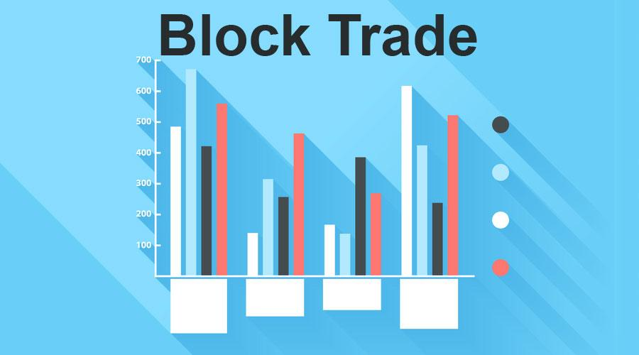

## Table of Contents

## What is a block trade?

A block trade is a large trade that involves buying or selling a big number of shares or bonds all at once. Usually, these trades are done by big investors like big companies or banks. They do this because they want to buy or sell a lot without changing the price of the stock too much. To keep the price stable, these trades are often done privately, away from the public stock market.

Block trades can affect the market because they involve so many shares. If everyone knew about a big sale or purchase, it could scare other investors and make the stock price go up or down a lot. That's why these trades are often kept secret until they are done. Once the trade is complete, the details might be shared with the public, but by then, the market has already adjusted to the new situation.

## How does a block trade differ from a regular trade?

A block trade is different from a regular trade mainly because of its size and how it's done. A regular trade is when someone buys or sells a small number of shares on the public stock market. It's like buying a few apples at the grocery store. On the other hand, a block trade is like buying a whole truckload of apples at once. It involves a huge number of shares, often thousands or even millions, and it's usually done by big investors like banks or big companies.

Because block trades are so big, they need to be handled carefully to avoid messing up the market. If everyone knew about a big sale or purchase, it could scare other investors and make the stock price go crazy. That's why block trades are often done privately, away from the public eye. They might use special trading desks or even go through a process called "dark pools" to keep the trade secret until it's done. Once the trade is complete, the details might be shared with the public, but by then, the market has already adjusted to the new situation.

## What is the typical size of a block trade?

A block trade is usually a very big trade, involving at least 10,000 shares of stock or a total value of $200,000 or more. But, the exact size can be different depending on the stock and the rules of the exchange where the trade happens. For example, for stocks that are traded a lot and have a high price, a block trade might need to be even bigger, like 50,000 shares or more.

Because block trades are so big, they can affect the market a lot. If everyone knew about a big sale or purchase, it could scare other investors and make the stock price go up or down a lot. That's why these trades are often done privately, away from the public stock market. They might use special trading desks or even go through a process called "dark pools" to keep the trade secret until it's done. Once the trade is complete, the details might be shared with the public, but by then, the market has already adjusted to the new situation.

## Who typically engages in block trades?

Block trades are usually done by big investors like big companies, banks, or investment funds. These groups have a lot of money to spend and need to buy or sell a lot of shares at once. They do this because they want to make big changes to their investments without messing up the market too much. For example, a big company might want to sell a lot of its shares to get cash for a new project, or an investment fund might want to buy a lot of shares in a company it thinks will do well.

These big investors use block trades to keep their actions secret until the trade is done. If everyone knew about a big sale or purchase, it could scare other investors and make the stock price go up or down a lot. That's why block trades are often done privately, away from the public stock market. They might use special trading desks or even go through a process called "dark pools" to keep the trade secret until it's done. Once the trade is complete, the details might be shared with the public, but by then, the market has already adjusted to the new situation.

## What are the advantages of executing a block trade?

One big advantage of doing a block trade is that it lets big investors buy or sell a lot of shares without messing up the market too much. If a big investor tried to buy or sell a lot of shares on the public stock market, it could scare other investors and make the stock price go up or down a lot. By doing a block trade privately, they can keep their actions secret until the trade is done. This helps keep the market stable and stops other investors from getting scared.

Another advantage is that block trades can be done quickly and easily. Because these trades are done away from the public stock market, big investors can work with special trading desks or use "dark pools" to make the trade happen fast. This is important for big investors who need to make big changes to their investments quickly. Once the trade is done, the details might be shared with the public, but by then, the market has already adjusted to the new situation.

## What are the potential risks associated with block trades?

One risk of block trades is that they can still affect the market, even if they are done privately. If news about a big block trade leaks out before it's done, it can scare other investors and make the stock price go up or down a lot. This can cause a lot of chaos in the market, which is what block trades are supposed to avoid. Also, if the market finds out about a big block trade after it's done, it might still react strongly, causing the stock price to change a lot.

Another risk is that block trades can be hard to do right. Because they involve so many shares, it can be tough to find someone who wants to buy or sell that many shares at the same time. This can make the trade take longer or even fall apart. Also, the people doing the trade might have to accept a lower price to get it done quickly, which means they might lose money.

## How is a block trade executed?

A block trade is done when a big investor wants to buy or sell a lot of shares all at once. They usually work with a special trading desk at a bank or use something called a "dark pool" to keep the trade secret. These places help the investor find someone else who wants to buy or sell that many shares. They do this away from the public stock market so that other investors don't know about the big trade until it's done.

Once they find someone to trade with, they agree on a price and do the trade quickly. The big investor might have to accept a lower price to get the trade done fast. After the trade is finished, the details might be shared with the public, but by then, the market has already adjusted to the new situation. This way, the big trade doesn't scare other investors and make the stock price go crazy.

## What role do dark pools play in block trading?

Dark pools are special places where big investors can do block trades without other people knowing about it. They are like secret markets where big trades can happen away from the public stock market. Big investors use dark pools because they want to buy or sell a lot of shares without scaring other investors and making the stock price go up or down a lot. 

In a dark pool, the big investor works with the people who run the pool to find someone else who wants to buy or sell that many shares. They do this quietly, so other investors don't know about the big trade until it's done. Once the trade is finished, the details might be shared with the public, but by then, the market has already adjusted to the new situation. This helps keep the market stable and stops other investors from getting scared.

## How does the timing of a block trade impact the market?

The timing of a block trade can have a big effect on the market. If a block trade happens when the market is calm, it might not cause too much trouble. The trade can be done quietly, and the market might not even notice until it's over. But if a block trade happens when the market is already nervous or busy, it can make things worse. Other investors might get scared and start selling their shares, which can make the stock price go down a lot.

Also, if news about a block trade leaks out before it's done, it can cause a lot of chaos. People might start buying or selling shares based on the news, which can make the stock price go crazy. That's why big investors try to keep block trades secret until they are finished. Once the trade is done, the details might be shared with the public, but by then, the market has already adjusted to the new situation.

## What regulatory considerations must be taken into account with block trades?

When doing block trades, big investors need to follow some rules set by the government and the stock market. These rules are there to make sure the market stays fair and honest. For example, the big investors have to report their block trades to the stock market after they are done. This helps keep everything out in the open and stops people from doing secret deals that could hurt other investors. Also, the stock market has rules about how big a block trade needs to be and how it should be done, to make sure it doesn't mess up the market too much.

Another important rule is about insider trading. Big investors can't use secret information to do block trades that give them an unfair advantage. If they do, they could get in big trouble. The government watches block trades closely to make sure no one is breaking these rules. By following these rules, block trades can be done in a way that keeps the market stable and fair for everyone.

## How can block trades be used as part of a broader trading strategy?

Big investors can use block trades as part of their overall plan to manage their money. For example, if a big company wants to sell a lot of its shares to get cash for a new project, it might do a block trade. This way, it can sell the shares quickly and quietly without scaring other investors and making the stock price go down a lot. The company can then use the money from the block trade to start its new project, which could help it grow and make more money in the future.

Another way block trades can be used is by investment funds that want to change their investments. If a fund thinks a certain stock will do well, it might buy a lot of shares through a block trade. This lets the fund get a big position in the stock without causing too much trouble in the market. Once the block trade is done, the fund can hold onto the shares and wait for the stock price to go up. If the fund is right, it can make a lot of money from the block trade as part of its overall plan to grow its investments.

## What advanced techniques can be employed to optimize block trade execution?

To make block trades work better, big investors can use special ways to find the best price and the right time to do the trade. One way is to use algorithms, which are like smart math formulas that can help find the best price for the big trade. These algorithms look at a lot of information about the stock, like how much it's being traded and what the price is doing. They can help the investor decide when to do the trade and how to do it in a way that doesn't scare other investors and make the stock price go crazy.

Another way to make block trades better is to use something called "slicing and dicing." This means breaking the big trade into smaller pieces and doing them over time. By doing this, the big investor can spread out the trade and make it less likely to mess up the market. They can also use dark pools, which are secret places to do trades, to keep the big trade quiet until it's done. This helps keep the market calm and stops other investors from getting scared. By using these smart ways, big investors can do block trades that help them reach their goals without causing too much trouble.

## References & Further Reading

[1]: Hasbrouck, J. (2007). ["Empirical Market Microstructure: The Institutions, Economics, and Econometrics of Securities Trading."](https://academic.oup.com/book/52241) Oxford University Press.

[2]: O'Hara, M. (1997). ["Market Microstructure Theory."](https://www.wiley.com/en-us/Market+Microstructure+Theory-p-9780631207610) Blackwell Publishers.

[3]: Hull, J. C. (2018). ["Options, Futures, and Other Derivatives."](https://www.pearson.com/nl/en_NL/higher-education/subject-catalogue/finance/Options-Futures-and-Other-Derivatives-Hull.html) Pearson.

[4]: Kissell, R. (2013). ["The Science of Algorithmic Trading and Portfolio Management."](https://www.sciencedirect.com/book/9780124016897/the-science-of-algorithmic-trading-and-portfolio-management) Academic Press.

[5]: ["Block Trading and Market Efficiency: A Market Microstructure Approach"](https://en.wikipedia.org/wiki/Market_microstructure) by Conrad, J., Johnson, K., & Wahal, S. (2003). Journal of Financial Markets.