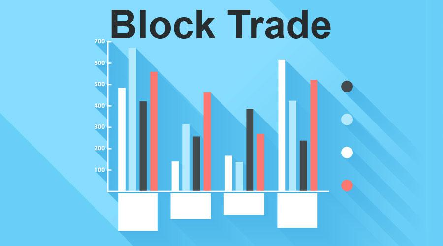

Block trading refers to the purchase or sale of large volumes of securities, typically conducted by institutional investors, hedge funds, or large-scale traders. These trades are often executed off-exchange or in dark pools to minimize market impact and maintain price stability. The significance of block trading lies in its ability to facilitate substantial transactions without causing significant fluctuations in the market. This is critical in maintaining liquidity and ensuring that the trades do not adversely affect the market’s equilibrium.

Over the years, trading mechanisms have undergone significant transformations. Initially, trading involved physical exchanges with brokers calling out orders, which evolved into electronic platforms where trades can be executed quickly and efficiently. This transition has been marked by advancements in technology and the development of more complex trading systems, including quote-driven and order-driven markets. Quote-driven markets are dominated by dealers who provide liquidity, whereas order-driven markets rely on a continuous order book. The evolution of these mechanisms has enhanced market efficiency, reduced trading costs, and improved accessibility for a broader range of participants.

Algorithmic trading, which uses computer algorithms to automate trading strategies, has emerged as a prominent feature in modern finance. By analyzing market data at high speeds, algorithms can execute trades in milliseconds, offering increased efficiency, speed, and precision in trading. Algorithmic trading has grown exponentially, now accounting for a significant portion of trading volumes in various financial markets. Its rise has not only transformed traditional trading practices but also introduced challenges such as market manipulation and the need for regulatory oversight.

This article explores key aspects of block trading, trading mechanisms, and algorithmic trading. We aim to provide insights into how these elements integrate to influence financial markets today. Understanding these components is essential for investors and traders as they navigate the complex landscape of financial markets. The integration of advanced trading strategies and technologies enables market participants to enhance execution efficiency, manage risk effectively, and capitalize on market opportunities.

As we investigate these trading components, the article underlines the importance for investors and traders to remain informed about developments in trading technologies and strategies. This knowledge is vital not only to optimize trading outcomes but also to adapt to the evolving regulatory and market conditions that govern today’s financial systems.

## Table of Contents

## Understanding Block Trading

Block trading refers to the execution of sizable orders of financial securities, whereby the transaction involves a substantial number of shares or contracts. These trades are typically executed by institutional investors, including mutual funds, pension funds, and hedge funds, aiming to buy or sell a large volume of securities without causing significant movements in the market price. A block trade is conventionally defined as a trade that involves at least 10,000 shares or a total market value of at least $200,000, though the exact size may vary depending on the liquidity and volatility of the security being traded.

Block trades differ from regular market trades primarily in their size and execution methods. While regular trades are conducted on public exchanges and involve standard order sizes, block trades often occur off-exchange, facilitated through alternative trading systems such as dark pools. This method allows large trades to be executed discreetly and often at a negotiated price, reducing the risk of adverse price movements that might occur if the trade were carried out openly in the market. 

One of the primary benefits of block trading is its ability to achieve large-scale transactions with minimized market impact. By conducting these trades off-exchange, institutions can shield their intentions from the broader market, helping to sustain the price stability of the affected securities. However, block trading also poses challenges. The lack of transparency in such trades can lead to information asymmetries, potentially disadvantaging retail investors who have less access to market-moving information. Additionally, executing large trades off-exchange can contribute to reduced market [liquidity](/wiki/liquidity-risk-premium) and may increase [volatility](/wiki/volatility-trading-strategies) if significant quantities of shares are suddenly bought or sold. 

Real-world examples of block trades illustrate their prevalence in major financial markets. For instance, a well-documented block trade occurred when a large [hedge fund](/wiki/hedge-fund-trading-strategies) decided to liquidate a substantial part of its holdings in a single stock. To prevent market disruption, the fund negotiated with several investment banks to execute the trade in a series of smaller blocks over a set period. This allowed the transaction to be completed efficiently without significantly affecting the stock's price.

The impact of block trading on market liquidity and volatility is multifaceted. On one hand, block trades provide liquidity to large investors looking to move substantial positions without dramatically impacting the market. On the other hand, if a block trade is executed suddenly or if there is a lack of counter-parties, it can lead to sharp price swings, thereby increasing volatility. Understanding these dynamics is crucial for investors and traders who must navigate the intricate balance between executing large trades efficiently and maintaining market equilibrium. 

Overall, block trading represents a significant component of the financial markets, accommodating the complex needs of institutional investors while also presenting unique challenges related to market structure and transparency.

## Trading Mechanisms in Financial Markets

Trading mechanisms in financial markets are fundamental components that dictate how transactions occur. Understanding these mechanisms is crucial for market participants as they directly influence market dynamics, liquidity, and price discovery.

**Order-Driven vs. Quote-Driven Mechanisms**

Trading mechanisms can broadly be classified into order-driven and quote-driven systems. In an order-driven market, prices are determined by buy and sell orders submitted by participants. These markets accumulate orders in a central limit [order book](/wiki/order-book-trading-strategies) (CLOB), where trades are executed when buy and sell prices match. This matching process ensures transparency and often leads to better price discovery. Examples include most global equity exchanges, such as the New York Stock Exchange (NYSE) and NASDAQ.

In contrast, quote-driven markets, also known as dealer markets, involve market makers or dealers who provide buy and sell quotes for financial instruments, facilitating trade by standing ready to buy or sell at publicly quoted prices. While these systems can offer liquidity and quick execution, they might result in less competitive pricing compared to order-driven systems. Foreign exchange (Forex) markets often use a quote-driven model.

**The Role of Electronic Trading Platforms and Exchanges**

Electronic trading platforms and exchanges have revolutionized how trading is conducted, offering speed and efficiency. They provide the infrastructure for executing trades, maintaining market integrity, and ensuring that regulations are followed. With the advent of electronic trading, the need for physical trading floors has diminished, allowing traders from across the globe to participate in real-time.

These platforms support both order-driven and quote-driven mechanisms and have facilitated the rise of [algorithmic trading](/wiki/algorithmic-trading). They offer various tools, including automated order matching, advanced analytics, and real-time market data. Popular platforms include MetaTrader for Forex and electronic exchanges such as the London Stock Exchange.

**Influence of Trading Mechanisms on Market Dynamics**

Different trading mechanisms shape market dynamics in unique ways. Order-driven systems inherently foster a competitive environment where participants' willingness to buy or sell dictates price movements, leading to potentially greater market depth and liquidity. However, in times of extreme volatility, these markets can experience rapid price swings due to the aggregation of market orders.

Quote-driven markets often provide stable liquidity and narrower spreads, primarily due to the continuous presence of market makers. However, the dependency on dealers can occasionally result in wider spreads during volatile periods or when dealers withdraw from the market.

**Development of Trading Technology and Systems**

Trading technology has evolved dramatically over the years, transitioning from open outcry systems to sophisticated electronic trading platforms. Initially, trades were executed manually, with traders using hand signals and verbal communication to conclude deals on physical trading floors. The introduction of electronic systems marked a pivotal shift, enabling higher trade volumes and faster execution times.

Technological advancements have also led to the development of high-frequency trading ([HFT](/wiki/high-frequency-trading-strategies)) systems, which utilize complex algorithms to execute trades at micro-second intervals. Such systems have significantly increased market efficiency but have also raised concerns about market stability and fairness.

**Considerations for Traders Selecting Appropriate Trading Mechanisms**

When selecting a trading mechanism, traders must assess their trading objectives, liquidity needs, and risk tolerance. Order-driven markets might be suitable for equity traders seeking transparency and better price discovery, while quote-driven systems could benefit those prioritizing liquidity and speed of execution.

Traders must also consider transaction costs, as these can vary significantly between markets and mechanisms. Furthermore, with the growing integration of technology, traders should evaluate the electronic trading platforms' capabilities and the potential impact of algorithmic strategies on their trading performance.

In summary, understanding the intricacies of different trading mechanisms enables traders to make informed decisions, aligning their strategies with market opportunities and risks. This knowledge is indispensable in navigating the complexities of modern financial markets.

## The Rise of Algorithmic Trading

Algorithmic trading, commonly referred to as algo trading, involves using complex algorithms to automate trading decisions and execute transactions in financial markets. These algorithms, embodied in computer programs, are designed to perform high-speed, low-cost trading by applying pre-defined instructions that can encompass a wide range of variables such as timing, price, and [volume](/wiki/volume-trading-strategy).

### History and Evolution of Algorithmic Trading

Algorithmic trading first emerged in the early 1970s as financial markets began to embrace computer technology. The advent of electronic communication networks (ECNs) in the 1980s allowed for computerized trading and reduced the need for human-mediated transactions. However, algo trading gained significant traction in the late 1990s and early 2000s when technological advancements enabled the proliferation of programmable trading strategies. The proliferation of the internet, increasing computer processing power, and the development of sophisticated financial software platforms facilitated this growth. Today, algo trading accounts for a substantial portion of trading volume on major stock exchanges globally, such as the New York Stock Exchange (NYSE) and NASDAQ.

### Benefits of Algorithmic Trading

The primary benefits of algorithmic trading lie in its ability to enhance speed, efficiency, and cost-effectiveness:

1. **Speed**: Computers can analyze multiple market conditions and execute trades much faster than human traders. This rapid execution capability allows traders to capitalize on even the smallest price discrepancies between markets.

2. **Efficiency**: Algo trading minimizes the emotional and psychological biases that typically affect human decision-making. Algorithms follow logical criteria consistently, reducing errors that may arise from human judgment.

3. **Reduced Costs**: By automating the trading process, firms can decrease transaction costs. Given the higher trade volumes executed algorithmically, economies of scale further contribute to cost savings.

### Challenges and Risks of Algorithmic Trading

Despite its advantages, algorithmic trading is not without challenges:

1. **Technical Failures**: Algorithmic systems can suffer from bugs and unforeseen errors, leading to undesirable market outcomes. Flash crashes, where rapid sell-offs result in precipitous drops in market prices, highlight such vulnerabilities.

2. **Market Impact**: Large algorithmically-driven trades can influence market prices, leading to adverse price movement before full execution, particularly in less liquid markets.

3. **Regulatory Risks**: The speed and complexity of algorithmic trades pose challenges for market regulation and oversight. Regulatory bodies have to constantly evolve to address these sophisticated trading practices.

4. **Algorithm Transparency and Security**: Ensuring the security and integrity of algorithmic strategies is crucial, as proprietary methods can be targets for cyber theft.

### Impact on Traditional Trading Roles and Practices

Algorithmic trading has significantly reshaped the landscape of traditional trading roles. Human involvement in direct trade execution has diminished as algorithmic systems have taken over. The role of traders is increasingly shifting from executing orders manually to designing and managing these trading algorithms. Additionally, the development and employment of quantitative analysts, often referred to as "quants", have become more prominent as firms prioritize innovative algorithmic strategies.

Despite these changes, human oversight remains essential to address unexpected situations and ensure the systems function within desired parameters. As algorithmic trading continues to evolve, it will likely steer further innovations in market infrastructure and trading strategies.

## Integration of Block Trading and Algorithmic Trading

Block trading and algorithmic trading are two critical components in modern financial markets, each offering distinct benefits. The integration of these two can significantly enhance trading strategies, optimizing execution, and improving market outcomes. By leveraging the computational power and precision of algorithmic systems, block trading strategies can be refined to achieve more favorable terms for large orders.

### Enhancing Block Trading with Algorithmic Systems

Block trading, involving the buying or selling of large quantities of securities, can benefit significantly from the application of algorithmic systems. Algorithms can be used to break down large trades into smaller, more manageable pieces, thus minimizing their market impact and optimizing the execution price. One common method is the Volume Weighted Average Price (VWAP) algorithm, which executes trades incrementally over a specific period to achieve an average price that is better aligned with market conditions.

Another approach is the Implementation Shortfall algorithm, which aims to minimize the difference between the decision price and the final execution price. This algorithm is particularly useful for block trades as it focuses on reducing slippage and opportunity costs, ensuring that the trade is executed efficiently.

### Examples of Algorithms Specifically Designed for Managing Block Trades

Several algorithms have been developed specifically to manage block trades. The Iceberg Order algorithm, for instance, conceals the true size of a large order by only showing a small part of it at any given time. By doing so, it reduces the risk of revealing trade intentions to the market, thereby minimizing potential adverse price movements.

Another example is the Arrival Price algorithm, which focuses on executing trades close to the market price at the time the order is placed. This algorithm is beneficial for traders who prioritize immediate execution and are willing to pay a slight premium for rapid order fulfillment.

### Case Studies

One notable case illustrating the successful integration of block and algorithmic trading is the use of these techniques by large institutional investors during the stock market rebound in 2020. By leveraging algorithmic strategies tailored for block trading, these investors were able to efficiently reallocate significant portions of their portfolios without disrupting the market or triggering unfavorable price movements.

### Regulatory Considerations

When integrating block trading with algorithmic systems, compliance with regulatory frameworks is critically important. Regulators are increasingly scrutinizing these practices to ensure market fairness and stability. Regulations may require transparency in order execution, disclosure of algorithmic strategies, and controls to prevent market manipulation.

Firms engaging in this integrated approach must ensure compliance with guidelines set forth by institutions such as the U.S. Securities and Exchange Commission (SEC) and the European Securities and Markets Authority (ESMA). This includes rigorous testing of algorithmic systems, maintaining audit trails, and adhering to pre- and post-trade transparency norms.

### Future Trends

The intersection of block trading and algorithmic methods will likely continue to evolve with advancements in technology and data analytics. Emerging technologies such as [artificial intelligence](/wiki/ai-artificial-intelligence) and [machine learning](/wiki/machine-learning) are set to play a pivotal role in crafting more sophisticated trading algorithms that can predict market trends and enhance decision-making.

Moreover, the increasing demand for real-time data analytics will drive further integration, allowing traders to adapt strategies dynamically in response to market shifts. As these technologies develop, the fusion of block trading and algorithmic trading will likely become more seamless, offering greater strategic advantages for market participants. 

Overall, the synergy of block and algorithmic trading represents a frontier with significant potential for innovation and efficiency, shaping the future of how large-scale trades are executed in financial markets.

## Conclusion

Block trading and algorithmic trading have emerged as pivotal components in the contemporary financial landscape. This article has explored the intricacies of block trading, highlighting its distinct characteristics, benefits, and challenges, along with its significant impact on market liquidity and volatility. Additionally, we have examined the evolution of trading mechanisms and the transformative effects of algorithmic trading on financial markets.

The future of block trading and algorithmic trading shows promise, as technological advancements continue to revolutionize the way trades are executed. The integration of artificial intelligence and machine learning into algorithmic trading systems is gaining traction, offering enhanced efficiency and precision. This evolution is likely to lead to more sophisticated trading strategies, providing traders and investors with a competitive edge. However, the increasing complexity of these systems also presents challenges, such as the need for robust regulatory frameworks to address ethical concerns and mitigate risks.

For investors and market participants, understanding the interplay between block and algorithmic trading is crucial. Block trades can significantly influence asset prices, and algorithmic trading strategies can enhance execution and mitigate market impact. As these trading methods evolve, staying informed and adaptable is essential for capitalizing on opportunities and navigating potential pitfalls.

This article encourages further research and active engagement with emerging trading innovations. By keeping abreast of technological developments and regulatory changes, stakeholders can better position themselves in the dynamic financial markets. Exploring individual components, such as algorithmic models or the nuances of block trade execution, can provide valuable insights and foster a deeper comprehension of these trading mechanisms.

As the financial industry continues to embrace technological innovation, continuous learning and exploration of these trading paradigms will remain crucial. Whether one is an investor, trader, or financial professional, a proactive approach to understanding and leveraging block trading and algorithmic trading will undoubtedly yield dividends in the evolving market landscape.

## References & Further Reading

[1]: Block, B., & Jacobs, D. (2018). ["Dark Pools: A Practical Guide to Off-Exchange Trading and Liquidity"](https://www.ncbi.nlm.nih.gov/sites/books/NBK568758/). Palgrave Macmillan.

[2]: Harris, L. (2003). ["Trading and Exchanges: Market Microstructure for Practitioners"](https://academic.oup.com/book/52292). Oxford University Press.

[3]: Narang, R. K. (2013). ["Inside the Black Box: The Simple Truth About Quantitative Trading"](https://onlinelibrary.wiley.com/doi/book/10.1002/9781118267738). John Wiley & Sons.

[4]: Aldridge, I. (2013). ["High-Frequency Trading: A Practical Guide to Algorithmic Strategies and Trading Systems"](https://www.ahmetbeyefendi.com/wp-content/uploads/2020/07/High-Frequency-Trading-Irene-Aldridge.pdf), 2nd Edition. John Wiley & Sons.

[5]: Joel, H. (2015). ["Algorithmic Trading and DMA: An Introduction to Direct Access Trading Strategies"](https://www.semanticscholar.org/paper/Algorithmic-trading-%26-DMA-%3A-an-introduction-to-Johnson/aa5de1ab883d5e23b6651faa7c1807586d688e4b). 4Myeloma Press.