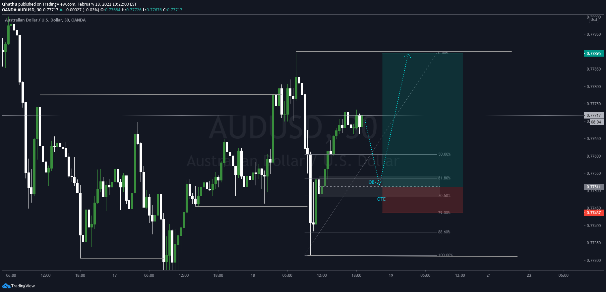

## Table of Contents

## What is block trading?

Block trading is when big investors, like big companies or rich people, buy or sell a lot of stocks, bonds, or other things all at once. They do this because it's easier to trade a lot at one time instead of doing many small trades. Usually, these trades are worth a lot of money, like over $200,000 or even more.

These big trades can affect the price of the stock or whatever they are trading. That's why they often do these trades privately, away from the public market. This way, they don't scare other people and make the price go up or down too much. Special people called block traders help them do this, making sure everything goes smoothly and the big trade doesn't mess up the market.

## How does block trading differ from regular trading?

Block trading and regular trading are different in how they work and who does them. Block trading is when someone, usually a big investor or a company, wants to buy or sell a huge amount of stocks or other things all at once. These trades are so big, often more than $200,000, that they can't be done on the regular market without causing a big fuss. So, they do these trades privately, away from the eyes of everyone else. This helps keep the price from jumping around too much because of their big trade.

Regular trading, on the other hand, is what most people do. It's when you buy or sell smaller amounts of stocks or other things on the public market. These trades are small enough that they don't usually shake up the market. Regular trading happens all the time, and everyone can see these trades happening. It's like the everyday shopping of the stock market, where people trade little by little, unlike the big, private deals of block trading.

## What are the typical sizes of block trades?

Block trades are usually very big. They are often worth more than $200,000. This is because they are meant for big investors or companies who want to buy or sell a lot of stocks or other things all at once.

The exact size can change depending on the market and what is being traded. For example, in the stock market, a block trade might be at least 10,000 shares. But in other markets, like bonds or commodities, the size could be different. The main thing is that block trades are much bigger than what regular people trade.

## Who typically engages in block trading?

Big investors and companies usually do block trading. They have a lot of money and want to buy or sell a huge number of stocks or other things all at once. These could be big investment firms, hedge funds, or even big companies that want to move a lot of their money around quickly.

Block trading is not something that regular people do because it involves very large amounts of money. For example, a big pension fund might use block trading to buy a lot of stocks for their members. Or a company might sell a lot of its own stocks to raise money for something big, like building a new factory. These big players use block trading to keep their big moves from shaking up the market too much.

## What are the advantages of block trading for investors?

Block trading helps big investors buy or sell a lot of stocks or other things all at once. This is good because it saves them time and money. Instead of making many small trades, they can do one big trade. This means they don't have to pay fees for each small trade, which can add up to a lot of money.

Also, block trading can keep the price of the stock from moving too much. When big investors want to buy or sell a lot, doing it all at once privately means other people won't see it and panic. This way, the big trade doesn't make the price go up or down a lot, which is good for the investor because they get a better price for their big trade.

## What are the potential risks associated with block trading?

Block trading can be risky because it involves big amounts of money and can affect the market. When a big investor does a block trade, they might change the price of the stock or other thing they are trading. If other people see the price change, they might start buying or selling too, which can make the price go up or down even more. This can be bad for the investor because they might not get the price they wanted for their big trade.

Another risk is that block trades are usually done privately, away from the public market. This means the investor has to trust the block trader to do a good job. If the block trader doesn't find the right buyer or seller, or if they don't keep the trade secret, the whole plan can fail. The investor might end up with a worse price or even lose money because of this.

## How is a block trade executed?

When someone wants to do a block trade, they usually talk to a special person called a block trader. The block trader helps them find someone else who wants to buy or sell the same big amount of stocks or other things. This is important because the trade needs to be big, often more than $200,000, and it has to be done away from the regular market. The block trader makes sure the trade is kept secret so it doesn't mess up the price of the stock or whatever they are trading.

Once the block trader finds the right person, they agree on a price and do the trade privately. This way, no one else sees the big trade happening, which helps keep the price from going up or down too much. After the trade is done, it might be reported to the public market, but by then, the big move is already over. This helps the big investor get a good price for their big trade without scaring other people in the market.

## What role do dark pools play in block trading?

Dark pools are special places where big investors can do block trades without other people seeing what they are doing. They are called "dark" because the trades happen in secret, away from the regular market. This is really helpful for block trading because big trades can shake up the market if everyone knows about them. By using dark pools, big investors can buy or sell a lot of stocks or other things all at once without making the price go up or down too much.

In a dark pool, the big investor works with a special person called a block trader. The block trader helps find someone else who wants to do the big trade. They agree on a price and do the trade in the dark pool. This way, the trade doesn't scare other people in the market, and the big investor gets a good price for their big trade. Dark pools are a big part of how block trading works because they help keep big trades private and smooth.

## How does block trading impact the market?

Block trading can change the market because it involves big amounts of money. When a big investor does a block trade, it can move the price of the stock or whatever they are trading. If other people see the price change, they might start buying or selling too, which can make the price go up or down even more. This can be good or bad for the market. If the price goes up a lot, it might make other people excited and want to buy more. But if the price goes down a lot, it might scare people and make them want to sell.

To stop this from happening too much, block trades are often done in secret, away from the regular market. This is called using a dark pool. By keeping the big trade private, the big investor can do their trade without making the price jump around too much. This helps keep the market calm and stable. But even though the trade is secret at first, it might be reported later, and that can still affect the market a little bit. So, block trading can have a big impact, but it's usually done in a way that tries to keep the market from getting too wild.

## What are the regulatory considerations for block trading?

When big investors do block trading, they have to follow special rules made by people who watch over the market. These rules are there to make sure that big trades don't mess up the market too much. For example, in the United States, the Securities and Exchange Commission (SEC) has rules about how block trades should be reported and when. They want to make sure that big trades are done fairly and that everyone knows about them after they happen, so the market stays honest.

Another important rule is about using dark pools for block trading. Dark pools are special places where big trades can happen in secret. But even though the trades are secret at first, the rules say that they have to be reported to the public market after they are done. This helps keep the market fair because it makes sure that no one is hiding big trades that could affect prices. Regulators keep a close eye on dark pools to make sure they are used the right way and don't cause problems for the market.

## How can technology facilitate block trading?

Technology makes block trading easier by helping big investors find each other and do big trades quickly and secretly. Special computer systems and software can match big buyers with big sellers without anyone else knowing. This is important because big trades can change the price of a stock or other thing, and doing it in secret helps keep the market calm. Technology also helps block traders keep track of all the details and make sure the big trade goes smoothly.

Another way technology helps is by using dark pools. Dark pools are like secret markets where big trades can happen away from the regular market. Technology makes it possible to do these trades quickly and safely. It also helps report the trades to the public market after they are done, so everyone knows what happened but the big trade doesn't scare the market. This way, big investors can move a lot of money without causing too much trouble.

## What advanced strategies can be used to optimize block trading?

One advanced strategy for optimizing block trading is using algorithms to find the best time and price to do the big trade. These algorithms look at a lot of information, like how the market is moving and what other big investors are doing. They help the block trader decide when to do the trade so that it doesn't shake up the market too much. This way, the big investor can get a good price without making other people panic.

Another strategy is to split up the big trade into smaller pieces. Instead of doing one huge trade all at once, the block trader can do several smaller trades over time. This helps keep the trade secret and stops the price from jumping around too much. By spreading out the trade, the big investor can move a lot of money without causing a big fuss in the market. 

Using dark pools is also a smart strategy. Dark pools are secret places where big trades can happen without everyone knowing. By using technology, block traders can find other big investors who want to do the same trade. This keeps the big trade private and helps the big investor get a good price. Dark pools make it easier to do big trades without scaring the market.

## What is the role of algorithmic trading in block trading?

Algorithmic trading, a cornerstone of modern financial markets, utilizes sophisticated technological systems to automate trading processes based on predefined criteria such as time, price, and [volume](/wiki/volume-trading-strategy). This form of trading is particularly integral to the execution of large trades, known as block trades. In block trading, algorithms facilitate the execution of substantial orders while minimizing market impact and transaction costs.

Algorithms in block trading serve a critical function by deconstructing large orders into smaller, manageable chunks. This fragmentation enables the trades to be spread across different times or venues, thereby reducing the potential for significant price shifts that could result from executing a large block all at once. The systematic division of orders allows these trades to occur at optimal times and prices, ensuring decisions are made with greater precision and less manual intervention.

Several algorithmic strategies are prevalent in block trading to boost efficiency. Among these, the Volume Weighted Average Price (VWAP) and Time Weighted Average Price (TWAP) are widely recognized. VWAP aims to execute the trade as close to the average price of the stock throughout the day, weighted by volume. It is calculated as:

$$
\text{VWAP} = \frac{\sum (\text{Price} \times \text{Volume})}{\sum \text{Volume}}
$$

This strategy is particularly useful when the goal is to minimize the market impact of a trade by spreading it over an extended time period, thereby ensuring that the trader achieves a price that reflects the [liquidity](/wiki/liquidity-risk-premium) of the market.

On the other hand, the TWAP strategy focuses on the time aspect of execution. It evenly distributes the order over a specified time frame, which is ideal for less liquid markets or when the trader wishes to lessen the impact on the stock's price trend. Python’s simple implementation to simulate TWAP could look as follows:

```python
def twap_execution(total_quantity, start_time, end_time, time_intervals):
    interval_quantity = total_quantity // time_intervals
    execution_times = [start_time + (end_time - start_time) * i / time_intervals for i in range(1, time_intervals + 1)]
    executions = [(time, interval_quantity) for time in execution_times]
    return executions
```

The primary advantage of these algorithmic strategies in block trading lies in their ability to reduce transaction costs and market impact, a necessity in highly competitive financial markets. By ensuring that orders are executed discreetly and at favorable conditions, algorithms help market participants execute high-volume trades efficiently and effectively. Such strategies underscore the transformation in how trades are executed, moving from manual trading processes to a highly automated and strategic approach, which is pivotal for handling large-volume trades in a fluctuating market environment.

## References & Further Reading

[1]: Bouchaud, J.-P., & Potters, M. (2004). ["Theory of Financial Risk and Derivative Pricing: From Statistical Physics to Risk Management"](https://www.cambridge.org/core/books/theory-of-financial-risk-and-derivative-pricing/5BBBA04CE72ED9E5E7C1C028D9A94FCB). Cambridge University Press.

[2]: Aldridge, I. (2013). ["High-Frequency Trading: A Practical Guide to Algorithmic Strategies and Trading Systems"](https://www.wiley.com/en-us/High+Frequency+Trading%3A+A+Practical+Guide+to+Algorithmic+Strategies+and+Trading+Systems%2C+2nd+Edition-p-9781118343500) (2nd ed.). Wiley.

[3]: Hasbrouck, J. (2007). ["Empirical Market Microstructure: The Institutions, Economics, and Econometrics of Securities Trading"](https://academic.oup.com/book/52241). Oxford University Press.

[4]: Cartea, Á., Jaimungal, S., & Penalva, J. (2015). ["Algorithmic and High-Frequency Trading"](https://assets.cambridge.org/97811070/91146/frontmatter/9781107091146_frontmatter.pdf). Cambridge University Press.

[5]: Kissell, R. (2014). ["The Science of Algorithmic Trading and Portfolio Management"](https://www.sciencedirect.com/book/9780124016897/the-science-of-algorithmic-trading-and-portfolio-management). Academic Press.