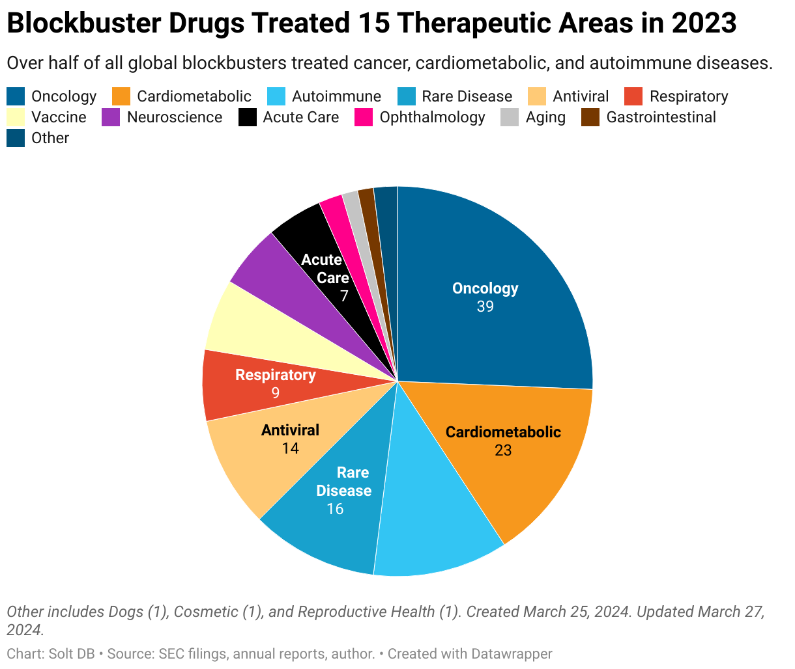

## Table of Contents

## What is a blockbuster drug?

A blockbuster drug is a medicine that makes a lot of money for the company that makes it. Usually, it earns more than one billion dollars a year. These drugs are often used to treat common diseases that many people have, like high blood pressure or diabetes. Because so many people need them, the sales add up to a huge amount.

Blockbuster drugs are important for pharmaceutical companies because they help pay for the cost of making new drugs. It can be very expensive to research and develop new medicines, so the money from blockbuster drugs helps companies keep going. Sometimes, when the patent for a blockbuster drug runs out, other companies can make cheaper versions called generics, and the original company might lose a lot of money.

## How are blockbuster drugs identified and developed?

Blockbuster drugs are identified and developed through a long process that starts with finding a medical need. Scientists look for diseases that affect a lot of people and don't have good treatments yet. They then try to create a new drug that can help. This involves a lot of research in labs, where they test many different chemicals to see if any of them can treat the disease. Once they find a promising chemical, they start testing it on animals to see if it's safe and works well.

After the animal tests, if the drug looks good, it moves on to human trials. These trials have different stages. In the early stages, they test the drug on a small group of people to check for safety. If it's safe, they test it on more people to see if it really helps with the disease. This can take many years and costs a lot of money. If the drug passes all these tests, it can be approved by agencies like the FDA in the United States. Once approved, the company can start selling it, and if it treats a common disease well, it can become a blockbuster drug.

The development of blockbuster drugs also involves a lot of marketing and planning. Companies need to figure out how to make the drug affordable and accessible to many people. They also need to think about how to get doctors to prescribe it and how to tell patients about it. Sometimes, they might even buy other companies that have promising drugs to help speed up the process. All of this work together helps a drug become a blockbuster, making a lot of money and helping a lot of people.

## What is the typical mechanism of action for blockbuster drugs?

Blockbuster drugs work in different ways depending on what disease they are treating. Some drugs might block a harmful substance in the body, like how statins block the production of cholesterol to help with heart health. Others might help the body make more of something good, like how insulin helps people with diabetes control their blood sugar. The main thing is that these drugs target something important in the body that affects a lot of people.

The way these drugs work is often simple but very effective. For example, painkillers like ibuprofen work by reducing inflammation and blocking pain signals in the body. This makes them useful for many people with different kinds of pain. Because these drugs can help so many people, they become very popular and can make a lot of money for the companies that make them.

## Can you explain the impact of blockbuster drugs on the pharmaceutical industry?

Blockbuster drugs are really important for the pharmaceutical industry. They make a lot of money because they treat common diseases that many people have. This money helps companies pay for the expensive research and development of new drugs. Without blockbuster drugs, it would be hard for companies to keep going because making new medicines costs a lot.

But there are also challenges with blockbuster drugs. When their patents run out, other companies can make cheaper copies called generics. This can make the original company lose a lot of money. So, pharmaceutical companies always need to keep finding new blockbuster drugs to stay successful. It's like a never-ending race to find the next big thing that can help a lot of people and make a lot of money.

## What role do blockbuster drugs play in healthcare systems worldwide?

Blockbuster drugs are very important for healthcare systems all over the world. They help treat common diseases that many people have, like high blood pressure or diabetes. When a lot of people can use the same drug, it makes it easier for doctors to treat patients and for healthcare systems to manage costs. These drugs are often well-studied and safe, so doctors feel confident using them.

However, there are also challenges with blockbuster drugs. They can be expensive, which can make it hard for some people to get them. When the patents for these drugs run out, other companies can make cheaper versions called generics. This is good because it makes the drugs more affordable, but it can also make it hard for the original companies to keep making money. So, healthcare systems need to find a balance between using these important drugs and making sure they are affordable for everyone.

## How do blockbuster drugs affect patient outcomes and quality of life?

Blockbuster drugs can really help patients feel better and live longer. They treat common diseases that a lot of people have, like high blood pressure or diabetes. When people take these drugs, they can control their health problems better. This means they might not have to go to the hospital as often, and they can do more things they enjoy, like spending time with family or working. So, these drugs can make a big difference in how patients feel every day.

But there are also some challenges. Blockbuster drugs can be expensive, and not everyone can afford them. This can be hard for people who need these drugs to feel better. Also, some people might have side effects from the drugs, which can make them feel worse. So, while blockbuster drugs can help a lot, they also need to be affordable and safe for everyone who uses them.

## What are some examples of blockbuster drugs and their specific mechanisms?

One example of a blockbuster drug is Lipitor, which is used to lower cholesterol. Lipitor works by blocking an enzyme in the liver that helps make cholesterol. When this enzyme is blocked, the body makes less cholesterol, which can help prevent heart disease. Lipitor became very popular because a lot of people have high cholesterol and need help managing it.

Another example is Humira, which is used to treat conditions like rheumatoid arthritis and Crohn's disease. Humira works by blocking a protein in the body called TNF-alpha, which causes inflammation. By stopping this protein, Humira can reduce inflammation and help people feel better. It became a blockbuster drug because these conditions affect a lot of people and there weren't many good treatments before Humira came along.

A third example is Viagra, which is used to treat erectile dysfunction. Viagra works by increasing blood flow to certain parts of the body. It does this by blocking an enzyme called PDE5, which helps blood vessels relax and widen. This can help men have better sexual function. Viagra became a blockbuster because it helped a lot of people with a common problem and got a lot of attention.

## How do regulatory processes influence the development and market entry of blockbuster drugs?

Regulatory processes are very important for the development and market entry of blockbuster drugs. Before a drug can be sold, it needs to be approved by agencies like the FDA in the United States or the EMA in Europe. These agencies make sure the drug is safe and works well. To get approval, companies have to do a lot of tests and studies. They start with lab tests and animal studies to see if the drug might work and is safe. Then, they do human trials to check if the drug really helps people and doesn't cause too many problems. This whole process can take many years and costs a lot of money.

Once a drug gets approved, it can go on the market and start helping people. But the regulatory process doesn't stop there. After the drug is on the market, the agencies keep watching to make sure it stays safe. If they find any problems, they can make the company change the drug or even take it off the market. This ongoing monitoring helps make sure that blockbuster drugs keep helping people without causing harm. So, the regulatory process is a big part of making sure that blockbuster drugs are safe and effective from start to finish.

## What are the economic implications of blockbuster drugs for both manufacturers and consumers?

Blockbuster drugs have big economic effects for the companies that make them. When a drug becomes a blockbuster, it can make over a billion dollars a year. This money helps the company pay for the cost of making new drugs. It can be very expensive to do all the research and tests needed to make a new medicine. So, when a drug becomes a blockbuster, it helps the company keep going and even make more new drugs. But there is a problem when the patent for a blockbuster drug runs out. Other companies can make cheaper versions called generics. This can make the original company lose a lot of money, so they always need to keep finding new blockbuster drugs.

For people who use blockbuster drugs, there are also big economic effects. These drugs can be expensive, which can be hard for some people to afford. But when they work well, they can help people feel better and maybe not have to go to the hospital as much. This can save money in the long run. When the patents run out and generics come out, the drugs can become cheaper, which is good for patients. But until then, the high cost of blockbuster drugs can be a big problem for some people. So, while these drugs can help a lot, they also need to be affordable for everyone who needs them.

## How do advances in technology and research methodologies impact the discovery of new blockbuster drugs?

Advances in technology and research methods are helping scientists find new blockbuster drugs faster and better. New tools like high-throughput screening let scientists test thousands of chemicals quickly to see if any can treat a disease. Also, computers can now help with drug discovery. They can look at big amounts of data to find patterns and predict which drugs might work. This saves time and money because scientists can focus on the best ideas. Plus, new ways of studying genes and how they work, called genomics, help find new targets for drugs. This means scientists can make drugs that are more likely to help people.

These new technologies also help make drugs safer. With better ways to test drugs, scientists can find out if a drug might cause problems before it gets to people. This is important because it makes sure that new blockbuster drugs are not only effective but also safe. All these advances mean that companies can bring new drugs to the market faster and at a lower cost. This is good for the companies because they can make money sooner, and it's good for patients because they can get new treatments that help them feel better and live longer.

## What challenges do pharmaceutical companies face in maintaining the success of blockbuster drugs?

Pharmaceutical companies face big challenges in keeping their blockbuster drugs successful. One big problem is when the patent for a blockbuster drug runs out. When this happens, other companies can make cheaper versions of the drug, called generics. This makes it hard for the original company to keep making a lot of money from the drug. So, they always need to keep finding new blockbuster drugs to stay successful. This is like a never-ending race to find the next big thing that can help a lot of people and make a lot of money.

Another challenge is the high cost of making new drugs. It can take many years and a lot of money to research and test a new drug. Even with a blockbuster drug making a lot of money, it's still hard to pay for all the work needed to find the next one. Plus, not all new drugs work out. Sometimes, a drug that looks promising in early tests doesn't help people when it's tested more. This can be a big setback for a company. So, they need to keep trying different ideas and hope that one of them will be the next blockbuster drug.

## What future trends are anticipated in the development and impact of blockbuster drugs?

In the future, we might see more blockbuster drugs thanks to new technology. Scientists are using computers and big data to find new drugs faster. They can test thousands of chemicals at once and use computers to predict which ones might work. This can save a lot of time and money. Also, new ways of studying genes, called genomics, are helping scientists find new targets for drugs. This means they can make drugs that are more likely to help people. These new technologies can help companies bring new blockbuster drugs to the market faster and at a lower cost.

But there are also challenges ahead. One big problem is that patents for blockbuster drugs will keep running out. When this happens, other companies can make cheaper versions called generics. This can make it hard for the original company to keep making money from the drug. So, they need to keep finding new blockbuster drugs to stay successful. Also, making new drugs is very expensive and risky. Not all new drugs work out, even after a lot of testing. So, companies need to keep trying new ideas and hope that one of them will be the next big thing.

## References & Further Reading

[1]: DiMasi, J. A., Grabowski, H. G., & Hansen, R. W. (2016). [“Innovation in the pharmaceutical industry: New estimates of R&D costs.”](https://pubmed.ncbi.nlm.nih.gov/26928437/) Journal of Health Economics, 47, 20-33.

[2]: Hay, M., Thomas, D. W., Craighead, J. L., Economides, C., & Rosenthal, J. (2014). [“Clinical development success rates for investigational drugs.”](https://pubmed.ncbi.nlm.nih.gov/24406927/) Nature Biotechnology, 32(1), 40-51.

[3]: Khan, A. R., & Real, A. (2016). ["The Impact of Algorithmic Trading on Stock Market Behavior."](https://www.semanticscholar.org/paper/Assessing-the-Impact-of-Algorithmic-Trading-on-A-Gsell/820fa261b451f5b57decf4f8ccf526247fcbc2ff) SSRN Electronic Journal.

[4]: Lepore, N. (2020). ["The Pharmaceutical Industry: Economics and Regulation."](https://academic.oup.com/book/34817/chapter/297699554) Elsevier.

[5]: Hoffman, K., & Bartlett, J. (2021). ["Understanding the Orphan Drug Act and its Impact on Pharmaceutical Development."](https://link.springer.com/article/10.1208/s12248-021-00657-y) Policy & Medicine News.