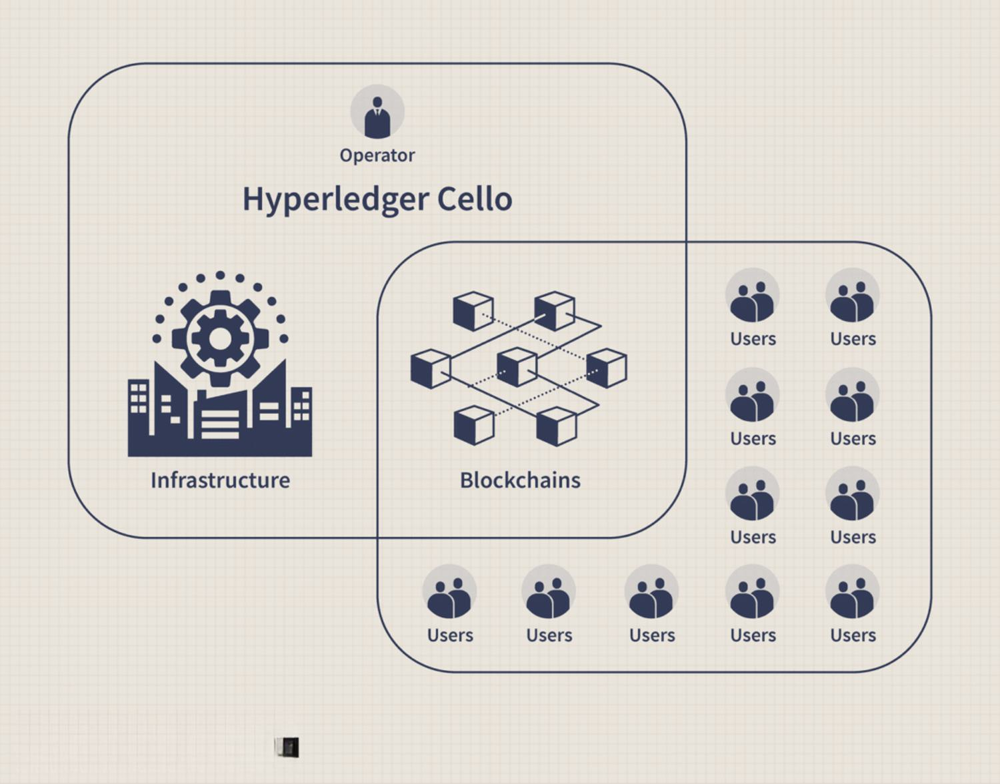

Blockchain technology has advanced swiftly, transforming its role from supporting cryptocurrency transactions to becoming an essential component of secure and efficient operations across a variety of sectors. This evolution is largely driven by Blockchain-as-a-Service (BaaS), a model that allows companies to adopt blockchain technology swiftly without the need to invest heavily in infrastructure. BaaS streamlines the implementation process, democratizing access to blockchain capabilities that were once the preserve of large corporations.

Leading industry giants such as Microsoft, IBM, and Amazon Web Services (AWS) are at the forefront of this transformation. They offer scalable, cloud-based blockchain services that cater to businesses of all sizes, providing the tools necessary to harness the power of blockchain. By offering these services, these providers not only facilitate blockchain adoption but also support companies in securely managing and deploying blockchain networks.

The demand for blockchain solutions is growing as businesses recognize their potential to enhance operational efficiency and data security. For smaller firms, BaaS levels the playing field, empowering them to compete effectively alongside larger enterprises. This is especially pertinent as blockchain technology continues to make inroads into various industries, impacting everything from finance and supply chain management to healthcare and beyond.

This article seeks to examine the concept of BaaS, the benefits it brings, the key providers leading the market, and its influence on sectors that are increasingly integrating blockchain technology into their operations.

## Table of Contents

## What is Blockchain-as-a-Service (BaaS)?

Blockchain-as-a-Service (BaaS) is a service model that allows enterprises to leverage blockchain technology without needing to develop and manage their blockchain networks and infrastructure. Operating similarly to Software-as-a-Service (SaaS), BaaS provides a streamlined approach for businesses wanting to explore blockchain applications without getting involved in the complexities of backend management and maintenance.

BaaS providers handle the setup, management, and maintenance of blockchain infrastructure, which includes nodes, network settings, and services. This outsourcing allows enterprises to focus on their core business functions while still taking advantage of blockchain’s benefits, such as enhanced security, transparency, and decentralization. By adopting BaaS, companies can bypass the challenges associated with blockchain deployment, such as provisioning hardware, configuring networks, and handling ongoing security updates.

The service model offers a user-friendly interface that simplifies the development and deployment of blockchain applications. This simplifies tasks like creating smart contracts, managing transactions, and integrating blockchain networks with existing business systems. As a result, businesses can rapidly prototype and launch blockchain applications, accelerating time-to-market and reducing development complexity.

BaaS allows companies to implement blockchain solutions with the certainty of scalability. As business needs evolve, BaaS platforms enable easy adjustment of resources, ensuring efficient handling of varying workloads without the necessity for significant capital investment in additional infrastructure. This flexibility is crucial for businesses operating in dynamic markets where technology adoption can provide a competitive edge.

By facilitating access to blockchain technology, BaaS empowers organizations to explore new business models and operational efficiencies. It can foster innovation by enabling companies of different sizes to engage with blockchain without having to build expertise in-house, thus driving broader adoption across industries.

## How Does BaaS Work?

Blockchain-as-a-Service (BaaS) operates by providing an environment where businesses can create, manage, and deploy blockchain applications without needing to invest in the underlying infrastructure. The service is typically offered through platforms hosted by major cloud service providers. Here's a breakdown of the key components and functionalities involved in BaaS:

1. **Platform Offerings**: BaaS platforms simplify the process of blockchain integration by providing a comprehensive suite of development tools and templates. These resources include pre-built smart contracts, identity management systems, and consensus mechanisms, which allow developers to focus on customizing applications rather than building core blockchain components from scratch. This streamlined approach is pivotal in accelerating blockchain solution deployment, effectively reducing the time-to-market for new applications.

2. **Integration Capabilities**: These platforms often include robust integration features that enable seamless interaction between blockchain networks and existing enterprise systems. For instance, APIs and SDKs are provided to facilitate connectivity with legacy systems, third-party applications, and other blockchains. This integration capability is crucial for businesses seeking to enhance existing processes through blockchain technology.

3. **Cloud Deployment**: BaaS solutions are predominantly deployed on cloud infrastructures facilitated by providers such as Microsoft Azure, Amazon Web Services (AWS), and IBM Cloud. This approach negates the necessity for businesses to maintain extensive in-house hardware and software, significantly lowering the barrier to entry for blockchain adoption. The cloud model also supports scalability, allowing companies to adjust computational resources in response to varying demands.

By utilizing BaaS, companies optimize the blockchain development lifecycle and achieve efficient resource management, making blockchain technology accessible and practical for a broader range of industries.

## Benefits of Blockchain-as-a-Service

Blockchain-as-a-Service (BaaS) streamlines the adoption of blockchain technology by addressing the financial and technical barriers traditionally associated with its setup. By outsourcing the infrastructure and management of blockchain networks, businesses can significantly reduce both cost and complexity, allowing them to explore blockchain's full potential in a more accessible manner. 

A core advantage of BaaS is its scalability. By leveraging cloud-based platforms such as Microsoft Azure, Amazon Web Services, and IBM Cloud, businesses can dynamically adjust their resources in response to changing demands. This elasticity eliminates the need for substantial upfront investments in physical infrastructure, thus allowing companies to scale operations smoothly and efficiently. 

Moreover, BaaS enables enhanced collaboration across different entities through secure, shared data environments intrinsic to blockchain technology. Such environments provide transparency and immutability, which are critical for ensuring trust in multi-party transactions. This shared ledger approach fosters an ecosystem where data privacy and security are maintained, yet accessible for authorized participants, promoting greater inter-organizational collaboration and operational efficiency.

Through these benefits, BaaS offers a pragmatic solution for businesses aiming to harness blockchain technology without the encumbrance of deploying and maintaining their own blockchain infrastructure.

## Top BaaS Providers and Their Offerings

IBM Blockchain Platform, Amazon Managed Blockchain, and Microsoft Azure Blockchain are major providers offering Blockchain-as-a-Service (BaaS), each with unique features and capabilities tailored to diverse enterprise needs.

**IBM Blockchain Platform**

The IBM Blockchain Platform is renowned for its robust Hyperledger-based solutions. Hyperledger Fabric, an open-source blockchain framework hosted by The Linux Foundation, provides a modular architecture aimed at enterprise usage, ensuring high scalability and confidentiality. The IBM Blockchain Platform is recognized for its mature infrastructure, making it suitable for businesses such as WeTrade and IBM Food Trust. These enterprises benefit from IBM's focus on secure, permissioned networks that enable private transactions and confidential contracts, vital for managing complex trade relationships and supply chains.

**Amazon Managed Blockchain**

Amazon Managed Blockchain provides a versatile managed service supporting both Hyperledger Fabric and Ethereum, leveraging Amazon's extensive cloud infrastructure. The service allows organizations to establish scalable blockchain networks with ease, focusing on simplified network maintenance and decentralized applications (dApps) deployment. Through Amazon's infrastructure, users can automate the tasks required to configure the network settings, adding new members swiftly. Such features are designed to minimize transaction times and enhance operational efficiencies, making it a preferred choice for enterprises looking to adopt blockchain technology within familiar cloud environments.

**Microsoft Azure Blockchain**

Microsoft Azure Blockchain simplifies the deployment of Ethereum networks by offering a reliable and scalable platform. Azure's comprehensive tools and services facilitate the quick setup and management of blockchain applications, making it accessible for companies without extensive blockchain expertise. The service emphasizes ease of integration with existing systems and Microsoft products. Azure's architecture ensures transactional integrity and transparency, supporting a range of use cases from supply chain tracking to identity management. Its scalable nature allows businesses to dynamically adjust resources in response to changing demands, a crucial aspect for evolving enterprise needs.

These top BaaS providers offer enterprises multiple pathways to integrate blockchain technology, leveraging their unique infrastructures to meet varying industry demands.

## Blockchain Technology in Algorithmic Trading

Blockchain technology is transforming [algorithmic trading](/wiki/algorithmic-trading) by introducing a new level of transparency, security, and efficiency to the financial markets. The foundational element of blockchain, the decentralized ledger, provides an immutable and transparent record of transactions. This enhanced transparency is crucial in algorithmic trading, where the integrity of data and transactions is paramount.

Decentralized ledgers eliminate the need for intermediaries, traditionally required to validate transactions in trading systems. By automating this process via blockchain, transaction times and costs are significantly reduced. For example, smart contracts, which are self-executing contracts with the terms directly written into code, facilitate faster execution of trades as they eliminate the need for manual reconciliation.

Incorporating blockchain into algorithmic trading also reduces discrepancies often arising from traditional trading methods. Discrepancies can occur due to human errors or misreporting by intermediaries. In contrast, blockchain’s distributed nature ensures that all participants have access to the same data, and once data is written to the blockchain, it cannot be altered. Therefore, traders and regulators can be confident in the accuracy and reliability of transaction data.

Blockchain-as-a-Service (BaaS) platforms provide financial firms access to blockchain technology without needing to develop a deep in-house technical understanding. Firms can benefit from ready-to-use blockchain infrastructure, enabling them to deploy trading solutions swiftly and efficiently. This capability allows smaller firms to compete more effectively with larger players by leveling the technological playing field.

In conclusion, blockchain technology, facilitated by BaaS, offers a transformative approach to algorithmic trading, characterized by reduced transaction times and costs, transparency, and security. As the technology continues to evolve, it is poised to further advance the efficiency and reliability of financial markets.

## Challenges and Considerations

Blockchain-as-a-Service (BaaS) offers numerous advantages for businesses seeking to adopt blockchain technology without the burdens of managing complex infrastructure. However, it also presents certain challenges and considerations that organizations must address to ensure successful implementation.

One of the primary challenges associated with BaaS is vendor dependency. By relying on third-party providers for blockchain infrastructure, businesses may become reliant on those vendors for service updates, troubleshooting, and overall system management. This dependency can limit flexibility and control, and any change in vendor policies or service quality can impact business operations. To mitigate this risk, companies should choose vendors with a reliable track record and include service-level agreements (SLAs) that clearly define expectations and responsibilities.

Data privacy concerns also represent a significant consideration in the deployment of BaaS solutions. Blockchain inherently involves the sharing of data across a distributed network, which, if not properly managed, can expose sensitive information. Companies need to implement robust encryption methods and access controls to safeguard data, particularly when handling personally identifiable information (PII) or other confidential business data. It is essential to work with providers that offer strong data protection mechanisms and compliance with data privacy regulations.

Evaluating BaaS providers involves assessing several critical criteria, including scalability, security, integration capabilities, and cost. Scalability ensures that the blockchain solutions can grow with the business needs without necessitating a complete overhaul of the infrastructure. Security features such as advanced encryption, authentication protocols, and regular security audits are fundamental to maintaining the integrity and confidentiality of blockchain transactions.

Integration capabilities are equally important, as businesses need to ensure that the BaaS solution can seamlessly integrate with existing systems and processes. This includes compatibility with various platforms, programming languages, and third-party services. Cost is a practical consideration, and businesses must balance the subscription fees, usage costs, and potential hidden charges against the expected benefits the BaaS solution will provide.

Compliance with regional and industry-specific regulatory standards is crucial when implementing BaaS solutions. Regulations such as the General Data Protection Regulation (GDPR) in the European Union, or sector-specific standards like those in healthcare or finance, impose strict requirements on data handling and security. Businesses must work closely with legal and regulatory experts to ensure that their BaaS deployments meet all relevant compliance obligations, thereby avoiding potential legal issues and financial penalties.

In summary, while Blockchain-as-a-Service facilitates easier adoption of blockchain technology, organizations must carefully navigate challenges such as vendor dependency and data privacy. By thoroughly evaluating providers on scalability, security, integration capabilities, and cost, and ensuring compliance with relevant regulations, businesses can successfully harness the power of BaaS to enhance their operations.

## The Future of BaaS and Blockchain Technology

As Blockchain-as-a-Service (BaaS) continues to develop, its potential to drive the widespread adoption of blockchain technology across various sectors becomes increasingly evident. This evolution holds promise for unveiling new business models and enhancing operational efficiencies. As businesses recognize the benefits of blockchain, such as transparency, security, and immutability, demand for accessible and manageable blockchain solutions through BaaS is expected to grow.

Innovation within BaaS platforms is anticipated to lead to more advanced blockchain applications and integrations. These advancements will facilitate a broader range of use cases, from secure data sharing and identity verification to more complex operations like supply chain management and digital asset trading. With user-friendly interfaces and modular components, future BaaS platforms will enable businesses to tailor blockchain solutions to their unique requirements without needing extensive technical expertise.

Moreover, the convergence of blockchain technology with other emerging technologies such as Artificial Intelligence (AI) and the Internet of Things (IoT) is set to further broaden its application potential. For example, AI can be used to analyze large datasets stored on a blockchain, providing insights and automating decision-making processes. Meanwhile, IoT devices can generate and send data to blockchain networks, ensuring data integrity and traceability. This fusion is likely to foster innovations such as smart cities, autonomous vehicles, and enhanced supply chain logistics, driving further demand for BaaS solutions tailored to these interdisciplinary needs.

In conclusion, the future of BaaS and blockchain technology is characterized by continued growth and integration with other technologies, ultimately paving the way for unprecedented advancements and efficiencies across industries. As businesses increasingly leverage BaaS, staying updated on the latest innovations will be crucial in adapting to this evolving landscape and maintaining a competitive edge.

## Conclusion

Blockchain-as-a-Service (BaaS) provides an accessible and transformative offering that democratizes access to blockchain technology for businesses of all sizes. It alleviates the burdens associated with developing and managing blockchain infrastructure, enabling companies to focus on leveraging its inherent benefits. By selecting a suitable BaaS provider, organizations can streamline their operations, boost efficiency, and gain a significant competitive advantage in their respective industries.

The strategic implementation of BaaS allows companies to explore new business models and operational efficiencies, optimized through blockchain’s secure, transparent, and decentralized nature. This adaptability is crucial as it provides organizations with the tools to quickly scale and integrate cutting-edge blockchain solutions, thereby fostering innovation and responsiveness in a rapidly evolving market landscape.

As global interest and investment in blockchain technology continue to grow, remaining informed about the latest developments in BaaS will be essential for any business aiming to future-proof its strategy. This entails not only understanding emerging trends but also evaluating advancements in BaaS offerings against organizational needs to maximize potential benefits. Embracing these developments can result in enhanced operational resilience and sustained competitive positioning, paving the way for long-term growth and success in an increasingly digital economy.

## References & Further Reading

[1]: Croman, K., Decker, C., Eyal, I., Gencer, A. E., Juels, A., Kosba, A., Miller, A., Saxena, P., Shi, E., Sirer, E. G., Song, D., & Wattenhofer, R. (2016). ["On Scaling Decentralized Blockchains."](https://www.initc3.org/files/Scaling2016.pdf) International Conference on Financial Cryptography and Data Security.

[2]: Mohanty, S. (2018). ["Ethereum for Architects and Developers."](https://link.springer.com/book/10.1007/978-1-4842-4075-5) Packt Publishing.

[3]: Mougayar, W. (2016). ["The Business Blockchain: Promise, Practice, and Application of the Next Internet Technology."](https://books.google.com/books/about/The_Business_Blockchain.html?id=CEsPDAAAQBAJ) Wiley.

[4]: Tapscott, D., & Tapscott, A. (2016). ["Blockchain Revolution: How the Technology Behind Bitcoin is Changing Money, Business, and the World."](https://dl.acm.org/doi/10.5555/3051781) Portfolio.

[5]: Niranjanamurthy, M., Nithya, B. N., & Jagannatha, S. (2019). ["Analysis of Blockchain technology: pros, cons and SWOT."](https://link.springer.com/article/10.1007/s10586-018-2387-5) Cluster Computing, 22(6), 14743-14757.