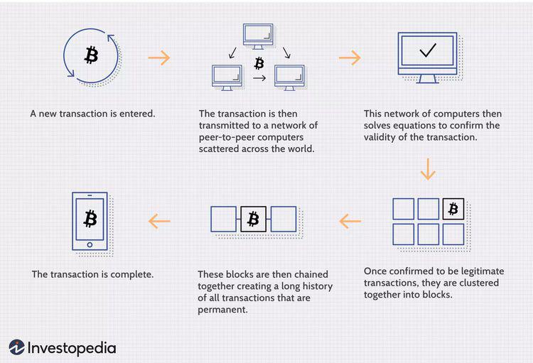

Blockchain technology is a decentralized digital ledger system that records transactions across multiple computers in a manner that ensures the data's integrity and security through cryptographic hashing. Its advent has had a transformative impact on financial systems globally. By offering enhanced transparency, immutability, and reduced costs, blockchain has revolutionized the way financial transactions are conducted. This innovation allows for real-time settlement of transactions and reduces the need for intermediaries, leading to significant efficiency improvements in various segments of the financial industry, including payments, remittances, and securities trading. Notable examples of blockchain in finance include the use of distributed ledgers for cross-border payments and the creation of digital assets such as cryptocurrencies.

Exchange-Traded Funds (ETFs) are a form of investment fund and exchange-traded product which are traded on stock exchanges, just like stocks. ETFs have gained immense popularity in the past few years due to their flexibility, low costs, and potential for diversification. They allow investors to gain exposure to a wide array of asset classes, sectors, or indexes without needing to directly purchase the underlying assets. This has democratized access to investment opportunities that were traditionally limited to wealthier investors or institutions.

The convergence of financial technology (fintech) and cryptocurrencies has paved the way for innovative investment opportunities and financial solutions. Fintech utilizes advanced technologies to enhance and automate financial services, creating efficiencies and new services for consumers and institutions. Cryptocurrencies, as a financial innovation enabled by blockchain technology, represent a new asset class that fintech firms are increasingly integrating into traditional financial systems. This integration facilitates the creation of cryptocurrency-based financial products, payments systems, and investment solutions, expanding the scope of investment portfolios.

Algorithmic trading is a method of executing orders using automated pre-programmed trading instructions accounting for variables such as time, price, and volume. This technology is significant in modern financial markets due to its ability to process vast amounts of data at high speed, optimizing trading decisions and maximizing returns. Algorithmic trading systems utilize sophisticated mathematical models and formulas to identify profitable trading opportunities and execute trades at a frequency and speed impossible for a human trader.

The intersection of blockchain, ETFs, fintech, and algorithmic trading represents a convergence of technological advancements that are reshaping investment strategies. As these elements integrate, they are expected to revolutionize financial markets by providing more efficient, accessible, and innovative ways to trade and invest. The combination of transparency and real-time data processing enabled by blockchain, the accessibility of investment opportunities through ETFs, the cutting-edge solutions provided by fintech, and the optimization capabilities of algorithmic trading collectively drive the evolution of the investment landscape, offering unprecedented opportunities and challenges for investors and financial institutions alike. This convergence is poised to define the future dynamics of financial systems, prompting stakeholders to adapt and harness these technologies for strategic advantage.

## Table of Contents

## Understanding Blockchain and Its Role in Finance

Blockchain technology, a decentralized digital ledger system, fundamentally transforms the way data transactions are recorded and verified. At its core, blockchain operates as a distributed network where data is stored in blocks, which are linked chronologically to form an immutable chain. This technology leverages cryptographic algorithms to ensure data integrity and security, providing a trustless environment where transactions can occur without the need for intermediaries.

One of the primary advantages of blockchain lies in its transparency and security features. Transparency is achieved as all participants in a blockchain network have access to the same information, recorded on a public ledger. This transparency enhances accountability by allowing every transaction to be tracked and verified. Security is bolstered by blockchain’s cryptographic nature, which ensures that once data is recorded, it cannot be altered retroactively without consensus from the network, making it highly resistant to fraud and unauthorized modifications.

Blockchain is revolutionizing traditional financial transactions by reducing the need for intermediaries, speeding up processing times, and lowering transaction costs. For instance, in cross-border payments, blockchain can significantly reduce settlement times from days to minutes, while simultaneously minimizing costs associated with foreign exchange and intermediary banks. This efficiency is fostering a new era of payment systems that are not only faster but also more accessible globally.

Numerous applications of blockchain within the banking and finance sector illustrate its transformative potential. Smart contracts, for instance, automate and enforce contractual agreements without intermediaries, reducing both time and costs associated with traditional contract execution. The banking sector also employs blockchain for Know Your Customer (KYC) processes, enhancing verification while safeguarding customer privacy through secure data sharing. Furthermore, blockchain is utilized in trade finance to eliminate paperwork and improve transaction traceability, enhancing supply chain transparency and efficiency.

In summary, blockchain technology is reshaping the financial landscape by offering transparent, secure, and efficient alternatives to traditional systems. Its applications within banking and finance demonstrate its capacity to streamline processes, reduce costs, and increase accessibility, marking a significant shift towards more decentralized and trustless financial infrastructures.

## The Rise of ETFs in the Investment Landscape

Exchange-Traded Funds (ETFs) are investment funds traded on stock exchanges, much like stocks. They hold assets such as stocks, commodities, or bonds and operate with a mechanism designed to keep trading close to its net asset value, though sometimes there may be small deviations. ETFs provide investors with an opportunity to diversify their portfolios across various asset classes through a single purchase. The creation and redemption process involves authorized participants who facilitate the buying and selling of shares to keep [ETF](/wiki/etf-trading-strategies) prices stable.

The growth and popularity of ETFs have surged over recent years, largely due to their efficiency, simplicity, and enhanced accessibility. According to the Investment Company Institute, the global ETF industry saw assets reaching nearly $9 trillion by 2021, a significant increase from previous years. This growth can be attributed to their appeal among both retail and institutional investors, who seek low-cost, flexible investment options. 

One of the primary benefits of ETFs is diversification, as they allow investors to gain exposure to a broad range of securities. This diversification can mitigate risk compared to investing in individual stocks. Additionally, ETFs generally have lower expense ratios than mutual funds, as most are passively managed to track a specific index. Furthermore, ETFs offer tax efficiency due to their unique in-kind creation and redemption process.

Recent trends in the ETF market include thematic and sector-specific ETFs, which cater to investor interest in specific investment ideas or industries. A notable trend is the advent of [cryptocurrency](/wiki/cryptocurrency) ETFs, providing traditional investors a route to invest in digital currencies without directly owning them. Cryptocurrency ETFs simplify exposure to the fluctuating cryptocurrency market and have been gaining traction with both retail and institutional investors. As digital assets continue to integrate into the broader financial ecosystem, cryptocurrency ETFs represent a growing segment of the ETF market.

By offering a combination of diversification, cost-efficiency, and targeted investment opportunities, ETFs have become a prominent feature in today's investment landscape, continuously evolving to meet investor needs and trends.

## Financial Technology: Transforming Investment and Trade

Financial technology, commonly referred to as fintech, is rapidly transforming the investment landscape by introducing a new wave of digital solutions that streamline, enhance, and democratize investment opportunities. Fintech encompasses a variety of innovative platforms and tools that are reshaping how investors interact with financial markets.

Innovative fintech platforms like robo-advisors have gained prominence by offering personalized investment advice without the need for a traditional financial advisor. These platforms use algorithms to recommend investments based on individual risk tolerance, financial goals, and market conditions. Popular robo-advisors include Betterment, Wealthfront, and Acorns. These services often provide lower fees than traditional investment advisors, making them an attractive choice for cost-conscious investors.

Moreover, fintech has significantly integrated with blockchain and cryptocurrency solutions, bringing these novel asset classes into the mainstream investment arena. Blockchain technologies enhance fintech platforms by ensuring secure, transparent, and immutable record-keeping, which addresses a critical need in the financial sector. Cryptocurrency trading platforms like Coinbase and Binance have made it easier for investors to buy, sell, and store digital currencies, reflecting the melding of fintech with blockchain capabilities.

Key players and disruptors in the fintech landscape include companies such as Robinhood, which brought commission-free trading to the masses, and Square, which offers an array of services including payment solutions and mobile banking apps. These companies have democratized access to financial markets, enabling a broader segment of the population to engage in investment activities that were traditionally reserved for institutional players.

Additionally, payment processors like PayPal and Stripe are integrating cryptocurrency services into their platforms, illustrating a trend towards greater acceptance and utilization of digital currencies. This evolution is indicative of fintech's role as a bridge between traditional finance and emerging technologies, providing seamless experiences in asset management and trading.

Overall, fintech continues to disrupt traditional financial systems, offering innovative tools that enhance accessibility, efficiency, and user experience in investing. By embracing these new technologies, fintech firms have positioned themselves as vital players in the ongoing evolution of global financial markets.

## Cryptocurrency: A New Asset Class for Investors

Cryptocurrencies have emerged as a novel asset class that has garnered significant attention from investors and financial markets. Originating with Bitcoin's introduction in 2009 by an anonymous figure known as Satoshi Nakamoto, cryptocurrencies have since evolved into a diverse array of digital assets, each designed with unique use cases and technologies. At their core, cryptocurrencies are decentralized digital currencies based on blockchain technology, which ensures transparency, security, and reduced dependence on central intermediaries.

The potential of cryptocurrencies lies in their ability to disrupt traditional financial systems by enabling peer-to-peer transactions, enhancing cross-border payment efficiency, and offering new means of value exchange. Cryptocurrencies like Ethereum have introduced smart contracts, allowing automated and programmable transactions without the need for third-party intervention.

However, investing in cryptocurrencies comes with substantial risks. The [volatility](/wiki/volatility-trading-strategies) of digital currencies is notable, with prices susceptible to dramatic swings based on market sentiment, regulatory news, and technological developments. For instance, Bitcoin's price soared from approximately $1,000 in January 2017 to nearly $20,000 by December 2017, only to plummet to around $3,000 by the end of 2018. This volatility presents both opportunities for high returns and significant risks of loss.

To mitigate some of these risks, traditional investors are increasingly turning to Exchange-Traded Funds (ETFs) as a means to gain exposure to cryptocurrencies. Cryptocurrency ETFs, when available, enable investors to diversify their crypto holdings through a single, regulated financial product that tracks the price of one or multiple digital currencies. These ETFs offer a more straightforward and secure way for investors to access the burgeoning crypto market, without having to manage crypto wallets or navigate complex exchanges.

Several case studies highlight successful cryptocurrency investments and strategies. Early adopters of Bitcoin who recognized its potential as a store of value have profited substantially over the past decade. Another notable example is the investment strategy involving Initial Coin Offerings (ICOs), where investors fund blockchain projects at an early stage in exchange for newly minted tokens. While this strategy has led to lucrative gains for some, it also carries high risk due to the speculative nature and potential for scams.

In conclusion, cryptocurrencies represent an evolving asset class that offers both transformative potential and significant risks. The introduction of vehicles such as cryptocurrency ETFs provides traditional investors with an accessible and regulated means of accessing this dynamic market. As this asset class continues to develop, understanding its intricacies will be crucial for investors seeking to capitalize on its unique offerings.

## Algorithmic Trading: Optimizing Investment Strategies

Algorithmic trading refers to the use of computer algorithms to execute trading orders with minimal human intervention. These algorithms are designed to follow precise instructions based on different variables such as timing, price, and [volume](/wiki/volume-trading-strategy). The significance of [algorithmic trading](/wiki/algorithmic-trading) in modern financial markets is underscored by its capacity to manage high-frequency trading, capitalize on minute price discrepancies, and execute trades far more efficiently than manual trading.

Algorithmic trading works by leveraging mathematical models and formulas to make decisions in the trading process. It employs technologies such as [machine learning](/wiki/machine-learning), statistical [arbitrage](/wiki/arbitrage), and [artificial intelligence](/wiki/ai-artificial-intelligence) to analyze market data and identify trading opportunities. These algorithms are capable of dissecting vast amounts of market data in real time to initiate trades based on pre-defined conditions. A typical algorithm might be programmed to spot a particular pattern in market data—such as a moving average crossover—to trigger a buy or sell order.

The benefits of algorithmic trading include enhanced speed and accuracy. Algorithms can process data and execute orders faster than a human trader, reducing the time lag between making a trading decision and executing it. This speed advantage allows traders to take advantage of short-lived market opportunities, improving potential profit margins. Furthermore, algorithmic trading minimizes human errors that can arise from emotional biases or fatigue, thereby increasing the accuracy of transactions.

Algorithms are increasingly used in trading cryptocurrencies and ETFs. In the volatile cryptocurrency market, algorithmic trading enables investors to establish stop-loss orders, automate trading strategies, and manage risk more effectively. For example, an algorithm may automatically sell a cryptocurrency if its price falls below a certain threshold, thereby protecting the investor from further losses.

In the ETF market, algorithms facilitate arbitrage opportunities by taking advantage of price differences between the ETF and its underlying assets. This is achieved by executing a series of rapid trades to exploit small pricing inefficiencies. For instance, if an ETF is trading at a discount compared to its net asset value, algorithms can buy the ETF, sell the underlying assets, and pocket the difference.

Algorithmic trading has become an integral component of modern trading strategies, providing the tools and infrastructure necessary to navigate complex financial markets efficiently. As technology advances, the sophistication and capabilities of algorithmic trading are likely to expand further, offering even more refined strategies for investors.

## The Convergence: Blockchain, ETFs, Fintech, and Algorithmic Trading

Blockchain technology, exchange-traded funds (ETFs), financial technology (fintech), and algorithmic trading are converging to redefine the landscape of modern investments. This intertwining of innovative technologies presents new opportunities and challenges for investors and the financial industry.

### Integration of Blockchain with ETFs and Algorithmic Trading

Blockchain's immutable ledger and decentralized nature provide significant advantages for ETFs and algorithmic trading. Smart contracts on blockchain networks can automate and enforce trading rules with high precision, reducing the risk of human error and enhancing transparency. This can help streamline the processes involved in issuing, trading, and managing ETFs. Blockchain also facilitates instant settlement of transactions, vastly improving the efficiency of traditional settlement processes.

For algorithmic trading, blockchain offers an immutable record of all transactions that provides a robust database to draw insights from for automated decision-making. Algorithms can leverage this data to identify trading opportunities that are transparent and verifiable, mitigating the risks of fraud.

### The Role of Fintech in Creating Seamless Investment Experiences

Fintech serves as a bridge integrating blockchain technology with traditional financial instruments like ETFs, offering investors real-time access to trading and portfolio management tools. Fintech platforms are increasingly adopting artificial intelligence and machine learning to analyze blockchain data, enabling the development of sophisticated algorithms for trading and risk assessment. These platforms often provide user-friendly interfaces and simplified access to diverse investment products, enabling seamless user experiences.

### Case Studies of Successful Integration

One notable example is the launch of blockchain-based ETFs that invest directly in cryptocurrencies. Platforms such as Grayscale have created products like the Grayscale Bitcoin Trust, which facilitates traditional investors' access to Bitcoin through ETF-like structures. Another example is the fintech firm SFOX, which provides algorithmic trading solutions tailored for cryptocurrency markets, integrating blockchain data with proprietary trading algorithms to optimize trading strategies.

### Future Trends and Implications

The convergence of these technologies is set to transform investment strategies fundamentally. Expected trends include the proliferation of tokenized ETFs, which could democratize asset ownership by allowing fractional ownership and global access. Furthermore, the integration of blockchain with artificial intelligence in trading could lead to the development of autonomous investment platforms that self-optimize based on market conditions.

For the financial industry, these convergences bring both opportunities and challenges. On the one hand, they offer enhanced efficiency, lower costs, and expanded market access. On the other, they require robust regulatory frameworks to manage the complexities and risks associated with these innovative technologies. As these trends continue to evolve, investors who remain informed and adaptable will be well-positioned to leverage the full potential of this tech-driven investment landscape.

## Conclusion: The Future of Investment in a Tech-Driven World

The convergence of blockchain technology, Exchange-Traded Funds (ETFs), financial technology (fintech), and algorithmic trading represents a significant shift in the investment landscape. This amalgamation is set to redefine how investors approach finance and trade, offering both unprecedented opportunities and formidable challenges.

Central to this transformation is blockchain technology, which underpins greater transparency and security in financial transactions. When combined with ETFs, blockchain facilitates efficient, reliable tracking of assets. The growth of ETFs provides investors with versatile options for diversification and cost-effectiveness, making them increasingly popular alternatives to traditional funds. This intersection is further augmented by fintech innovations, which democratize access to advanced trading platforms and tools that simplify investment processes and increase market accessibility.

Algorithmic trading, powered by sophisticated computational models and high-frequency trading algorithms, optimizes investment strategies by rapidly executing trades based on predefined criteria. Its integration with cryptocurrencies and traditional ETF markets emphasizes the technological sophistication driving the current investment climate. Python and other programming languages play a crucial role in developing these algorithms, allowing for adaptable and scalable trading conditions that can react to market fluctuations in milliseconds.

The continuous evolution of investment strategies is a testament to technological advancements. Investors now have access to a plethora of data-driven tools and platforms, enhancing their ability to make informed decisions. However, this dynamic landscape poses challenges such as market volatility and cyber security risks. These hurdles require investors to constantly update their knowledge and adapt to technological changes.

The future of investment in this tech-driven world offers immense potential. The merger of blockchain, ETFs, fintech, and algorithmic trading is likely to lead to even more innovative financial products and services. Investors who stay informed and adaptable will be best positioned to capitalize on these opportunities while navigating the associated risks. Embracing these advancements not only means enhancing profitability but also contributing to a more efficient and transparent global financial system.

## References & Further Reading

[1]: Nakamoto, S. (2008). ["Bitcoin: A Peer-to-Peer Electronic Cash System."](https://nakamotoinstitute.org/library/bitcoin/)

[2]: Tapscott, D., & Tapscott, A. (2016). ["Blockchain Revolution: How the Technology Behind Bitcoin Is Changing Money, Business, and the World."](https://dl.acm.org/doi/10.5555/3051781) Penguin.

[3]: Swensen, D. F. (2009). ["Pioneering Portfolio Management: An Unconventional Approach to Institutional Investment."](https://books.google.com/books/about/Pioneering_Portfolio_Management.html?id=SbIz2gRbrF4C) Free Press.

[4]: Frino, A., & Gallagher, D. R. (2001). ["Tracking S&P 500 Index Funds."](https://www.semanticscholar.org/paper/Tracking-S%26P-500-Index-Funds-Frino-Gallagher/b9b608ebe4913ebe21ccad86917fbf6286c4c23c) The Journal of Portfolio Management.

[5]: Burniske, C., & Tatar, J. (2017). ["Cryptoassets: The Innovative Investor's Guide to Bitcoin and Beyond."](https://www.amazon.com/Cryptoassets-Innovative-Investors-Bitcoin-Beyond/dp/1260026671) McGraw-Hill Education.

[6]: Lopez de Prado, M. (2018). ["Advances in Financial Machine Learning."](https://www.amazon.com/Advances-Financial-Machine-Learning-Marcos/dp/1119482089) Wiley.

[7]: Chan, E. P. (2009). ["Quantitative Trading: How to Build Your Own Algorithmic Trading Business."](https://github.com/ftvision/quant_trading_echan_book) Wiley.

[8]: Mueller, B. (2019). ["Investing in the Age of FinTech."](https://link.springer.com/book/10.1007/978-3-030-40818-3) TrendNation.

[9]: Bouchaud, J. P., & Potters, M. (2003). ["Theory of Financial Risk and Derivative Pricing: From Statistical Physics to Risk Management."](https://www.cambridge.org/core/books/theory-of-financial-risk-and-derivative-pricing/5BBBA04CE72ED9E5E7C1C028D9A94FCB) Cambridge University Press.