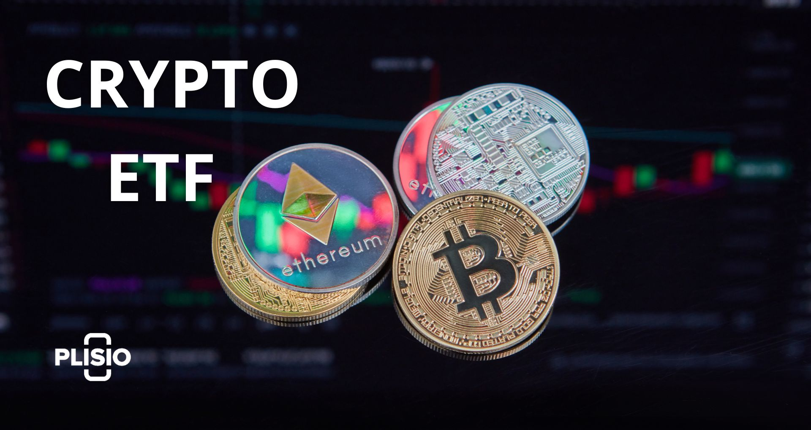

## Table of Contents

## What is a Blockchain ETF?

A Blockchain ETF, or Exchange-Traded Fund, is a type of investment fund that focuses on companies involved in blockchain technology. Blockchain is the technology behind cryptocurrencies like Bitcoin, but it's also used for other things like secure data storage and smart contracts. When you buy shares in a Blockchain ETF, you're investing in a bunch of different companies that work with blockchain, instead of just one company. This can help spread out your risk because if one company doesn't do well, the others might still be doing okay.

These ETFs can be a good way for people who want to invest in blockchain technology without having to pick individual stocks. They're traded on stock exchanges, just like regular stocks, so it's easy to buy and sell them. Some Blockchain ETFs might focus only on companies that make blockchain technology, while others might include companies that use blockchain in their business, like banks or tech companies. This variety means you can choose an ETF that fits what you're looking for in your investment strategy.

## How does a Blockchain ETF work?

A Blockchain ETF works by pooling money from many investors to buy a collection of stocks related to blockchain technology. When you buy shares of the ETF, you're essentially buying a small piece of all the companies the fund holds. This means you don't have to pick and choose individual stocks yourself; the fund managers do that for you. They pick companies that are involved in developing or using blockchain technology, like crypto exchanges, software companies, and even some big banks that are getting into blockchain.

The value of the [ETF](/wiki/etf-trading-strategies) goes up or down based on how well the companies it invests in are doing. If the blockchain industry is doing well, the value of the ETF usually goes up too. You can buy or sell shares of the ETF on a stock exchange, just like you would with any other stock. This makes it easy to get in and out of your investment. Plus, because the ETF holds many different stocks, it can help spread out your risk, which is a big advantage if you're new to investing or want to play it safe.

## What are the benefits of investing in a Blockchain ETF?

Investing in a Blockchain ETF can help you spread out your risk. Instead of putting all your money into one company, you're investing in a bunch of different companies that work with blockchain technology. This means if one company doesn't do well, it might not hurt your investment as much because the others could still be doing okay. It's like not putting all your eggs in one basket.

Another benefit is that it's easy to get started. You don't need to be an expert on blockchain or spend a lot of time [picking](/wiki/asset-class-picking) individual stocks. The fund managers do the hard work for you, choosing which companies to invest in. Plus, you can buy or sell shares of the ETF just like regular stocks, so it's simple to manage your investment. This can be a good way to get into the growing world of blockchain without a lot of hassle.

## What are the risks associated with Blockchain ETFs?

Investing in a Blockchain ETF comes with some risks you should know about. One big risk is that the whole blockchain industry can be pretty up and down. If the market for blockchain technology takes a hit, the value of your ETF could drop too. It's like riding a roller coaster, which can be exciting but also a bit scary if you're not ready for the ups and downs.

Another risk is that the ETF might not pick the best companies to invest in. Even though the fund managers are supposed to choose good companies, they can still make mistakes. If they pick companies that don't do well, it could drag down the value of your ETF. So, it's important to trust that the people managing the fund know what they're doing.

Lastly, there's the risk that comes with any investment in new technology. Blockchain is still pretty new, and it's hard to say for sure how it will grow or change in the future. If it doesn't take off like people hope, the companies in the ETF might struggle, and that could hurt your investment. So, while a Blockchain ETF can be a good way to invest in this exciting new field, it's important to be aware of these risks and think about them before you decide to invest.

## Which companies are typically included in a Blockchain ETF?

A Blockchain ETF usually includes a mix of different types of companies that are involved with blockchain technology. You'll often find companies that make the technology itself, like software developers and crypto exchanges. For example, companies like Coinbase, which runs a big [cryptocurrency](/wiki/cryptocurrency) exchange, or Square, which has a lot of interest in blockchain and cryptocurrencies, might be in the ETF. These companies are directly working on building and improving blockchain tech.

There are also companies that use blockchain in their business, even if they're not making it. Big banks like JPMorgan Chase or tech giants like IBM might be included because they're using blockchain to make their own services better. These companies might not be as focused on blockchain as the first group, but they still play a big role in how the technology grows and is used.

Sometimes, the ETF might even include smaller companies that are trying new things with blockchain. These could be startups working on new ways to use blockchain for things like supply chain management or secure data storage. Including a mix of big and small companies helps spread out the risk and gives you a good look at the whole blockchain world.

## How do Blockchain ETFs differ from other types of ETFs?

Blockchain ETFs are special because they focus only on companies that work with blockchain technology. This is different from other ETFs, which might focus on things like big tech companies, healthcare, or even whole countries' stock markets. When you invest in a Blockchain ETF, you're betting on the growth and success of blockchain, which is the tech behind cryptocurrencies like Bitcoin. Other ETFs might not have anything to do with blockchain at all, so they can be about very different parts of the economy.

Another big difference is that Blockchain ETFs can be a bit riskier because blockchain technology is still pretty new. The value of these ETFs can go up and down a lot, depending on how people feel about blockchain and cryptocurrencies. Other types of ETFs, like ones that focus on big, stable companies or well-known industries, might not have such big swings in value. So, while a Blockchain ETF can be exciting because it's tied to a new and growing technology, it's also important to be ready for the ups and downs that come with it.

## What are the performance metrics to consider when evaluating a Blockchain ETF?

When you're looking at a Blockchain ETF, one important thing to check is how it's doing compared to other investments. You can look at the ETF's returns over different times, like one year, three years, or even longer. This tells you if the ETF is growing and making money. Another thing to look at is how much the ETF's value goes up and down, which is called [volatility](/wiki/volatility-trading-strategies). If the ETF's value jumps around a lot, it might be riskier but could also have bigger rewards. You'll want to see if the ETF is doing better or worse than the overall stock market or other ETFs that focus on technology.

Another key metric is the expense ratio, which is how much you pay to own the ETF. A lower expense ratio means you keep more of your investment returns. You should also check the ETF's holdings to see what companies it's invested in and how much of each company it owns. This can tell you if the ETF is spread out across many companies or if it's putting a lot of money into just a few. Lastly, consider the ETF's trading [volume](/wiki/volume-trading-strategy), which shows how easy it is to buy and sell the ETF. Higher trading volume usually means it's easier to trade without affecting the price too much.

## How does regulation impact Blockchain ETFs?

Regulation can have a big impact on Blockchain ETFs. Since blockchain technology is linked to cryptocurrencies, which can be hard to regulate, the rules around them can change a lot. If the government makes new laws about cryptocurrencies or blockchain, it could affect the companies in the ETF. For example, if a new rule makes it harder for companies to use blockchain, their stocks might go down, and that would make the ETF's value go down too. So, keeping an eye on what regulators are doing is important for anyone investing in a Blockchain ETF.

On the other hand, good regulation can also help Blockchain ETFs. If the government sets clear rules that make it easier for companies to use blockchain, it could help the industry grow. This might make the stocks of the companies in the ETF go up, which would be good for investors. But because the rules can change, investing in a Blockchain ETF can be a bit riskier than other types of ETFs. It's always a good idea to think about how regulations might affect your investment before you decide to buy into a Blockchain ETF.

## What are the common criticisms of Blockchain ETFs?

Some people don't like Blockchain ETFs because they think they're too risky. Blockchain and cryptocurrencies can go up and down a lot, so if you invest in a Blockchain ETF, your money might do the same. Critics say that these ETFs might not be good for people who want their investments to be safe and steady. They also worry that the companies in the ETF might not be the best ones to invest in. The people who pick the companies for the ETF could make mistakes, and that could hurt your investment.

Another criticism is that Blockchain ETFs might not really give you a good way to invest in blockchain technology. Some ETFs include a lot of big companies that only use blockchain a little bit, instead of focusing on the companies that are really working on the tech. Critics say this makes the ETF less about blockchain and more about big tech or finance companies. Also, some people think that because blockchain is so new, it's hard to tell which companies will do well in the future. So, investing in a Blockchain ETF might not be the best way to bet on the future of blockchain.

## How do Blockchain ETFs contribute to the broader adoption of blockchain technology?

Blockchain ETFs help more people learn about and invest in blockchain technology. When people buy shares in a Blockchain ETF, they're putting money into a bunch of different companies that work with blockchain. This can help those companies grow and do more with blockchain, which can make the technology more popular and used in more places. It's like giving a vote of confidence to the whole blockchain industry.

Also, Blockchain ETFs make it easier for regular people to invest in blockchain without having to understand all the tech details. Instead of picking one company to invest in, people can just buy into the ETF and get a piece of many different blockchain companies. This can bring more money into the blockchain world, which can help the technology grow and be used in new ways. So, Blockchain ETFs can play a big role in making blockchain technology more common and accepted.

## What are the future prospects for Blockchain ETFs in the financial market?

The future looks bright for Blockchain ETFs in the financial market. As more people learn about and start using blockchain technology, the demand for easy ways to invest in it will probably grow. Blockchain ETFs make it simple for people to get a piece of the blockchain world without having to pick individual companies. This could bring a lot more money into the industry, helping it grow even faster. Plus, as big companies keep finding new ways to use blockchain, like in banking or supply chains, the ETFs that focus on these companies could do well.

However, there are some things to watch out for. The rules about blockchain and cryptocurrencies can change a lot, and that could affect how well Blockchain ETFs do. If the government makes it harder for companies to use blockchain, the ETFs might struggle. Also, because blockchain is still pretty new, it's hard to say for sure which companies will do well in the long run. So, while Blockchain ETFs have a lot of potential, they also come with some risks. It's important for investors to keep an eye on these things as they think about putting money into Blockchain ETFs.

## How can investors use Blockchain ETFs as part of a diversified investment strategy?

Investors can use Blockchain ETFs to add a bit of excitement to their investment mix without putting all their eggs in one basket. Since Blockchain ETFs hold a bunch of different companies that work with blockchain technology, they can help spread out the risk. Instead of betting everything on one company, you're getting a small piece of many companies. This can be a good way to try out the growing world of blockchain without going all in on a single stock.

Adding a Blockchain ETF to your investment strategy can also help balance out other, more stable investments. If you already have money in things like big tech companies or safe bonds, a Blockchain ETF can give you a chance to grow your money faster, even though it's riskier. By mixing in a Blockchain ETF, you can keep your overall investment safe while still getting a chance to benefit from the exciting new world of blockchain technology.

## References & Further Reading

[1]: Nakamoto, S. (2008). ["Bitcoin: A Peer-to-Peer Electronic Cash System."](https://nakamotoinstitute.org/library/bitcoin/)

[2]: Tapscott, D., & Tapscott, A. (2016). ["Blockchain Revolution: How the Technology Behind Bitcoin Is Changing Money, Business, and the World."](https://dl.acm.org/doi/10.5555/3051781) Penguin.

[3]: Swensen, D. F. (2009). ["Pioneering Portfolio Management: An Unconventional Approach to Institutional Investment."](https://books.google.com/books/about/Pioneering_Portfolio_Management.html?id=SbIz2gRbrF4C) Free Press.

[4]: Frino, A., & Gallagher, D. R. (2001). ["Tracking S&P 500 Index Funds."](https://www.semanticscholar.org/paper/Tracking-S%26P-500-Index-Funds-Frino-Gallagher/b9b608ebe4913ebe21ccad86917fbf6286c4c23c) The Journal of Portfolio Management.

[5]: Burniske, C., & Tatar, J. (2017). ["Cryptoassets: The Innovative Investor's Guide to Bitcoin and Beyond."](https://www.amazon.com/Cryptoassets-Innovative-Investors-Bitcoin-Beyond/dp/1260026671) McGraw-Hill Education.

[6]: Lopez de Prado, M. (2018). ["Advances in Financial Machine Learning."](https://www.amazon.com/Advances-Financial-Machine-Learning-Marcos/dp/1119482089) Wiley.

[7]: Chan, E. P. (2009). ["Quantitative Trading: How to Build Your Own Algorithmic Trading Business."](https://github.com/ftvision/quant_trading_echan_book) Wiley.

[8]: Mueller, B. (2019). ["Investing in the Age of FinTech."](https://link.springer.com/book/10.1007/978-3-030-40818-3) TrendNation.

[9]: Bouchaud, J. P., & Potters, M. (2003). ["Theory of Financial Risk and Derivative Pricing: From Statistical Physics to Risk Management."](https://www.cambridge.org/core/books/theory-of-financial-risk-and-derivative-pricing/5BBBA04CE72ED9E5E7C1C028D9A94FCB) Cambridge University Press.