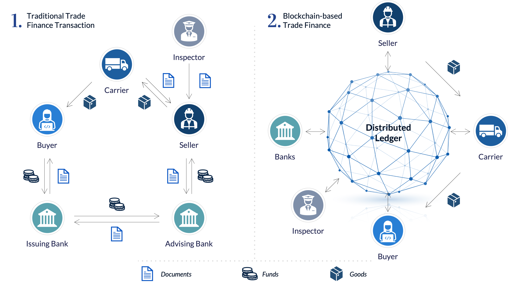

## Table of Contents

## What is blockchain technology?

Blockchain technology is like a digital record book that keeps track of transactions and other information in a way that is secure and hard to change. Imagine a chain of blocks, where each block contains a list of transactions. Once a block is filled with transactions, it gets added to the chain and is locked in place. This chain is stored on many computers around the world, so there's no single point of failure, making it very safe and reliable.

The cool thing about blockchain is that it's transparent and everyone can see the transactions, but it's also private because the people involved are usually represented by codes instead of names. This makes it great for things like cryptocurrencies, where you want to keep your identity secret but still have a trustworthy system. Because it's so hard to change or cheat the system, blockchain is used for many things beyond money, like tracking goods in supply chains or keeping medical records safe.

## How does blockchain work in simple terms?

Imagine a big notebook where everyone can write down what they did, but once something is written, it can't be changed. That's basically what blockchain is. When someone wants to record a transaction, like sending money to a friend, it gets written into a page of the notebook, which we call a "block." Once the page is full, it gets locked and added to the end of the notebook, creating a chain of blocks. Each new block is connected to the one before it, making a long chain that everyone can see and check.

To make sure nobody cheats and changes what's written, the notebook is kept by lots of people all over the world. They all have a copy, and they all agree on what's written in it. If someone tries to change something in their copy, the others will notice because their copies won't match. This way, the information stays safe and honest. That's how blockchain works in simple terms!

## What is trade settlement in financial markets?

Trade settlement in financial markets is when a buyer and seller complete a trade by exchanging money and the asset they agreed on. Imagine you buy a toy from a friend. You give them the money, and they give you the toy. That's settlement. In financial markets, it's the same idea, but instead of toys, it could be stocks, bonds, or other financial products. The process makes sure that both sides get what they expected from the trade.

Settlement usually happens a few days after the trade is agreed upon. This time is needed to make sure everything is correct and to move the money and assets between the buyer and seller. If something goes wrong, like if the buyer doesn't have enough money or the seller doesn't have the asset, the trade might not settle. That's why having a smooth and reliable settlement process is important for keeping trust in financial markets.

## Why is trade settlement important for businesses?

Trade settlement is important for businesses because it makes sure that they get what they paid for and that they get paid for what they sold. When a business buys something, like raw materials, they need those materials to make their products. If the settlement doesn't happen, they might not be able to make their products and could lose money. On the other hand, when a business sells something, they need to get paid so they can keep running and pay their bills. If the settlement doesn't happen, they might run out of money and have to stop working.

Having a good trade settlement process also helps businesses trust each other and the financial system. If businesses know that they will get their money and their goods on time, they are more likely to do business with each other. This trust helps the economy grow because more trading happens. If the settlement process is slow or unreliable, businesses might be scared to trade, and the economy could slow down. So, making sure trade settlement works well is really important for businesses and the whole economy.

## How can blockchain improve the trade settlement process?

Blockchain can make trade settlement faster and safer. Right now, settling a trade can take a few days because it involves many steps and different people checking everything. With blockchain, all the information about a trade is recorded in a way that everyone can see and trust. This means that instead of waiting for different people to check and approve the trade, the settlement can happen almost right away. This is because blockchain uses smart contracts, which are like automatic agreements that do the settlement as soon as everything is ready.

Another way blockchain helps is by making the whole process more secure. Since the information is stored on many computers all over the world, it's very hard for anyone to change or cheat the system. This means businesses can trust that their trades will settle correctly and on time. By using blockchain, businesses can save time and money, and they don't have to worry as much about mistakes or fraud. This can make trading easier and more reliable for everyone involved.

## What are the key benefits of using blockchain for trade settlement?

Using blockchain for trade settlement can make the whole process much faster. Normally, settling a trade can take a few days because it involves a lot of checking and waiting for different people to approve everything. But with blockchain, all the information about a trade is recorded in a way that everyone can see and trust. This means that the settlement can happen almost right away because blockchain uses smart contracts. These are like automatic agreements that do the settlement as soon as everything is ready. This saves a lot of time and helps businesses get their money and goods faster.

Another big benefit is that blockchain makes the trade settlement process more secure. The information about trades is stored on many computers all over the world, so it's very hard for anyone to change or cheat the system. This makes it safer for businesses because they can trust that their trades will settle correctly and on time. By using blockchain, businesses can save money by not having to deal with as many mistakes or fraud. This makes trading easier and more reliable for everyone involved, which can help the economy grow.

## What challenges might arise when implementing blockchain for trade settlement?

When businesses want to use blockchain for trade settlement, they might run into some problems. One big challenge is that blockchain is still new and not everyone understands it well. This means that businesses might need to train their employees and customers about how it works. It can also be hard to get everyone in the trade chain to agree to use blockchain, because some might not want to change the way they do things. This can slow down the process of switching to blockchain.

Another challenge is that blockchain technology can be expensive to set up. Businesses need to buy the right technology and make sure it works well with their current systems. There can also be costs for keeping the blockchain running smoothly and safely. On top of that, the rules about using blockchain for trade settlement can be different in different countries. This means businesses might have to deal with a lot of legal stuff to make sure they are doing everything right. All these challenges can make it tough for businesses to start using blockchain for trade settlement, but if they can get past them, the benefits can be really big.

## Can you explain a real-world example of blockchain being used for trade settlement?

A good example of blockchain being used for trade settlement is the Australian Securities Exchange (ASX). They decided to use blockchain to make settling trades faster and safer. Instead of taking a few days, like it used to, now it can happen almost right away. This helps businesses get their money and stocks faster, which is great for them. The ASX uses a special kind of blockchain called distributed ledger technology to keep track of all the trades. This makes it hard for anyone to cheat or make mistakes, so everyone can trust that the trades will settle correctly.

Another example is the partnership between IBM and the financial company CLS. They created a blockchain platform called LedgerConnect to help with trade settlement. This platform makes it easier for banks and other financial companies to settle their trades quickly and securely. By using blockchain, they can cut down on the time and money it takes to settle trades. This is really helpful for businesses because it means they can get paid faster and don't have to worry as much about mistakes or fraud.

## How does blockchain ensure security and transparency in trade settlements?

Blockchain keeps trade settlements safe and clear by using a special kind of record book that everyone can see but is hard to change. Imagine a big notebook where every trade is written down in a block, and once that block is full, it gets locked and added to a chain of blocks. This notebook is kept by lots of people all over the world, so if someone tries to change something, everyone else will notice because their notebooks won't match. This makes it really hard for anyone to cheat or mess up the trades, which keeps the whole system safe.

The transparency part comes from the fact that everyone can see what's written in the notebook. When a trade happens, it's recorded in a way that everyone can check. The people involved in the trade are usually represented by codes instead of names, so it's private but still open for everyone to see. This means that if there's ever a question about a trade, anyone can look at the blockchain to see what really happened. This openness helps everyone trust that the trades are being settled fairly and correctly.

## What are the regulatory considerations for using blockchain in trade settlement?

When businesses want to use blockchain for trade settlement, they need to think about the rules and laws that might affect them. Different countries have different rules about using new technology like blockchain. Some places might have strict rules to make sure that the trades are safe and fair, while other places might not have clear rules yet. This means businesses might have to spend time and money to make sure they are following all the right laws. They might also need to talk to lawyers and regulators to understand what they need to do to use blockchain correctly.

Another thing to think about is how blockchain can change the way businesses report their trades to the government. Since blockchain makes everything more open and easy to check, it might make it easier for businesses to follow the rules about reporting their trades. But it can also be hard to fit blockchain into the old ways of doing things. Businesses might need to work with regulators to find new ways to report their trades that work well with blockchain. This can take time and might need businesses to change how they do things, but it can also help make the whole system better and more trustworthy.

## How might blockchain integration affect existing trade settlement systems?

When blockchain is added to existing trade settlement systems, it can make things faster and safer. Right now, settling a trade can take a few days because it involves a lot of steps and people checking everything. With blockchain, all the information about a trade is recorded in a way that everyone can see and trust. This means the settlement can happen almost right away because blockchain uses smart contracts, which are like automatic agreements that do the settlement as soon as everything is ready. This can save businesses a lot of time and help them get their money and goods faster.

But adding blockchain to existing systems can also be tricky. It might need businesses to change the way they do things, which can be hard. They might have to train their employees and customers about how blockchain works, and it can be expensive to set up the new technology. Also, not everyone in the trade chain might want to switch to blockchain, which can slow things down. But if businesses can get past these challenges, using blockchain can make trade settlement much better and more reliable for everyone involved.

## What future developments can we expect in blockchain technology for trade settlement?

In the future, we can expect blockchain technology to make trade settlement even faster and easier. Right now, it can already make trades settle almost right away, but as the technology gets better, it might become even quicker and cheaper to use. More businesses might start using blockchain because they see how it can save them time and money. We might also see new ways of using blockchain that we haven't thought of yet, like combining it with other new technologies to make the whole trade process even smoother.

Another thing that could happen is that the rules about using blockchain for trade settlement might become clearer. Right now, different countries have different rules, which can make it hard for businesses to use blockchain everywhere. But as more people start using it, governments might make new rules that help businesses use blockchain more easily. This could make it easier for businesses to settle trades across different countries, which would be great for the global economy.

## References & Further Reading

[1]: Tapscott, D., & Tapscott, A. (2016). ["Blockchain Revolution: How the Technology Behind Bitcoin Is Changing Money, Business, and the World"](https://dl.acm.org/doi/10.5555/3051781). Penguin Books.

[2]: Yu, J., Lin, J., & Shi, X. (2018). ["Application of Blockchain Technology in Financial Settlement System"](https://www.sciencedirect.com/science/article/pii/S221128552030567X). Frontiers of Engineering Management.

[3]: Mainelli, M., & Smith, M. (2015). ["Sharing Ledgers for Sharing Economies: An Exploration of Mutual Distributed Ledgers (aka blockchain technology)"](https://papers.ssrn.com/sol3/papers.cfm?abstract_id=3083963). Journal of Financial Perspectives.

[4]: Underwood, S. (2016). ["Blockchain beyond Bitcoin"](https://dl.acm.org/doi/10.1145/2994581). Communications of the ACM, 59(11), 15-17.

[5]: Ametrano, F. M., & Tasca, P. (2016). ["Blockchain and Crypto-assets: Ledger-based Technologies as Tools to Improve the Financial Sector"](https://papers.ssrn.com/sol3/papers.cfm?abstract_id=2892552). Social Science Research Network. 

[6]: Narayanan, A., Bonneau, J., Felten, E., & Miller, A. (2016). ["Bitcoin and Cryptocurrency Technologies: A Comprehensive Introduction"](https://press.princeton.edu/books/hardcover/9780691171692/bitcoin-and-cryptocurrency-technologies). Princeton University Press. 

[7]: Pilkington, M. (2016). ["11 Blockchain Technology: Principles and Applications"](https://www.elgaronline.com/abstract/edcoll/9781784717759/9781784717759.00019.xml) in Handbook of Digital Currency.