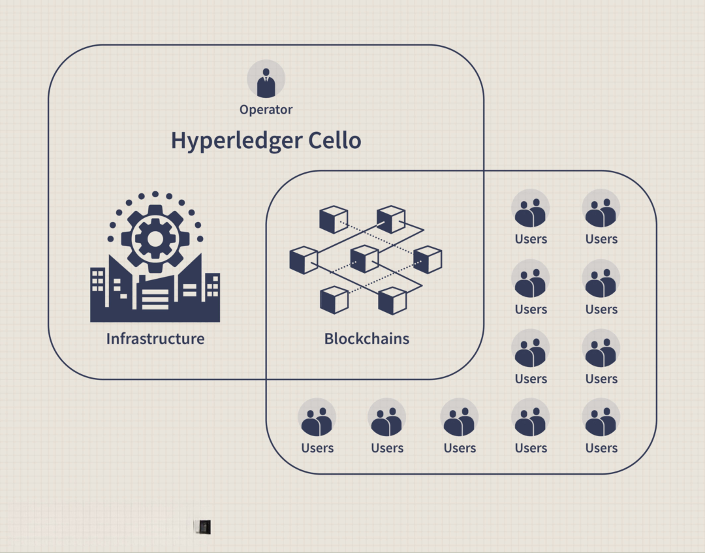

## Table of Contents

## What is blockchain and how does it work at a basic level?

Blockchain is a type of database that stores information in blocks, which are linked together in a chain. Imagine a digital notebook where each page is a block, and these pages are connected in a way that you can't remove or change them without everyone noticing. This makes blockchain very secure and transparent because all the information is spread across many computers, not just one.

At a basic level, when someone wants to add new information to the blockchain, like a new transaction in a cryptocurrency, it gets grouped with other transactions into a block. This block is then checked and verified by many computers in the network, called nodes. Once the majority of these nodes agree that the block is valid, it gets added to the chain. After that, it's very hard to change because it's locked in place and connected to the blocks before and after it. This process keeps the information safe and trustworthy.

## What are the key components of a blockchain?

The main parts of a blockchain are blocks and the chain that links them together. Each block holds a bunch of information, like records of transactions or other data. Every block also has a special code called a hash, which is like a unique fingerprint for that block. There's also a hash from the block before it, which helps keep everything connected and in order.

Another important part is the network of computers, called nodes, that work together to keep the blockchain running. These nodes check and agree on new blocks before they're added to the chain. This process makes sure the information is correct and safe. The whole system is designed so that once something is added to the blockchain, it's very hard to change or remove, which makes it secure and reliable.

## How does blockchain achieve decentralization?

Blockchain achieves decentralization by spreading information across many computers, called nodes, instead of keeping it in one place. Each node has a copy of the entire blockchain, so there's no single point of control or failure. When someone wants to add new information, like a transaction, it has to be checked and agreed upon by many nodes. This means no single person or group can control the whole system because decisions are made by the network as a whole.

This way of working together makes the system fair and open. Because everyone can see the same information and has to agree on changes, it's hard for anyone to cheat or change things without others noticing. This shared responsibility and transparency is what makes blockchain decentralized, keeping power and control spread out among many people instead of just a few.

## What is a block in blockchain and what does it contain?

A block in a blockchain is like a page in a digital notebook. It's a collection of information that gets added to the chain. Each block has a specific amount of data, and once it's full, it gets locked and connected to the block before it. This makes sure that the information stays in order and can't be changed easily.

Inside each block, you'll find a few important things. There are the details of transactions or other data that people want to record. Each block also has a unique code called a hash, which is like a fingerprint for that block. Plus, there's another code, the hash of the previous block, which helps keep the blocks linked together. This way, if someone tries to change something in a block, it would mess up the chain, and everyone would notice.

## How are transactions verified and added to the blockchain?

When someone wants to add a new transaction to the blockchain, it first gets sent to the network of computers, called nodes. These nodes work together to check if the transaction is valid. They look at things like if the person sending the money actually has it, and if the transaction follows the rules of the blockchain. If most of the nodes agree that the transaction is good, it gets grouped with other transactions into a block.

Once a block is full of verified transactions, it's ready to be added to the blockchain. The nodes then compete to solve a tricky math problem, which is like a puzzle. The first node to solve it gets to add the new block to the chain and tell everyone else about it. After the block is added, it's very hard to change because it's locked in place and connected to the blocks before and after it. This process keeps the blockchain safe and trustworthy.

## What is consensus in blockchain and why is it important?

Consensus in blockchain is when most of the computers in the network agree on something, like adding a new block of transactions. It's like voting where everyone has to agree before a decision is made. This agreement is important because it makes sure that everyone has the same information and that the blockchain stays accurate and fair.

Without consensus, someone could add fake transactions or change the information in the blockchain without others knowing. This would make the system unsafe and untrustworthy. By having everyone agree, the blockchain stays secure and everyone can trust that the information is correct.

## What are the different types of consensus mechanisms used in blockchain?

There are several ways that blockchains can reach consensus, and each way has its own special features. One common method is called Proof of Work (PoW). In PoW, computers in the network, called miners, compete to solve a hard math problem. The first one to solve it gets to add a new block to the blockchain and is rewarded with some [cryptocurrency](/wiki/cryptocurrency). This method is used by Bitcoin and is very secure, but it uses a lot of energy.

Another method is Proof of Stake (PoS). Instead of using energy to solve problems, PoS picks the next person to add a block based on how much cryptocurrency they have and are willing to "stake" or lock up as a promise to behave honestly. This method is more energy-efficient and is used by blockchains like Ethereum after its upgrade. There are other methods too, like Delegated Proof of Stake (DPoS) where people vote for a few to make decisions, and Practical Byzantine Fault Tolerance (PBFT) which is used in some private blockchains where a smaller group of nodes agree on changes quickly.

Each of these consensus mechanisms has its own benefits and challenges. PoW is very secure but slow and energy-intensive. PoS is faster and greener but might favor those with more money. DPoS can be even faster but depends on the honesty of a few chosen people. PBFT is quick and efficient but works best in smaller, private networks. Choosing the right consensus mechanism depends on what the blockchain is trying to achieve and the trade-offs it's willing to make.

## How does blockchain ensure security and immutability?

Blockchain keeps information safe and unchangeable by using a special way of storing data. Each piece of information, or transaction, is put into a block. Every block has a unique code called a hash, which is like a fingerprint. This hash is created using the information in the block and the hash of the block before it. If someone tries to change something in a block, the hash would change too, and it wouldn't match with the next block's hash. This makes it very hard to mess with the information because any change would break the chain, and everyone in the network would notice.

Another way blockchain stays secure is by spreading the information across many computers, called nodes. Each node has a copy of the whole blockchain, so there's no single place that can be attacked. When someone wants to add a new block, the nodes work together to check if it's correct. They use a process called consensus to agree on whether the new block should be added. This means that a lot of computers have to agree before anything changes, making it very hard for anyone to cheat or change the information without everyone knowing.

## What are smart contracts and how do they function within a blockchain?

Smart contracts are like digital agreements that automatically do what they're supposed to do when certain conditions are met. They live on the blockchain, which means they're super safe and can't be changed once they're set up. Imagine you and your friend want to bet on a football game. You can use a smart contract that says, "If team A wins, send the money to my friend. If team B wins, send it to me." Once the game is over and the result is clear, the smart contract does the work without anyone needing to do anything else.

These smart contracts work because they're coded with rules that everyone can see and agree on. When something happens that matches the rules, like the football game ending, the smart contract checks if it's true and then does what it's supposed to do. Because it's on the blockchain, everyone can trust that the smart contract will do exactly what it's supposed to do, without any cheating or changing the rules after the fact. This makes them useful for all kinds of things, like buying and selling stuff, or even voting, where you want to make sure everything is fair and automatic.

## What are some common applications of blockchain technology?

Blockchain technology is used in many ways, one of the most famous being cryptocurrencies like Bitcoin and Ethereum. These digital currencies use blockchain to keep track of who owns what, making sure transactions are safe and no one can spend the same money twice. Besides money, blockchain is also used for keeping records safe and private. For example, in supply chains, companies can use blockchain to track products from the factory to the store, making sure everything is done correctly and transparently.

Another common use of blockchain is in smart contracts, which are like automatic agreements that do what they're supposed to do when certain things happen. This can be useful in many areas, like real estate where a smart contract can handle the buying and selling of a house without needing a middleman. Blockchain is also used in voting systems to make sure votes are counted correctly and can't be changed, helping to make elections more fair and transparent.

Overall, blockchain is changing how we do things by making them safer, more transparent, and often cheaper. From banking and finance to healthcare and even art, blockchain is finding new ways to help people trust the information they see and the deals they make.

## How does blockchain technology impact industries like finance, healthcare, and supply chain management?

In the finance industry, blockchain technology is making a big difference by making transactions faster, cheaper, and safer. With cryptocurrencies like Bitcoin, people can send money anywhere in the world without needing a bank. This cuts out the middleman, which saves time and money. Banks are also using blockchain to keep better track of their records and to make sure no one can change them without everyone knowing. This makes the whole system more trustworthy and less likely to have mistakes or fraud.

In healthcare, blockchain helps keep patient records safe and private. Each patient's information is stored in a way that only they and their doctors can see it, but it's also easy to share with other healthcare providers when needed. This can help doctors make better decisions because they have all the information they need. Blockchain can also help track medicines from the factory to the patient, making sure they're safe and real. This can stop fake drugs from getting to people and make sure everyone gets the right treatment.

In supply chain management, blockchain makes it easier to see where products come from and where they're going. Companies can use it to track everything from raw materials to finished products, making sure everything is done right and on time. This helps stop fraud and mistakes, and it can also make the whole process more efficient. For example, if there's a problem with a product, companies can quickly find out where it came from and fix it, which saves time and money.

## What are the scalability challenges faced by blockchain and potential solutions being developed?

Blockchain faces big challenges when it comes to handling a lot of transactions quickly. As more people use blockchain, it can get slow and expensive. For example, Bitcoin can only process a few transactions per second, which is much slower than what big payment systems like Visa can do. This is because every computer on the network has to check and agree on each transaction, which takes time. Also, the more transactions there are, the bigger the blockchain gets, which can make it harder for new computers to join the network.

To solve these problems, people are working on different ideas. One way is to use something called sharding, which splits the blockchain into smaller parts so different groups of computers can work on different transactions at the same time. This can make the system much faster. Another idea is to use "off-chain" transactions, where some transactions happen outside the main blockchain but are still safe and can be added later. This can help reduce the load on the blockchain. There are also new blockchains being made that are designed to be faster and can handle more transactions, like Ethereum 2.0, which is working on making big improvements to how it works.

## What is Blockchain Technology and How Does it Work?

Blockchain technology is fundamentally a decentralized digital ledger system that securely records and verifies transactions across a vast network of computers. Unlike traditional centralized databases, where data is stored on a single server, a blockchain distributes data across multiple nodes, ensuring that the information is both redundant and immutable. This decentralized framework is crucial in eliminating single points of failure and enhancing system resilience.

The bedrock of blockchain's security and data integrity is cryptographic hashing. In this context, a hash function takes an input (or 'message') and returns a fixed-size string of bytes. The output is typically a unique and scrambled representation of the original data. Functions like SHA-256 are prevalently used, especially in Bitcoin's blockchain, to create unique hash values for each block, thus linking it securely to the previous block. The relationship between the blocks can be conceptualized as follows:

$$
\text{hash}_{\text{current}} = \text{SHA-256}(\text{block data} + \text{hash}_{\text{previous}})
$$

This mathematical linkage ensures the chronological and immutable nature of the blockchain, as modifying any part of a block would lead to a cascade of changes throughout the series, alerting network validators to the tamper.

A core advantage of blockchain is its capability to reduce the necessity for intermediaries. In traditional transaction ecosystems, a central authority, like a bank or financial institution, is required to establish trust. However, blockchain technology builds trust through consensus protocols, such as Proof of Work (PoW) or Proof of Stake (PoS). These protocols facilitate agreement among distributed nodes on the true state of the ledger without needing a central moderator, effectively decentralizing trust mechanisms.

Moreover, the ability to maintain a transparent ledger ensures that all participants in the blockchain network have access to the same data concurrently. This transparency, coupled with the assurance of data accuracy and integrity, contributes to establishing a trust-fed transactions environment. These features make blockchain a powerful tool for reliable and decentralized data management, fostering innovation in various sectors by not only safeguarding records but also streamlining processes.

## References & Further Reading

[1]: Nakamoto, S. (2008). ["Bitcoin: A Peer-to-Peer Electronic Cash System."](https://bitcoin.org/bitcoin.pdf)

[2]: Mougayar, W. (2016). ["The Business Blockchain: Promise, Practice, and Application of the Next Internet Technology."](https://books.google.com/books/about/The_Business_Blockchain.html?id=CEsPDAAAQBAJ) Wiley.

[3]: Tapscott, D., & Tapscott, A. (2016). ["Blockchain Revolution: How the Technology Behind Bitcoin Is Changing Money, Business, and the World."](https://dl.acm.org/doi/10.5555/3051781) Portfolio.

[4]: Swan, M. (2015). ["Blockchain: Blueprint for a New Economy."](https://dl.acm.org/doi/book/10.5555/3006358) O'Reilly Media.

[5]: Iansiti, M., & Lakhani, K. R. (2017). ["The Truth About Blockchain."](https://hbr.org/2017/01/the-truth-about-blockchain) Harvard Business Review.

[6]: Treleaven, P., Gendal Brown, R., & Yang, D. (2017). ["Blockchain Technology in Finance."](https://ieeexplore.ieee.org/abstract/document/8048631) Computer, 50(9), 14–17.

[7]: Casey, M. J., & Vigna, P. (2018). ["The Truth Machine: The Blockchain and the Future of Everything."](https://books.google.com/books/about/The_Truth_Machine.html?id=37QoDwAAQBAJ) St. Martin's Press.

[8]: Buterin, V. (2013). ["Ethereum Whitepaper: A Next-Generation Smart Contract and Decentralized Application Platform."](https://ethereum.org/en/whitepaper/)