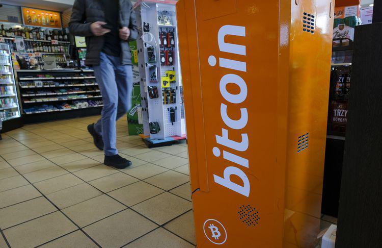

Blockchain technology is heralded as a significant innovation, often compared to the transformative impact of the internet. Initially introduced to the global stage through Bitcoin's inception in 2009, blockchain's conceptual roots extend further back into technology histories, inspired by ideas such as cryptographic security and decentralized computing. At its core, blockchain is a distributed ledger technology that ensures data transparency, immutability, and security, serving multiple applications across diverse sectors beyond its original association with digital currencies.

Bitcoin, envisioned by the pseudonymous Satoshi Nakamoto, marked the birth of blockchain in the public eye. While blockchain's initial use case was cryptocurrency, its potential applications have revealed vast opportunities extending far beyond financial transactions. The underpinning technology of blockchain facilitates peer-to-peer transactions without the need for intermediaries, thus enhancing the speed and cost-effectiveness of data exchanges. This decentralization shifts power from centralized authorities to distributed networks, promoting democratized access to information and resources.



The role of blockchain continues to evolve, paving the way for advancements in algorithmic trading and influencing numerous industries such as finance, healthcare, and supply chain management. In algorithmic trading, blockchain enhances transparency and fairness through immutable transaction records, potentially transforming trading markets into more secure and efficient environments.

Understanding the historical trajectory and technological underpinnings of blockchain is crucial to appreciating its far-reaching impacts and the potential it holds for reshaping industries through innovation. As development and integration continue, blockchain promises to unlock unprecedented efficiency and create new paradigms in data management and transaction security.

## Table of Contents

## The Birth and Evolution of Blockchain Technology

Blockchain technology emerged prominently with the release of Bitcoin in 2009, developed by an anonymous entity known as Satoshi Nakamoto. This innovation addressed the issue of trust in digital transactions by enabling a decentralized and secure method of recording transactions without the need for intermediaries. Initially, blockchain was tightly linked to cryptocurrencies, fostering a perception of it as part of the financial 'Wild West'. The absence of regulatory oversight and the novelty of digital currencies contributed to this reputation.

The landscape of blockchain technology expanded significantly with the introduction of Ethereum in 2015. Ethereum, created by programmer Vitalik Buterin, introduced the concept of smart contracts—self-executing contracts with the terms of the agreement directly written into code. This development effectively decoupled blockchain from its association solely with Bitcoin and other cryptocurrencies, paving the way for myriad business applications. Smart contracts allow for automatic execution of transactions and agreements without the need for a trusted third party, thereby extending blockchain's utility beyond digital currencies.

Today, blockchain stands at a pivotal juncture of digital innovation, influencing a spectrum of industries beyond finance. Its capacity for decentralization, transparency, and security has led to its adoption in sectors such as supply chain management, healthcare, and real estate, among others. These industries leverage blockchain's immutable ledger capabilities to enhance transparency, reduce costs, and improve operational efficiencies. As blockchain technology continues to evolve, it holds the potential to revolutionize conventional systems and practices across diverse sectors by offering new paradigms for data management and transaction processing.

## Blockchain's Applications in Various Industries

Blockchain technology has demonstrated its potential to transform a wide array of industries beyond its origins in cryptocurrencies. One of the most prominent applications is in the finance sector, where blockchain helps address widespread issues such as corruption and inefficiencies. By providing a decentralized and transparent ledger, blockchain enhances trust and accountability, reducing the risk of fraudulent activities and improving operational efficiency. Its ability to facilitate secure, fast, and low-cost transactions is gradually reshaping the financial landscape, with innovations like decentralized finance (DeFi) further broadening its impact.

In government sectors, blockchain is being explored as a tool to enhance transparency and efficiency, thereby reducing corruption. Governments can leverage blockchain to create immutable records of transactions and operations, ensuring that data cannot be tampered with after it is recorded. Such applications include secure voting systems, transparent public expenditure tracking, and efficient land registry management. The technology's inherent transparency can increase public trust in governmental operations and services.

The healthcare industry stands to benefit significantly from blockchain through the secure management of patient data and the streamlining of insurance processes. Blockchain can offer a reliable and secure way to store and share medical records across various healthcare providers, while maintaining patient privacy and consent. This secure data sharing can facilitate better coordination in patient care and improve healthcare outcomes. Furthermore, blockchain can simplify and expedite insurance claims processing by providing verifiable, tamper-proof records of medical treatments and procedures.

The supply chain industry is witnessing significant improvements in tracking and transparency due to blockchain technology. By enabling the recording of every transaction and movement of goods in a permanent and transparent manner, blockchain ensures that supply chain participants have access to a single source of truth regarding product provenance. This enhances the ability to trace products from their origin to the consumer, which is crucial for quality assurance, regulatory compliance, and in cases of recalls. The increased transparency also helps in identifying inefficiencies and reducing fraudulent activities within the supply chain.

## Algorithmic Trading and Blockchain

The intersection of blockchain and [algorithmic trading](/wiki/algorithmic-trading) is emerging as a significant development in financial markets, offering transformative possibilities for trading efficiency and security. Algorithmic trading entails executing trades automatically based on predefined criteria, such as price, [volume](/wiki/volume-trading-strategy), or timing, to optimize outcomes and increase the speed of transactions. Traditionally, there have been challenges related to trust and transparency in algorithmic trading, primarily because of the centralized nature of conventional financial platforms. Blockchain technology addresses these concerns by ensuring transaction security through its decentralized and immutable ledger system.

Blockchain enhances trust within algorithmic trading by providing a transparent, tamper-proof record of transactions. Every transaction is recorded in a block, which is then linked to a chain of previous blocks. This structure ensures that once a transaction is added, it cannot be altered or deleted without detection, fostering greater accountability and reducing the risk of fraud or human error.

Traditional trading platforms often suffer from inefficiencies related to data reconciliation, counterparty risk, and audit trails. In contrast, blockchain automates and streamlines these processes. Smart contracts, introduced with the Ethereum blockchain, are self-executing contracts with the terms of the agreement directly written into code. They automatically enforce and verify the adherence to predetermined trading criteria, further reducing intermediaries and operational delays.

Looking ahead, advancements in blockchain technology hold the potential for even deeper integration with algorithmic trading. The introduction of [artificial intelligence](/wiki/ai-artificial-intelligence) (AI) into this equation could lead to the development of algorithms that not only execute trades but also learn and adapt to market conditions in real-time. AI could analyze vast datasets, identifying patterns and signals more efficiently than human traders, while blockchain ensures that these insights are securely and transparently executed.

For example, consider a Python implementation where AI analyzes a dataset to predict stock price movements, and blockchain is used to execute trades securely:

```python
import pandas as pd
from sklearn.ensemble import RandomForestClassifier
from blockchain import BlockchainNetwork  # Hypothetical blockchain module

# Load historical stock data
data = pd.read_csv('stock_data.csv')

# Feature engineering
features = data[['open', 'high', 'low', 'volume']]
target = data['close'].shift(-1) > data['close']  # Predict if next day's closing price will be higher

# Train a basic Random Forest model
model = RandomForestClassifier(n_estimators=100)
model.fit(features, target)

# Predict future trends
predictions = model.predict(features)

# Trade execution (hypothetical, assumes blockchain network setup)
blockchain_network = BlockchainNetwork()
for i, pred in enumerate(predictions):
    if pred:
        blockchain_network.execute_trade('BUY', data['close'].iloc[i])
    else:
        blockchain_network.execute_trade('SELL', data['close'].iloc[i])

# Output trades
blockchain_network.view_ledger()
```

In this conceptual example, AI provides predictive insights which are executed on a blockchain network, illustrating the potential synergy between these technologies. As blockchain technology continues to evolve, the integration with algorithmic trading is expected to enhance the speed, accuracy, and security of market operations globally. This convergence will likely play a pivotal role in the future landscape of financial markets, potentially leading to the creation of a more robust and transparent trading ecosystem.

## Challenges and Concerns

Blockchain technology, while heralded for its transformative potential, is not without its challenges. A primary concern is scalability. Current blockchain systems often struggle to process a large number of transactions at high speeds. For instance, Bitcoin's blockchain can handle about 7 transactions per second, whereas traditional financial networks like Visa can process thousands of transactions in the same time frame. This limitation hampers the widespread adoption of blockchain for various applications requiring high throughput.

Another significant issue is the consensus mechanisms used by blockchain networks. Proof-of-Work (PoW), employed by Bitcoin, demands substantial computational power and results in high energy consumption. According to a 2019 study by the University of Cambridge, Bitcoin's electricity consumption was comparable to that of some small countries. This environmental impact has led to criticism and a shift towards more sustainable alternatives, such as Proof-of-Stake (PoS). PoS reduces energy consumption by eliminating the competitive mining process, instead requiring validators to hold a certain amount of [cryptocurrency](/wiki/cryptocurrency) to participate in the consensus.

In addition to technical hurdles, blockchain faces regulatory challenges. The decentralized nature of blockchain makes it difficult for traditional regulatory frameworks to apply effectively. Governments worldwide are grappling with how to oversee blockchain activities without stifacing innovation. The integration of blockchain across various industries also poses challenges, as existing systems must be restructured to accommodate decentralized ledgers. This process can be resource-intensive and requires significant time and collaboration between stakeholders.

Addressing these challenges is critical for the continued evolution and acceptance of blockchain technology across sectors. Solutions such as implementing layer-2 scaling solutions, like the Lightning Network for Bitcoin, are being explored to improve scalability. Furthermore, the development of hybrid consensus protocols seeks to balance security, speed, and energy efficiency, fostering broader blockchain adoption while mitigating environmental concerns.

## The Future of Blockchain and Algorithmic Trading

As blockchain technology continues to develop, its integration with algorithmic trading is anticipated to expand significantly. This growth is poised to foster new opportunities for innovation and efficiency in financial markets. Advanced blockchain systems like Ethereum 2.0 and developments in Web 3.0 are pivotal in this evolution, paving the way for decentralized financial ecosystems.

Ethereum 2.0 introduces a transition from the energy-intensive proof-of-work (PoW) consensus mechanism to a proof-of-stake (PoS) system. This shift not only enhances sustainability but also improves scalability and transaction speed, which are critical for high-frequency algorithmic trading. The PoS mechanism allows traders to validate transactions based on the number of cryptocurrency tokens they hold, reducing the carbon footprint and operational costs associated with trade validations. Moreover, Ethereum 2.0's shard chains are designed to enhance the network's throughput, making it more conducive for handling the high volume of transactions typical in algorithmic trading.

In parallel, Web 3.0 developments emphasize decentralized, peer-to-peer networks which promise to transform financial ecosystems. These advancements enable greater data interchange without intermediaries, reducing latency and transaction costs in trading operations. Algorithmic trading can leverage these networks for real-time data analytics, allowing more precise trading strategies based on up-to-date market information.

Algorithmic trading benefits immensely from blockchain's intrinsic properties of transparency and security. The immutability of blockchain ledgers ensures that all transactions are recorded permanently and visible to all market participants, fostering trust and reducing fraud. This transparency enables traders to audit their transactions, verify counterparties, and ensure compliance with regulatory frameworks efficiently. Moreover, blockchain's secure nature protects trading algorithms from unauthorized access and tampering, safeguarding proprietary trading strategies.

Looking ahead, the integration of blockchain with artificial intelligence (AI) presents transformative potential for algorithmic trading. AI-driven algorithms can analyze vast amounts of data for pattern recognition and predictive analytics, enhancing trading decisions. Coupled with blockchain's secure and transparent environment, AI can optimize trading algorithms for speed, accuracy, and strategic adaptability. For example, [machine learning](/wiki/machine-learning) models can continuously improve trading strategies based on real-time feedback loop from the blockchain network, adjusting to market dynamics with greater precision.

In summary, as blockchain technology and algorithmic trading converge, the financial sector stands on the cusp of significant transformation. The adoption of more advanced consensus mechanisms and decentralized networks will not only increase the efficiency and scalability of trading operations but also offer robust security and transparency. This confluence promises to unlock new dimensions of financial innovation and market performance worldwide.

## Conclusion

Blockchain has the potential to be one of the most significant inventions of the 21st century, comparable to the transformative impact of the internet. Its influence extends beyond cryptocurrencies, opening new horizons for innovation and efficiency, particularly within financial markets. The integration of blockchain with algorithmic trading could revolutionize these markets by introducing unprecedented levels of efficiency, security, and transparency.

Algorithmic trading, which relies on automated systems to execute trades based on specific criteria, can benefit immensely from blockchain's attributes. The immutable and transparent nature of blockchain ensures that all transactions are recorded in a secure manner, reducing the risk of fraud and enhancing trust among market participants. By providing a reliable and transparent ledger of all market activities, blockchain can play a crucial role in optimizing trading algorithms, potentially enhancing both speed and accuracy.

Despite these immense potentials, the maturity of blockchain technology is essential to fully realize its potential benefits. Ongoing research and development are crucial to overcoming current challenges that blockchain faces, such as scalability, speed, and energy consumption. Addressing these issues could pave the way for the development of more advanced blockchain systems, such as Ethereum 2.0, and the proliferation of Web 3.0, heralding a new era of decentralized financial ecosystems.

In conclusion, blockchain's promise is vast, with the potential to transform multiple industries, particularly financial markets through advanced algorithmic trading systems. Continued commitment to research, development, and strategic implementation will be pivotal in unlocking blockchain's full potential, ensuring it becomes a cornerstone of technological progress in the years to come.

## References & Further Reading

[1]: Nakamoto, S. (2008). ["Bitcoin: A Peer-to-Peer Electronic Cash System."](https://nakamotoinstitute.org/library/bitcoin/) 

[2]: Buterin, V. (2013). ["Ethereum White Paper."](https://ethereum.org/en/whitepaper/)

[3]: Mougayar, W. (2016). ["The Business Blockchain: Promise, Practice, and Application of the Next Internet Technology."](https://books.google.com/books/about/The_Business_Blockchain.html?id=CEsPDAAAQBAJ)

[4]: Tapscott, D., & Tapscott, A. (2016). ["Blockchain Revolution: How the Technology Behind Bitcoin and Other Cryptocurrencies is Changing the World."](https://dl.acm.org/doi/10.5555/3051781)

[5]: Swan, M. (2015). ["Blockchain: Blueprint for a New Economy."](https://dl.acm.org/doi/book/10.5555/3006358)

[6]: Narayanan, A., Bonneau, J., Felten, E., Miller, A., & Goldfeder, S. (2016). ["Bitcoin and Cryptocurrency Technologies: A Comprehensive Introduction."](https://press.princeton.edu/books/hardcover/9780691171692/bitcoin-and-cryptocurrency-technologies)

[7]: Gomber, P., Kauffman, R. J., Parker, C., & Weber, B. W. (2018). ["On the Fintech Revolution: Interpreting the Forces of Innovation, Disruption, and Transformation in Financial Services."](https://www.jstor.org/stable/26613928) Journal of Management Information Systems, 35(1), 220-265.