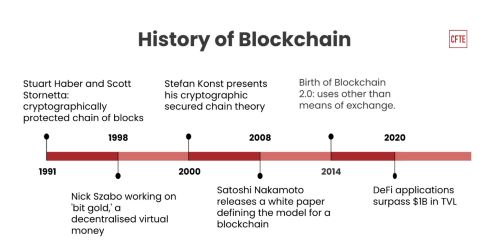

## Table of Contents

## What is blockchain technology?

Blockchain technology is a way to store information that is very safe and hard to change. It's like a chain of blocks where each block holds some information. Once information is put into a block, it's very hard to change it because it's spread out over many computers. This makes it good for things like money transactions, where you want to be sure no one can cheat.

People use blockchain for things like cryptocurrencies, like Bitcoin. It helps keep track of who owns what without needing a bank or a government to say it's okay. This can make transactions faster and cheaper. But it's not just for money; it can be used for other things too, like keeping medical records or tracking where food comes from, making sure everything is transparent and trustworthy.

## How does blockchain work?

Blockchain works by storing information in blocks that are chained together. Each block contains some data, a timestamp, and a special code called a hash. This hash is like a fingerprint for the block, and it's unique. When a new block is added, it's linked to the previous block using its hash. This creates a chain of blocks, which is why it's called a blockchain. All the blocks are stored on many different computers, so if one computer fails, the information is still safe on the others.

To add new information to the blockchain, like a new transaction, it needs to be verified by many computers on the network. This is done through a process called mining, where computers solve hard math problems to confirm the transaction. Once it's confirmed, the new block is added to the chain. Because the information is spread out and needs to be verified by many, it's very hard for someone to change or cheat the system. This makes blockchain secure and trustworthy for keeping records of things like money or contracts.

## What was the first blockchain and when was it created?

The first blockchain was created with Bitcoin. Bitcoin was invented by someone using the name Satoshi Nakamoto in 2009. This blockchain was made to keep track of Bitcoin transactions without needing a bank or any central authority.

Before Bitcoin, there were ideas about digital money, but they didn't work well because they could be cheated. Satoshi Nakamoto's big idea was to use a blockchain to make sure transactions were safe and could not be changed easily. This made Bitcoin the first successful use of blockchain technology.

## What are the key features that distinguish blockchain from other technologies?

Blockchain is different from other technologies because it's very safe and hard to change. It does this by spreading out the information across many computers, so no single person can control or cheat the system. This makes it good for things like money or contracts where you need to trust that the information is right and can't be changed easily. Also, because it's spread out, if one computer fails, the information is still safe on the others.

Another big thing about blockchain is that it's open and clear. Anyone can see the information on the blockchain, but it's hard to change it once it's there. This is useful for keeping track of things like where food comes from or medical records, where you want to make sure everything is done right. Plus, because it doesn't need a central authority like a bank or government to say it's okay, it can make things like money transactions faster and cheaper.

## How has blockchain evolved since its inception?

Since the first blockchain was made with Bitcoin in 2009, it has grown a lot. At first, people used blockchain just for cryptocurrencies like Bitcoin. But then, people started thinking of other ways to use it. They made new types of blockchains that could do more than just money transactions. These new blockchains could handle contracts, keep track of where things come from, and even help with voting. They also made blockchains that could work faster and use less energy, because the first ones used a lot of power.

Now, blockchain is used in many different areas. Big companies and banks are using it to make their work easier and safer. For example, they use it to keep track of money or goods moving around the world. Governments are looking at it too, to make voting or keeping records more clear and hard to cheat. Also, people are making new kinds of cryptocurrencies and using blockchain for things like art and games. Blockchain has come a long way from just being about Bitcoin, and it keeps changing to solve new problems.

## What are some major historical milestones in the development of blockchain?

The journey of blockchain started in 2009 when someone named Satoshi Nakamoto made Bitcoin. Bitcoin used blockchain to keep track of money transactions without needing a bank or any central authority. This was a big deal because it showed that you could have safe and clear records of transactions that no one could easily change. After Bitcoin, people started to see that blockchain could be used for other things too, not just money.

In the years that followed, new types of blockchains were made. In 2013, a group called Ethereum came up with a new kind of blockchain that could do more than just keep track of money. It could handle smart contracts, which are like digital agreements that run themselves. This opened up a lot of new possibilities. Around the same time, people started to see that blockchain could be used in many different areas, like keeping track of where food comes from or making voting more clear and hard to cheat. 

As blockchain kept growing, it faced some challenges too. People found that the early blockchains used a lot of energy, so they worked on making new ones that used less power. Big companies and banks started to see the value in blockchain and began using it to make their work easier and safer. Governments also started looking at blockchain to solve problems like keeping records or making voting better. Today, blockchain is still changing and finding new ways to help with all sorts of problems.

## Who were the key figures in the early development of blockchain?

The most important person in the early days of blockchain was Satoshi Nakamoto. This is the name used by the person or group who created Bitcoin in 2009. Nakamoto's big idea was to use a blockchain to keep track of Bitcoin transactions without needing a bank or any central authority. This made Bitcoin the first successful use of blockchain technology. Nakamoto worked on Bitcoin for a few years before disappearing in 2011, leaving behind a system that changed the world of money and technology.

After Nakamoto, other people started to build on the idea of blockchain. One key figure was Vitalik Buterin, who co-founded Ethereum in 2013. Ethereum took the idea of blockchain further by adding smart contracts, which are like digital agreements that run themselves. This opened up a lot of new possibilities for what blockchain could do. Buterin and his team helped show that blockchain wasn't just for money; it could be used for many different things. Together, Nakamoto and Buterin laid the groundwork for the growth and development of blockchain technology.

## What impact has blockchain had on various industries historically?

Since blockchain was first used with Bitcoin in 2009, it has changed many industries. In finance, blockchain made it possible to send money without banks, making transactions faster and cheaper. This was a big change because it showed that you could trust a system without needing a middleman. Companies like banks started using blockchain to keep track of money moving around the world, making everything clearer and safer. Also, new kinds of money called cryptocurrencies were made, which let people buy and sell things in new ways.

Blockchain also affected other areas like supply chains and healthcare. In supply chains, companies use blockchain to track where goods come from and where they go, making sure everything is done right. This is important for things like food, where you want to know it's safe and fresh. In healthcare, blockchain helps keep medical records safe and clear, so doctors and patients can trust that the information is right and can't be changed easily. These changes show how blockchain can make industries work better and be more trustworthy.

Over time, blockchain has kept growing and finding new uses. Governments have looked at using blockchain for voting to make it more clear and hard to cheat. Artists and gamers have used blockchain to make and sell digital art and games, creating new ways to own and trade things online. Even though blockchain started with just Bitcoin, it has become a big part of many different industries, helping to solve problems and make things better.

## How have governments and regulatory bodies responded to blockchain over time?

Since blockchain started with Bitcoin, governments and regulatory bodies have been trying to figure out how to handle it. At first, many were worried because blockchain let people send money without banks or governments, which could be used for things like illegal activities. So, some countries made strict rules to control cryptocurrencies and blockchain. But as time went on, more governments saw that blockchain could be useful for good things too, like making voting more clear or keeping records safe. They started to make rules that would help blockchain grow in a safe way, balancing the need to stop bad uses with the chance to use it for good.

Now, many countries have different ways of dealing with blockchain. Some have made clear rules about how to use cryptocurrencies and blockchain, trying to make sure they are safe and legal. Others are still thinking about what to do, watching how blockchain is used and what problems come up. Governments are also starting to use blockchain themselves, like for keeping track of land records or making sure voting is fair. This shows that while there are still worries about how blockchain could be misused, many see it as a tool that can help make things better and more trustworthy.

## What are the significant challenges blockchain has faced throughout its history?

One big challenge for blockchain has been using a lot of energy. The early blockchains, like the one used by Bitcoin, needed a lot of power to keep working. This was because they used a process called mining, where computers solve hard math problems to add new information to the blockchain. This used so much energy that it worried people about the environment. Over time, people have been working on new ways to make blockchains that use less power, but it's still a big problem.

Another challenge has been making rules and laws about blockchain. Because blockchain let people send money without banks or governments, some people used it for illegal things. This made governments worried, and they started making strict rules to control cryptocurrencies and blockchain. But it's hard to make rules that stop bad uses without stopping the good uses too. Governments are still trying to find the right balance, so blockchain can grow in a safe way.

Also, people have had trouble understanding and using blockchain. It's a new and complicated technology, and not everyone knows how it works or how to use it. This has made it hard for blockchain to be used in more places. But as more people learn about it and it gets easier to use, blockchain is starting to be used in more industries, like finance, healthcare, and supply chains.

## How does blockchain's historical development compare to other revolutionary technologies?

Blockchain's history is a bit like the stories of other big technologies, like the internet or electricity. When these technologies first came out, people didn't really know what they could do. The internet started as a way for scientists to share information, but then it grew into something that changed the whole world. Electricity was first used for simple things like lighting, but then it made all sorts of new inventions possible. Blockchain started with Bitcoin, which was just about sending money without banks, but now it's used for all sorts of things, like keeping track of where food comes from or making voting more fair.

But blockchain also has its own special challenges. Like the internet, it faced worries about security and being used for bad things. People were scared that the internet could be used for crime, and they had to make rules to keep it safe. Blockchain had the same problem, with some people using it for illegal money stuff. Also, blockchain used a lot of energy, which is a problem that other technologies like the internet didn't have as much. But just like the internet and electricity, people are working hard to solve these problems so that blockchain can keep growing and helping in new ways.

## What future developments in blockchain are predicted based on its historical trajectory?

Based on how blockchain has grown over time, people think it will keep getting better and be used in more places. One big thing that might happen is that blockchains will get faster and use less energy. Right now, some blockchains use a lot of power, which is not good for the environment. But people are working on new ways to make blockchains that don't need so much energy. This could make blockchain more popular and easier to use for all sorts of things, like keeping track of money or goods.

Another thing that might happen is that more rules will be made about how to use blockchain. Governments have been trying to figure out how to keep blockchain safe while still letting it grow. In the future, they might make clearer rules that help blockchain be used for good things, like voting or keeping records, without letting it be used for bad things. This could make people trust blockchain more and use it in more places.

Also, blockchain might be used in even more industries than it is now. Right now, it's used in finance, healthcare, and supply chains, but in the future, it could help with things like making sure art or music is real, or helping companies work together better. As more people learn about blockchain and it gets easier to use, it could change a lot of different areas and make them better and more trustworthy.

## References & Further Reading

[1]: Nakamoto, S. (2008). ["Bitcoin: A Peer-to-Peer Electronic Cash System."](https://nakamotoinstitute.org/library/bitcoin/) 

[2]: Buterin, V. (2013). ["Ethereum White Paper."](https://ethereum.org/en/whitepaper/)

[3]: Mougayar, W. (2016). ["The Business Blockchain: Promise, Practice, and Application of the Next Internet Technology."](https://books.google.com/books/about/The_Business_Blockchain.html?id=CEsPDAAAQBAJ)

[4]: Tapscott, D., & Tapscott, A. (2016). ["Blockchain Revolution: How the Technology Behind Bitcoin and Other Cryptocurrencies is Changing the World."](https://dl.acm.org/doi/10.5555/3051781)

[5]: Swan, M. (2015). ["Blockchain: Blueprint for a New Economy."](https://dl.acm.org/doi/book/10.5555/3006358)

[6]: Narayanan, A., Bonneau, J., Felten, E., Miller, A., & Goldfeder, S. (2016). ["Bitcoin and Cryptocurrency Technologies: A Comprehensive Introduction."](https://press.princeton.edu/books/hardcover/9780691171692/bitcoin-and-cryptocurrency-technologies)

[7]: Gomber, P., Kauffman, R. J., Parker, C., & Weber, B. W. (2018). ["On the Fintech Revolution: Interpreting the Forces of Innovation, Disruption, and Transformation in Financial Services."](https://www.jstor.org/stable/26613928) Journal of Management Information Systems, 35(1), 220-265.