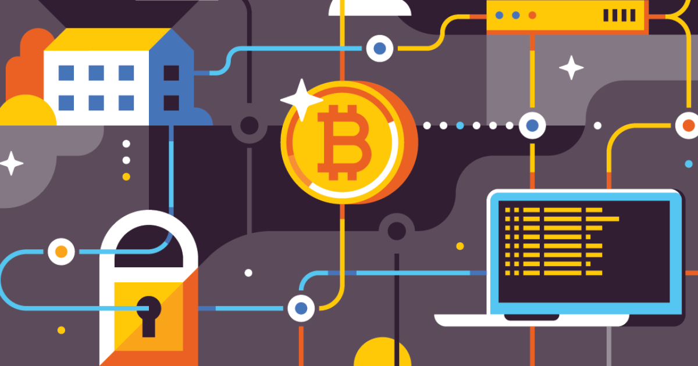

## Table of Contents

## What is blockchain technology and how does it work?

Blockchain technology is a way to store information securely and transparently. It's like a digital ledger where information is recorded in blocks, and these blocks are linked together in a chain. Once information is added to a block, it's very hard to change or delete it. This makes the system trustworthy because everyone can see the same information, and no one can secretly change it.

The way blockchain works is by using many computers, called nodes, that all keep a copy of the ledger. When someone wants to add new information, like a transaction, it gets checked by these nodes. If most of the nodes agree that the information is correct, it gets added to a new block. This process is called consensus. After a block is added, it's locked and connected to the previous block, creating a chain. This makes it very secure because changing one block would require changing all the blocks that come after it, which is nearly impossible.

## How is blockchain used in trading?

Blockchain is used in trading to make it safer and more transparent. When people trade things like stocks or cryptocurrencies, they use blockchain to record every trade. This record is kept on many computers, so it's hard for anyone to cheat or change the information. Everyone can see the trades, which helps build trust because you know the information is real and hasn't been messed with.

In trading, blockchain also helps to speed things up. Normally, trading can take a few days because banks or other middlemen need to check everything. With blockchain, trades can happen much faster because the computers can agree on the trade quickly. This means you can buy or sell things more easily and don't have to wait as long for your money or items to move from one place to another.

## What are the benefits of using blockchain in trading?

Using blockchain in trading makes everything more secure and trustworthy. Because every trade is recorded on a blockchain, it's very hard for anyone to change or fake the information. This means that when you trade, you can be sure that the record of what you bought or sold is correct and hasn't been tampered with. Everyone can see the same information, which helps to build trust between people who are trading.

Another benefit is that blockchain can make trading faster and easier. Normally, when you trade things like stocks or money, it can take a few days because banks or other middlemen need to check everything. But with blockchain, the computers can agree on the trade quickly, so you don't have to wait as long. This makes it easier to buy or sell things and get your money or items moved from one place to another without delays.

Lastly, using blockchain can save money. Because there are fewer middlemen involved, the costs of trading go down. You don't have to pay as much for banks or other services to handle your trades, which means more of your money stays with you. This can make trading more affordable for everyone.

## What are the potential risks and challenges of using blockchain in trading?

Using blockchain in trading can be risky because it's still a new technology. One big problem is that it can be hard to understand and use. Not everyone knows how blockchain works, so it can be confusing for people who want to trade. Also, if something goes wrong with the blockchain system, like a computer hack, it can be hard to fix because the information is spread out on many computers. This means that if someone steals your information or money, it might be very hard to get it back.

Another challenge is that blockchain can use a lot of energy. The computers that keep the blockchain running need to do a lot of work to check and agree on trades, which can use up a lot of electricity. This can be bad for the environment and can also make trading more expensive because someone has to pay for all that energy. Plus, because blockchain is still new, the rules and laws about using it in trading are not clear yet. This can make it tricky for people to know if they are doing things the right way and can lead to problems with the law.

Overall, while blockchain can make trading safer and faster, it also comes with risks and challenges. It's important for people to learn about these issues and be careful when they use blockchain for trading. As the technology gets better and more people understand it, some of these problems might get easier to handle, but for now, it's good to be aware of the potential downsides.

## How does blockchain enhance security in trading?

Blockchain makes trading safer by keeping a record of every trade on many computers. This means that if someone tries to change or fake a trade, it's very hard because they would need to change the information on all those computers at the same time. Everyone can see the same information, so it's easy to spot if something is wrong. This helps to build trust because people know that the trades are real and haven't been messed with.

Another way blockchain helps with security is by using special codes called cryptography. These codes make sure that only the right people can see and change the information. When you make a trade, it gets locked with these codes, so no one else can mess with it. This keeps your trades safe and private, which is important when you're dealing with money or valuable things.

## What role do cryptocurrencies play in blockchain-based trading?

Cryptocurrencies are a big part of trading that uses blockchain. They are like digital money that people can use to buy and sell things on the internet. When you trade cryptocurrencies, every trade is recorded on the blockchain, which is a safe and clear way to keep track of everything. This means that when you use cryptocurrencies to trade, you can trust that the information about your trades is correct and hasn't been changed by anyone.

Using cryptocurrencies in blockchain-based trading also makes things faster and easier. Normally, when you trade with regular money, banks or other middlemen need to check everything, which can take a few days. But with cryptocurrencies, the trades can happen much quicker because the computers on the blockchain can agree on the trade without needing these middlemen. This makes it easier for you to buy or sell things and get your money moved around without waiting as long.

## How can blockchain improve the efficiency of trading processes?

Blockchain can make trading faster and easier. When you trade using blockchain, the computers on the network can check and agree on trades quickly. This means you don't have to wait for banks or other middlemen to look at everything, which can take a few days. With blockchain, your trades can happen in minutes or even seconds. This makes it easier for you to buy or sell things and get your money or items moved around without long delays.

Another way blockchain improves efficiency is by cutting out the middleman. Normally, when you trade, you have to pay fees to banks or other services to handle your trades. But with blockchain, you can trade directly with other people without needing these middlemen. This can save you money because you don't have to pay as much for the trade to happen. It also means that the process is simpler and quicker because there are fewer steps involved.

## What are smart contracts and how are they used in blockchain trading?

Smart contracts are like digital agreements that work on the blockchain. They are special because they can do things automatically when certain rules are met. For example, if you're trading something and you both agree on the price, the smart contract can make sure the trade happens without anyone else needing to check it. This makes trading faster and easier because you don't have to wait for someone to say it's okay.

In blockchain trading, smart contracts are really helpful. They can make sure that trades are fair and that everyone follows the rules. If you're buying something with [cryptocurrency](/wiki/cryptocurrency), the smart contract can hold the money until you get what you paid for. Once you get it, the money is automatically sent to the seller. This way, both buyers and sellers can trust that the trade will happen the way it's supposed to, without needing a middleman to make sure everything goes right.

## Can you explain the concept of decentralized exchanges (DEXs) in blockchain trading?

Decentralized exchanges, or DEXs, are a way to trade cryptocurrencies without needing a middleman like a bank or a traditional exchange. Instead of using one big company to handle all the trades, DEXs use blockchain technology to let people trade directly with each other. This means that when you want to trade, you connect to the blockchain, and the trade happens between you and the other person, without anyone else controlling it.

Using DEXs can be safer and more private because you keep control of your own money. When you trade on a DEX, you don't have to give your money to someone else to hold onto while the trade happens. Instead, the smart contracts on the blockchain make sure the trade is fair and that both people get what they're supposed to. This can make trading faster and cheaper because you don't have to pay fees to a middleman, and you can trust that the trade will happen the way it's supposed to.

## How does blockchain technology affect regulatory compliance in trading?

Blockchain technology can make it harder for regulators to keep track of trading because it's decentralized and doesn't have one central place to check. With traditional trading, regulators can go to banks or exchanges to see what's happening. But with blockchain, trades happen between people directly, and the information is spread out on many computers. This means regulators need to find new ways to watch what's going on and make sure everyone is following the rules.

On the other hand, blockchain can also help with regulatory compliance by making everything more transparent. Every trade is recorded on the blockchain, so it's easy to see what happened and when. This can help regulators because they can look at the blockchain to check if trades are fair and if people are following the rules. But because blockchain is still new, the rules about how to use it for trading are not clear yet, so it's a challenge for everyone to figure out how to do things the right way.

## What are some real-world examples of blockchain being used in trading?

One real-world example of blockchain being used in trading is with cryptocurrencies like Bitcoin and Ethereum. People trade these digital currencies on blockchain-based platforms, like decentralized exchanges (DEXs). These platforms let people buy and sell cryptocurrencies directly with each other without needing a bank or traditional exchange. This makes trading faster and can save money because there are fewer fees to pay. The blockchain keeps a clear record of every trade, so everyone can see what's happening and trust that the trades are fair.

Another example is in the stock market, where some companies are starting to use blockchain to make trading more efficient. For instance, the Australian Securities Exchange (ASX) is working on a new system that uses blockchain to settle trades. This means that when people buy or sell stocks, the blockchain can help make sure the trade happens quickly and correctly. By using blockchain, the ASX hopes to cut down on the time and cost of trading, making it easier for everyone involved.

Overall, blockchain is being used in different ways to improve trading. Whether it's trading cryptocurrencies on DEXs or using blockchain to settle stock trades, the technology helps make things faster, cheaper, and more transparent. As more people and companies learn about blockchain, we might see even more examples of how it can change the way trading works.

## What future developments can we expect in blockchain technology for trading?

In the future, we can expect blockchain technology to make trading even better. One big change might be that more and more people will use decentralized exchanges (DEXs) for trading cryptocurrencies. These DEXs let people trade directly with each other without needing a middleman, which can make trading faster and cheaper. As more people learn about DEXs and how to use them, they might become the main way people trade digital money. Also, as blockchain technology gets better, it might be used for trading other things like stocks and bonds, making the whole process more efficient and secure.

Another thing we might see is that blockchain will help make trading rules clearer and easier to follow. Right now, it can be hard for regulators to keep track of trades on the blockchain because it's decentralized. But in the future, new tools and systems might be made to help regulators watch what's happening and make sure everyone is following the rules. This could mean that blockchain trading becomes more common and trusted, as people know that the trades are being watched and that everything is fair. As blockchain technology keeps growing, it will likely change the way trading works in many exciting ways.

## References & Further Reading

[1]: Tapscott, D., & Tapscott, A. (2016). ["Blockchain Revolution: How the Technology Behind Bitcoin Is Changing Money, Business, and the World."](https://dl.acm.org/doi/10.5555/3051781) Penguin.

[2]: Narayanan, A., Bonneau, J., Felten, E., Miller, A., & Goldfeder, S. (2016). ["Bitcoin and Cryptocurrency Technologies: A Comprehensive Introduction."](https://press.princeton.edu/books/hardcover/9780691171692/bitcoin-and-cryptocurrency-technologies) Princeton University Press.

[3]: Swan, M. (2015). ["Blockchain: Blueprint for a New Economy."](https://www.scirp.org/reference/ReferencesPapers?ReferenceID=2529258) O'Reilly Media.

[4]: Mougayar, W. (2016). ["The Business Blockchain: Promise, Practice, and Application of the Next Internet Technology."](https://books.google.com/books/about/The_Business_Blockchain.html?id=CEsPDAAAQBAJ) Wiley.

[5]: Peters, G.W., & Panayi, E. (2016). ["Understanding Modern Banking Ledgers through Blockchain Technologies: Future of Transaction Processing and Smart Contracts on the Internet of Money"](https://link.springer.com/chapter/10.1007/978-3-319-42448-4_13) In Banking Beyond Banks and Money. Springer. 

[6]: Yermack, D. (2017). ["Corporate Governance and Blockchains."](https://academic.oup.com/rof/article/21/1/7/2888422) Journal of Economic Perspectives, 31(3), 141-156.