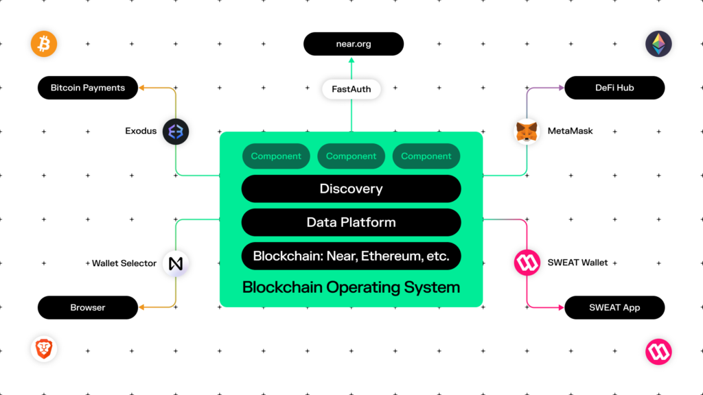

## Table of Contents

## What is a blockchain operating system?

A blockchain operating system is a special kind of computer system that uses blockchain technology to work. Blockchain is like a digital notebook where information is stored in a way that is very hard to change or cheat. In a blockchain operating system, this technology helps to make the system more secure and transparent. Instead of having one main computer controlling everything, many computers work together and keep copies of the same information. This makes it harder for anyone to take control or mess with the system.

These operating systems are often used for things like cryptocurrencies, where people need to trust that their money is safe. But they can also be used for other things, like keeping track of who owns what in a company, or making sure votes in an election are counted fairly. Because the system is spread out across many computers, it can keep running even if some of the computers stop working. This makes it very reliable and hard to break.

## How does a blockchain operating system differ from traditional operating systems?

A blockchain operating system is different from traditional operating systems in how it stores and manages data. In a traditional operating system, like Windows or macOS, there's usually one main computer or server that controls everything. This central computer keeps all the important data and tells other computers what to do. But in a blockchain operating system, there's no single boss computer. Instead, many computers work together, and each one has a copy of all the data. This makes it much harder for someone to cheat or mess with the system because they would need to change the data on most of the computers at the same time.

Another big difference is how secure and transparent a blockchain operating system is compared to traditional ones. Traditional operating systems can be secure, but they often rely on the central computer to protect the data. If someone hacks into that central computer, they could change or steal the data. In a blockchain operating system, the data is spread out and protected by many computers. Plus, every change to the data is recorded in a way that everyone can see, making it very hard to hide any sneaky actions. This makes blockchain operating systems great for things like money or voting, where trust and fairness are really important.

## What are the key features of a blockchain operating system?

A blockchain operating system is special because it uses many computers to work together instead of just one. Each computer in the system keeps a copy of all the information, which makes it very hard for someone to change or cheat the data. If someone tries to mess with the information on one computer, the other computers can spot the change and fix it. This way of working together makes the system very strong and reliable, even if some computers stop working.

Another important feature is how secure and open the system is. Because the data is spread out across many computers, it's much harder for hackers to break into the system. Every change to the data is recorded and can be seen by everyone, which helps keep everything fair and honest. This makes blockchain operating systems good for things like money or voting, where people need to trust the system a lot.

## Can you explain the architecture of a blockchain operating system?

A blockchain operating system is built on a network of computers that work together without a single boss computer. Instead of having one main computer that controls everything, each computer in the network keeps a copy of all the data. This setup is called a decentralized system. When someone wants to add new information or make a change, the computers in the network vote on it. If most of them agree, the change gets added to the data that everyone shares. This way, the system stays fair and can keep working even if some computers stop working or get hacked.

The architecture also includes special ways to keep the data safe and open. Every piece of data is stored in blocks, and these blocks are linked together to form a chain, which is why it's called a blockchain. Each block has a record of all the changes made, and once a block is added to the chain, it's very hard to change it without everyone noticing. This makes the system very secure and transparent because everyone can see all the changes that have been made. This setup is great for things like money or voting, where people need to trust that the system is fair and honest.

## What are the main benefits of using a blockchain operating system?

One of the main benefits of using a blockchain operating system is that it is very secure. Because the data is spread out across many computers instead of just one, it's much harder for hackers to break into the system and mess with the information. If someone tries to change the data on one computer, the other computers can spot the change and fix it. This makes the system very reliable and trustworthy, which is important for things like money or voting where people need to feel safe about using the system.

Another big benefit is that a blockchain operating system is very transparent. Every change to the data is recorded in a way that everyone can see, making it hard for anyone to hide any sneaky actions. This openness helps build trust because people can check the records and see that everything is fair and honest. Plus, since the system doesn't rely on one main computer, it can keep running even if some computers stop working, making it very dependable.

## What are some common use cases for blockchain operating systems?

One common use for blockchain operating systems is in the world of cryptocurrencies, like Bitcoin and Ethereum. These systems help keep digital money safe and make sure that transactions are fair and honest. Because the data is spread out across many computers, it's very hard for someone to cheat or steal the money. This makes people feel more secure when they use cryptocurrencies for buying things or sending money to others.

Another use case is in supply chain management. Companies can use blockchain operating systems to keep track of where their products are coming from and where they are going. This helps make sure that the products are real and haven't been messed with along the way. It's like having a clear record that everyone can see, which builds trust between the company and its customers.

Blockchain operating systems are also used in voting systems to make elections more fair and transparent. Each vote can be recorded on the blockchain, making it hard for anyone to change the results without being noticed. This helps people trust that their votes are counted correctly and that the election is honest.

## How does security work in a blockchain operating system?

Security in a blockchain operating system works by spreading data across many computers instead of keeping it in one place. This means that if someone tries to hack into the system, they would need to change the data on most of the computers at the same time, which is very hard to do. Each computer in the network keeps a copy of all the data, so if one computer gets messed with, the others can spot the change and fix it. This makes the system very strong and reliable, even if some computers stop working or get hacked.

Another important part of security is how the system keeps track of changes. Every time someone wants to add new information or make a change, the computers in the network vote on it. If most of them agree, the change gets added to the data that everyone shares. This way, the system stays fair and honest. Plus, every change is recorded in a way that everyone can see, making it hard for anyone to hide any sneaky actions. This openness helps build trust because people can check the records and see that everything is fair and honest.

## What are the challenges and limitations of implementing a blockchain operating system?

One of the big challenges of using a blockchain operating system is that it can be slow. Because every computer in the network has to agree on changes, it takes time for new information to be added. This can be a problem if you need to do things quickly, like in a busy store where lots of people are buying things at the same time. Another challenge is that it can use a lot of energy. Each computer in the network has to work hard to keep the system running, and all that work adds up to a lot of electricity being used, which can be bad for the environment.

Another limitation is that once something is added to the blockchain, it's very hard to change or take it away. This can be good for keeping things safe and honest, but it can also be a problem if you make a mistake or if someone adds something they shouldn't. Also, not everyone understands how blockchain works, so it can be hard to get people to trust and use the system. This means that companies and groups need to spend time teaching people about blockchain before they can use it widely.

## How does a blockchain operating system handle scalability and performance?

A blockchain operating system can face challenges with scalability and performance because it needs many computers to agree on every change. This agreement process, called consensus, takes time and can slow down the system. When lots of people want to use the system at the same time, like during busy hours, it can get even slower. This is why blockchain systems might not be the best choice for things that need to happen very quickly, like buying things in a busy store.

To help with these issues, people are working on new ways to make blockchain systems faster and able to handle more users. One idea is to use smaller groups of computers to agree on changes instead of the whole network. This can speed things up because fewer computers need to talk to each other. Another idea is to split the work into different parts of the blockchain, so that different groups of computers can work on different tasks at the same time. These solutions are still being tested and improved, but they show that there are ways to make blockchain systems work better as more people use them.

## What are the leading blockchain operating systems currently available?

Some of the leading blockchain operating systems right now are Ethereum, Hyperledger Fabric, and EOS. Ethereum is very popular because it lets people create smart contracts, which are like digital agreements that can do things automatically. It's used for lots of different projects, not just for money. Hyperledger Fabric is another big one, but it's more for businesses. It's made to be private and secure, so companies can use it to keep track of their stuff without everyone being able to see. EOS is also important because it tries to make things faster and easier to use. It's like a platform where people can build their own apps and services on top of it.

These systems each have their own special features. Ethereum is open for anyone to use and has a big community of people working on it. Hyperledger Fabric is more about helping businesses work together in a safe way. EOS focuses on making things run smoothly and quickly, so it's good for apps that need to work fast. All of these systems are trying to solve different problems and make blockchain technology better for different kinds of users.

## How can developers start building applications on a blockchain operating system?

Developers can start building applications on a blockchain operating system by first choosing the right platform for their needs. Ethereum is a popular choice because it supports smart contracts, which are like digital agreements that can automatically do things when certain conditions are met. To get started, developers need to learn a programming language like Solidity, which is used specifically for writing smart contracts on Ethereum. They can then use tools like Truffle or Remix to write, test, and deploy their smart contracts. There are lots of online tutorials and communities that can help developers learn and solve problems as they build their applications.

Once developers have a good understanding of the basics, they can start thinking about what kind of application they want to build. For example, they might want to create a new kind of digital money, a game where players can own and trade items, or a system to track where products come from in a supply chain. They need to plan out how their application will work and how it will use the blockchain to keep things safe and fair. After they have a plan, they can start coding their application, testing it to make sure it works right, and then putting it on the blockchain for people to use. It's important for developers to keep learning and improving their applications as they go, because blockchain technology is always changing and getting better.

## What future developments can we expect in blockchain operating systems?

In the future, we can expect blockchain operating systems to become faster and easier to use. Right now, one of the big problems with blockchain is that it can be slow when lots of people are using it at the same time. People are working on new ways to make it quicker, like using smaller groups of computers to agree on changes instead of the whole network. This could help make blockchain better for things that need to happen fast, like buying things online or playing games. Also, as more people learn about blockchain, it will become easier for developers to build new apps and for regular people to use them.

Another big change we might see is blockchain becoming more friendly to the environment. Right now, using blockchain can use a lot of energy because each computer in the network has to work hard to keep the system running. Scientists and engineers are trying to find ways to make blockchain use less power, maybe by using different ways for computers to agree on changes. If they can do this, it will make blockchain a better choice for all kinds of uses, not just money and voting. As these improvements happen, blockchain operating systems could become a normal part of our digital lives, helping to keep things safe and fair in many different ways.

## What is an Overview of Algorithmic Trading?

Algorithmic trading utilizes computer algorithms to execute trades by following predefined criteria, significantly boosting trading efficiency. These algorithms minimize human intervention, allowing trades to be executed at optimal speeds. This efficiency is achieved by automating the decision-making process regarding the timing, price, and [volume](/wiki/volume-trading-strategy) of trades, which can be represented by:

$$
P(t) = X \text{ if } C(t)
$$

where $P(t)$ is the execution of a trade at time $t$, $X$ is the predefined trading action, and $C(t)$ is the set of conditional criteria met at time $t$.

The rise of high-frequency trading ([HFT](/wiki/high-frequency-trading-strategies)), characterized by rapid trade execution often in milliseconds, has further propelled the demand for highly secure and efficient trading strategies. HFT strategies depend on swift data analysis and execution capabilities, employing algorithms that can assess vast amounts of market data in real-time. This requires processing power and speed, often involving sophisticated mathematical models and statistical analyses.

Algorithmic trading systems process market information swiftly to make informed trading decisions. They exploit opportunities such as [arbitrage](/wiki/arbitrage), [statistical arbitrage](/wiki/statistical-arbitrage), and [trend following](/wiki/trend-following). For example, algorithms might detect a slight price discrepancy between different markets and execute trades to capitalize on these differences before they disappear, all within fractions of a second.

The potential integration of blockchain technology into [algorithmic trading](/wiki/algorithmic-trading) aims to optimize these processes by providing enhanced transparency and security. Blockchain's decentralization ensures that trading records are immutable and tamper-proof, reducing the likelihood of fraudulent activities. This gives traders confidence in the integrity of their trades and the underlying data, an essential [factor](/wiki/factor-investing) for algorithms operating at high speeds.

Moreover, smart contracts on blockchain platforms can automate complex trading strategies, executing trades automatically when specific conditions are met. This automation simplifies settlement processes and further reduces human intervention, leading to cost savings and operational efficiency.

In summary, algorithmic trading represents a critical advancement in finance, automating trading processes to achieve greater speed and efficiency. The integration of blockchain technology into this sphere holds promise for further optimization, offering potential improvements in transparency, security, and trust in algorithmic transactions.

## References & Further Reading

[1]: Narayanan, A., Bonneau, J., Felten, E., Miller, A., & Goldfeder, S. (2016). ["Bitcoin and Cryptocurrency Technologies"](https://press.princeton.edu/books/hardcover/9780691171692/bitcoin-and-cryptocurrency-technologies). Princeton University Press.

[2]: Mougayar, W. (2016). ["The Business Blockchain: Promise, Practice, and Application of the Next Internet Technology"](https://books.google.com/books/about/The_Business_Blockchain.html?id=CEsPDAAAQBAJ). Wiley.

[3]: Wood, G. (2014). ["Ethereum: A Secure Decentralised Generalised Transaction Ledger"](https://www.semanticscholar.org/paper/ETHEREUM%3A-A-SECURE-DECENTRALISED-GENERALISED-LEDGER/da082d8dcb56ade3c632428bfccb88ded0493214). Ethereum Project Yellow Paper.

[4]: DeGrasse, S. (2017). ["Blockchain Applications for Financial Services"](https://www.sciencedirect.com/science/article/pii/S2772485922000606). Capgemini.

[5]: Linton, O. (2019). ["Financial Econometrics Handbook"](https://www.cambridge.org/highereducation/books/financial-econometrics/09CA0F5E949EB8F516EE4BB4E45F393E). Cambridge University Press.

[6]: Satoskar, S. & Khedkar, N. & Deshpande, A. (2020). ["Blockchain for Business"](https://shop.elsevier.com/books/pharmacology-and-pharmacotherapeutics-26e/satoskar/978-81-312-5695-4). Apress.

[7]: Esposito, R., De Benedictis, A., & Chinellato, A. (2020). ["Blockchain and Cryptocurrencies: Business and Legal Challenges and Opportunities"](https://www.sifoweb.it/images/pdf/chi_siamo/organizzazione/Curriculum/Segretari_regionali_2024-2028/SR_ABRUZZO-MOLISE_SANTOLERI_FIORENZO_-_CV.pdf). Springer.