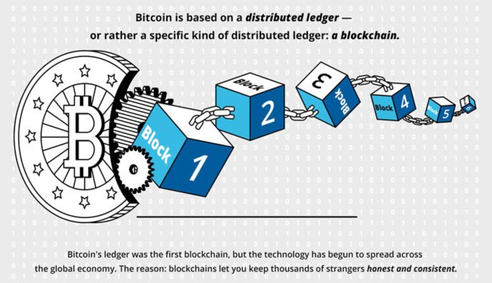

Blockchain technology has rapidly become a critical component across numerous sectors, ushering in transformative changes that promise to redefine traditional systems. At its core, blockchain provides a secure, decentralized framework capable of facilitating transparent and immutable transactions. One of the most notable applications of this technology is Bitcoin, the first cryptocurrency that highlighted the potential of digital currencies as an alternative to traditional financial systems.

This article examines how blockchain and Bitcoin are intersecting with future technologies, particularly in the domain of algorithmic trading. With their innovative features, these technologies are not only enhancing current investment strategies but are also paving the way for new market dynamics. Algorithmic trading, which leverages complex algorithms for executing trades with high efficiency and precision, stands to benefit considerably from blockchain's ability to improve transparency and security.

As we explore these advancements, it is essential to consider how they might reshape the financial landscape over time. The integration of blockchain into trading systems could address existing issues related to traceability and trust, thereby offering solutions to the inherent opacity in some trading algorithms. Furthermore, the impact on market efficiency could be profound, allowing for faster and more secure transactions with reduced dependency on intermediaries.

Understanding the potential and limitations of blockchain and Bitcoin is crucial, as these technologies continue to mature and integrate with existing financial infrastructure. They not only suggest new pathways for investment opportunities but also introduce novel challenges and solutions that need to be navigated.

Throughout this article, key developments will be highlighted, alongside the challenges and potential solutions that arise in this constantly evolving domain. By focusing on these critical elements, we aim to provide a comprehensive overview of how blockchain and Bitcoin are influencing the way we approach future technologies and algorithmic trading.

## Table of Contents

## Basics of Blockchain and Bitcoin

Blockchain technology functions as a decentralized ledger system designed to provide secure and transparent transactions by maintaining a distributed database that is immutable and tamper-proof. Each block in a blockchain contains a list of transactions and is linked to the previous block, forming a chronological chain. This architecture ensures that once a transaction is recorded, it cannot be altered retrospectively without altering all subsequent blocks, which requires consensus across the network. This feature is a significant [factor](/wiki/factor-investing) in blockchain's ability to offer enhanced security and transparency over traditional centralized database systems.

Bitcoin was the first and most prominent application of blockchain technology, acting as a decentralized digital currency. Proposed by an anonymous entity under the pseudonym Satoshi Nakamoto in 2008, Bitcoin offered a novel way to conduct financial transactions without the need for an intermediary such as a bank. Bitcoin transactions are recorded on a blockchain, illustrating the potential of digital currencies to obviate the need for trusted third parties and providing a glimpse into the future possibility of a decentralized financial system.

The utility of blockchain technology extends beyond digital currencies. It has transformative applications in various other sectors, such as identity management, where it can enhance security and user control over personal data. Smart contracts—self-executing contracts with the terms of the agreement directly written into code—are made possible by blockchain technology, offering the promise of automating and enforcing contract terms without the need for traditional intermediaries. Moreover, in supply chain optimization, blockchain can enhance traceability and transparency by providing an immutable record of product provenance, logistics, and storage conditions.

A comprehensive understanding of blockchain technology can enable investors and stakeholders to appreciate its role in transforming numerous industries. The technology’s capacity for secure, transparent, and efficient data management ensures that it has the potential to reshape business practices, reduce fraud, and enable new forms of collaboration. By acknowledging the far-reaching implications of blockchain, individuals and organizations can position themselves to harness its capabilities, fostering innovation and improved service delivery across sectors.

## Algorithmic Trading: Evolution and Impact

Algorithmic trading, also known as 'algo trading,' involves the use of computer algorithms to automate and execute trading decisions across financial markets. Since its inception in the 1970s, [algorithmic trading](/wiki/algorithmic-trading) has undergone substantial evolution, transforming from simple rule-based systems to sophisticated platforms that leverage cutting-edge technologies. Today, it plays a dominant role in global financial markets, enhancing both the speed and accuracy of trade execution.

The early stages of algorithmic trading were characterized by the implementation of basic strategies aimed at optimizing trade execution by minimizing transaction costs and time delays. These strategies quickly evolved as technological advancements, such as faster processors and more reliable data feeds, became available. By the late 20th century and early 21st century, algorithmic trading had begun to incorporate more complex models that could respond to real-time market data, thus enabling quicker adjustments in trading positions.

One of the most significant advancements in this domain has been the integration of [artificial intelligence](/wiki/ai-artificial-intelligence) (AI) and big data analytics. These technologies allow for the incorporation of vast amounts of unstructured data into trading algorithms, enabling more nuanced trading strategies that can adapt to a wide range of market conditions. AI-driven models can conduct real-time decision-making and predictive analytics, anticipating market trends through historical data analysis, sentiment assessment, and probabilistic forecasting.

Moreover, as trading strategies become more advanced, the implementation of [machine learning](/wiki/machine-learning) models facilitates the development of self-optimizing algorithms. These algorithms can learn from past experiences and adjust their strategies accordingly, thereby continually increasing the effectiveness and profitability of trades. The use of neural networks, for instance, allows algorithms to recognize complex patterns in market data that humans might overlook.

Despite its advancements, algorithmic trading faces ongoing challenges related to transparency and risk management. The nature of algorithmic systems as 'black boxes' can obscure the rationale behind specific trading decisions, posing significant risks to investors and market stability. However, the incorporation of blockchain technology promises potential solutions by introducing transparency through decentralized ledgers. These ledgers can record and verify every transaction in real-time, providing an immutable record that can be audited to ensure compliance and traceability.

In summary, algorithmic trading has revolutionized the financial markets by improving the speed, accuracy, and efficiency of trading processes. The continued evolution of AI and big data within this sphere is set to further reshape trading strategies, while blockchain technology offers promising avenues to address the transparency and risk management challenges that persist.

## The Role of Blockchain in Algorithmic Trading

Blockchain technology presents a transformative opportunity in algorithmic trading by tackling the persistent 'black box' problem. Traditionally, algorithmic trading operates on complex algorithms that execute trades at high speeds based on predefined criteria. However, the opacity of these algorithms can obscure their decision-making processes, raising concerns over transparency and accountability. Blockchain can alleviate these issues by providing a transparent and auditable ledger of all transactions and algorithmic decisions.

Smart contracts, a core feature of blockchain, can revolutionize trading processes by automating and securing them. These self-executing contracts contain the terms of an agreement written into code, ensuring that trades occur only when certain conditions are met. By automating execution, smart contracts reduce the need for human intervention and reliance on intermediaries, thereby minimizing transaction costs and risks associated with manual errors or fraudulent activities.

Additionally, decentralized ledgers contribute significantly to algorithmic performance verification. A blockchain ledger records each algorithm's actions, creating a comprehensive and immutable history of trading activities. This not only facilitates performance auditability but also enables market participants to verify both past results and ongoing strategies. Traders and regulators can thus examine the exact sequence of events leading to any trade, ensuring accountability and reducing the risk of manipulative practices.

Through these mechanisms, blockchain integration in algorithmic trading enhances transparency and security while maintaining performance efficiency. The technology's ability to provide a transparent infrastructure with tamper-proof records holds great promise for transforming how algorithmic trading is conducted, potentially leading to more trustworthy and efficient financial markets.

## Challenges and Potential Solutions

Algorithmic trading systems often operate with a high degree of opacity, creating significant challenges for investors and market participants. These challenges primarily stem from the lack of transparency in algorithmic processes and decision-making pathways, which can lead to increased risks and reduced trust in the system.

One of the primary solutions offered by blockchain technology is the introduction of transparency through immutable data records. Blockchain’s decentralized ledger allows for the recording and verification of every transaction in a transparent manner, ensuring that all parties have access to an accurate and unalterable record. This transparency can alleviate investor concerns by providing clear audit trails and enhancing accountability within algorithmic trading systems. The immutable nature of blockchain records ensures that once data is recorded, it cannot be tampered with or altered, thus preserving the integrity of the information. This feature not only aids in compliance and regulatory reporting but also provides reassurance to investors about the veracity of the trading processes.

Additionally, the integration of artificial intelligence with blockchain technology holds significant promise in optimizing algorithmic trading strategies. AI can analyze vast datasets to identify patterns and insights that are not immediately apparent, enabling more informed decision-making. When coupled with blockchain, these AI-driven insights can be securely and transparently verified, reducing biases and errors that may be inherent in traditional systems. This synergy can lead to more robust trading strategies that leverage the strengths of both AI and blockchain innovations.

Furthermore, AI algorithms, particularly those employing machine learning techniques, can adapt and improve over time, learning from past trades and outcomes to refine their future trading strategies. The use of AI can address some of the complexities and dynamic conditions of financial markets, offering the potential for more accurate forecasting and strategy development. By incorporating these AI insights on a blockchain platform, the results and decision-making processes become not only more sophisticated but also more transparent and accountable.

In summary, while algorithmic trading systems face significant challenges due to their opacity, blockchain and AI technologies offer viable solutions to address these issues. By enhancing transparency and utilizing advanced analytical capabilities, these emerging technologies promise to mitigate risks, foster trust, and optimize trading strategies for better outcomes.

## Future Outlook: Trends and Innovations

Quantum computing stands poised to significantly transform trading systems by offering unparalleled data processing capabilities. Ordinary computations faced by financial markets become exceedingly complex given the size and rapid pace at which data must be analyzed. Classic computing encounters limitations in processing such voluminous information swiftly, whereas quantum computing, leveraging principles such as superposition and entanglement, opens new possibilities for tackling these computational challenges. In trading, quantum computers could execute complex algorithms much faster than traditional systems, thus potentially identifying profitable trading opportunities with improved speed and precision.

Another significant trend is the emergence and uptake of decentralized finance (DeFi), which fundamentally challenges and redefines traditional financial systems through disintermediation. With blockchain as its backbone, DeFi platforms facilitate automated trading via smart contracts, bypassing conventional intermediaries such as banks and brokers. This innovation diminishes transaction costs and increases accessibility, democratically broadening participation in financial activities. Additionally, the [liquidity](/wiki/liquidity-risk-premium) and speed inherent in DeFi systems may attract a wider range of automated trading strategies, further enhancing market efficiency.

As blockchain and Bitcoin undergo further maturation, their impact on mainstream financial systems becomes increasingly evident. The adoption of blockchain technology in areas like identity verification, asset tokenization, and even central bank digital currencies (CBDCs) reflects a growing mainstream acknowledgment of its benefits. Bitcoin, while initially seen primarily as a digital currency, is now explored as an asset class and a hedge against inflation, influencing portfolio diversification strategies.

The convergence of these technologies points to new opportunities and innovations in the financial sector. Enhanced data processing through quantum computing, novel financial paradigms introduced by DeFi, and the broadening scope of blockchain and Bitcoin applications indicate a transformative landscape, likely altering traditional investment strategies and financial market dynamics. Consequently, this tech convergence signals a future where trading systems and market infrastructures become more robust, transparent, and efficient.

## Conclusion

While blockchain and Bitcoin technologies continue to progress, their influence within the financial sector, notably in algorithmic trading, is becoming increasingly significant. Blockchain's decentralized and transparent nature addresses longstanding issues related to security and efficiency in financial transactions. By enabling more secure, efficient, and transparent markets, blockchain technology presents a considerable advantage for algorithmic trading systems, which rely on data integrity and speed. The automation and verification capabilities provided by blockchain—such as those realized through smart contracts—facilitate greater trust and reduce operational risks in trading environments.

Additionally, the merger of blockchain and algorithmic trading could produce a synergistic effect, likely driving innovative solutions in financial markets. This synergy promises not only to enhance current trading practices but also to explore new paradigms of trade execution and settlement. As blockchain and Bitcoin technologies continue to integrate with algorithmic trading, the landscape of investments is poised for transformation. The trustless environment created by blockchain could lead to a reduction in the need for intermediaries, lowering transaction costs and time delays.

Looking forward, as blockchain technologies mature, their applications will expand beyond current limitations, influencing mainstream finance. This evolution is expected to unlock new opportunities in trading systems, potentially leading to breakthroughs in areas such as decentralized finance (DeFi) and the incorporation of advanced technologies like AI in trading algorithms. The ongoing advancements in these fields not only serve current market demands but also chart a path for developing more resilient and adaptive financial ecosystems.

## References & Further Reading

[1]: Narayanan, A., Bonneau, J., Felten, E., Miller, A., & Goldfeder, S. (2016). ["Bitcoin and Cryptocurrency Technologies: A Comprehensive Introduction."](https://press.princeton.edu/books/hardcover/9780691171692/bitcoin-and-cryptocurrency-technologies) Princeton University Press.

[2]: Tapscott, D., & Tapscott, A. (2016). ["Blockchain Revolution: How the Technology Behind Bitcoin is Changing Money, Business, and the World."](https://dl.acm.org/doi/10.5555/3051781) Penguin.

[3]: Mougayar, W. (2016). ["The Business Blockchain: Promise, Practice, and Application of the Next Internet Technology."](https://books.google.com/books/about/The_Business_Blockchain.html?id=CEsPDAAAQBAJ) Wiley.

[4]: Lopez de Prado, M. (2018). ["Advances in Financial Machine Learning."](https://www.amazon.com/Advances-Financial-Machine-Learning-Marcos/dp/1119482089) Wiley.

[5]: Yermack, D. (2017). ["Corporate Governance and Blockchains."](https://academic.oup.com/rof/article/21/1/7/2888422) Review of Finance, Volume 21, Issue 1.

[6]: Swan, M. (2015). ["Blockchain: Blueprint for a New Economy."](https://books.google.com/books/about/Blockchain.html?id=RHJmBgAAQBAJ) O'Reilly Media.

[7]: Peters, G. W., & Panayi, E. (2015). ["Understanding Modern Banking Ledgers through Blockchain Technologies: Future of Transaction Processing and Smart Contracts on the Internet of Money."](https://link.springer.com/content/pdf/10.1007/978-3-319-42448-4_13.pdf) 

[8]: Schär, F. (2021). ["Decentralized Finance: On Blockchain- and Smart Contract-based Financial Markets."](https://www.stlouisfed.org/publications/review/2021/02/05/decentralized-finance-on-blockchain-and-smart-contract-based-financial-markets) Federal Reserve Bank of St. Louis Review.