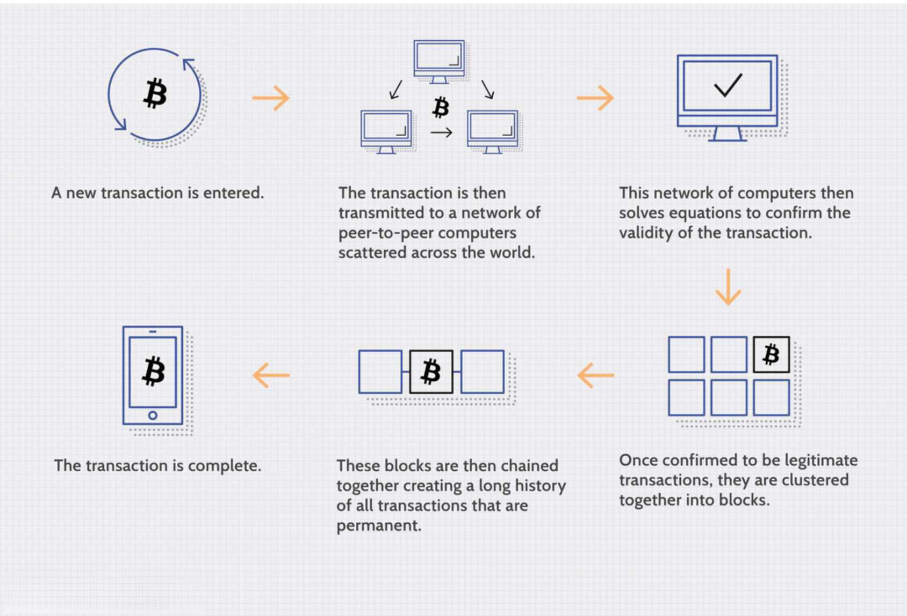

In the ever-evolving landscape of technology and finance, blockchain technology and algorithmic trading are two areas that are gaining significant attention due to their transformative potential. Blockchain technology, renowned for its decentralized and secure nature, facilitates transparent, immutable transactions across a distributed network. Meanwhile, algorithmic trading automates complex trading decisions by leveraging sophisticated algorithms and software, enabling market operations at speeds and scales beyond human capability.

However, the potential of these technologies is hindered by notable challenges, particularly governance and scalability. In blockchain, governance refers to decision-making processes that are decentralized among participants, which can complicate coordination and policy implementation. Scalability, on the other hand, remains a critical hurdle, impacting the ability of blockchain networks to process an increasing volume of transactions efficiently, leading to issues like delayed processing times and high operational costs.

Similar complexities affect algorithmic trading. While it thrives on advanced computational technology, the seamless integration with blockchain's benefits—such as enhanced security and transparency—faces obstructions due to the same governance and scalability hurdles.

This article examines these challenges, highlighting their implications for the synergy between blockchain and algorithmic trading. Understanding and addressing these issues is crucial for traders and technologists alike, as they navigate the current landscape of blockchain technology and its inherent challenges.

## Table of Contents

## Blockchain Technology: A Brief Overview

Blockchain technology is fundamentally a decentralized and distributed ledger system designed to record transactions across a network of computers. The primary advantage of such a system is its inherent resistance to modification: once information is entered into a block within the chain, it becomes a permanent record that cannot be changed retroactively without altering all subsequent blocks, a process that requires the consensus of the network majority. This immutability is coupled with high security and transparency, which make blockchain an attractive technology for various applications, especially in sectors requiring stringent data integrity, such as finance.

Despite these advantages, blockchain technology faces significant hurdles related to scalability and governance. A commonly discussed challenge is the "blockchain trilemma," a concept postulated by Ethereum co-founder Vitalik Buterin. The trilemma outlines a problematic balance between three core properties that blockchain networks strive to achieve: decentralization, security, and scalability. According to the trilemma, enhancing any two of these properties typically undermines the third. For instance, increasing scalability can lead to a reduced level of decentralization, as seen in more centralized blockchains that process transactions faster than their decentralized counterparts. Conversely, maintaining strong security and decentralization typically results in limited scalability, as demonstrated by both Bitcoin and Ethereum, where transaction processing speed and block size constraints limit the number of transactions per second.

Scalability issues are notably problematic as blockchain applications move into sophisticated financial services like [algorithmic trading](/wiki/algorithmic-trading). These applications often demand high transaction throughput and swift execution times, which current blockchain networks struggle to provide. The majority of mainstream blockchains, such as Bitcoin and Ethereum, process a limited number of transactions per second, which pales in comparison to traditional financial systems like Visa, capable of handling thousands of transactions in the same time frame.

Addressing the blockchain trilemma is crucial for improving governance in blockchain systems. Effective governance models can enable a network to adapt quickly to network upgrades or security threats while maintaining its foundational decentralized ethos. However, achieving consensus in decentralized networks often involves lengthy and contentious deliberations among numerous stakeholders, complicating swift and cohesive decision-making. 

As blockchain applications proliferate, particularly in high-stakes industries such as finance, the necessity to overcome the trilemma becomes even more urgent. Innovative solutions are being actively developed and tested: these include Layer 2 scaling solutions like the Lightning Network for Bitcoin, which offload transactions from the main blockchain to increase throughput, and sharding for Ethereum, where the blockchain is split into smaller parts, or shards, each capable of processing transactions independently.

In conclusion, while blockchain technology brings forth a revolutionary approach to transactional security and transparency, unlocking its full potential — especially in advanced financial applications like algorithmic trading — depends on overcoming systemic scalability and governance challenges rooted in the blockchain trilemma. Understanding and addressing these aspects will be vital as blockchain technology continues to integrate more deeply into the financial services sector.

## Governance Challenges in Blockchain Technology

Decentralized governance in blockchain technology is a complex and significant aspect that often leads to slower decision-making compared to centralized systems. In a decentralized governance framework, every participant in the network typically has a voice in the decision-making process. This inclusivity can be a strength, fostering transparency and reducing the likelihood of power concentration among a few entities. However, this broad participation can also slow down the decision-making process, as achieving consensus among a large, distributed group often proves challenging.

One prominent challenge is managing disputes in consensus protocols or software updates. When disagreements arise, they can result in network forks, which create divergent chains. A notable example is Bitcoin, which has experienced several forks, such as Bitcoin Cash, due to differences in opinions on protocol upgrades. Similarly, Ethereum underwent a significant fork in 2016, splitting into Ethereum and Ethereum Classic, following a disagreement over how to handle the DAO hack. These forks [carry](/wiki/carry-trading) potential risks, such as creating confusion among users and developers, diluting the blockchain's value, and raising questions about immutability.

Another significant challenge in blockchain governance is the lack of unified regulatory frameworks across different global jurisdictions. Since blockchain networks often operate on a global scale, they must navigate varying regulatory environments that can conflict and create additional layers of complexity. For example, some countries may impose stringent regulations on cryptocurrencies, while others adopt a more laissez-faire approach. This disparity complicates governance, as developers and organizations must adapt to numerous legal requirements, potentially stifling innovation and growth.

Ultimately, effective governance in blockchain must find a balance between maintaining decentralization and enabling swift, efficient decision-making. This requires innovative governance models that can streamline processes without compromising the core principles of openness and consensus. One approach is incorporating automated governance mechanisms, such as smart contracts, which could facilitate quicker decisions while maintaining transparency. Additionally, research into alternative consensus mechanisms, alongside ongoing dialogue with regulators, may pave the way for more adaptive and resilient governance structures.

## Scalability: The Largest Hurdle

Scalability is a critical [factor](/wiki/factor-investing) in the functionality and expansion of blockchain technology. It reflects a blockchain's capacity to manage an increasing [volume](/wiki/volume-trading-strategy) of work and its ability to grow without compromising performance. Scalability issues manifest significantly in well-known blockchains such as Bitcoin, where the consensus mechanism and protocols inadvertently restrict transaction throughput and increase energy consumption.

Bitcoin's scalability limitations arise primarily from its proof-of-work (PoW) consensus mechanism, where miners validate transactions by solving complex cryptographic puzzles. This process, while ensuring security and decentralization, leads to limited transaction throughput—as low as 7 transactions per second—and significant energy use. The energy-intensive nature of PoW raises not only sustainability concerns but also questions about operational efficiency as transaction demands grow globally.

Several innovative approaches are under exploration to overcome these challenges. Sharding is one such strategy, which involves partitioning a blockchain into smaller, more manageable pieces called shards. Each shard operates semi-independently, processing transactions and smart contracts—which can substantially increase the network's overall throughput. In a sharded blockchain, validators manage only a portion of the transactions, reducing the computational load and allowing for parallel processing.

Layer-two solutions also offer promising scalability advantages without altering the underlying blockchain. Technologies like the Lightning Network for Bitcoin illustrate this approach by facilitating off-chain transactions, which are then consolidated and recorded on the main chain. This drastically reduces the load on the blockchain, improves transaction speeds, and lowers costs.

Although these solutions show considerable promise, their widespread adoption remains problematic. Challenges such as maintaining security and synchronization across shards or achieving robust network effects for layer-two protocols require ongoing research and development. Technical complexity, potential vulnerability to attacks, and the necessity for prevalent consensus among a diverse group of stakeholders hinder seamless integration into existing frameworks. In essence, the quest for scalable blockchain solutions demands not only technical innovation but also collaborative efforts across the global blockchain community.

## Algorithmic Trading and Blockchain

Algorithmic trading is a sophisticated method of executing orders using pre-programmed trading instructions accounting for variables such as time, price, and volume. These complex algorithms operate at speeds and frequencies unreachable by human traders, leveraging technologies that can respond to market conditions within milliseconds. This rapid execution capability allows for the optimization of trading strategies, ultimately aiming for profitable opportunities in financial markets.

Blockchain technology introduces unique features to the landscape of algorithmic trading. Primarily, it offers transparency, ensuring all transactions are visible on a public ledger, thus allowing traders and analysts to verify and scrutinize trades with greater accountability. Additionally, blockchain's immutability guarantees that once transactions are recorded, they cannot be altered, providing a secure and reliable audit trail that is crucial for backtracking and validating trading histories.

However, despite these advantages, blockchain technology's inherent challenges present significant hurdles to its widespread integration in algorithmic trading. One prominent issue is governance. The decentralized nature of blockchain means that decision-making processes can be slow and contentious, often leading to disputes and forks within a network as seen in protocols like Bitcoin and Ethereum. Such instability can deter the adoption of blockchain solutions in trading environments where reliability and consistent standards are paramount.

Scalability is another critical concern. Popular blockchains such as Bitcoin face limitations in transaction processing speed and capacity, making them less suitable for high-frequency trading environments that require swift executions. While advancements like sharding and layer-two solutions (e.g., the Lightning Network for Bitcoin) are being explored to tackle these scalability issues, their implementation and integration remain complex and are still in developmental stages.

As algorithmic trading continues to evolve and scale, it remains essential for ongoing research and development to address these governance and scalability challenges within blockchain technology. The potential enhancements in security, transparency, and efficiency that blockchain can offer may revolutionize trading if these obstacles can be overcome.

## Compliance Challenges in Algo Trading

Algorithmic trading, a domain characterized by the use of sophisticated mathematical models and high-speed data processing, operates within a stringent regulatory framework. In the United States, the Securities and Exchange Commission (SEC) and the Commodity Futures Trading Commission (CFTC) provide oversight to ensure market integrity and protect investors. These regulatory bodies impose comprehensive requirements on algorithmic trading to address potential risks such as market manipulation and systemic vulnerabilities.

High-frequency trading ([HFT](/wiki/high-frequency-trading-strategies)), a subset of algorithmic trading that executes a high volume of trades at extreme speeds, is particularly under scrutiny due to its potential to disrupt market stability. The integration of [artificial intelligence](/wiki/ai-artificial-intelligence) (AI) and blockchain technologies in HFT, aimed at enhancing trading efficiency and reducing latency, introduces additional layers of complexity. AI-driven algorithms can exploit minute price discrepancies at lightning speeds, which, if unchecked, might lead to manipulative practices such as spoofing. Blockchain's immutable ledger enhances transparency but also demands robust governance to monitor its integration in trading strategies.

Market manipulation risks associated with HFT and AI necessitate a robust compliance infrastructure. For instance, regulations may require firms to implement pre-trade risk assessments and real-time monitoring systems to detect anomalies that could indicate manipulative activities. Compliance measures also involve ensuring algorithms conform to market regulations and ethical standards. Institutions must maintain audit trails, which are facilitated by blockchain's transparent yet secure transaction records, aiding in post-trade analysis and regulatory reporting.

Navigating the compliance landscape in algorithmic trading involves a proactive approach to align technological advancements with regulatory requirements. Institutions often invest in developing sophisticated risk management frameworks and deploying compliance officers who specialize in algorithmic market activities. There is also an ongoing dialogue between regulators and industry stakeholders to update regulations that reflect technological evolutions in trading practices.

Moreover, the global nature of financial markets means that traders must also be cognizant of cross-border regulatory differences which can complicate compliance efforts. Institutions striving to mitigate risks associated with algorithmic trading must adopt a comprehensive strategy that encompasses not only technological innovation but also adherence to evolving regulatory landscapes across jurisdictions. This dual focus on technology and compliance is vital to exploiting the potential of algorithmic trading while safeguarding market integrity.

## Intersections and Future Perspectives

The integration of blockchain technology with algorithmic trading systems holds the promise of bringing about enhanced security and transparency in trading activities. Blockchain's inherent attributes of immutability and distributed ledger technology can offer algorithmic trading platforms a robust framework for recording trades and ensuring the integrity of data. However, for this integration to be effective, it is imperative that the challenges of scalability and governance inherent in blockchain technology are adeptly managed.

Scalability issues, characterized by the limitations in handling high volumes of transactions swiftly, must be resolved to meet the demands of algorithmic trading, which operates at high speeds and frequencies. The adoption of technologies such as sharding—where the blockchain is divided into smaller, more manageable parts—or layer-two solutions like the Lightning Network could potentially alleviate these scalability concerns. These innovations aim to increase transaction throughput and reduce latencies, thus aligning blockchain capabilities with the rapid requirements of algorithmic trading systems.

Governance challenges also require careful consideration. Decentralized governance frameworks, while democratic, can impede swift decision-making, something antithetical to the fast-paced nature of trading environments. Therefore, developing governance models that strike a balance between decentralization and nimbleness is of paramount importance.

Looking to the future, the evolution of regulatory frameworks tailored to integrate blockchain and algorithmic trading is crucial. Adequate regulatory support could provide the structure needed for these technologies to mature and gain broader acceptance within financial systems. Regulatory bodies around the world may need to harmonize their standards to form a coherent global strategy, which can help in mitigating risks such as market manipulation and system downtimes.

Moreover, the dynamic nature of both blockchain technology and algorithmic trading necessitates ongoing innovation. Continuous improvement and adaptation of these technologies will likely see the development of hybrid models that leverage the strengths of both fields. Developers and financial institutions must remain agile, experimenting with new strategies and technological advancements to harness the full potential of this integration successfully. A focus on research and development will be critical, ensuring that as these technologies evolve, they do so in a manner conducive to reliable, efficient, and transparent financial markets.

## Conclusion

Blockchain technology and algorithmic trading represent powerful tools in the financial world, yet they encounter unique challenges that must be addressed for these technologies to reach their full potential. The main obstacles that blockchain faces are in governance and scalability. Governance in blockchain involves decentralized decision-making, which can slow down the resolution of important issues. To overcome this, blockchain systems need to find a balance between decentralization and efficient decision-making to remain robust and adaptable.

Scalability, the ability to handle increasing amounts of work or growth efficiently, is perhaps the most significant technical challenge for blockchain systems. Popular blockchains like Bitcoin struggle with low transaction speeds and high energy consumption. Although innovations like sharding and layer-two solutions are being pursued to improve scalability, broad adoption is not yet realized.

Algorithmic trading, on the other hand, could benefit significantly from blockchain's transparency and immutability but is likewise affected by its current limitations. For algo trading to fully integrate and benefit from blockchain technology, scalability and governance challenges must be resolved.

Continued innovation is necessary to overcome these challenges; however, such advancements must be accompanied by careful consideration of regulatory frameworks. Regulatory clarity will be crucial to ensuring that advancements in blockchain and algorithmic trading technologies are both responsible and sustainable. As the financial world becomes increasingly complex, navigating these challenges through iterative innovation and sound regulation will be vital for harnessing the full capabilities of blockchain technology and algorithmic trading.

## References & Further Reading

[1]: Buterin, V. (2014). ["On Public and Private Blockchains."](https://blog.ethereum.org/2015/08/07/on-public-and-private-blockchains) Ethereum Blog.

[2]: Narayanan, A., Bonneau, J., Felten, E., Miller, A., & Goldfeder, S. (2016). ["Bitcoin and Cryptocurrency Technologies."](https://press.princeton.edu/books/hardcover/9780691171692/bitcoin-and-cryptocurrency-technologies) Princeton University Press.

[3]: Antonopoulos, A. M. (2017). ["Mastering Bitcoin: Unlocking Digital Cryptocurrencies."](https://books.google.com/books/about/Mastering_Bitcoin.html?id=IXmrBQAAQBAJ) O'Reilly Media.

[4]: De Filippi, P., & Wright, A. (2018). ["Blockchain and the Law: The Rule of Code."](https://www.jstor.org/stable/j.ctv2867sp) Harvard University Press.

[5]: Tapscott, D., & Tapscott, A. (2016). ["Blockchain Revolution: How the Technology Behind Bitcoin Is Changing Money, Business, and the World."](https://dl.acm.org/doi/10.5555/3051781) Penguin.

[6]: Wood, G. (2014). ["Ethereum: A Secure Decentralised Generalised Transaction Ledger."](https://www.semanticscholar.org/paper/ETHEREUM%3A-A-SECURE-DECENTRALISED-GENERALISED-LEDGER/da082d8dcb56ade3c632428bfccb88ded0493214) Ethereum Yellow Paper.

[7]: Gomber, P., Arndt, B., Lutat, M., & Uhle, T. (2011). ["High-Frequency Trading."](https://papers.ssrn.com/sol3/papers.cfm?abstract_id=1858626) In Information Systems Engineering in Complex Environments. 

[8]: Hileman, G., & Rauchs, M. (2017). ["Global Cryptocurrency Benchmarking Study."](https://www.jbs.cam.ac.uk/wp-content/uploads/2020/08/2017-04-20-global-cryptocurrency-benchmarking-study.pdf) Cambridge Centre for Alternative Finance.

[9]: Buterin, V. (2018). ["Notes on Blockchain Governance."](https://hackernoon.com/notes-on-blockchain-governance-ob65o3pod) Vitalik Buterin Blog.