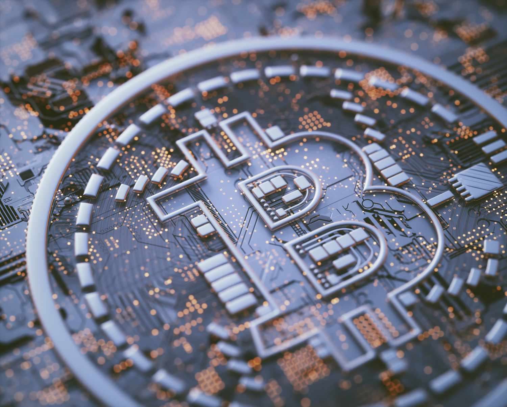

In today's digital landscape, the rapid proliferation of online content and transactions has ushered in an era marked by significant security concerns. Issues such as piracy, data breaches, and market exploitation have emerged as formidable threats to individuals, businesses, and entire industries. Traditional security mechanisms—reliant on centralized control and oversight—often fall short in effectively countering these threats due to their inherent vulnerabilities to manipulation and unauthorized access.

Blockchain technology is increasingly being recognized as a robust solution to these pervasive security challenges. By leveraging a decentralized and distributed ledger system, blockchain promises enhanced security protocols that are resistant to tampering and unauthorized modifications. Its potential to revolutionize digital security lies in its capacity to ensure the integrity and authenticity of data, making it a formidable tool against piracy and unauthorized duplication of digital content.

Moreover, blockchain's immutable nature offers a promising avenue for protecting digital assets in a secure manner. Its ability to facilitate transparent and tamper-proof record-keeping makes it a valuable asset for industries seeking to safeguard intellectual property and sensitive information. The emergence of blockchain-based platforms designed to protect content creators and support fair revenue distribution further underscores its potential to mitigate piracy issues.

In addition to enhancing security for digital assets, blockchain technology is poised to transform algorithmic trading. By providing immutable records of transactions, blockchain enhances transparency and trust in financial markets. The incorporation of smart contracts—self-executing agreements with the terms directly written into code—can automate trading processes, reducing the likelihood of human error and minimizing opportunities for market manipulation.

This article explores the multifaceted applications of blockchain technology in combatting piracy, protecting digital assets, and enhancing algorithmic trading. By examining the ways in which blockchain can bolster digital security, we can better understand its role in shaping future digital ecosystems that prioritize both security and efficiency.

## Table of Contents

## Understanding Digital Security

Digital security refers to the comprehensive measures and practices designed to safeguard online data and transactions from a multitude of threats, which include hackers, pirates, and other malicious actors. As the digital landscape continues to expand, encompassing an ever-increasing amount of digital content and online transactions, the necessity for robust security protocols has become more pronounced. 

The proliferation of internet-connected devices and online services heightens the exposure to potential security breaches, making it imperative for individuals and organizations to adopt stringent security practices. According to a report by Cybersecurity Ventures, cybercrime damages are estimated to hit $6 trillion annually by 2021, a figure that underscores the urgent need for improved security measures.[^1]

Traditional security methods, often reliant on centralized systems, can be inadequate due to their susceptibility to manipulation and unauthorized access. These systems typically involve the use of passwords, firewalls, and antivirus software, but they can be bypassed or compromised by persistent cyber-attackers employing sophisticated techniques. For instance, centralized databases have been prime targets for data breaches because a single point of failure can expose vast amounts of sensitive information.

Moreover, with the advent of more complex cyber-attacks, there is a growing recognition that traditional models are struggling to keep pace. The Ponemon Institute's report highlights that the average time to identify a data breach in 2020 was 207 days, suggesting significant delays in detecting unauthorized access to systems and data.[^2] This delay can augment the potential damage caused by breaches and makes addressing these vulnerabilities a priority.

Emerging technologies and methodologies are being developed to address these challenges, with an emphasis on decentralization and distributed ledger technologies like blockchain, which inherently offer enhanced security features over traditional methods. Blockchain's cryptographic nature provides a layer of security by making data alteration difficult once it is written onto the blockchain, thereby reducing the risk of unauthorized data manipulation.

In summary, as digital content and transactions continue to grow, the requirement for robust security mechanisms is underscored by the insufficiencies of conventional methods in addressing modern threats. Innovative solutions, such as those offered by blockchain technology, are being explored to offer enhanced protection and resilience against the evolving landscape of digital security threats.

[^1]: Morgan, S. (2019). Cybersecurity Ventures. Retrieved from https://cybersecurityventures.com/cybercrime-damages-6-trillion-by-2021/
[^2]: Ponemon Institute. (2020). Cost of a Data Breach Report. Retrieved from https://www.ibm.com/security/data-breach

## Blockchain's Role in Preventing Piracy

Blockchain technology has emerged as a potent solution for combating digital piracy by leveraging its decentralized structure to secure data integrity and ownership rights. Unlike traditional databases that are centrally managed and often susceptible to unauthorized access, blockchain is inherently resistant to data tampering due to its distributed ledger system. Each transaction or piece of data recorded on a blockchain is verified and stored across multiple nodes, making unauthorized alterations significantly more challenging.

One of the key techniques utilized by blockchain to mitigate piracy is the incorporation of digital watermarks and tokenized media. Digital watermarks are unique identifiers embedded within digital content, which can be tracked on the blockchain to verify the authenticity and ownership of a piece of media. Tokenization involves creating a digital token on the blockchain that represents rights to a particular media asset. These tokens can be used to trace the flow of digital content and ensure that copies are legitimate and authorized by the rightful owner.

Projects like SingularDTV have successfully implemented blockchain solutions to protect digital content. SingularDTV operates on the Ethereum blockchain, providing a decentralized platform for content creators to manage and distribute their work. By using smart contracts, SingularDTV ensures that revenue is distributed fairly and transparently among the stakeholders. This not only minimizes the risk of piracy but also supports creators in monetizing their work effectively.

In conclusion, blockchain's decentralized architecture and cryptographic techniques offer a robust framework for preventing digital piracy. By utilizing digital watermarks and tokenized media, blockchain can track and verify the authenticity of digital content. Projects such as SingularDTV exemplify how blockchain can be used to protect content creators and ensure fair revenue distribution, thereby reducing the incentives and opportunities for piracy.

## Algo Trading and Blockchain

Algorithmic trading, often referred to as algo trading, involves the use of computer algorithms to execute large volumes of trades at high speeds. These algorithms follow pre-defined sets of instructions to analyze market data and make trading decisions in fractions of a second. The inherent advantage of [algorithmic trading](/wiki/algorithmic-trading) is its speed and precision, which surpass that of human traders. However, with these advantages come security and transparency challenges that can be addressed by integrating blockchain technology.

Blockchain's primary contribution to algorithmic trading lies in its ability to enhance security and transparency through its decentralized and immutable ledger. Each transaction carried out on a blockchain network is recorded in a time-stamped block that forms part of a chronological chain. This arrangement ensures that once a transaction is entered, it cannot be altered or deleted, thus providing an audit trail that enhances trust and accountability among market participants.

By maintaining an immutable record of transactions, blockchain technology can provide a robust framework for verifying trades in real-time. This transparency can mitigate issues related to fraud and unauthorized trading activities. Moreover, the decentralized nature of blockchain can reduce the risk of a single point of failure or data manipulation that traditional centralized systems might face.

Another crucial aspect of blockchain in algorithmic trading is the use of smart contracts. Smart contracts are self-executing contracts with the terms of the agreement directly written into code. They automatically execute and enforce contractual terms when specified conditions are met. In the context of algorithmic trading, smart contracts can streamline the trading process by eliminating the need for intermediaries, thereby expediting transaction speeds and reducing costs.

For example, consider a scenario where a trader wants to execute a buy order only when a particular asset reaches a specified price. A smart contract can be programmed to monitor the market and automatically execute the order as soon as the condition is fulfilled, ensuring that the transaction is timely and according to the stipulated terms. This automation can significantly reduce human error and limit the possibility of market manipulation by ensuring that trades are carried out exactly as intended.

The benefits of integrating blockchain for algorithmic trading are evident. However, it is crucial to acknowledge the challenges such as the scalability of blockchain networks and the regulatory frameworks that govern financial markets. Despite these challenges, blockchain holds significant promise in making algorithmic trading more secure, transparent, and efficient. As these technologies continue to evolve, they are likely to play an increasingly vital role in shaping the future of financial markets.

## Blockchain as a Piracy Deterrent

Blockchain technology not only aids in the prevention of piracy but also serves as a powerful deterrent by effectively tracking illegal distribution channels. Its decentralized nature ensures that transactions and data entries are verified across a network of computers, making it substantially difficult to alter data without detection. This inherent transparency and security offer a formidable layer of protection against piracy activities.

With the rise of Web3 concepts, blockchain is playing a pivotal role in the enforcement of intellectual property rights. Web3, often described as the next evolution of the internet, incorporates decentralized elements such as blockchain to enable more user-centric applications. Within this framework, blockchain can provide a robust mechanism for rights holders to assert and manage their intellectual property more effectively. By embedding digital content within a blockchain, creators can establish immutable proof of ownership and distribution rights. This technological advancement ensures that only authorized access to digital content is permitted, significantly reducing opportunities for piracy.

Smart contracts, which are automated and self-executing agreements coded into the blockchain, further enhance compliance and enforcement of licensing terms. By utilizing smart contracts, rights holders can embed specific conditions that must be met before content is accessed or used. For instance, a smart contract may automatically trigger a micropayment each time a piece of content is accessed, ensuring that creators are compensated appropriately without the need for intermediaries. This automatic enforcement not only deters unauthorized access but also streamlines the process of rights management, making it easier and more efficient for creators to manage their digital assets.

Furthermore, smart contracts can be designed to track the use and distribution of content across different platforms and networks. By doing so, they provide valuable data and insights into the pathways through which digital content is shared, enabling rights holders to identify and curtail illegal distribution channels easily. This level of transparency and control is unparalleled in traditional digital rights management systems.

In conclusion, blockchain technology, coupled with the principles of Web3 and the application of smart contracts, offers a sophisticated toolkit for deterring digital piracy. It ensures that intellectual property rights are respected and upheld by providing a secure, transparent, and automated system for managing and enforcing digital content rights. As the technology continues to evolve, its capacity to safeguard digital assets will likely become even more comprehensive, cementing blockchain as an integral component in the ongoing battle against piracy.

## Challenges and Limitations

Blockchain technology, while revolutionary, is not without its challenges and limitations. A primary concern is scalability. Blockchain networks, such as Bitcoin and Ethereum, suffer from relatively slow transaction processing speeds compared to centralized systems. This limitation is due to their consensus mechanisms, like Proof of Work (PoW), which require significant computational resources and time to validate transactions, resulting in bottlenecks as the network scales. For instance, Bitcoin processes about 7 transactions per second, whereas a traditional payment processor like Visa can handle thousands.

Moreover, blockchain technology is still grappling with regulatory hurdles. The decentralized nature of blockchain presents unique challenges for governments and regulatory bodies, as it blurs jurisdictional lines and complicates the enforcement of existing regulations. Legal frameworks are still evolving to address the nuances of blockchain, which can lead to uncertainty and discourage adoption in heavily regulated industries.

The implementation of blockchain solutions necessitates substantial changes to existing infrastructure, which can be a significant barrier for organizations with entrenched systems. This transition may require not only technical upgrades but also reconfigurations of business processes and strategies, leading to substantial initial investment and potential disruption.

Additionally, widespread adoption of blockchain technology is impeded by a lack of understanding and expertise across industries. There is a critical need for education and collaboration to bridge this knowledge gap. Organizations must invest in training for their workforce and participate in cross-industry partnerships to fully harness blockchain technology’s potential. Without these efforts, the transformative prospects of blockchain might remain underutilized due to hesitance or misapplication.

In conclusion, while blockchain offers significant advantages in enhancing digital security and efficiency, overcoming these challenges requires concerted effort across technological, regulatory, and educational domains. The path forward involves balancing innovation with pragmatic solutions to integrate blockchain into the existing digital ecosystem effectively.

## Conclusion

Blockchain represents a promising tool in the fight against digital piracy and the enhancement of digital security in trading due to its unique capabilities. By guaranteeing immutability, transparency, and decentralization, blockchain technology provides a robust framework for secure and efficient digital ecosystems. The immutable nature of the blockchain ledger ensures that once data is recorded, it cannot be altered retroactively without the consensus of the network, thus providing an effective deterrent to unauthorized access and manipulation, which are common tactics in piracy and fraudulent trading activities. 

Continued development and integration of blockchain technology could dramatically improve both security and efficiency in digital ecosystems. By automating processes through smart contracts, unnecessary human intervention and its associated errors can be minimized. This automation ensures that transactions and digital agreements are executed exactly as programmed, reducing the risks of fraud and manipulation. The efficiency brought by blockchain's transparency and speed can also facilitate algorithmic trading, where real-time data validation and transparent record-keeping are crucial for success.

While blockchain won't eliminate piracy entirely, its role as a deterrent and investigative tool is significant. The technology can track and verify the distribution of digital media and intellectual property, supporting content creators and rights holders in their efforts to safeguard their assets. Additionally, through the blockchain’s decentralized nature, it becomes costly and complex for pirates to modify or reproduce digital assets unlawfully. 

The challenges confronting blockchain, such as scalability and regulatory hurdles, are substantial but not insurmountable. These challenges necessitate ongoing education, research, and collaboration across various industries to harness blockchain’s full potential. Embracing this technology is not merely a forward-thinking approach; it is an essential strategy in the ever-evolving landscape of cybersecurity and digital trading safeguards. By leveraging blockchain technology, stakeholders can navigate the complexities of modern data security with greater confidence and clarity.

## References & Further Reading

[1]: Nakamoto, S. (2008). ["Bitcoin: A Peer-to-Peer Electronic Cash System."](https://nakamotoinstitute.org/library/bitcoin/) Retrieved from https://bitcoin.org/bitcoin.pdf

[2]: Tapscott, D., & Tapscott, A. (2016). ["Blockchain Revolution: How the Technology Behind Bitcoin and Other Cryptocurrencies is Changing the World."](https://dl.acm.org/doi/10.5555/3051781) Portfolio.

[3]: Mougayar, W. (2016). ["The Business Blockchain: Promise, Practice, and Application of the Next Internet Technology."](https://books.google.com/books/about/The_Business_Blockchain.html?id=CEsPDAAAQBAJ) Wiley.

[4]: Swan, M. (2015). ["Blockchain: Blueprint for a New Economy."](https://dl.acm.org/doi/book/10.5555/3006358) O'Reilly Media.

[5]: Peters, G. W., & Panayi, E. (2016). ["Understanding Modern Banking Ledgers through Blockchain Technologies: Future of Transaction Processing and Smart Contracts on the Internet of Money."](https://www.researchgate.net/publication/307551799_Understanding_Modern_Banking_Ledgers_Through_Blockchain_Technologies_Future_of_Transaction_Processing_and_Smart_Contracts_on_the_Internet_of_Money) In Banking Beyond Banks and Money (pp. 239-278). Springer, Cham.

[6]: Buterin, V. (2014). ["A Next-Generation Smart Contract and Decentralized Application Platform."](https://ethereum.org/content/whitepaper/whitepaper-pdf/Ethereum_Whitepaper_-_Buterin_2014.pdf) Retrieved from https://ethereum.org/en/whitepaper/

[7]: Tapscott, A., & Tapscott, D. (2018). ["How Blockchain Is Changing Finance."](https://hbr.org/2017/03/how-blockchain-is-changing-finance) Harvard Business Review.

[8]: Zohar, A. (2015). ["Bitcoin: Under the Hood."](https://dl.acm.org/doi/10.1145/2701411) Science, 346(6213), 1349-1351.