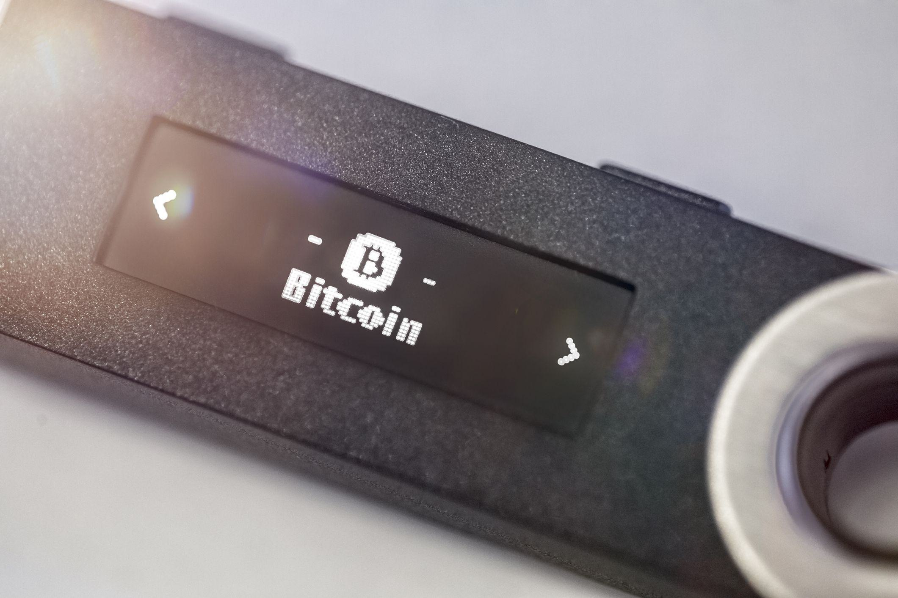

Cryptocurrencies have fundamentally transformed the landscape of global finance by decentralizing control and enabling individuals to manage their assets directly without the need for traditional financial intermediaries. At the heart of this transformation lie digital wallets and blockchain technology. Digital wallets serve as secure, versatile platforms for storing and managing cryptocurrency, while blockchain technology underpins these transactions with a decentralized ledger that assures transparency and security across the network. Together, they form the backbone of this innovative financial system, providing users around the world with unprecedented levels of security and flexibility.

At the forefront of the ongoing revolution in cryptocurrency, algorithmic trading and blockchain wallets are playing transformative roles. Algorithmic trading leverages advanced algorithms to enhance trading precision and efficiency, opening new opportunities for investors by automating trade execution at optimal speeds and prices. Meanwhile, blockchain wallets enable secure and straightforward interactions with cryptocurrencies, bolstering the management and transaction of digital assets across various platforms.



This article will explore the intricacies of cryptocurrency security, focusing on the role of both digital and blockchain wallets as integral tools for safeguarding digital assets, and examining how algorithmic trading is reshaping the crypto landscape. Grasping these fundamental concepts is essential for anyone engaged in, or interested in entering, the dynamic fields of cryptocurrencies and blockchain technology.

## Table of Contents

## Understanding Cryptocurrency Security

Cryptocurrency security is paramount to safeguarding digital assets from the myriad cyber threats that proliferate in the online environment. As cryptocurrencies have gained widespread popularity, they have also become prime targets for cybercriminals. Threats such as hacking, phishing attacks, and other forms of cybercrime pose significant risks that need to be mitigated adequately.

Blockchain technology underpins most cryptocurrencies and provides a level of inherent security through its decentralized nature. Each transaction on a blockchain is linked to the previous one, forming an immutable chain that is distributed across numerous nodes. This decentralization makes it difficult for cybercriminals to alter transaction history fraudulently. However, vulnerabilities persist, primarily at the endpoints where users access their cryptocurrencies.

To enhance security, users can adopt several protective measures. Two-factor authentication (2FA) is a widely recommended method that adds an extra layer of security beyond just a password. By requiring a second form of identification, 2FA significantly reduces the likelihood of unauthorized access.

Strong passwords are another fundamental aspect of cybersecurity. A robust password typically includes a mix of uppercase and lowercase letters, numbers, and symbols, making it difficult for attackers to guess or execute brute force attacks. Hardware wallets, such as those developed by Ledger, offer an additional security layer by storing the user's private keys offline. This physical separation from online environments shields the keys from hackers.

Encryption practices are a critical component in securing digital wallets. Encryption transforms regular data into an unreadable format using a cryptographic key, ensuring that any intercepted information remains unintelligible without the corresponding decryption key. Password stretching is another technique employed to strengthen passwords; it involves applying a cryptographic hash function multiple times to make password cracking more computationally intensive.

Public and private keys are central to [cryptocurrency](/wiki/cryptocurrency) transactions. The public key serves as an address for sending and receiving cryptocurrencies, while the private key grants access to them. Protecting private keys is of utmost importance, as possession of a private key equates to control over the associated funds. Users should avoid storing private keys on any internet-connected device and instead use secure storage solutions such as encrypted USB drives or paper wallets.

In summary, while blockchain technology provides a foundational layer of security through decentralization, additional practices and tools are necessary to protect digital assets effectively. Implementing two-[factor](/wiki/factor-investing) authentication, using strong passwords, employing hardware wallets, and ensuring safe storage of private keys are fundamental strategies in the ongoing battle against cryptocurrency-related cybercrime.

## Digital Wallets: The Gateway to the Crypto World

Digital wallets serve as crucial tools in the world of cryptocurrency, acting as software applications that securely store both private and public keys, essential for sending and receiving digital currencies. Despite common misconceptions, these wallets do not store the actual cryptocurrencies. Instead, they maintain the cryptographic keys that enable access to one's digital assets on the blockchain. This distinction is important as it highlights the dual function of digital wallets: maintaining security and providing accessibility.

There are various types of digital wallets that cater to different user needs, primarily categorized into custodial and non-custodial wallets. Custodial wallets are managed by a third-party service provider, which means the responsibility for key management and security lies with the custodian. This type typically offers ease of use and user-friendly interfaces, making them appealing to newcomers. However, they often involve giving up some degree of control over the assets due to reliance on the third party.

In contrast, non-custodial wallets provide users with full control over their private keys. These wallets demand personal responsibility for security measures but grant users complete autonomy over their digital funds. This distinction can greatly influence the security and functionality preferences of individual users, with non-custodial wallets generally seen as more secure due to the lack of a centralized point of failure.

Choosing the right digital wallet requires careful consideration of one's personal needs, balancing factors like usability, security, and control. For instance, while hardware wallets offer enhanced security by storing keys offline, software wallets, including mobile and desktop versions, provide greater convenience for regular transactions.

To ensure the security of digital wallets, regular updates of wallet software are imperative. This practice helps protect against vulnerabilities that hackers might exploit. Users should never share their login credentials and should always enable two-factor authentication when available. Additionally, backing up mnemonic phrases—a sequence of words generated by the wallet to recover lost data—is a fundamental step in safeguarding one's digital assets. This ensures that, in the event of technical issues or loss of access to a device, users can restore access to their cryptocurrencies. 

In summary, digital wallets are pivotal in the safe management of cryptocurrencies, with their functionality closely tied to the security measures and user preferences regarding control over their digital assets.

## Blockchain Wallets in Depth

Blockchain wallets represent a specific category of digital wallets designed to facilitate the exchange of cryptocurrencies on blockchain networks. Unlike traditional financial systems that rely on centralized organizations, blockchain wallets operate on decentralized platforms, providing users increased autonomy and security over their digital assets.

One of the core functionalities of blockchain wallets is their support for cross-chain swaps. This feature allows users to conduct transactions between different blockchain platforms without the need for a centralized exchange, promoting a more seamless and direct exchange mechanism. Cross-chain swaps are facilitated through advanced protocols such as atomic swaps, which ensure that the exchange process is both secure and trustless. These protocols hold the transaction in an escrow-like smart contract until both parties fulfill the terms of the trade, thereby reducing the risk of default by either party.

Blockchain wallets are also equipped with advanced security features designed to protect digital assets from unauthorized access. Innovations such as IP whitelisting enhance security by allowing users to define specific IP addresses that can access their wallet, reducing the risk of breaches from unfamiliar locations. Additionally, optional security practices like two-factor authentication (2FA) and biometric verification add further layers of protection, ensuring that only authenticated users can initiate transactions.

Integration with decentralized exchanges (DEX) is another significant attribute of blockchain wallets. This integration enables blockchain wallets to facilitate direct trading activities without relying on centralized exchanges. It offers users the benefit of maintaining custody of their funds during trading while also reducing the transaction fees typically associated with centralized platforms.

Moreover, the ability to manage multiple types of cryptocurrencies within a single blockchain wallet demonstrates another level of convenience for users. It simplifies asset management by allowing for diverse portfolios to be held and managed in one place. This is particularly advantageous for users involved in multi-token ecosystems or those seeking to diversify their crypto investments across different blockchain protocols without the hassle of juggling multiple wallet applications.

In summary, blockchain wallets are not only a secure and versatile tool for managing cryptocurrencies but also a critical component in fostering efficient and secure transactions across blockchain networks. Their ability to support cross-chain swaps, advanced security features, integration with decentralized exchanges, and multi-cryptocurrency management underscores their essential role in the evolution and adoption of digital finance.

## The Evolution of Algorithmic Trading in Crypto Markets

Algorithmic trading represents a paradigm shift in the mechanisms of cryptocurrency markets, driven by the application of computer algorithms to execute trades with precision and speed. These algorithms act based on preset conditions, processing data as quickly as it is received and making trading decisions at speeds far beyond human capability. This approach enhances accuracy by minimizing human error and adeptly navigating the often erratic nature of crypto markets. As a result, traders can both capitalize on short-term opportunities and implement long-term strategies more effectively.

A common practice within [algorithmic trading](/wiki/algorithmic-trading) is high-frequency trading ([HFT](/wiki/high-frequency-trading-strategies)), where numerous trades are executed in fractions of a second. This strategy exploits minute price variations to generate profits, a task ideally suited to the volatile environment of cryptocurrency exchanges. Arbitrage is another prevalent strategy, where traders take advantage of price discrepancies of the same asset across different markets or exchanges.

The ongoing advancement of [artificial intelligence](/wiki/ai-artificial-intelligence) (AI) and [machine learning](/wiki/machine-learning) has significantly enriched algorithmic trading. These technologies enable the creation of more sophisticated algorithms capable of learning from historical data to predict future trends and adapt to changing market conditions. For instance, machine learning models can assess large datasets to uncover patterns and correlations that might go unnoticed by traditional data analysis methods, thereby informing more effective trading strategies.

Algorithmic trading platforms are continuously improving, offering traders a suite of tools designed to enhance their investment strategies. These platforms often integrate real-time data analysis, [backtesting](/wiki/backtesting) capabilities, and risk management frameworks. Python, due to its extensive libraries and ease of use, has become a popular programming language among quantitative traders for building and testing trading algorithms. A basic Python script for a moving average crossover strategy might look like the following:

```python
import pandas as pd

# Assuming 'data' is a DataFrame with datetime index and 'close' price column
def moving_average_crossover(data, short_window=40, long_window=100):
    data['short_mavg'] = data['close'].rolling(window=short_window, min_periods=1).mean()
    data['long_mavg'] = data['close'].rolling(window=long_window, min_periods=1).mean()
    data['signal'] = 0
    data['signal'][short_window:] = np.where(data['short_mavg'][short_window:] > data['long_mavg'][short_window:], 1, 0)
    data['positions'] = data['signal'].diff()
    return data

# Example usage
# data = pd.read_csv('crypto_price_data.csv', index_col='Date', parse_dates=True)
# signals = moving_average_crossover(data)
```

This simple example implements a moving average crossover strategy, where buy signals are generated when a short-term moving average crosses above a long-term moving average, and sell signals occur when the opposite happens. Such strategies can be customized and expanded with complex logic to better suit specific trading goals.

As the cryptocurrency landscape continues to evolve, algorithmic trading is likely to grow in prominence, supported by technological advancements and the increasing availability of detailed market data. Traders who harness these developments can expect to see improved performance and profitability in the dynamic and competitive world of crypto markets.

## Enhancing Security: Best Practices and Tools

Keeping cryptocurrencies secure involves a thorough understanding of both technological and personal security measures. With the increasing digitization of finance, protecting digital assets from cyber threats is paramount. Employing best practices in security and utilizing advanced tools ensures a safer environment for managing cryptocurrencies.

Multi-signature wallets are among the most effective tools for enhancing security. These wallets require multiple private keys to authorize a transaction, thereby adding an extra layer of protection. This method reduces the risk of a single point of failure, making unauthorized access significantly more difficult. For example, a transaction might require validation from three out of five authorized signatures, thereby enhancing control over digital funds.

Cold wallets, often referred to as offline storage options, are indispensable for securing large amounts of cryptocurrency. By keeping digital assets offline, cold wallets shield them from potential online threats like hacking. Hardware wallets, a type of cold storage, offer a tangible and secure method to store private keys, isolating them from internet exposure. Devices such as Trezor and Ledger are popular choices in this category.

Another critical security measure involves keeping the software associated with cryptocurrency storage up to date. Regularly updating wallet software and other associated applications is crucial for protecting against vulnerabilities. Software updates often include security patches that close potential loopholes, making digital wallets less susceptible to unauthorized access. Additionally, being vigilant about phishing attempts is necessary to prevent malicious actors from accessing sensitive information. Users should be cautious of unsolicited communications asking for private keys or login credentials, which are typical phishing strategies.

Advanced analytics and regulatory technologies also play a substantial role in enhancing cryptocurrency security. By utilizing machine learning and AI, these technologies can detect suspicious patterns and atypical behavior in transactions, flagging them for further investigation. Moreover, adherence to regulatory standards contributes to increased trust and risk mitigation across the crypto ecosystem. Engaging with platforms that comply with international financial regulations adds another assurance layer for users and investors.

Incorporating these best practices and tools not only secures digital assets against theft and fraud but also fosters a more secure and trustworthy environment for cryptocurrency transactions. Personal due diligence, combined with technological safeguards, paves the way for safer engagement with digital finance.

## Conclusion

Cryptocurrency security represents a foundational aspect of the expanding digital finance landscape. As this domain evolves, digital and blockchain wallets have become indispensable tools for managing and securing crypto assets. Their utility is further complemented by algorithmic trading, which broadens trading capabilities by offering strategies that enhance efficiency and accuracy.

A thorough understanding of and commitment to implementing security measures is crucial for successfully navigating the cryptocurrency environment. As technology continues to advance, it is anticipated that the crypto space will witness improvements in both security practices and trading methodologies, potentially reshaping the future of finance.

To ensure the safety and growth of cryptocurrency investments, it is essential for individuals to remain informed and incorporate robust security measures. This proactive approach will not only safeguard assets but also enable individuals to capitalize on emerging opportunities in this dynamic financial sector.

## References & Further Reading

[1]: Antonopoulos, A. M. (2017). [Mastering Bitcoin: Unlocking Digital Cryptocurrencies](https://books.google.com/books/about/Mastering_Bitcoin.html?id=IXmrBQAAQBAJ). O'Reilly Media.

[2]: Narayanan, A., Bonneau, J., Felten, E., Miller, A., & Goldfeder, S. (2016). [Bitcoin and Cryptocurrency Technologies: A Comprehensive Introduction](https://press.princeton.edu/books/hardcover/9780691171692/bitcoin-and-cryptocurrency-technologies). Princeton University Press.

[3]: Tiwari, S. (2018). [Beginning Blockchain: A Beginner's Guide to Building Blockchain Solutions](https://link.springer.com/book/10.1007/978-1-4842-3444-0). Apress.

[4]: Antonopoulos, A. M., & Wood, G. (2018). [Mastering Ethereum: Building Smart Contracts and Dapps](https://www.amazon.com/Mastering-Ethereum-Building-Smart-Contracts/dp/1491971940). O'Reilly Media.

[5]: Lopez de Prado, M. (2018). [Advances in Financial Machine Learning](https://www.amazon.com/Advances-Financial-Machine-Learning-Marcos/dp/1119482089). Wiley.

[6]: Chen, J., & Wei, Z. (2018). [Algorithmic and High-Frequency Trading](https://assets.cambridge.org/97811070/91146/frontmatter/9781107091146_frontmatter.pdf). Cambridge University Press.