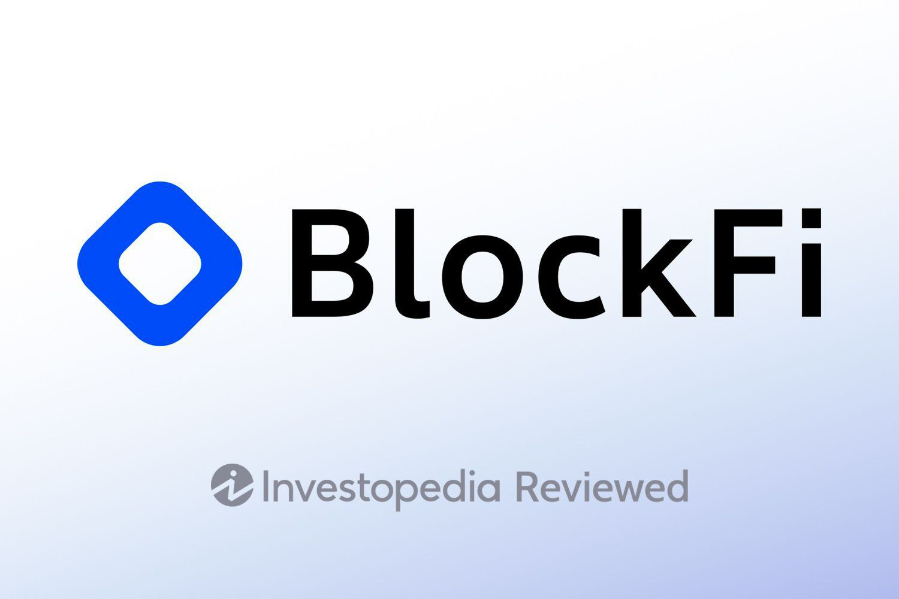

The financial landscape is experiencing a significant transformation with the rise of cryptocurrency as a crucial component. Platforms such as BlockFi are leading this transformation by providing unique financial services, including crypto wallets and algorithmic trading. These innovative services not only redefine how individuals engage with digital currencies but also bridge the gap between traditional finance and modern crypto economies.

BlockFi is notable for its comprehensive suite of services tailored for both individual and institutional investors. Its offerings include lending services, where users can borrow funds by leveraging their cryptocurrency holdings as collateral. Additionally, BlockFi's interest accounts allow users to earn substantial yields on their digital assets, providing an alternative to conventional savings accounts with potentially higher returns. This approach effectively integrates time-tested financial principles within the rapidly evolving digital currency ecosystem, offering users diversified options for managing and growing their wealth.



As cryptocurrency continues to assert its importance on the global financial stage, platforms like BlockFi are carving out a space where digital and traditional financial services coalesce. This evolution not only enhances accessibility to cryptocurrency investments but also empowers users to maximize their financial potential through innovative tools and strategies. As we explore BlockFi's impact on crypto wallet financial services and algorithmic trading, it becomes clear that the intersection of technology and finance will shape the future of the industry.

## Table of Contents

## Understanding Crypto Wallets

Crypto wallets are essential tools in the digital finance ecosystem, empowering users to securely store and manage their cryptocurrency assets. They operate as digital interfaces that facilitate interactions with blockchain networks, enabling users to send, receive, and track their digital currency holdings. A crypto wallet does not store the physical cryptocurrencies; rather, it holds the secure private keys required to sign transactions, while the cryptocurrency itself resides on the blockchain.

Crypto wallets are classified into two primary types: custodial and non-custodial. Custodial wallets are managed by a third party that controls the user's private keys, providing convenience at the cost of reduced personal control. Non-custodial wallets offer users complete control over their private keys, enhancing security but requiring a higher level of technical proficiency.

BlockFi offers a notable custodial crypto wallet solution that extends beyond mere storage. Through the BlockFi Interest Account (BIA), users can leverage their digital assets to earn interest, transforming idle cryptocurrency into an income-generating tool. This innovative feature allows for the compounding of interest, providing users with an opportunity to grow their crypto holdings over time.

The BIA functions similarly to a traditional savings account, where the principal is the deposited [cryptocurrency](/wiki/cryptocurrency), and interest is accrued based on the holdings. Interest rates are often higher than those offered in conventional savings accounts, reflecting the volatile and emerging nature of cryptocurrency markets. BlockFi's interest rates are determined by the market demand for borrowing specific cryptocurrencies, creating a dynamic ecosystem of lenders and borrowers.

For instance, if a user deposits Bitcoin into their BIA, the calculation of interest earned ($E$) over a period can be represented as:

$$
E = P \times \left(1 + \frac{r}{n}\right)^{nt} - P
$$

where:
- $P$ is the principal amount (initial deposit),
- $r$ is the annual nominal interest rate,
- $n$ is the number of compounding periods per year,
- $t$ is the time in years.

This formula showcases the potential of enhancing crypto portfolios by utilizing interest-yielding accounts within custodial crypto wallets like those offered by BlockFi. Such financial innovation widens the scope of cryptocurrency application, integrating traditional finance concepts with new-age digital advancements.

## BlockFi's Financial Services

BlockFi distinguishes itself in the cryptocurrency industry by entwining digital asset investments with conventional financial services. It provides a diverse array of financial offerings tailored to meet the needs of both individual and institutional investors seeking to maximize [earning](/wiki/earning-announcement) potential through flexible solutions. 

One of the cornerstone services BlockFi provides is crypto-backed loans. These loans enable users to leverage their cryptocurrency holdings as collateral to obtain U.S. dollars without selling their digital assets. This feature is advantageous for investors who wish to maintain their crypto positions while still accessing [liquidity](/wiki/liquidity-risk-premium). The loan-to-value (LTV) ratio typically offered by BlockFi ranges from 20% to 50%, allowing borrowers to determine the level of exposure and risk they are comfortable with while receiving funds. The interest rates on these loans are competitively structured, providing a cost-effective borrowing solution compared to traditional financial systems.

Another significant service is the BlockFi Interest Account (BIA), which allows users to earn interest on their cryptocurrency deposits. Unlike traditional bank accounts, BIA holders can accrue compound interest on a monthly basis on various cryptocurrencies like Bitcoin and Ethereum. This high-yield interest-bearing account transforms idle crypto assets into a productive financial tool, delivering returns that can be significantly higher than standard savings accounts.

BlockFi also offers seamless trading services on its platform. Users can buy, sell, and trade a wide array of cryptocurrencies without the usual complexities associated with crypto exchanges. The platform's user interface is designed for ease of use, providing a straightforward process for executing trades. Moreover, BlockFi's trading services are enhanced by the lack of transaction fees, setting it apart from many other platforms which often impose fees for each trade. This feature is especially appealing for frequent traders aiming to maximize their investment's efficiency.

These diversified services reflect BlockFi's commitment to integrating the principles of traditional finance with the evolving digital currency ecosystem, catering to a broad spectrum of investors by providing robust earning potential coupled with operational flexibility. By making such services accessible, BlockFi fosters a bridge between traditional financial mechanisms and the burgeoning world of cryptocurrency.

## Algorithmic Trading in Crypto

Algorithmic trading employs sophisticated mathematical models and powerful computer systems to automate and execute trades at speeds and volumes unattainable by human traders. This technology is especially pivotal in the cryptocurrency market where its capacity to process large datasets efficiently results in optimized trading strategies and enhanced market liquidity.

In essence, [algorithmic trading](/wiki/algorithmic-trading) leverages pre-defined strategies based on statistical analysis and market conditions, facilitating high-frequency trading operations. These algorithms can identify market trends, execute trades, and adjust strategies in real-time without human intervention, thereby minimizing human error and optimizing trade execution.

A simple example of a trading algorithm in Python could involve a moving average crossover strategy, a common technique used to signal buy or sell opportunities:

```python
def moving_average(prices, window_size):
    return [sum(prices[i:i+window_size])/window_size for i in range(len(prices)-window_size+1)]

def crossover_strategy(prices, short_window, long_window):
    short_ma = moving_average(prices, short_window)
    long_ma = moving_average(prices, long_window)

    signals = []
    for i in range(1, len(short_ma)):
        if short_ma[i] > long_ma[i-1] and short_ma[i-1] <= long_ma[i-1]:
            signals.append('buy')
        elif short_ma[i] < long_ma[i-1] and short_ma[i-1] >= long_ma[i-1]:
            signals.append('sell')
        else:
            signals.append('hold')

    return signals

# Sample usage
prices = [100, 102, 101, 105, 107, 110, 108, 115]
signals = crossover_strategy(prices, short_window=2, long_window=3)
print(signals)
```
This simplistic model calculates moving averages over specified windows and signals when to buy or sell based on their intersection.

BlockFi integrates algorithmic trading within its platform to offer users seamless, precise trading capabilities. By adopting these algorithms, BlockFi provides an enhanced trader experience that capitalizes on market movements and data-driven strategies, amplifying users' trading efficiency and potential gains. Furthermore, the use of algorithmic trading allows BlockFi to offer zero commission trading, which is an added advantage for traders seeking to maximize their profits in a cost-effective manner. As a result, users are better positioned to exploit market opportunities with greater speed and accuracy, reinforcing BlockFi's commitment to delivering robust financial solutions in the digital currency market.

## Why Choose BlockFi?

BlockFi is an appealing choice for cryptocurrency investors, primarily due to its strong commitment to regulatory compliance and high-security standards. This commitment ensures that users can confidently manage their digital assets within a secure framework. BlockFi's dedication to adhering to financial regulations sets it apart in the often turbulent cryptocurrency industry, where security concerns and regulatory ambiguities are prevalent.

The platform's innovative financial products further enhance its appeal. BlockFi offers zero trading fees, making it an economically attractive option for users seeking to optimize their investment returns. This cost-effective trading structure can significantly benefit high-frequency traders or those with substantial investment volumes, as trading fees can accumulate rapidly in other platforms.

Notably, BlockFi stands out with its unique offerings such as crypto interest accounts and crypto-backed loans. The BlockFi Interest Account (BIA) allows users to earn interest on their cryptocurrency holdings, providing a passive income stream in addition to potential capital appreciation. This feature is particularly advantageous in a low-interest-rate environment, where traditional savings accounts offer minimal returns. 

Crypto-backed loans provide another layer of flexibility, allowing users to leverage their cryptocurrency holdings without the need to liquidate their assets. This service enables investors to meet liquidity needs or invest in different opportunities while maintaining their long-term crypto investment strategy.

Overall, BlockFi's comprehensive suite of financial services is designed to accommodate both novice and experienced cryptocurrency users, offering a versatile platform that aligns with diverse investment strategies and risk appetites.

## Risks and Considerations

Investing in cryptocurrencies and utilizing financial services like those provided by BlockFi involve inherent risks that should be carefully considered by potential users. One of the primary risks associated with cryptocurrency investment is market [volatility](/wiki/volatility-trading-strategies). The cryptocurrency market is known for its price fluctuations, which can be both sudden and significant. This volatility can lead to substantial financial gains; however, it also poses the risk of serious losses. Investors are advised to regularly monitor market trends and developments to better navigate this turbulent environment.

Another critical consideration is the lack of traditional insurance protections. Traditional banking systems offer a layer of security through government-backed insurance, such as the Federal Deposit Insurance Corporation (FDIC) insurance in the United States, which protects consumers' deposits. In contrast, cryptocurrency holdings are not typically covered by such insurance, exposing them to a higher risk in the event of exchange failures or security breaches. Consequently, individuals should remain vigilant and seek financial platforms that offer alternative security measures.

BlockFi addresses some of these concerns by implementing high levels of security and reliability. Features like two-[factor](/wiki/factor-investing) authentication (2FA) enhance the security of user accounts, offering a layer of protection against unauthorized access. Additionally, BlockFi employs a range of insurance solutions to safeguard client assets, though potential users should thoroughly investigate the extent and limitations of such coverage. Despite these robust measures, it's imperative for users to conduct their own due diligence, as even platforms with strong security protocols are not entirely immune to risk.

Moreover, users should carefully consider market conditions and personal risk tolerance before engaging in cryptocurrency trading or savings on platforms like BlockFi. This involves assessing their own financial situations and setting clear investment goals. A comprehensive understanding of the potential risks and rewards can help investors make informed decisions, mitigating the likelihood of unexpected financial impacts. Engaging in diversified investment strategies and keeping abreast of market news can further enhance an investor's ability to manage these inherent risks effectively.

## Conclusion

BlockFi effectively combines elements of traditional finance with the innovations of modern digital asset management. This integration offers a distinct advantage to individuals and institutions engaging with crypto wallet services and algorithmic trading. By providing a versatile platform that bridges the gap between conventional financial infrastructures and the burgeoning cryptocurrency landscape, BlockFi positions itself as a significant player in the financial services sector.

As the cryptocurrency market continues to expand, driven by technological advancements and growing investor interest, platforms like BlockFi will increasingly influence the development and accessibility of financial solutions worldwide. Their offerings of crypto-backed loans, high-yield interest accounts, and algorithmic trading capabilities present lucrative opportunities for users seeking to maximize their investments. BlockFi's emphasis on regulatory compliance and security further enhances its appeal, ensuring a safer environment for conducting these innovative financial transactions.

The company’s forward-thinking approach not only caters to the current needs of crypto enthusiasts but also anticipates the evolving demands of the global financial ecosystem. By balancing the principles of traditional finance with the flexibility of digital assets, BlockFi is set to remain a cornerstone in the advancement of crypto-based financial solutions, fostering greater adoption and integration of cryptocurrencies in everyday financial activities.

## References & Further Reading

[1]: BlockFi. ["How BlockFi Makes Money."](https://moneymodels.org/business-models/how-does-blockfi-make-money/) BlockFi.

[2]: Popper, Nathaniel. ["Digital Gold: Bitcoin and the Inside Story of the Misfits and Millionaires Trying to Reinvent Money"](https://www.amazon.com/Digital-Gold-Bitcoin-Millionaires-Reinvent/dp/006236250X) by Nathaniel Popper.

[3]: Antonopoulos, Andreas M. ["Mastering Bitcoin: Unlocking Digital Cryptocurrencies"](https://www.amazon.com/Mastering-Bitcoin-Unlocking-Digital-Cryptocurrencies/dp/1449374042) by Andreas M. Antonopoulos.

[4]: Narayanan, Arvind et al. ["Bitcoin and Cryptocurrency Technologies: A Comprehensive Introduction"](https://press.princeton.edu/books/hardcover/9780691171692/bitcoin-and-cryptocurrency-technologies) by Arvind Narayanan, Joseph Bonneau, Edward Felten, Andrew Miller, and Steven Goldfeder.

[5]: Tapscott, Don, and Tapscott, Alex. ["Blockchain Revolution: How the Technology Behind Bitcoin and Other Cryptocurrencies is Changing the World"](https://www.amazon.com/Blockchain-Revolution-Technology-Cryptocurrencies-Changing/dp/1101980141) by Don Tapscott and Alex Tapscott.

[6]: ["The Basics of Bitcoins and Blockchains: An Introduction to Cryptocurrencies and the Technology that Powers Them"](https://www.amazon.com/Basics-Bitcoins-Blockchains-Introduction-Cryptocurrencies/dp/1633538001) by Antony Lewis.