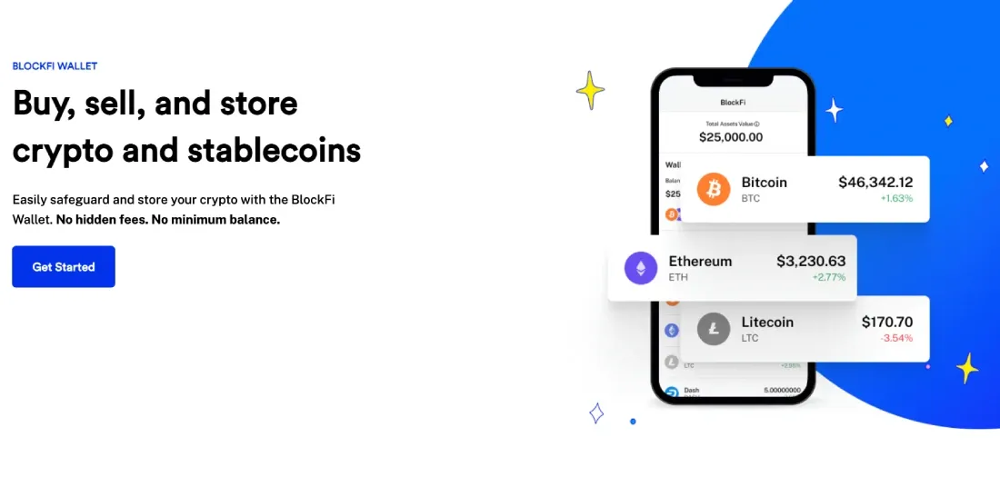

## Table of Contents

## What is BlockFi Wallet and what is its primary purpose?

BlockFi Wallet is a type of digital wallet that lets you store, send, and receive cryptocurrencies like Bitcoin and Ethereum. It's made by a company called BlockFi, which also offers other financial services related to cryptocurrencies. The wallet is easy to use and can be accessed on your computer or phone, making it convenient for people who want to manage their digital money.

The primary purpose of the BlockFi Wallet is to help people keep their cryptocurrencies safe and to make it easy to use them. With the wallet, you can send your crypto to other people or use it to buy things. It also lets you keep track of how much crypto you have and see the history of your transactions. This makes managing your digital money simple and secure.

## How do you set up a BlockFi Wallet account?

To set up a BlockFi Wallet account, first go to the BlockFi website or download the BlockFi app on your phone. Once you're there, click on the option to sign up or create a new account. You'll need to enter some basic information like your name, email address, and a strong password. Make sure to choose a password that's hard to guess to keep your account safe. After you enter your information, you'll get an email to verify your email address. Click on the link in the email to confirm your account.

After verifying your email, you'll need to complete the identity verification process. This means you'll have to provide some documents like a driver's license or passport to prove who you are. This step is important to make sure your account is secure and to follow the rules about using cryptocurrencies. Once your identity is verified, you can log into your BlockFi Wallet. You'll see your wallet address, which is like a special code that you use to send and receive cryptocurrencies. Now you're all set to start using your BlockFi Wallet to manage your digital money.

## What types of cryptocurrencies does BlockFi Wallet support?

BlockFi Wallet supports a few different types of cryptocurrencies. The main ones are Bitcoin (BTC) and Ethereum (ETH). These are two of the most popular cryptocurrencies, and having them in your wallet lets you do a lot of things like sending them to friends or using them to buy stuff.

Besides Bitcoin and Ethereum, BlockFi Wallet also supports other cryptocurrencies like Litecoin (LTC) and USD Coin (USDC). Litecoin is similar to Bitcoin but works a bit faster, which can be handy. USD Coin is a type of stablecoin, meaning its value stays pretty steady because it's tied to the US dollar. This makes it a good choice if you want to keep your money safe without it going up and down a lot.

## How can you deposit and withdraw funds from BlockFi Wallet?

To deposit funds into your BlockFi Wallet, you first need to go to the wallet section of the app or website. Look for the option to deposit, and you'll see your wallet address for each type of cryptocurrency you want to add. You can copy this address and send your cryptocurrencies from another wallet or exchange to this address. Once the transaction is confirmed on the blockchain, the funds will show up in your BlockFi Wallet. It's like sending money to a friend, but you use your wallet address instead of a bank account number.

To withdraw funds from your BlockFi Wallet, go to the wallet section again and find the withdraw option. Choose the cryptocurrency you want to take out and enter the amount. You'll need to provide the wallet address where you want to send the funds. Double-check the address to make sure it's right, because sending crypto to the wrong address can mean you lose your money. After you confirm the withdrawal, the transaction will be processed, and the funds will be sent to the address you provided. It might take a little while for the transaction to be confirmed on the blockchain, but once it is, the funds will be in the new wallet.

## What are the fees associated with using BlockFi Wallet?

When you use BlockFi Wallet, you might have to pay some fees. These fees depend on what you're doing. For example, when you send Bitcoin or Ethereum from your wallet to another address, you'll have to pay a network fee. This fee goes to the people who run the blockchain and help process your transaction. The amount of this fee can change based on how busy the network is. If a lot of people are using it at the same time, the fee might be higher.

There are no fees for depositing cryptocurrencies into your BlockFi Wallet. That means you can add Bitcoin, Ethereum, or other supported cryptocurrencies to your wallet without paying anything extra. However, if you want to move your money out of the wallet, you'll need to pay those network fees I mentioned before. Also, if you use other services from BlockFi, like taking out a loan or [earning](/wiki/earning-announcement) interest on your crypto, there might be different fees for those services. It's a good idea to check the fee details on the BlockFi website or app before you do anything.

## How does BlockFi Wallet ensure the security of user funds?

BlockFi Wallet keeps your money safe by using strong security measures. One important way they do this is by using two-[factor](/wiki/factor-investing) authentication (2FA). This means that when you log in, you need to enter a special code sent to your phone or generated by an app. This makes it much harder for someone else to get into your account, even if they know your password. Also, BlockFi uses encryption to protect your information. Encryption is like a secret code that keeps your data safe from people who shouldn't see it.

Another way BlockFi Wallet protects your funds is through their identity verification process. When you sign up, you have to prove who you are with documents like a driver's license. This helps stop people from using fake accounts to do bad things. BlockFi also keeps most of the cryptocurrencies in cold storage, which means they're kept offline where hackers can't reach them. By combining all these methods, BlockFi Wallet makes sure your digital money stays safe and secure.

## What are the benefits of using BlockFi Wallet compared to other wallets?

BlockFi Wallet offers several benefits that make it stand out from other wallets. One big advantage is that it's easy to use. You can access it on your computer or phone, which makes managing your cryptocurrencies simple and convenient. Plus, BlockFi Wallet supports popular cryptocurrencies like Bitcoin and Ethereum, as well as others like Litecoin and USD Coin. This gives you a lot of options for storing and using your digital money.

Another benefit is the strong security measures BlockFi Wallet has in place. It uses two-factor authentication to keep your account safe, and your information is protected with encryption. BlockFi also keeps most of your cryptocurrencies in cold storage, which means they're stored offline where hackers can't get to them. This focus on security helps you feel confident that your digital money is safe.

## How does BlockFi Wallet integrate with other BlockFi services like lending and borrowing?

BlockFi Wallet works well with other BlockFi services like lending and borrowing. If you want to lend your cryptocurrencies and earn interest, you can easily move your crypto from your wallet to the lending platform. It's simple because everything is in one place. You just pick the crypto you want to lend, and BlockFi takes care of the rest. They pay you interest regularly, which you can then keep in your wallet or use for something else.

If you need to borrow money, BlockFi Wallet makes that easy too. You can use your cryptocurrencies as collateral to get a loan. All you do is move your crypto from your wallet to the borrowing service. BlockFi will give you a loan based on how much crypto you have. You can then use the loan for whatever you need, and when you pay it back, your crypto goes back to your wallet. This integration makes managing your money and using BlockFi's other services smooth and straightforward.

## Can you use BlockFi Wallet for international transactions, and what are the considerations?

Yes, you can use BlockFi Wallet for international transactions. It's easy because cryptocurrencies like Bitcoin and Ethereum work the same all over the world. You can send your crypto to someone in another country just like you would send it to someone nearby. All you need is their wallet address, and the money can move quickly without having to go through banks or other middlemen.

When you're thinking about using BlockFi Wallet for international transactions, there are a few things to keep in mind. First, you might have to pay network fees when you send your crypto. These fees can change based on how busy the blockchain is, so it's good to check them before you send money. Also, remember that the value of cryptocurrencies can go up and down a lot, so the amount of money you send might be worth more or less when it gets to the other person. It's a good idea to keep an eye on the prices and maybe use a stablecoin like USD Coin if you want to avoid big changes in value.

## What advanced features does BlockFi Wallet offer to expert users?

BlockFi Wallet has some cool advanced features for people who know a lot about cryptocurrencies. One of these is the ability to use hardware wallets like Ledger or Trezor to store your crypto. This means you can keep your digital money super safe because hardware wallets are really hard for hackers to break into. Another neat feature is that you can see detailed transaction histories and use advanced tools to keep track of your crypto. This helps expert users make smart choices about when to buy, sell, or move their money.

Also, BlockFi Wallet lets you connect to decentralized finance (DeFi) platforms. This means you can use your crypto to do things like earn interest or trade on different apps without leaving your wallet. It's like having a key that opens up a lot of doors in the world of crypto. Plus, if you're good with tech, you can use the wallet's API to build your own tools or connect with other services. This gives you even more control over how you use your cryptocurrencies.

## How does BlockFi Wallet handle private keys and what control do users have over them?

BlockFi Wallet keeps your private keys safe by using a system where they are stored securely on their servers. When you use BlockFi Wallet, you don't have to worry about managing your private keys yourself because BlockFi takes care of them for you. This means you don't need to remember long codes or keep them in a safe place. Instead, BlockFi uses strong security measures like encryption and cold storage to protect your keys and make sure no one else can get to them.

However, this also means that you don't have full control over your private keys. If you want to have more control, you might want to use a hardware wallet with BlockFi Wallet. This lets you keep your private keys on a special device that you own, giving you more power over your cryptocurrencies. But for most people, letting BlockFi handle the keys is easier and still very safe.

## What are the future developments and updates planned for BlockFi Wallet?

BlockFi is always working to make their wallet better. They plan to add support for more types of cryptocurrencies. This means you'll be able to store, send, and receive even more digital money in the future. They also want to make the wallet easier to use by adding new features that help you manage your crypto better. For example, they might add tools that let you see more details about your transactions or help you make better choices about when to buy or sell.

Another big thing BlockFi is thinking about is making their wallet work better with other services. They want to make it easier for you to use your crypto for things like lending and borrowing without leaving the wallet. This could mean new ways to earn interest on your money or get loans using your crypto as collateral. By doing this, BlockFi hopes to make their wallet a one-stop shop for all your cryptocurrency needs.

## What is the understanding of Crypto Wallets?

Crypto wallets are essential tools in the digital finance ecosystem, empowering users to securely store and manage their cryptocurrency assets. They operate as digital interfaces that facilitate interactions with blockchain networks, enabling users to send, receive, and track their digital currency holdings. A crypto wallet does not store the physical cryptocurrencies; rather, it holds the secure private keys required to sign transactions, while the cryptocurrency itself resides on the blockchain.

Crypto wallets are classified into two primary types: custodial and non-custodial. Custodial wallets are managed by a third party that controls the user's private keys, providing convenience at the cost of reduced personal control. Non-custodial wallets offer users complete control over their private keys, enhancing security but requiring a higher level of technical proficiency.

BlockFi offers a notable custodial crypto wallet solution that extends beyond mere storage. Through the BlockFi Interest Account (BIA), users can leverage their digital assets to earn interest, transforming idle cryptocurrency into an income-generating tool. This innovative feature allows for the compounding of interest, providing users with an opportunity to grow their crypto holdings over time.

The BIA functions similarly to a traditional savings account, where the principal is the deposited [cryptocurrency](/wiki/cryptocurrency), and interest is accrued based on the holdings. Interest rates are often higher than those offered in conventional savings accounts, reflecting the volatile and emerging nature of cryptocurrency markets. BlockFi's interest rates are determined by the market demand for borrowing specific cryptocurrencies, creating a dynamic ecosystem of lenders and borrowers.

For instance, if a user deposits Bitcoin into their BIA, the calculation of interest earned ($E$) over a period can be represented as:

$$
E = P \times \left(1 + \frac{r}{n}\right)^{nt} - P
$$

where:
- $P$ is the principal amount (initial deposit),
- $r$ is the annual nominal interest rate,
- $n$ is the number of compounding periods per year,
- $t$ is the time in years.

This formula showcases the potential of enhancing crypto portfolios by utilizing interest-yielding accounts within custodial crypto wallets like those offered by BlockFi. Such financial innovation widens the scope of cryptocurrency application, integrating traditional finance concepts with new-age digital advancements.

## References & Further Reading

[1]: BlockFi. ["How BlockFi Makes Money."](https://moneymodels.org/business-models/how-does-blockfi-make-money/) BlockFi.

[2]: Popper, Nathaniel. ["Digital Gold: Bitcoin and the Inside Story of the Misfits and Millionaires Trying to Reinvent Money"](https://www.amazon.com/Digital-Gold-Bitcoin-Millionaires-Reinvent/dp/006236250X) by Nathaniel Popper.

[3]: Antonopoulos, Andreas M. ["Mastering Bitcoin: Unlocking Digital Cryptocurrencies"](https://www.amazon.com/Mastering-Bitcoin-Unlocking-Digital-Cryptocurrencies/dp/1449374042) by Andreas M. Antonopoulos.

[4]: Narayanan, Arvind et al. ["Bitcoin and Cryptocurrency Technologies: A Comprehensive Introduction"](https://press.princeton.edu/books/hardcover/9780691171692/bitcoin-and-cryptocurrency-technologies) by Arvind Narayanan, Joseph Bonneau, Edward Felten, Andrew Miller, and Steven Goldfeder.

[5]: Tapscott, Don, and Tapscott, Alex. ["Blockchain Revolution: How the Technology Behind Bitcoin and Other Cryptocurrencies is Changing the World"](https://www.amazon.com/Blockchain-Revolution-Technology-Cryptocurrencies-Changing/dp/1101980141) by Don Tapscott and Alex Tapscott.

[6]: ["The Basics of Bitcoins and Blockchains: An Introduction to Cryptocurrencies and the Technology that Powers Them"](https://www.amazon.com/Basics-Bitcoins-Blockchains-Introduction-Cryptocurrencies/dp/1633538001) by Antony Lewis.