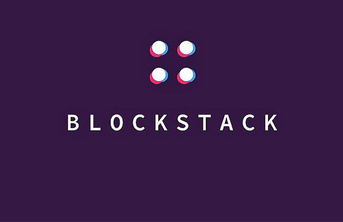

In the ever-evolving landscape of blockchain technology, Stacks has emerged as a powerful platform that integrates smart contracts and decentralized applications on Bitcoin. This integration is achieved without altering Bitcoin's core protocol, thereby offering a unique opportunity to enhance Bitcoin's functionality while maintaining its inherent security features. Stacks blockchain technology leverages these capabilities to extend Bitcoin's usability beyond a mere store of value, fostering a new ecosystem of innovation for developers and traders.

This article explores the intersection of Stacks blockchain technology, Blockstack, and algorithmic trading, highlighting the unique features and opportunities presented by this synergy. Stacks acts as a bridge, utilizing its unique Proof of Transfer (PoX) consensus mechanism to anchor smart contracts and applications directly onto the Bitcoin blockchain. This approach not only enhances security but also allows for the creation of decentralized applications (dApps) and smart contracts that benefit from Bitcoin's robustness.



With a focus on innovation and usability, Stacks offers a new paradigm for developers and traders alike. Developers can create sophisticated applications using the Clarity language, which is designed for predictability and security, while traders can explore algorithmic strategies that leverage blockchain's transparency and reduced transaction costs. Algo trading on platforms powered by blockchain technology is shaping the financial markets of the future, offering high-frequency trading opportunities with greater trust and efficiency.

Understanding how Stacks and Blockstack fit into this narrative is crucial for anyone involved in blockchain and trading. As Blockstack's rebranding into Stacks signifies a strategic shift towards an integrated ecosystem, it continues the vision of decentralized user empowerment and privacy. Recognizing the potential of Stacks' framework in enhancing financial systems is essential for leveraging blockchain technology's full capabilities in algorithmic trading and beyond.

## Table of Contents

## What is Stacks Blockchain Technology?

Stacks is a layer-1 blockchain solution engineered to augment Bitcoin by embedding smart contracts and decentralized applications without necessitating changes to Bitcoin's core protocol. This technology becomes a bridge between Bitcoin's inherent security and the need for innovation brought forth by newer blockchain solutions. It accomplishes this by using a distinctive consensus mechanism known as Proof of Transfer (PoX). PoX capitalizes on Bitcoin's robust security features to bring about a system that allows the Stacks blockchain to build on Bitcoin's underlying infrastructure.

The Stacks blockchain is further distinguished by its use of the Clarity language, specifically designed for reasoning about smart contracts with predictable behavior, offering developers the ability to construct applications that benefit from both Bitcoin's security and the additional functionalities provided by smart contracts. Clarity is a decidable language, meaning every operation's outcome can be predicted before execution, significantly enhancing security.

Stacks aims to redefine how businesses and individuals interact with blockchain technology by providing an avenue for deploying smart contracts directly linked to Bitcoin. This novel approach makes the Stacks blockchain a pioneering force in promoting transparency, security, and new capabilities within the Bitcoin ecosystem. As more developers embrace this framework, Bitcoin's utility is anticipated to broaden significantly, influencing perceptions and methodologies associated with blockchain technology in varied sectors.

## Understanding Blockstack

Blockstack, originally the foundational platform for decentralized computing, has evolved into what is now known as Stacks. Despite the rebranding, the core principles of Blockstack remain integral to Stacks' identity, focusing on decentralization and empowering users with ownership and data privacy. Blockstack's early vision was to create a decentralized internet where users retain control over their data, steering away from centralized authorities that dominate traditional internet frameworks.

In the Stacks network, Blockstack’s principles continue to guide the development of applications that prioritize decentralization. This commitment is reflected in how these applications are designed to ensure that end-users have control over their digital assets and identity. The transition from Blockstack to Stacks marks a strategic shift that embraces broader ecosystem integrations while staying true to the original aims of decentralized governance and user empowerment. This shift reflects a response to the growing demand for blockchain networks that can support diverse applications and use cases, thereby expanding the potential utility of the blockchain.

The rebranding and evolution from Blockstack to Stacks represent a significant pivot, showcasing the potential to integrate various ecosystems while upholding the vision of decentralized control. This strategic evolution has attracted considerable interest from investors and developers who recognize the platform's capability to support a wide array of innovative applications. The foundational work laid down by Blockstack has provided a substantial infrastructure that continues to support new developments within the Stacks ecosystem, enabling a diverse range of applications that leverage blockchain technology to redefine digital interactions.

## The Rise of Algorithmic Trading

Algorithmic trading, often referred to as algo trading, represents a sophisticated method of executing trades using pre-programmed computer algorithms. These algorithms analyze market data at incredible speeds, facilitating trading decisions with minimal human intervention. This approach is grounded in quantitative analysis, which enables the identification of trading opportunities that might be missed by the human eye. By utilizing vast datasets and complex mathematical models, [algorithmic trading](/wiki/algorithmic-trading) enhances efficiency and accuracy in executing trades at optimal moments.

The integration of blockchain technology into algorithmic trading introduces a novel dimension to the field, particularly through platforms like Stacks. Stacks enhances the traditional framework of algorithmic trading by providing a decentralized, secure, and transparent environment for executing trades. Blockchain's distributed ledger technology ensures that transaction records are immutable and verifiable, thereby fostering a higher level of trust among traders. Furthermore, the reduction of intermediaries in transactions through blockchain technology can significantly lower transaction costs, a crucial [factor](/wiki/factor-investing) in large-scale trading operations.

The synergy between algorithmic trading and the Stacks blockchain allows for the development of robust trading systems capable of reshaping existing paradigms. These systems leverage the smart contract capabilities provided by Stacks, enabling automated and conditional trade executions without the need for central authorities. This automation not only streamlines trading processes but also reduces the risks of human error, thereby improving overall efficiency.

Adapting algorithmic trading strategies to blockchain environments promotes higher levels of trust and operational efficiency. Traders are increasingly drawn to these technological advantages, as they seek to harness the transparency, security, and cost-effectiveness offered by platforms like Stacks. The blend of advanced algorithmic techniques with the innovative features of blockchain technology positions this intersection as a pivotal driver of future transformations in the financial markets. As blockchain continues to evolve, its potential to enhance the effectiveness and accessibility of algorithmic trading is expected to become even more profound.

## How Stacks Enables Advanced Algo Trading

Merging Stacks blockchain capabilities with algorithmic trading offers several advantages to traders, primarily through enhanced security, decentralized networks, and improved process efficiency. Stacks blockchain facilitates advanced algorithmic trading by utilizing smart contracts that perform automation and conditional executions. This feature is instrumental in streamlining complex algorithmic strategies, enabling trades to be executed automatically when predefined conditions are met, thus enhancing operational efficiency.

In traditional trading systems, latency and reliability are often concerns, particularly for high-frequency trading ([HFT](/wiki/high-frequency-trading-strategies)) operations where milliseconds can determine the success or failure of a trade. Stacks addresses these issues by providing reduced latency and improved reliability, thanks to its integration with Bitcoin's blockchain. This connection ensures that transactions are processed swiftly and securely, minimizing delays and errors that can impact trading outcomes.

Traders using Stacks benefit from lower friction in their transactions due to the blockchain’s compatibility with Bitcoin, allowing for seamless operations across the globe. This compatibility not only broadens the market reach for traders but also opens up new opportunities by connecting them with the extensive Bitcoin user base. Consequently, traders can engage with a wider market and leverage the robust network effects of Bitcoin.

Moreover, the precision offered by smart contracts on the Stacks network empowers traders to develop and implement more sophisticated algorithms. Smart contracts on Stacks, written in Clarity, a secure and predictable language, enable the development of complex scenarios that can automatically execute trades based on intricate logic and data inputs. For instance, trades could be executed when specific market indicators suggest a favorable trend, optimizing investment strategies with minimal manual intervention.

Here's a basic outline of how a Python-based script might interact with smart contracts on Stacks:

```python
from stacks_blockchain import SmartContract

# Initialize smart contract
contract = SmartContract(address='smart_contract_address')

# Define trading conditions
def trading_conditions(market_data):
    # Example condition: Buy if BTC price falls below a threshold
    return market_data['btc_price'] < 30000

# Monitor market and execute trades
def execute_trade():
    market_data = get_market_data()
    if trading_conditions(market_data):
        contract.execute_function('buy', params={'amount': 1})

# Function to simulate market data retrieval
def get_market_data():
    # Placeholder for actual market data retrieval logic
    return {'btc_price': 29500}

# Execute trading logic
execute_trade()
```

This script represents a hypothetical interaction with a Stacks smart contract, allowing traders to automate actions based on market data inputs, showcasing the potential applications of combining blockchain technology with algorithmic trading frameworks. By leveraging these technologies, traders can effectively enhance their trading strategies, ensuring robust and efficient market engagements.

## Challenges and Considerations

Integrating algorithmic trading with Stacks blockchain technology, while promising, involves addressing several critical challenges. A primary concern is scalability. As algorithmic trading systems often handle vast amounts of data and require rapid execution times, the capacity of the Stacks blockchain to process these transactions efficiently is crucial. The Proof of Transfer (PoX) consensus mechanism, foundational to Stacks, involves transaction verification processes that, if not optimized, might introduce latency or bottlenecks in high-frequency trading scenarios.

Furthermore, the inherent [volatility](/wiki/volatility-trading-strategies) of cryptocurrencies adds complexity to algorithmic trading strategies. Unlike traditional markets, the [cryptocurrency](/wiki/cryptocurrency) space is known for significant price fluctuations. Traders must develop robust algorithms that can not only execute trades based on price trends but also incorporate volatility management techniques to mitigate potential losses. Additionally, algorithms must be regularly updated to adapt to changing market conditions and ensure stability in a dynamically volatile environment.

Regulatory compliance is another significant consideration when employing blockchain technology in financial markets. Different jurisdictions impose varied regulations on cryptocurrency trading, necessitating that traders remain knowledgeable about global trading laws and adjust their strategies accordingly. Blockchain technology, including that employed by Stacks, offers transparency but may also require compliance with data protection and financial transaction laws, such as the GDPR in Europe or the SEC regulations in the United States. Ensuring compliance is vital to preventing legal repercussions and protecting trader investments.

Traders and developers face the task of optimizing smart contracts within the Stacks framework specifically for algorithmic trading. Smart contracts on Stacks, written in the Clarity language, need precise coding to facilitate automated and conditional trades efficiently. Developers must possess a deep understanding of both algorithmic trading principles and smart contract development to create contracts that perform reliably under various market conditions.

Addressing these issues demands a strategic approach that balances technical capabilities with foresight. Developing scalable infrastructure on the Stacks platform, implementing robust risk management algorithms, and ensuring compliance with international regulations remain pivotal steps. Collaboration between blockchain developers, financial experts, and regulatory bodies can support the creation of a conducive environment for deploying algorithmic trading solutions on the Stacks blockchain, setting the stage for secure and efficient trading advancements.

## Conclusion

Stacks blockchain technology, originally developed as Blockstack, has significantly enhanced Bitcoin's capabilities by introducing smart contracts and decentralized applications. This extension empowers Bitcoin, a traditionally static and security-focused platform, to support innovative functionalities without compromising its foundational principles. Through the integration of algorithmic trading, Stacks offers a robust and efficient platform for traders eager to exploit the advanced features of blockchain technology. The seamless fusion of Stacks with algo trading frameworks has yielded a secure and streamlined environment, ensuring lower transaction costs and increased transparency.

Despite the evident advantages, certain challenges remain, including scalability, regulatory compliance, and the inherent volatility of cryptocurrencies. These issues demand careful navigation and strategic innovation. Nevertheless, the convergence of Stacks technology and algorithmic trading heralds new opportunities for the financial industry, potentially reshaping trading mechanisms globally. By fostering a more sophisticated, transparent, and efficient trading ecosystem, this synergy is set to redefine how financial transactions are conducted.

As the adoption and acknowledgment of Stacks technology continue to grow, its impact on algorithmic trading is poised to become more pronounced. The ongoing advancements and increased understanding of Stacks promise to unlock further innovations in trading, potentially leading to a transformative era in global financial markets. Consequently, stakeholders involved in trading and blockchain technologies are encouraged to remain informed and adaptive, ensuring they fully capitalize on the evolving landscape that Stacks and algorithmic trading together present.

## References & Further Reading

[1]: Cascorbi, Andreas. ["An Overview of Stacks Blockchain: Bitcoin at a New Level."](https://medium.com/@confluxdevs/stacks-an-exploration-of-bitcoins-layer-2-smart-contract-infrastructure-bf49e3d430c6)

[2]: Ali, Muneeb, et al. (2017). ["Blockstack: A Global Naming and Storage System Secured by Blockchains."](https://www.semanticscholar.org/paper/Blockstack%3A-A-Global-Naming-and-Storage-System-by-Ali-Nelson/1f42fdecd70a7d72f0f108e80511320f7204316c) Blockstack Whitepaper.

[3]: Nelson, David. ["A Deep Dive into Stacks and Its Potential Implications on Bitcoin's Layer-1 System."](https://medium.com/@satoshiplanet/bitcoin-layers-explained-a-deep-dive-into-stacks-1947af27c886)

[4]: Angeris, Guillermo, et al. (2019). ["Analysis of the Long-Range Attack on Proof-of-Transfer."](https://papers.ssrn.com/sol3/papers.cfm?abstract_id=3602203) arXiv preprint.

[5]: Hull, John C. (2014). ["Options, Futures, and Other Derivatives."](https://www.amazon.com/Options-Futures-Other-Derivatives-9th/dp/0133456315) Pearson.