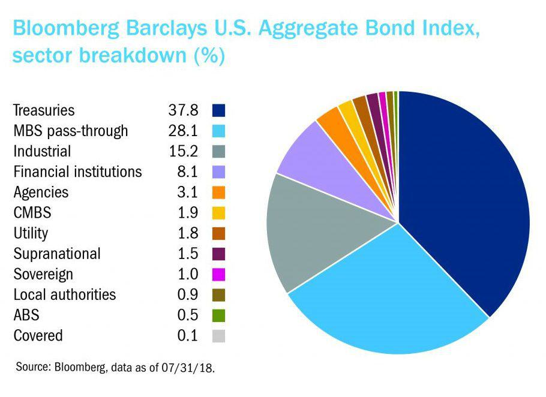

The Bloomberg Aggregate Bond Index, colloquially referred to as 'the Agg,' is a fundamental benchmark in the fixed-income securities sector. It is a comprehensive indicator for tracking the performance of investment-grade, U.S.-dollar-denominated, fixed-rate taxable bonds. Serving as a counterpart to the Wilshire 5000 Total Stock Index in equity markets, the Agg is often employed by portfolio managers, fund managers, and investors to gauge the overall health and performance of the bond market.

Algorithmic trading represents a significant evolution in trading practices, where sophisticated computer algorithms are used to automate and execute trades at speeds and frequencies beyond human capability. The integration of algorithmic trading with the Bloomberg Aggregate Bond Index represents a notable advancement in investment strategies, highlighting the increasing importance of technology in financial markets.



This article focuses on the synergy between the Bloomberg Aggregate Bond Index and algorithmic trading. Specifically, it explores how algorithmic traders utilize the Agg as a foundational benchmark to inform and refine their trading strategies. Understanding the composition and significance of the Agg is vital, as it encompasses a diverse range of components, including Treasuries, mortgage-backed securities, and corporate bonds, while excluding high-yield and select municipal securities. 

The role of algorithmic trading in transforming investment strategies is particularly pronounced in the context of the Agg, offering insights into interest rate dynamics, market volatility, and risk management. As algorithmic trading continues to evolve, it is poised to redefine traditional investment paradigms by enhancing efficiency, speed, and precision in trading practices. This integration signals a shift towards more technologically driven market strategies, offering investors and fund managers new tools for navigating the complexities of the bond market.

## Table of Contents

## Overview of the Bloomberg Aggregate Bond Index

The Bloomberg Aggregate Bond Index, widely known as "the Agg," serves as a comprehensive benchmark for tracking investment-grade, U.S.-dollar-denominated, fixed-rate taxable bonds. Since its introduction, the Agg has become a critical tool for assessing the overall health of the bond market and is often compared to the Wilshire 5000 Total Stock Index, which serves a similar purpose in the equity markets.

The composition of the Agg is diverse, encompassing various segments of the bond market. These include U.S. Treasuries, which represent government debt securities; mortgage-backed securities (MBS), which are bonds secured by mortgages; and corporate bonds, which are debt securities issued by corporations. Notably, the Agg excludes high-yield bonds, also known as junk bonds, due to their lower credit ratings and higher risk profiles. It similarly excludes certain municipal securities, which are typically tax-exempt and may not meet the investment-grade criteria required by the index.

Managed by Bloomberg, the index currently oversees more than $50 trillion worth of fixed-income securities, highlighting its extensive reach and the breadth of bonds it monitors. This broad inclusion makes the Agg a vital resource for investors aiming to gain insights into the fixed-income market's current conditions and trends.

Its significance lies not only in its comprehensive coverage but also in the role it plays in shaping investment strategies, risk assessments, and performance benchmarks for both individual and institutional investors. By providing a standardized measure of investment-grade bond performance, the Agg helps investors make informed decisions based on a detailed understanding of bond market dynamics. 

Overall, the Bloomberg Aggregate Bond Index remains an essential gauge for evaluating the performance and trends within the bond market, offering valuable insights for portfolio management and the formation of trading strategies.

## The Role of Algorithmic Trading in Fixed-Income Markets

Algorithmic trading, often referred to as algo trading, involves the use of computer programs to execute trades of financial assets at speeds and volumes that surpass human capabilities. This technological advancement is becoming increasingly important in fixed-income markets, where it offers significant advantages such as improved pricing, enhanced [liquidity](/wiki/liquidity-risk-premium), and lower transaction costs.

In fixed-income markets, [algorithmic trading](/wiki/algorithmic-trading) enhances efficiency by leveraging speed and precision. These markets have historically been less liquid compared to equity markets, and the introduction of algorithms has helped bridge this gap. Algo trading achieves better pricing through the use of automated systems that quickly process and analyze market information to execute trades at optimal prices. This speed in decision-making can exploit small price discrepancies across different trading venues, leading to cost savings.

The integration of algorithms with vast datasets like the Bloomberg Aggregate Bond Index provides traders with a powerful tool for real-time market analysis and decision-making. Algorithms can process the extensive data from the index, which includes investment-grade, U.S.-dollar-denominated bonds, and use this information to detect trends, assess risks, and identify trading opportunities. This capability enables market participants to adjust their positions rapidly in response to changes in market conditions, thus maintaining an advantageous stance.

Algorithmic trading systems utilize quantitative models to assess the market, often employing statistical techniques and [machine learning](/wiki/machine-learning) algorithms to predict price movements and execute trades accordingly. Python, a popular programming language, can be used to develop such models. For instance, a simple Python algorithm using libraries like NumPy and pandas could be set up to analyze the historical price data of a bond, detect patterns, and trigger trades based on pre-defined criteria. This ability to process complex datasets and execute trades autonomously greatly augments the effectiveness of trading strategies.

Furthermore, algo trading reduces transaction costs by minimizing the market impact of trades. By breaking up large orders into smaller trades, algorithms can execute these trades in a manner that does not significantly influence market prices, preserving the cost advantage for the trader.

In conclusion, the role of algorithmic trading in fixed-income markets is pivotal for enhancing market efficiency, liquidity, and cost-effectiveness. By utilizing the vast data available from the Bloomberg Aggregate Bond Index, algo traders are equipped to make informed decisions, thereby transforming traditional methods of bond trading and paving the way for more sophisticated investment strategies.

## Strategies for Algo Trading Using the Agg

Algorithmic trading employing the Bloomberg Aggregate Bond Index, often referred to as "the Agg," utilizes a variety of advanced quantitative strategies. These strategies are designed to interpret and act upon a multitude of market signals derived from the ample data provided by the Agg. Popular approaches in this space include trend-following models, mean-reversion strategies, and statistical [arbitrage](/wiki/arbitrage), all of which are leveraged to optimize investment outcomes.

Trend-following models are predicated on the notion that securities which have exhibited strong performance will continue to do so in the near term. These strategies analyze the directional movement of bond prices and interest rates to predict future trends. By utilizing historical pricing data and moving averages, algorithms can identify and exploit trends until signals indicate a reversal. In Python, such strategies can be implemented using libraries like Pandas and NumPy to compute rolling averages and assess price [momentum](/wiki/momentum). 

Mean-reversion strategies, on the other hand, are implemented on the assumption that bond prices will revert to their long-term average over time. This involves monitoring the divergence of current bond prices from their historical averages and using that divergence to trigger buy or sell orders. These algorithms benefit from the Agg's comprehensive data, which helps determine the equilibrium price levels. Applying statistical methods such as standard deviation and Bollinger Bands can be fundamental in constructing these strategies.

Statistical arbitrage involves taking advantage of pricing inefficiencies between related bonds. This approach necessitates a detailed analysis of bond premiums and discounts relative to the Agg's indices to identify opportunities where bonds are mispriced. Advanced statistical techniques and machine learning models help in quantifying these inefficiencies and executing trades to capitalize on them. Key to these strategies is the rapid processing of large datasets, often leveraging technologies like cloud computing and specialized databases for swift execution.

Risk management is integral to these algorithmic strategies. Due to the high [volume](/wiki/volume-trading-strategy) and speed of trades executed, algorithms dynamically adjust positions to hedge against market [volatility](/wiki/volatility-trading-strategies) and exposure. Utilizing [value at risk](/wiki/var-value-at-risk) (VaR) assessments and stress testing, algo traders can manage the potential downside of market movements. The diverse components of the Agg, including Treasuries, mortgage-backed securities, and corporate bonds, provide a wide range of data inputs for assessing risk levels and adapting trading strategies accordingly.

In summary, algorithmic trading strategies using the Bloomberg Aggregate Bond Index harness complex algorithms to process extensive market data, identify trade opportunities, and manage risks efficiently. This results in more informed decision-making and enhanced capability to navigate the fixed-income markets' complexities.

## Comparative Analysis: Traditional vs. Algorithmic Trading

Traditional trading in fixed-income markets is fundamentally driven by human decision-making processes, which involve detailed analysis of market conditions, economic indicators, and individual bond characteristics. Traders rely on their expertise and intuition to interpret data, assess risk, and make strategic choices. This approach is inherently flexible, allowing for the incorporation of qualitative insights and the nuanced understanding of market dynamics that may not be captured by purely quantitative models.

In contrast, algorithmic trading harnesses the power of computer algorithms to process and analyze vast amounts of data from sources like the Bloomberg Aggregate Bond Index (Agg) at high speeds. This technique focuses on speed, precision, and the ability to execute trades at a frequency and scale beyond human capacity. Algorithms can be designed to detect patterns, respond to market signals, and execute predefined strategies automatically, all with minimal human intervention.

One of the significant advantages of algorithmic trading is its ability to execute trades with remarkable speed. The quick execution reduces the impact of market fluctuations between the decision and execution phases of trading. Moreover, algorithms can evaluate diverse market conditions almost instantaneously, making them highly effective in capturing short-lived opportunities. For instance, a Python-based algorithm might employ the `numpy` and `pandas` libraries to swiftly calculate yield spreads or track market sentiment indicators:

```python
import numpy as np
import pandas as pd

# Example: Calculating moving averages for bond yields
data = pd.read_csv('bond_yields.csv')
short_term_window = 5
long_term_window = 20

data['short_ma'] = data['yield'].rolling(window=short_term_window).mean()
data['long_ma'] = data['yield'].rolling(window=long_term_window).mean()

# Signal: Buy when short-term MA crosses above long-term MA
data['signal'] = np.where(data['short_ma'] > data['long_ma'], 1, 0)
```

While algorithmic trading offers multiple advantages, it also presents some challenges. The reliance on historical data and predefined rules means algorithms may not adapt well to unforeseen market events or structural changes. Furthermore, the complexity and dependencies within algorithms can lead to systematic risks, particularly if multiple market participants employ similar strategies. 

Traditional trading, on the other hand, benefits from the human ability to incorporate qualitative factors, such as geopolitical events or market sentiment, into trading decisions. However, it also suffers from limitations in processing speed and the potential for emotional biases to affect decision quality.

Critically, the choice between traditional and algorithmic approaches in bond trading depends on the trader's objectives, resources, and risk tolerance. While traditional methods provide depth and context through human insight, algorithmic trading offers efficiency and speed, fueling its growing adoption in the bond markets. As the financial landscape continues to evolve with technological advancements, a hybrid approach that leverages both human insight and algorithmic efficiency may offer an optimal trading strategy.

## The Future of Algorithmic Trading in Fixed-Income Markets

As technology and data analytics continue to advance, the future of algorithmic trading in fixed-income markets, particularly with benchmarks like the Bloomberg Aggregate Bond Index, is marked by increasing sophistication and robustness. Algorithmic trading, characterized by high-speed and high-frequency trades executed by computer algorithms, has already transformed equity markets and is now making significant inroads into bond markets.

Emerging technologies, such as machine learning and [artificial intelligence](/wiki/ai-artificial-intelligence) (AI), are set to amplify the capabilities of algorithmic trading in these markets. Machine learning models enable the processing and analysis of vast datasets far beyond human capabilities, identifying patterns and making predictions that inform trading strategies. These models can continuously learn from new data inputs, refining their algorithms to improve performance over time. For example, supervised learning techniques can predict bond price movements based on historical data, while unsupervised learning can uncover hidden patterns within bond market data that may not be apparent through traditional analysis.

Moreover, AI-driven sentiment analysis, which interprets qualitative data from news articles, social media, and other textual sources, offers traders a nuanced understanding of market sentiment that can impact bond prices. This integration of qualitative insights with quantitative data presents a comprehensive trading strategy that aligns with market dynamics more closely.

Python, a popular programming language in finance, offers libraries like TensorFlow and PyTorch that facilitate the implementation of machine learning models. An example of a simple machine learning model in Python for predicting bond price movements could be:

```python
import numpy as np
from sklearn.model_selection import train_test_split
from sklearn.linear_model import LinearRegression

# Generate synthetic bond price data
np.random.seed(0)
bond_prices = np.random.rand(100, 1) * 100
interest_rates = np.random.rand(100, 1)
X = np.hstack((bond_prices, interest_rates))
y = bond_prices * (1 + interest_rates)

# Split data into training and testing sets
X_train, X_test, y_train, y_test = train_test_split(X, y, test_size=0.2, random_state=42)

# Train a linear regression model
model = LinearRegression()
model.fit(X_train, y_train)

# Predict bond prices
predictions = model.predict(X_test)
```

Investors and fund managers are increasingly leveraging these technologies to enhance their competitiveness and adapt to the fluid nature of modern financial markets. Such adoption not only optimizes strategies but also caters to the growing demand for faster and more precise execution of trades.

As algorithmic trading becomes more entrenched in fixed-income markets, regulatory bodies may need to address new challenges relating to market stability and integrity. Ensuring that these technologies are implemented responsibly will be crucial to sustaining trust and efficiency in financial markets.

Overall, the future of algorithmic trading in fixed-income markets is promising, with technology serving as a catalyst for continual evolution and enhancement of trading strategies. This evolution is likely to lead to more effective portfolio management and improved financial outcomes for both individual and institutional investors.

## Conclusion

The Bloomberg Aggregate Bond Index, commonly referred to as "the Agg," serves as a cornerstone in the fixed-income sector, providing an extensive overview of market performance. This index acts as a vital benchmark for tracking the collective movement of investment-grade bonds issued in the U.S. dollar, encompassing diverse components such as Treasuries, mortgage-backed securities, and high-quality corporate bonds. The depth and breadth of the Agg make it a reliable tool for assessing the health and trends of the broader bond market.

Algorithmic trading is transforming the landscape of fixed-income investments by utilizing the Agg's comprehensive dataset to drive more sophisticated trading strategies. Through advanced algorithms, traders can analyze vast amounts of data more quickly than ever before, allowing for precise execution of trades. These algorithms take into account various factors, including [interest rate](/wiki/interest-rate-trading-strategies) changes and market volatility, to optimize investment decisions. As a result, investments are managed with greater efficiency, lowering transaction costs and improving liquidity.

Understanding the intersection of the Bloomberg Aggregate Bond Index and algorithmic trading is essential for investors pursuing diversification and efficiency in their bond market strategies. As technology continues to advance, the synergy between the Agg and algorithmic trading enables investors to better navigate the complexities of modern financial markets, ultimately enhancing portfolio performance and risk management. This convergence is not just reshaping how investments are executed but also setting the stage for future innovations in managing fixed-income portfolios.

## References & Further Reading

[1]: ["The Bloomberg Barclays US Aggregate Bond Index."](https://www.bloomberg.com/markets/rates-bonds/bloomberg-fixed-income-indices) Bloomberg.

[2]: Lopez de Prado, M. (2018). ["Advances in Financial Machine Learning."](https://www.amazon.com/Advances-Financial-Machine-Learning-Marcos/dp/1119482089) John Wiley & Sons.

[3]: Chan, E. P. (2008). ["Quantitative Trading: How to Build Your Own Algorithmic Trading Business."](https://github.com/ftvision/quant_trading_echan_book) John Wiley & Sons.

[4]: Jansen, S. (2020). ["Machine Learning for Algorithmic Trading."](https://github.com/stefan-jansen/machine-learning-for-trading) Packt Publishing.

[5]: Aronson, D. (2007). ["Evidence-Based Technical Analysis: Applying the Scientific Method and Statistical Inference to Trading Signals."](https://www.amazon.com/Evidence-Based-Technical-Analysis-Scientific-Statistical/dp/0470008741) John Wiley & Sons.

[6]: Fabozzi, F. J. (2007). ["Fixed Income Analysis."](https://books.google.com/books/about/Fixed_Income_Analysis.html?id=lujLawVLS3YC) John Wiley & Sons.