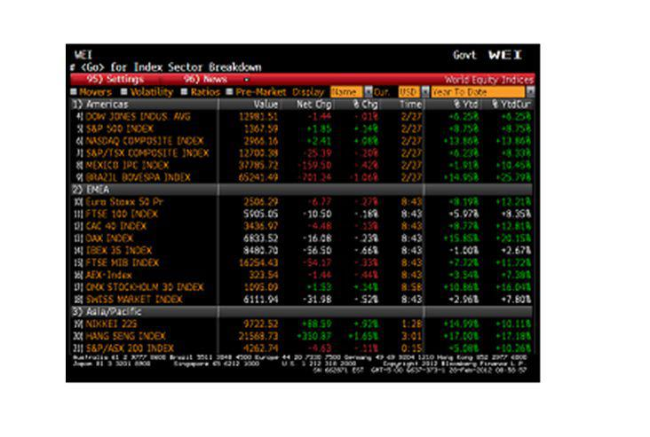

## Table of Contents

## What is Bloomberg and what does it do?

Bloomberg is a company that started in 1981 by a man named Michael Bloomberg. It is known for its financial data and news services. Bloomberg provides information about the stock market, companies, and the economy to people who work in finance, like bankers and traders. They use a special computer system called the Bloomberg Terminal, which gives them real-time data and tools to help them make decisions about buying and selling stocks and other financial products.

Besides financial data, Bloomberg also runs a news service that reports on business, politics, and other important topics. They have TV channels, radio stations, and a website where people can read news articles and watch videos. Bloomberg's news helps people understand what is happening in the world and how it might affect their money and investments. Overall, Bloomberg helps people in the finance world make smart choices by giving them the information they need.

## Who founded Bloomberg and when was it established?

Bloomberg was founded by a man named Michael Bloomberg. He started the company in 1981. Michael Bloomberg used to work at a big bank, but he left to start his own business.

At first, Bloomberg focused on making a special computer system called the Bloomberg Terminal. This system helped people in finance get important information about the stock market and other financial stuff. Over time, Bloomberg grew and started doing more things, like providing news and other services.

## What are the main products and services offered by Bloomberg?

Bloomberg offers a lot of different products and services, but one of the most important is the Bloomberg Terminal. This is a special computer system that people in finance use to get real-time information about stocks, bonds, and other financial products. The Terminal helps them make decisions about buying and selling things in the market. It has tools for analyzing data, making charts, and even chatting with other users. A lot of big banks and investment firms use the Bloomberg Terminal every day.

Another big part of what Bloomberg does is providing news. They have a news service that reports on business, finance, politics, and other important topics. Bloomberg's news comes in many forms, like TV channels, radio stations, and a website where you can read articles and watch videos. This news helps people understand what's happening in the world and how it might affect their money and investments. It's not just for people in finance; anyone can use Bloomberg's news to stay informed.

Bloomberg also offers other services like data and analytics, which help companies understand big sets of information. They have tools for managing risk and making sure investments are safe. Bloomberg even helps with things like figuring out how much a company is worth or how to manage money better. All these products and services make Bloomberg a big name in the world of finance and business.

## How does the Bloomberg Terminal work and what is its purpose?

The Bloomberg Terminal is a special computer system that people in finance use to get real-time information about the stock market and other financial stuff. It's like a big dashboard that shows lots of numbers and charts. When someone wants to know about a certain stock or bond, they can type in a code and the Terminal will show them all the latest information. It also has tools for making charts and doing calculations to help people decide if they should buy or sell something. People can even use the Terminal to chat with others and share information quickly.

The main purpose of the Bloomberg Terminal is to help people in finance make smart choices about their money. It gives them all the information they need in one place, so they don't have to go searching around. This saves them time and helps them react quickly to what's happening in the market. A lot of big banks and investment firms use the Bloomberg Terminal every day because it's so helpful. It's like having a big library of financial information right at your fingertips, making it easier to do your job well.

## What industries does Bloomberg primarily serve?

Bloomberg mainly serves the finance industry. This includes banks, investment firms, and traders who need real-time information about stocks, bonds, and other financial products. The Bloomberg Terminal is a big part of this, giving them the tools they need to make quick and smart decisions about buying and selling things in the market. People in finance rely on Bloomberg to help them understand what's happening with their money and investments.

Bloomberg also serves the media and news industry. They provide news about business, finance, politics, and other important topics through TV channels, radio stations, and their website. This news is useful not just for people in finance, but for anyone who wants to stay informed about what's happening in the world. Bloomberg's news helps people understand how events might affect their money and investments, making it a valuable resource for many industries.

In addition to finance and media, Bloomberg serves other industries like data analytics and risk management. Companies use Bloomberg's data and tools to understand big sets of information and make better decisions. This can include figuring out how much a company is worth or how to manage money more effectively. Bloomberg's services help a wide range of industries by providing the information and tools they need to succeed.

## How has Bloomberg expanded its business beyond financial data services?

Bloomberg has grown its business in many ways, not just sticking to financial data services. One big way they did this is by getting into the news business. They started making TV shows, radio programs, and a website where people can read articles and watch videos about business, finance, and other important topics. This news helps everyone, not just people in finance, understand what's happening in the world and how it might affect their money. By doing this, Bloomberg reached a lot more people and became a big name in the news world too.

Another way Bloomberg expanded is by offering services in data analytics and risk management. They help companies understand big sets of information and make better decisions. For example, they can help a company figure out how much it's worth or how to manage money more safely. These services are useful for many different industries, not just finance. By providing these tools, Bloomberg has become a helpful resource for businesses all over the world, showing that they can do more than just give financial data.

## What is Bloomberg's role in financial news and media?

Bloomberg plays a big role in financial news and media. They started by giving people in finance the information they need about the stock market and other financial stuff. But then they grew and started making news that everyone can use. Bloomberg has TV channels, radio stations, and a website where people can read articles and watch videos about business, finance, and other important topics. This news helps people understand what's happening in the world and how it might affect their money.

Bloomberg's news is not just for people in finance. It's for anyone who wants to stay informed. They report on things like politics, the economy, and big events that can change how people think about their money and investments. By doing this, Bloomberg has become a big name in the news world, not just in finance. They help a lot of people make smart choices by giving them the information they need.

## How does Bloomberg LP differ from Bloomberg Philanthropies?

Bloomberg LP is a company that helps people who work in finance. It gives them a special computer system called the Bloomberg Terminal, which shows them real-time information about the stock market and other financial things. This helps them make smart choices about buying and selling stocks and other investments. Bloomberg LP also makes news about business, finance, and other important topics. They have TV shows, radio programs, and a website where anyone can read articles and watch videos to stay informed.

Bloomberg Philanthropies is different because it's not a business. It's a group that helps people and communities around the world. Michael Bloomberg, who started Bloomberg LP, uses his money to support this group. Bloomberg Philanthropies works on things like education, the environment, and public health. They try to make the world a better place by giving money and support to projects that help people. So while Bloomberg LP focuses on finance and news, Bloomberg Philanthropies focuses on helping people and solving big problems.

## What are some key technological innovations introduced by Bloomberg?

Bloomberg has introduced several key technological innovations over the years. One of the most important is the Bloomberg Terminal, which is a special computer system that gives people in finance real-time information about the stock market and other financial stuff. The Terminal has tools that help users make charts, do calculations, and even chat with others. This helps them make quick and smart decisions about buying and selling stocks and other investments. The Terminal is used by many big banks and investment firms because it makes their work easier and faster.

Another big innovation is Bloomberg's data analytics and risk management tools. These tools help companies understand big sets of information and make better decisions about their money. For example, they can help a company figure out how much it's worth or how to manage money more safely. These services are useful for many different industries, not just finance. By providing these tools, Bloomberg has shown that they can do more than just give financial data, making them a valuable resource for businesses all over the world.

## How does Bloomberg ensure the security and privacy of its data?

Bloomberg takes the security and privacy of its data very seriously. They use strong security measures to keep the information safe. This includes things like encryption, which is like putting a secret code on the data so only people with the right key can see it. They also have firewalls and other tools to stop hackers from getting into their systems. Bloomberg makes sure that only the right people can see the data by using special access controls. This means that someone can only see the information they are supposed to see, and no one else can get to it.

Bloomberg also follows strict rules about privacy. They have rules about how they collect, use, and share data. They make sure to tell people what they are doing with their information and get permission when they need to. Bloomberg also checks their systems all the time to make sure they are working right and that no one is trying to steal or misuse the data. By doing all these things, Bloomberg helps keep the information safe and private for everyone who uses their services.

## What is Bloomberg's approach to sustainability and corporate social responsibility?

Bloomberg cares a lot about sustainability and helping the world. They try to be a good company by doing things that help the environment and the community. For example, they work to reduce their carbon footprint, which means they try to use less energy and make less pollution. Bloomberg also tries to use resources wisely and recycle things. They believe that being good to the planet is important for their business and for everyone.

Bloomberg also focuses on corporate social responsibility. This means they do things to help people and make the world a better place. They support education, public health, and other important causes through Bloomberg Philanthropies, which is run by Michael Bloomberg. They also make sure their workplace is fair and inclusive, where everyone can feel welcome and valued. By doing these things, Bloomberg shows that they care about more than just making money; they want to make a positive difference in the world.

## How does Bloomberg compete with other financial data providers like Reuters and FactSet?

Bloomberg competes with other financial data providers like Reuters and FactSet by offering a wide range of services and tools that are very helpful for people in finance. One of the main ways Bloomberg stands out is with its Bloomberg Terminal. This special computer system gives users real-time information about the stock market and other financial stuff. It also has tools for making charts, doing calculations, and even chatting with others. This makes it easier for people to make quick and smart decisions about buying and selling stocks and other investments. Many big banks and investment firms use the Bloomberg Terminal because it's so useful and reliable.

Another way Bloomberg competes is by providing a lot of news and data analytics services. They have TV channels, radio stations, and a website where people can read articles and watch videos about business, finance, and other important topics. This news helps everyone, not just people in finance, understand what's happening in the world and how it might affect their money. Bloomberg also offers data analytics and risk management tools that help companies understand big sets of information and make better decisions. By offering all these services, Bloomberg can meet the needs of many different customers and stay ahead of competitors like Reuters and FactSet.

## How can the Bloomberg Terminal be integrated into investment strategies?

The Bloomberg Terminal, a cornerstone of modern financial trading, offers a suite of tools essential for strategic investment decisions. Its capability for real-time data analysis is critical in a fast-paced market environment, where decisions must be made swiftly and accurately. By providing instantaneous access to market data, news, and analysis, the terminal ensures that traders and investors can respond promptly to market fluctuations. This real-time access helps identify emerging opportunities and manage potential risks effectively.

Risk management is another crucial aspect where Bloomberg Terminal plays a significant role. It offers tools such as Value at Risk (VaR) calculations, which allow investors to assess the potential losses in their portfolios under various market conditions. VaR is a widely used risk management metric, providing a quantitative measure of an investment's risk exposure by estimating the maximum loss over a given time frame at a certain confidence level. The formula for VaR can be mathematically represented as:

$$
\text{VaR}_p = \left( Z \times \sigma_p \times \sqrt{t} \right)
$$

where $Z$ is the Z-score corresponding to the desired confidence level, $\sigma_p$ is the standard deviation of the portfolio returns, and $t$ is the time period.

Moreover, Bloomberg Terminal facilitates [backtesting](/wiki/backtesting) of trading and investment strategies by providing access to historical data. By analyzing past market conditions and performance, investors can validate the effectiveness of their strategies and refine them to optimize future portfolio decisions. Historical data, combined with Bloomberg's powerful analytics tools, enables a thorough evaluation of strategies, minimizing the risk of relying on untested methodologies.

A noteworthy case study highlighting the effective integration of Bloomberg's analytics is its use in optimizing portfolio decisions at a global asset management firm. By leveraging real-time data and risk analysis tools, the firm was able to enhance its investment strategy, improving its portfolio diversification and risk-adjusted returns. The firm utilized Bloomberg's analytics to monitor market conditions continuously, adjust its asset allocations dynamically, and hedge against potential losses effectively.

In another instance, a [hedge fund](/wiki/hedge-fund-trading-strategies) employed Bloomberg's extensive historical data capabilities to backtest its quantitative models. The availability of comprehensive market data allowed the fund to refine its algorithms, resulting in more robust strategies that significantly improved its trading performance.

In conclusion, the Bloomberg Terminal stands out as an indispensable tool in developing strategic investment decisions. Its real-time data analysis, comprehensive risk management capabilities, and historical data access empower investors to make informed decisions, optimize their portfolios, and maintain a competitive edge in the financial markets.

## References & Further Reading

[1]: ["Bloomberg Markets - Bloomberg Terminal"](https://www.bloomberg.com/professional/products/bloomberg-terminal/) - An official overview of the Bloomberg Terminal, its features, and offerings.

[2]: Hasbrouck, J. (1995). ["Transaction Costs, Trade Throughs, and Riskless Principal Trading in the Nasdaq Market."](https://www.bauer.uh.edu/rsusmel/phd/hasbrouck95.pdf) The Journal of Finance.

[3]: Aldridge, I. (2013). ["High-Frequency Trading: A Practical Guide to Algorithmic Strategies and Trading Systems."](https://www.amazon.com/High-Frequency-Trading-Practical-Algorithmic-Strategies/dp/1118343506) - A book providing insights into the mechanics and strategies of high-frequency trading.

[4]: Lopez de Prado, M. (2018). ["Advances in Financial Machine Learning."](https://www.amazon.com/Advances-Financial-Machine-Learning-Marcos/dp/1119482089) - This book covers machine learning techniques applied to financial data for algorithmic trading.

[5]: Slavin, S. (2010). ["Electronic and Algorithmic Trading Technology: The Complete Guide."](https://www.sciencedirect.com/book/9780123724915/electronic-and-algorithmic-trading-technology) - A comprehensive look into the technologies supporting electronic and algorithmic trading.