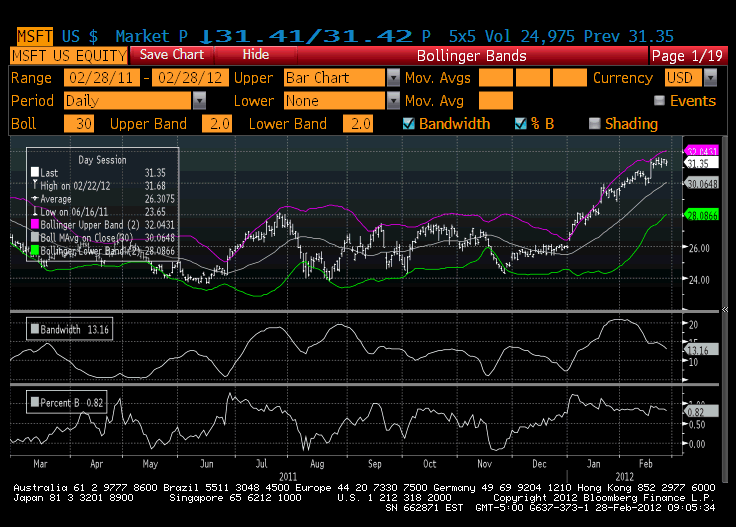

In the rapidly evolving financial markets, effective investment tools are crucial for success. Among these tools, Bloomberg Terminal stands out for its comprehensive offerings for institutional and individual investors alike. As the financial landscape becomes increasingly complex with globalization and technological advancements, the need for robust, real-time data and analytical resources becomes paramount. Traders and investors require access to a range of financial instruments, analytics, and executive capabilities to make informed decisions.

Bloomberg Terminal is renowned for its ability to combine an extensive repository of financial data with powerful analytical capabilities, making it an indispensable resource for users worldwide. The platform provides access to real-time market data, news, and analytics which are essential for making informed investment decisions in volatile markets. It supports various financial professionals, including those involved in portfolio management, trading, and risk assessment, by offering insights that extend beyond traditional data services.



One notable aspect of Bloomberg Terminal is its significant role in algorithmic trading—a process that utilizes algorithms to automatically execute trades, often at speeds and frequencies impossible for human traders. By integrating algorithmic trading capabilities with a vast dataset, Bloomberg Terminal allows traders to design and deploy trading strategies that enhance execution efficiency and profitability.

Furthermore, as a pivotal financial software investment tool, Bloomberg Terminal provides an integrated platform where financial professionals can manage trades, assess risk, and optimize portfolios. It serves as a bridge that connects users to a network of information, analytics, and execution tools, thus empowering them to navigate the complexities of modern financial markets.

This article will explore how Bloomberg Terminal's fusion of financial software, investment tools, and algorithmic trading capabilities creates unparalleled value for financial professionals. As we uncover the role of Bloomberg Terminal in algorithmic trading and its effectiveness as a financial software investment tool, it will become clear why it remains a market leader in empowering investors to achieve success in today's dynamic markets.

## Table of Contents

## Bloomberg Terminal: An Overview

The Bloomberg Terminal, a hallmark of financial technology, enables users to harness global financial data, sophisticated analytical tools, and seamless trade execution capabilities. Launched in 1981 by Bloomberg L.P., the Terminal has evolved into an indispensable instrument for financial professionals worldwide.

Originally designed to offer real-time financial market data, the Bloomberg Terminal quickly expanded its offerings, encompassing an array of functionalities that support financial analysis and decision-making. Its development marked a pivotal shift in how financial information was accessed and utilized, transforming it from a fragmented and delayed process into a centralized, real-time interface.

The Terminal's comprehensive features make it a cornerstone for buy-side and sell-side analysts. Its vast database includes data spanning securities, commodities, foreign exchanges, and derivatives, facilitating an extensive understanding of market dynamics. Real-time market quotes, historical data, and economic indicators are instantly accessible, enabling timely and informed decision-making.

For portfolio managers, the Terminal offers sophisticated tools for portfolio analysis and optimization. It supports asset allocation, risk management, and performance tracking, allowing managers to tailor portfolios to specific investment objectives and risk profiles. The Bloomberg Portfolio & Risk Analytics (PORT) function, in particular, provides deep insights into portfolio risk factors and performance analytics, enhancing the decision-making process.

Buy-side analysts utilize the Bloomberg Terminal to execute in-depth equity research, access proprietary Bloomberg Intelligence reports, and analyze financial statements using its interactive features. Sell-side analysts benefit from its trade execution capabilities and analytics, making it an essential tool for executing and analyzing trades.

In essence, the Bloomberg Terminal's evolution and its myriad of features have solidified its position as an essential tool for financial professionals, profoundly impacting portfolio management and aiding analysts across the financial sector. Its integration into daily financial practices underscores its critical role in accessing, analyzing, and acting on financial data in the modern investing landscape.

## Financial Software: Enhancing Investment Decisions

Financial software has become a cornerstone for investors aiming to make informed decisions within the ever-changing financial markets. These tools, particularly the Bloomberg Terminal, play a critical role in enhancing the investment decision-making process by providing comprehensive data services and analytical capabilities.

The Bloomberg Terminal distinguishes itself with real-time market data and a vast array of independent research resources. Its data is comprehensive, covering multiple asset classes such as equities, fixed income, commodities, and currencies. Investors rely on the Bloomberg Terminal for precise and up-to-date information, which is crucial for timing trades and assessing market sentiment. The importance of real-time data cannot be overstated, as delayed information can lead to missed opportunities and suboptimal investment decisions.

Additionally, the Bloomberg Terminal offers access to an extensive library of independent research. This feature provides users with insights from a multitude of analysts and institutions, offering a range of perspectives on market trends and potential investment avenues. This depth of analysis allows investors to evaluate the credibility of various investment theories and make informed decisions based on multiple expert opinions, thus reducing the risk of bias.

Financial software platforms like Bloomberg Terminal significantly contribute to investment analysis by offering robust analytical tools. These tools include [backtesting](/wiki/backtesting) capabilities, which allow investors to test the viability of their investment strategies using historical data. By running simulations on past market conditions, investors can identify potential weaknesses in their strategies and refine them for better performance in real-world applications.

Furthermore, Bloomberg Terminal's charting capabilities enable investors to visualize market data and trends effectively. Sophisticated charting tools can help detect patterns and market signals that might not be immediately evident through raw data alone. This visualization aids in technical analysis, allowing investors to make predictions about future price movements based on historical patterns.

Integrated analytics provided by financial software like Bloomberg also helps in risk management. Investors can use these tools to simulate various market scenarios and measure their exposure to different types of risk. This functionality allows for the optimization of portfolios by balancing potential returns against associated risks, thus aiding investors in achieving their financial goals with a calculated approach.

In conclusion, financial software platforms such as Bloomberg Terminal are indispensable in the landscape of investment decision-making. They provide unrivaled access to real-time data, independent research, and powerful analytical tools. These resources empower investors to make well-informed decisions, optimize their investment strategies, and effectively manage risk, ensuring success in a dynamic financial environment.

## Algorithmic Trading and Bloomberg Terminal

Algorithmic trading, often referred to as algo trading, involves the use of computer algorithms to execute trading orders with minimal human intervention. Algorithms operate by following a predetermined set of instructions or rules, which can be based on various inputs such as timing, price, or market conditions. This method has gained prominence in financial markets due to its ability to increase the speed and efficiency of trading, while minimizing human errors and emotions that can negatively impact decision-making.

The rise of [algorithmic trading](/wiki/algorithmic-trading) can be attributed to several factors such as advancements in technology, increased market complexity, and the demand for higher trading volumes. With the development of sophisticated trading platforms and the availability of granular market data, traders are empowered to develop and deploy algorithms tailored to specific strategies, ranging from [arbitrage](/wiki/arbitrage) and [market making](/wiki/market-making) to [statistical arbitrage](/wiki/statistical-arbitrage) and [trend following](/wiki/trend-following).

Bloomberg Terminal serves as a robust tool for algorithmic traders by providing an extensive suite of trade analytics and customizable applications. Its capabilities include real-time access to financial data, comprehensive historical data sets, and powerful analytics tools that facilitate the development and backtesting of trading algorithms. Bloomberg Terminal offers programming interfaces such as the Bloomberg API, which allows developers to integrate their proprietary models and access real-time data streams for dynamic algorithmic strategies.

One of the key advantages of using Bloomberg Terminal in algorithmic trading is its ability to process and analyze large volumes of data quickly. Traders can leverage Bloomberg's Tradebook platform to execute trades across multiple asset classes while utilizing advanced analytics to optimize execution strategies. For instance, using the Bloomberg Terminal’s analytics, traders can implement [volume](/wiki/volume-trading-strategy)-weighted average price (VWAP) strategies, which aim to execute trades at the average price of a security over a specified time period. This is particularly beneficial in reducing the market impact of large orders.

Real-world applications of algorithmic trading using Bloomberg Terminal are prevalent in various financial institutions. Hedge funds and proprietary trading firms, for instance, employ complex algorithms that continuously monitor market movements and execute trades in milliseconds. These algorithms might use [machine learning](/wiki/machine-learning) models to detect patterns and predict price movements, executing trades once a predefined pattern or signal is detected. Here's a simple Python example of how a basic moving average crossover strategy might be implemented in an algorithmic trading framework connected to Bloomberg's data:

```python
import numpy as np
import pandas as pd

def moving_average_crossover_strategy(data, short_window=40, long_window=100):
    signals = pd.DataFrame(index=data.index)
    signals['price'] = data['price']
    signals['short_mavg'] = data['price'].rolling(window=short_window, min_periods=1, center=False).mean()
    signals['long_mavg'] = data['price'].rolling(window=long_window, min_periods=1, center=False).mean()

    signals['signal'] = 0.0
    signals['signal'][short_window:] = np.where(signals['short_mavg'][short_window:] > signals['long_mavg'][short_window:], 1.0, 0.0)   
    signals['positions'] = signals['signal'].diff()

    return signals
```
This algorithm checks for short and long moving average crossovers to generate buy and sell signals. Data is accessed in real-time via Bloomberg Terminal's API, allowing the strategy to react immediately to market changes. 

In conclusion, Bloomberg Terminal functions as a pivotal resource for algorithmic trading by offering comprehensive data services and powerful analytical tools that support the seamless design, backtesting, and deployment of trading algorithms. Its integration into algorithmic workflows not only enhances trading efficiency but also enables traders to execute more informed and precise strategies.

## Competitors and Alternatives

Bloomberg Terminal, renowned for its comprehensive financial data and analytical capabilities, faces competition from several major platforms, each offering unique features and targeting different user segments. Notable competitors include Refinitiv Eikon and FactSet. Additionally, there are more affordable alternatives catered primarily to individual users or smaller institutions.

### Refinitiv Eikon

Refinitiv Eikon, developed by Refinitiv, is a prominent competitor to the Bloomberg Terminal. It provides access to a vast array of financial data, analytics, and execution services. 

**Advantages:**
- **User Interface:** Eikon's interface is often praised for its flexibility and customizability, allowing users to tailor the platform to their specific needs.
- **Integration:** It offers seamless integration with Microsoft Excel, which enables users to manipulate data and perform complex analyses efficiently.
- **Collaboration Features:** Eikon's communication tools facilitate collaboration among teams, comparable to Bloomberg's communication features.

**Disadvantages:**
- **Data Breadth:** While extensive, some users argue that Eikon's data offering is not as comprehensive as Bloomberg's, especially in niche markets.
- **Learning Curve:** New users may find the platform's interface complex, requiring time to get accustomed to various functionalities.

### FactSet

FactSet is another significant player in the financial data space, known for providing analytics and data to investment professionals.

**Advantages:**
- **Industry-Specific Solutions:** FactSet offers tailored modules for different financial sectors, providing depth in analysis for specific industries.
- **Client Service:** It is reputed for exceptional client service and support, ensuring users can maximize the platform's utilities.
- **Data Integration:** FactSet supports integration with other platforms and data sources, enhancing its flexibility in handling various data formats.

**Disadvantages:**
- **Cost:** While generally more affordable than Bloomberg, FactSet can still be expensive for smaller firms or individual users.
- **Market Position:** Some users perceive FactSet as more oriented towards buy-side analysis, which might limit its utility for other sectors.

### Affordable Alternatives for Individual Users

For individual users or smaller institutions, the high cost of platforms like Bloomberg Terminal, Refinitiv Eikon, or FactSet can be prohibitive. As a result, several alternatives exist that provide robust functionalities at a lower price point.

1. **TradingView:** Popular among individual traders, TradingView offers charting tools and a suite of technical analysis features. It is renowned for its social networking capabilities, allowing users to share strategies and insights.

2. **Koyfin:** Offering financial analytics and visualization tools, Koyfin is gaining traction among retail investors due to its comprehensive market data access and user-friendly interface. It covers equities, exchange rates, and macro trends.

3. **MetaStock:** Known for technical analysis, MetaStock equips individual traders with tools to forecast future price movements based on historical data. It is particularly noted for its customizable indicators and backtesting capabilities.

4. **Morningstar Direct:** Focused on investment research, Morningstar Direct is optimal for those looking to access financial data, investment analysis, and rating services. It's cost-effective compared to its high-end counterparts.

In conclusion, while Bloomberg Terminal remains a dominant force due to its extensive data and features, competitors like Refinitiv Eikon and FactSet offer substantial alternatives for firms needing specific tools and data integrations. At the same time, more affordable platforms such as TradingView, Koyfin, MetaStock, and Morningstar Direct provide access to essential financial analysis tools, catering to the expanding market of individual traders and small firms.

## Integrating Bloomberg Terminal into Investment Strategies

Incorporating the Bloomberg Terminal into investment strategies involves leveraging its robust data, analytics, and trading functionalities to enhance decision-making processes. The Terminal supports a wide array of financial tasks, driving efficiency and precision in handling investments.

### Integrating Bloomberg Terminal in Investment Workflows

Financial professionals can seamlessly incorporate Bloomberg Terminal into their investment workflows through its comprehensive suite of tools. The platform provides real-time data, news, and analytics, which are essential for informed decision-making. By customizing dashboards and setting up alerts for market events, users can maintain a constant awareness of market conditions. Bloomberg's Application Programming Interfaces (APIs) further allow the integration of Terminal data with other financial software, enabling automated processes and data visualization tasks essential for strategic analysis.

### Role in Risk Management and Portfolio Optimization

Bloomberg Terminal plays a significant role in risk management by providing tools such as Value at Risk (VaR) calculations and stress testing models. Users can simulate various market scenarios to predict potential portfolio losses and devise mitigation strategies accordingly. Real-time tracking of market [volatility](/wiki/volatility-trading-strategies) and correlation matrices helps in understanding the risk associated with asset classes, which is pivotal in maintaining a balanced portfolio.

For portfolio optimization, the Terminal offers advanced analytics, including mean-variance optimization models. By employing such models, investors can identify efficient asset allocations that aim to maximize returns for a given level of risk. The Terminal’s comprehensive asset coverage also allows for diversification strategies across global markets, thereby minimizing unsystematic risk.

### Case Studies of Successful Investment Strategies

Several successful investment strategies have effectively used Bloomberg Terminal. For instance, a [hedge fund](/wiki/hedge-fund-trading-strategies) might use the Terminal's backtesting features to evaluate the historical performance of a new trading strategy before implementation. If a strategy shows promise, the fund can utilize Bloomberg’s trade execution platform to capitalize on identified opportunities swiftly.

Another example involves portfolio managers employing the Terminal's analytics to assess macroeconomic indicators and sector performance, aiding in sector rotation strategies. By constantly refining these strategies through data-backed insights provided by the Terminal, investment managers have demonstrated improved portfolio performance over time.

In addition, quantitative analysts have utilized Bloomberg’s built-in analytics to develop algorithmic trading strategies. By taking advantage of the Terminal's real-time data feeds and historical data, analysts can create and refine algorithms that trade on statistical patterns or anomalies, enhancing the efficiency and profitability of trading operations.

In summary, Bloomberg Terminal’s integration into investment strategies significantly enhances workflow efficiency, risk management, and portfolio optimization through its vast data resources and analytic tools. These functionalities enable users to develop and execute sophisticated investment strategies, ultimately driving better investment outcomes.

## Conclusion

The Bloomberg Terminal has established itself as an indispensable tool in the dynamic landscape of modern investing and algorithmic trading. Through its vast capabilities in real-time data analytics, independent research, and robust trade execution, it empowers financial professionals to make informed decisions swiftly and accurately. Its contribution to enhancing investment strategies and optimizing portfolio management cannot be overstated, providing both buy-side and sell-side analysts with the insights necessary for strategic advantage.

As financial technology continues to evolve, the role of advanced investment tools like the Bloomberg Terminal is expected to expand. The increasing reliance on data-driven decision-making processes will likely spur technological advancements that further integrate [artificial intelligence](/wiki/ai-artificial-intelligence) and machine learning into financial software. This evolution promises to enhance the precision and efficiency of algorithmic trading, paving the way for innovative strategies that can adapt to market fluctuations in real time.

Investors are encouraged to assess the potential of integrating cutting-edge technologies into their investment processes. Embracing these advancements could mean harnessing the full power of the financial markets, optimizing risk management, and achieving superior portfolio performance. As the financial landscape becomes increasingly competitive and technologically oriented, leveraging tools like the Bloomberg Terminal will be crucial for staying ahead and maintaining a competitive edge.

## References & Further Reading

[1]: ["Bloomberg by Bloomberg"](https://www.amazon.com/Bloomberg-Michael-R/dp/0471208884) by Michael R. Bloomberg

[2]: ["Algorithmic Trading and DMA: An Introduction to Direct Access Trading Strategies"](https://www.amazon.com/Algorithmic-Trading-DMA-introduction-strategies/dp/0956399207) by Barry Johnson

[3]: ["Automated Trading with R: Quantitative Research and Platform Development"](https://link.springer.com/book/10.1007/978-1-4842-2178-5) by Chris Conlan

[4]: ["The Bloomberg Way: A Guide for Journalists"](https://www.wiley.com/en-us/The+Bloomberg+Way%3A+A+Guide+for+Journalists%2C+14th+Edition-p-9781119272335) by Matthew Winkler and Jennifer Sondag

[5]: ["Inside the Black Box: A Simple Guide to Quantitative and High Frequency Trading"](https://www.amazon.com/Inside-Black-Box-Quantitative-Frequency/dp/1118362411) by Rishi K. Narang

[6]: ["Trading and Exchanges: Market Microstructure for Practitioners"](https://academic.oup.com/book/52292) by Larry Harris

[7]: ["Market Liquidity: Theory, Evidence, and Policy"](https://academic.oup.com/book/55158) by Thierry Foucault, Marco Pagano, and Ailsa Roell